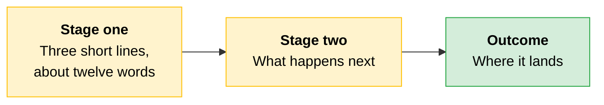
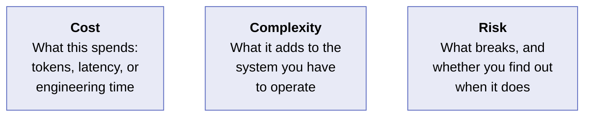
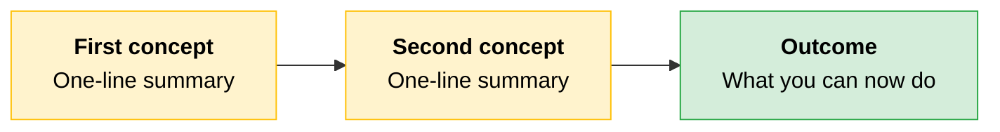

<!--
Copy this file to the right module folder, rename it NN-Title-Case.md, and
delete every HTML comment as you fill it in.

The seven parts below are numbered for orientation only. Do not ship the
"Part N" comments, and do not number the headings in the finished note.

Conventions in full: ../CONTRIBUTING.md
-->

<!-- Part 1: title. One H1 per file. "Topic: The Angle" reads better than a bare noun. -->
# Topic: The Angle You Are Taking

<!--
Part 2: orientation. One or two sentences placing this note after the previous
one, with a relative link so a reader arriving mid-repo is not stranded.
Then the framing callout: what this note is for.
-->
[Previous concept](NN-Previous-Note.md) established X. This note answers the question that follows: Y.

> **The framing:** The single idea that makes the rest of this note make sense.

---

<!--
Part 3: body sections. One H2 per concept, and one concept per section.
Each section runs: concept in 1-2 sentences, then a visual, then the detail
the visual cannot carry, then a callout. Repeat as many times as the topic needs.
-->
## First Concept

One or two sentences introducing it. Do not warm up, just start teaching.



<!--
The diagram is the map. The table is the detail. If you can delete either one
without losing information, you built the same thing twice.
-->

| Thing | What it does | When it applies |
|---|---|---|
| **Stage one** | One sentence. | One sentence. |
| **Stage two** | One sentence. | One sentence. |

The detail the visual cannot carry goes here, as prose. Named examples, definitional clauses, selection criteria, and error codes are the exam-testable substance. If they do not fit the visual, they belong in this paragraph, not in the bin.

> **The key:** The one thing to take away from this section.

---

## Second Concept

<!-- Same shape. Add as many sections as the topic needs. -->

> **Testable distinction:** Two things that look alike and are not, and the tell that separates them.

<!--
Mark any fact that will drift. Always say where to re-check.

> **Current practice note:** Available from Claude Opus 4.7 onward. Re-check the
> current list in the documentation rather than hardcoding it.
-->

---

<!--
Part 4: scenario. A story about a system that passed review and failed anyway.
Bold the setup sentence, tell what happened, close on a bold lesson.
Sits inside the concept it illustrates, immediately before Cost · Complexity · Risk.
-->
> [!CAUTION]
> **A team built something that looked correct and shipped it.**
>
> What the design looked like. What they assumed. What the system actually did when it met production.
>
> ```
> ┌──────────────────────────────────────────────┐
> │   1,000  requests handled                    │
> │      12  silently dropped                    │
> │       0  alerts fired                        │
> └──────────────────────────────────────────────┘
> ```
>
> Why it went unnoticed. What the missing control was.
>
> **The lesson:** One sentence naming the design error, not the symptom.

---

<!--
Part 5: Cost · Complexity · Risk. About twelve words per cell.
It is a memory hook, not an essay. Lavender only, and always flowchart LR
so the three sit side by side.
-->
## Cost · Complexity · Risk



**Cost.** One or two sentences.

**Complexity.** One or two sentences.

**Risk.** One or two sentences. Name the silent failure, not the loud one.

---

<!--
Part 6: Quick Revision. Always the last H2. A summary flowchart showing the
big picture, then a concept-to-one-line table covering everything above.
-->
## Quick Revision



| Concept | One-line summary |
|---|---|
| **First concept** | One line. |
| **Second concept** | One line. |
| **The distinction** | One line. |

<!--
Part 7: Exam Traps. 3-6 rows, scaled to how much the note covers.
Three columns, one short sentence per cell. Cover the third column to self-test.

Every row must trace to something actually asserted above. A row invented to
fill the table teaches a wrong answer with total confidence.

These are concept-level distinctions derived from the material. They are never
recalled exam items. See CONTRIBUTING.md.
-->
### Exam Traps

| If you see... | The trap | The right call |
|---|---|---|
| The scenario or question stem | The tempting wrong answer | The correct framing, one sentence |
| Another stem | Another wrong turn | The correct framing |
| A third stem | A third wrong turn | The correct framing |
