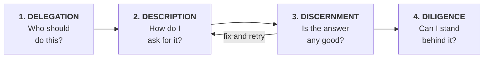
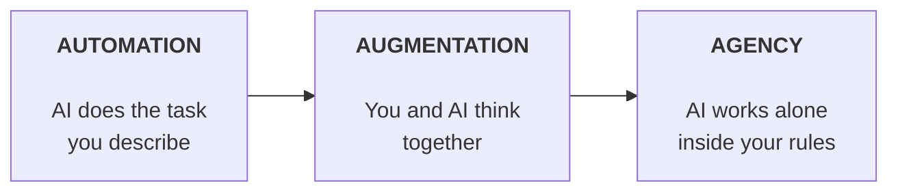
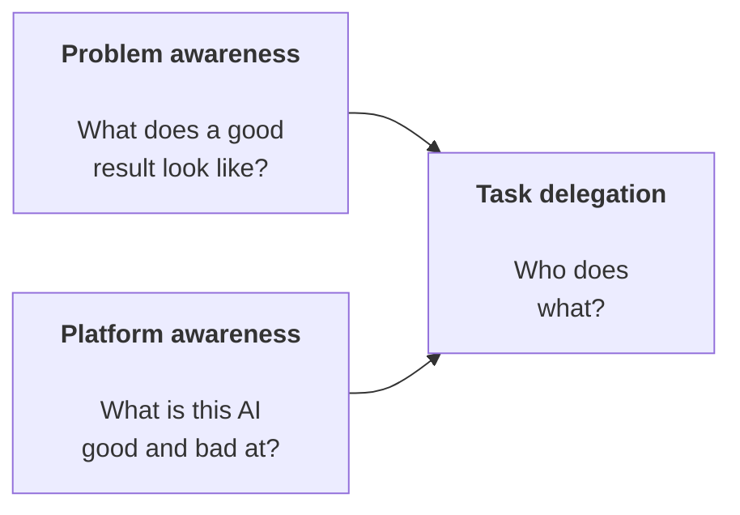
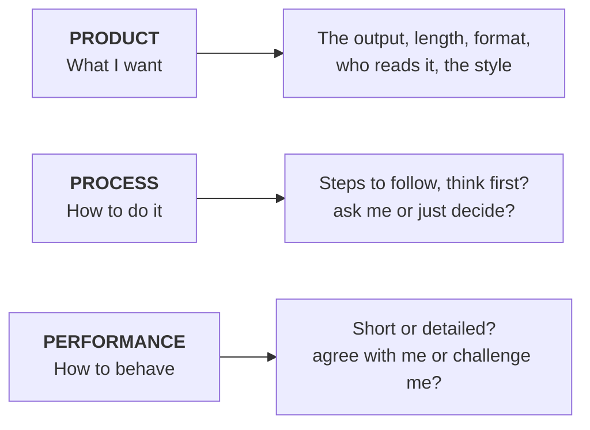
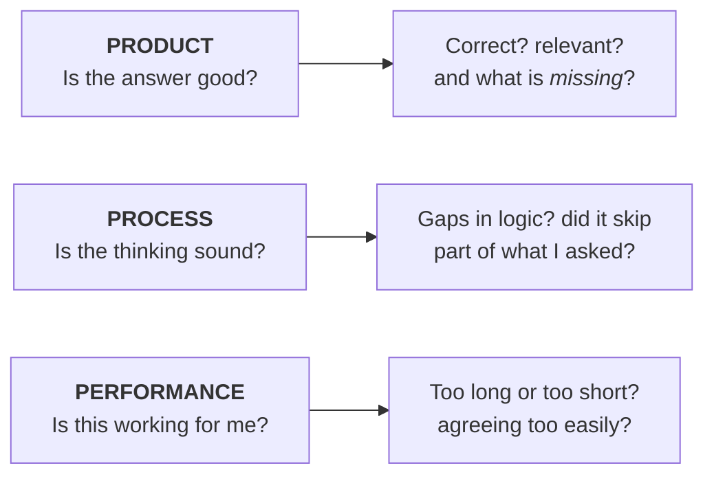
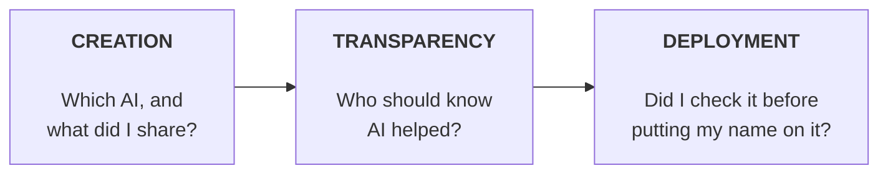

# AI Fluency: Framework & Foundations

**AI Fluency means working well with AI.** You are aiming for four things at once:

| Goal | What it means |
|---|---|
| **Effective** | You get a good result |
| **Efficient** | You get it without wasting time |
| **Ethical** | You are honest and fair to people |
| **Safe** | You avoid causing harm |

---

## The 4 Ds

Four skills. Learn these and you have the whole course.

| D | Ask yourself | Three parts |
|---|---|---|
| **Delegation** | Who should do this: me, AI, or both? | Problem · Platform · Task |
| **Description** | How do I ask for what I need? | Product · Process · Performance |
| **Discernment** | Is the answer any good? | Product · Process · Performance |
| **Diligence** | Am I being responsible? | Creation · Transparency · Deployment |

**Description and Discernment use the same three words.** One is for asking, one is for checking. That is why they loop together.

---

## Three ways to work with AI

| | You give | AI gives | Example |
|---|---|---|---|
| **Automation** | The task and the steps | The work | Tidy up a spreadsheet |
| **Augmentation** | Your knowledge and judgment | Speed and new angles | Plan a strategy together |
| **Agency** | The goal and the limits | Its own next steps | A set-up assistant that runs on its own |

Moving right gives you more power but less visibility. That is why Diligence matters most on the right.

These are not levels to climb. You switch between all three, often in one chat.

---

## 1. Delegation

**Decide what you do, what AI does, and what you do together.**

Two things to know before you split the work:

You need both. Knowing your subject but not the AI means you use it too little. Knowing the AI but not your subject means you use it too much and cannot check the answers.

| Do it yourself | Do it together | Give it to AI |
|---|---|---|
| Important decisions | Coming up with ideas | Boring, repetitive work |
| Anything you are answerable for | Analysis you will check | First drafts you will rewrite |
| Work where *you* are the point | Testing your own thinking | Formatting and tidying |

**The aim is not to hand over everything.** Explaining a task and checking the answer takes time too. Sometimes doing it yourself is just faster.

---

## 2. Description

**Ask clearly so the AI can help properly.**

AI is a partner you are briefing, not a search box. It only knows what you tell it.

**Weak:** "Write something about our sales."

**Strong:** "Write a short email to my team about last month's sales. Under 150 words. Start with the total, then the one thing we should fix. Keep it friendly."

Three things worth remembering:

- **Most bad answers happen because you left something out.** The AI cannot see what is in your head.
- **Telling it *how* to work is the most useful and the most forgotten.** Example: "List the likely objections first, then write the email."
- **How you want it to behave sticks for the whole chat.** Say it once at the start and every reply gets better.

---

## 3. Discernment

**Check what you get back.** Same three words as Description, but now you are judging.

When something is wrong, work out *which* one is wrong. That is how you fix it in one go instead of five:

| What went wrong | What to change |
|---|---|
| The facts are wrong | → Be clearer about **what** you want |
| It took the wrong approach | → Tell it **how** to do it |
| The chat is annoying you | → Tell it **how to behave** |

Two things worth remembering:

- **You can only spot mistakes you know are mistakes.** In your own subject, errors jump out. Outside it, they are invisible. Confident writing is not proof of a correct answer.
- **Watch for what is missing.** A wrong fact is easy to spot. A missing one is not. An answer can be completely correct and still leave you with the wrong impression.

---

## 4. Diligence

**Take responsibility for the work.** This is the honest and safe part of fluency.

| Part | Ask yourself | Common mistake |
|---|---|---|
| **Creation** | Is this information mine to share? | Pasting in data that belongs to someone else |
| **Transparency** | Would people feel misled if they knew? | Not lying, just never stopping to think |
| **Deployment** | Could I defend this if challenged? | Only checking the easy bits |

**How much you disclose depends on where you are:**

| Personal | Professional | Academic | Published |
|---|---|---|---|
| Usually nothing | Depends on your job | Often strict rules | Increasingly expected |

**The trap:** you check the parts you understand, because checking them is easy. But the parts you *cannot* check are the ones that need it most.

### Diligence statement

A short note saying AI helped. Four pieces: **what you used → what for → how you checked it → who is responsible.**

> *"In creating this [work], I used [AI] to help with [tasks]. I reviewed all AI-generated content. The final output reflects my own understanding and meaning. I take full responsibility for its accuracy."*

---

## Quick revision

| Skill | Three parts | Stops you from |
|---|---|---|
| **Delegation** | Problem · Platform · Task | Handing over work you should have kept |
| **Description** | Product · Process · Performance | Getting a great answer to the wrong question |
| **Discernment** | Product · Process · Performance | Using something that sounds right but is wrong |
| **Diligence** | Creation · Transparency · Deployment | Being fast in a way you cannot defend |

**Two warning signs:**

- You cannot say what a good result looks like → that is a **Delegation** problem, not a wording problem.
- Still going in circles after 3 tries → the problem is **what you handed over**, not how you asked.

**The three big ideas:**

1. **Delegation comes first.** Doing the wrong task perfectly is still a failure.
2. **Description and Discernment are one loop.** Naming *which* part went wrong is what breaks the loop.
3. **The less you supervise, the more Diligence matters.**

**Why this framework lasts:** it describes how you *work with* AI, not which buttons to press. As AI gets better, asking gets easier while deciding and taking responsibility get harder. All four skills stay.
