# Accessing the API & Making Requests

---

## 1. Accessing the API

### The Five-Step Request Flow

Every interaction with Claude follows a predictable round-trip through five phases:

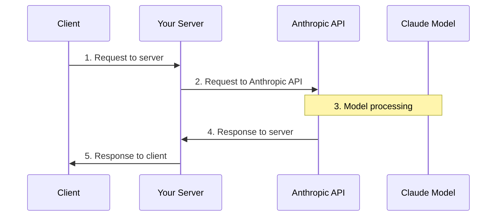

### What Every Request Must Include

Four fields. Miss one and the request fails.

| Field | What it does | Example |
|---|---|---|
| **API Key** | Identifies your request to Anthropic | `sk-ant-...` |
| **Model** | Which Claude model to use | `"claude-sonnet-4-20250514"` |
| **Messages** | The user's input text | `[{"role": "user", "content": "..."}]` |
| **Max Tokens** | Ceiling on how many tokens Claude can generate | `1024` |

---

### Inside Claude's Processing

Once Anthropic receives your request, Claude processes it through four stages before producing any output:

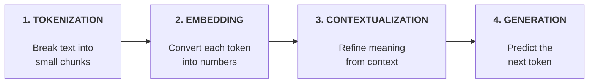

#### Tokenization

Text is split into **tokens**: whole words, parts of words, spaces, or symbols.

```
"Quantum computing is fascinating"
    → ["Quantum", " computing", " is", " fascinating"]
```

> **Rule of thumb:** ~1 word = ~1 token (actual ratio varies by language and vocabulary).

#### Embedding

Each token becomes an **embedding**, a long list of numbers capturing all possible meanings.

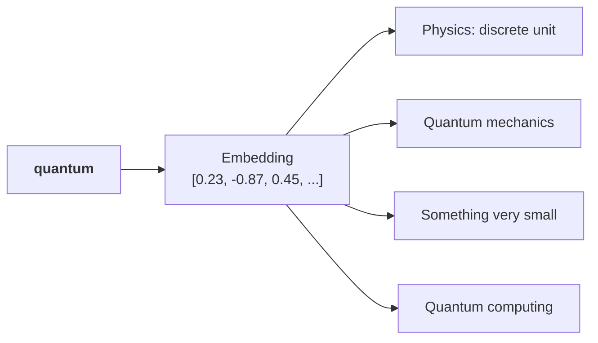

Think of embeddings as numerical definitions that capture semantic relationships between words.

#### Contextualization

Claude refines each embedding using surrounding words to pick the right meaning.

| Input | "quantum" most likely means |
|---|---|
| "quantum of light" | A discrete unit (physics) |
| "quantum computer" | Quantum computing |
| "a quantum of comfort" | Something very small |

The surrounding words adjust the numerical representation to highlight the appropriate definition.

#### Generation

The contextualized embeddings pass through an output layer that calculates probabilities for each possible next word.

```
Next word probabilities:
  "is"        → 42%
  "represents"→ 28%
  "uses"      → 15%
  ...
```

> Claude does not always pick the highest-probability word. It uses a mix of probability and controlled randomness to create natural, varied responses.

#### Temperature

Temperature (0 to 1) controls how Claude picks from those probabilities. Think of it as a **creativity dial**.

```
  Low temp (→ 0)                              High temp (→ 1)
  ┌──────────────────────────────────────────────────────┐
  │  ■■■■■■■■■■■■■■░░░░  →  ■■■■■■■■■░░░░░░░░░░░░░░░░  │
  │  Almost always picks      Spreads probability more   │
  │  the top word             evenly across options      │
  │                                                      │
  │  Deterministic             Creative & varied         │
  └──────────────────────────────────────────────────────┘
```

| Range | Best for | Examples |
|---|---|---|
| **Low** (0.0 - 0.3) | Precision & consistency | Factual responses, coding, data extraction, content moderation |
| **Medium** (0.4 - 0.7) | Balanced tasks | Summarization, educational content, problem-solving, constrained creative writing |
| **High** (0.8 - 1.0) | Creativity & variety | Brainstorming, creative writing, marketing copy, joke generation |

---

### When Does Claude Stop Generating?

After producing each token, Claude checks three conditions:

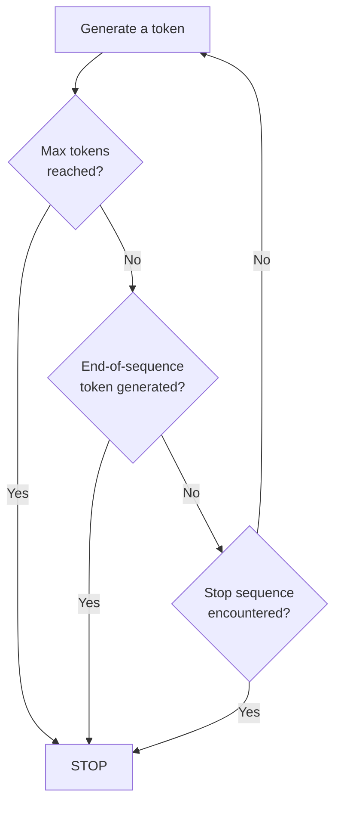

| Condition | Meaning |
|---|---|
| **Max tokens reached** | Hit the limit you set in the request |
| **Natural ending** | Claude generated an end-of-sequence token on its own |
| **Stop sequence** | Claude produced a predefined stop phrase you specified |

---

### The API Response

When generation completes, the API sends back a structured response:

```
┌─────────────────────────────────────────┐
│  API Response                           │
├─────────────────────────────────────────┤
│  message       → The generated text     │
│  usage         → Input & output tokens  │
│  stop_reason   → Why generation ended   │
└─────────────────────────────────────────┘
```

| Field | What it tells you |
|---|---|
| **message** | Claude's generated text |
| **usage** | Count of input tokens + output tokens consumed |
| **stop_reason** | `"end_turn"`, `"max_tokens"`, or `"stop_sequence"` |

### Streaming Responses

#### The Problem with Standard Responses

Without streaming, your server waits for Claude's **entire** response before sending anything to the client. Users see nothing while Claude thinks.

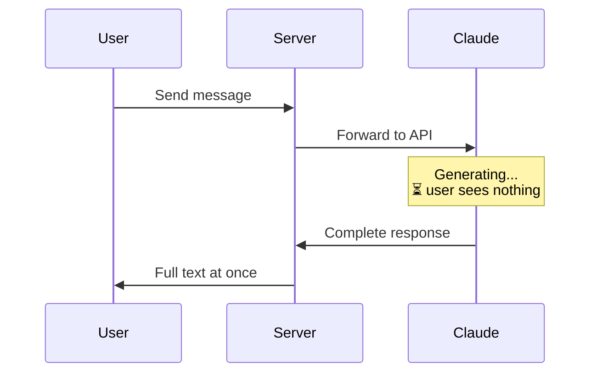

#### How Streaming Works

With streaming, Claude sends text back in small chunks as it generates. Your server forwards each chunk immediately, so users see the response build word by word.

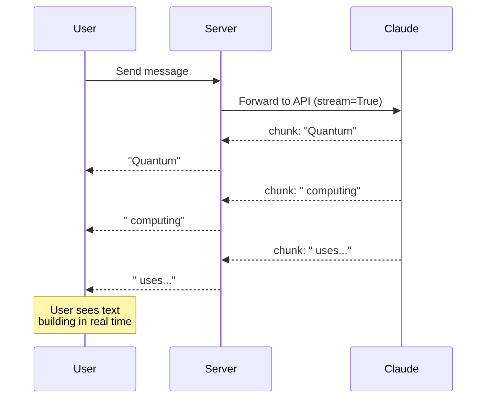

All chunks are part of a **single request** to Claude.

#### Stream Event Types

| Event | What it signals |
|---|---|
| **MessageStart** | A new message is being sent |
| **ContentBlockStart** | Start of a new block (text, tool use, etc.) |
| **ContentBlockDelta** | Chunks of actual generated text |
| **ContentBlockStop** | Current content block is complete |
| **MessageDelta** | Current message is complete |
| **MessageStop** | End of all information for this message |

> **ContentBlockDelta** is where the actual text lives. These are the events you care about most.

#### Basic Streaming

Add `stream=True` to your `messages.create` call:

```python
stream = client.messages.create(
    model=model,
    max_tokens=1000,
    messages=messages,
    stream=True
)

for event in stream:
    print(event)
```

#### Simplified Text Streaming

The SDK provides a cleaner interface that extracts just the text:

```python
with client.messages.stream(
    model=model,
    max_tokens=1000,
    messages=messages
) as stream:
    for text in stream.text_stream:
        print(text, end="")
```

#### Getting the Complete Message After Streaming

Stream for the user, then grab the full message for storage or processing:

```python
with client.messages.stream(
    model=model,
    max_tokens=1000,
    messages=messages
) as stream:
    for text in stream.text_stream:
        pass  # Send each chunk to your client

    final_message = stream.get_final_message()  # Complete message object
```

```
┌─────────────────────────────────────────────────┐
│  Best of both worlds                            │
├─────────────────────────────────────────────────┤
│  stream.text_stream  → Real-time UX for users   │
│  get_final_message() → Full object for your app  │
└─────────────────────────────────────────────────┘
```

---

## 2. Making a Request

### The `create` Function

The core of every API call is `client.messages.create()`. Three required parameters:

```python
message = client.messages.create(
    model="claude-sonnet-4-20250514",     # Which model
    max_tokens=1024,                      # Safety limit (not a target)
    messages=[                            # Conversation history
        {"role": "user", "content": "Explain quantum computing"}
    ]
)
```

| Parameter | Required | Purpose |
|---|---|---|
| `model` | Yes | Name of the Claude model |
| `max_tokens` | Yes | Upper bound on response length. Claude often stops well before this |
| `messages` | Yes | List of message objects with `role` and `content` |

### Extracting the Response

The response object contains metadata, usage stats, and more, but you usually just want the text:

```python
message.content[0].text
```

```
┌──────────────────────────────────┐
│  message                         │
│  ├── content                     │
│  │   └── [0]                     │
│  │       └── .text  ← You want  │
│  ├── usage                       │
│  ├── stop_reason                 │
│  └── ...                         │
└──────────────────────────────────┘
```

---

### Multi-Turn Conversations

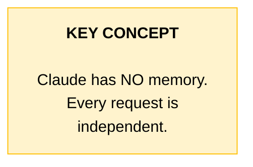

If you want Claude to remember earlier messages, **you** must send the entire conversation history with every request.

#### The Multi-Turn Flow

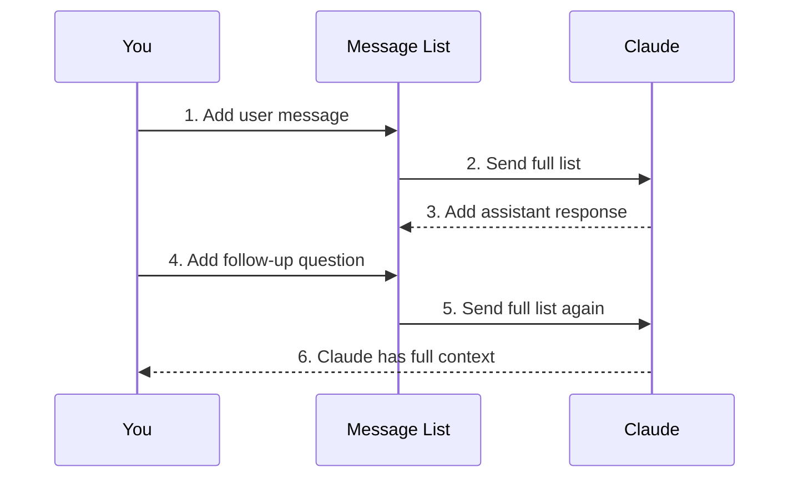

#### Helper Functions

Three small functions to manage conversation state:

```python
def add_user_message(messages, text):
    messages.append({"role": "user", "content": text})

def add_assistant_message(messages, text):
    messages.append({"role": "assistant", "content": text})

def chat(messages):
    message = client.messages.create(
        model=model,
        max_tokens=1000,
        messages=messages,
    )
    return message.content[0].text
```

#### Putting It Together

```python
messages = []

# Turn 1
add_user_message(messages, "Define quantum computing in one sentence")
answer = chat(messages)
add_assistant_message(messages, answer)

# Turn 2 — Claude knows Turn 1 happened
add_user_message(messages, "Write another sentence")
final_answer = chat(messages)
```

**What the message list looks like after Turn 2:**

```
┌─────────────────────────────────────────────────────┐
│  messages sent with the second request              │
├─────────────────────────────────────────────────────┤
│  [0]  user:      "Define quantum computing..."      │
│  [1]  assistant: "Quantum computing is..."          │
│  [2]  user:      "Write another sentence"           │
│  ↑ Claude sees ALL of this, so it knows "another    │
│    sentence" means another sentence about quantum   │
│    computing.                                       │
└─────────────────────────────────────────────────────┘
```

---

### System Prompts

System prompts give Claude a role and behavioral rules. Defined as a plain string, passed via the `system` parameter.

```python
system_prompt = """
You are a patient math tutor.
Do not directly answer a student's questions.
Guide them to a solution step by step.
"""

client.messages.create(
    model=model,
    messages=messages,
    max_tokens=1000,
    system=system_prompt
)
```

#### What System Prompts Do

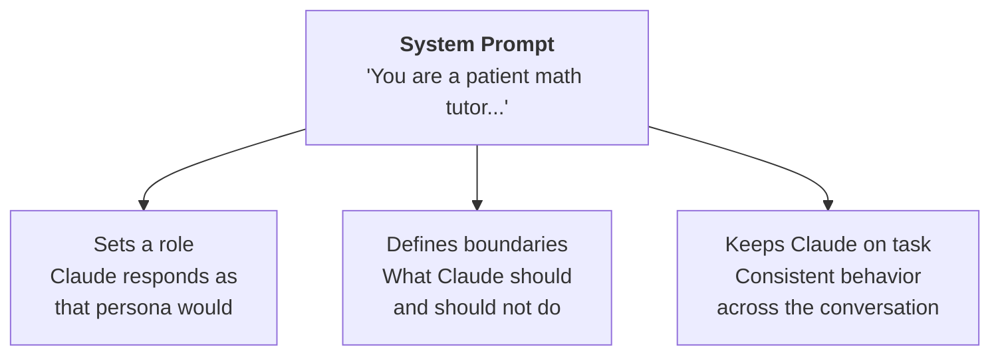

| Benefit | Example |
|---|---|
| **Sets a role** | "You are a patient math tutor," so Claude responds as a tutor would |
| **Defines boundaries** | "Do not directly answer," which constrains behavior |
| **Keeps Claude on task** | The prompt applies to every turn in the conversation |

---

### Getting Clean Structured Output

#### The Problem

By default, Claude wraps structured data in markdown formatting and adds explanatory text:

````
```json
{ "source": ["aws.ec2"], ... }
```
This rule captures EC2 instance state changes...
````

For a web app where users need to copy raw JSON, this creates friction.

#### The Solution: Prefilling + Stop Sequences

Combine **assistant message prefilling** with **stop sequences** to extract only the content you need.

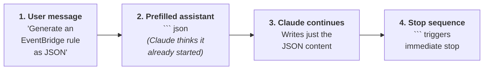

```python
messages = []

add_user_message(messages, "Generate a very short event bridge rule as json")
add_assistant_message(messages, "```json")

text = chat(messages, stop_sequences=["```"])
```

**How it works:**

| Step | What happens |
|---|---|
| User message | Tells Claude what to generate |
| Prefilled assistant message | Claude thinks it already opened a code block |
| Claude continues | Writes just the JSON content |
| Stop sequence ```` ``` ```` | Ends generation the moment Claude tries to close the block |

**Result:** clean JSON, no wrapping, no commentary.

```python
import json
clean_json = json.loads(text.strip())
```

#### Beyond JSON

This pattern works for any structured content. Swap the prefill and stop sequence to match the format:

| Content type | Prefill with | Stop at |
|---|---|---|
| JSON | `` ```json `` | `` ``` `` |
| Python code | `` ```python `` | `` ``` `` |
| CSV data | Column headers | A delimiter marker |
| Bulleted list | `- ` | Double newline |

> **The key:** identify what Claude naturally wraps your content in, then use that as your prefill and stop sequence.

---

## Quick Revision

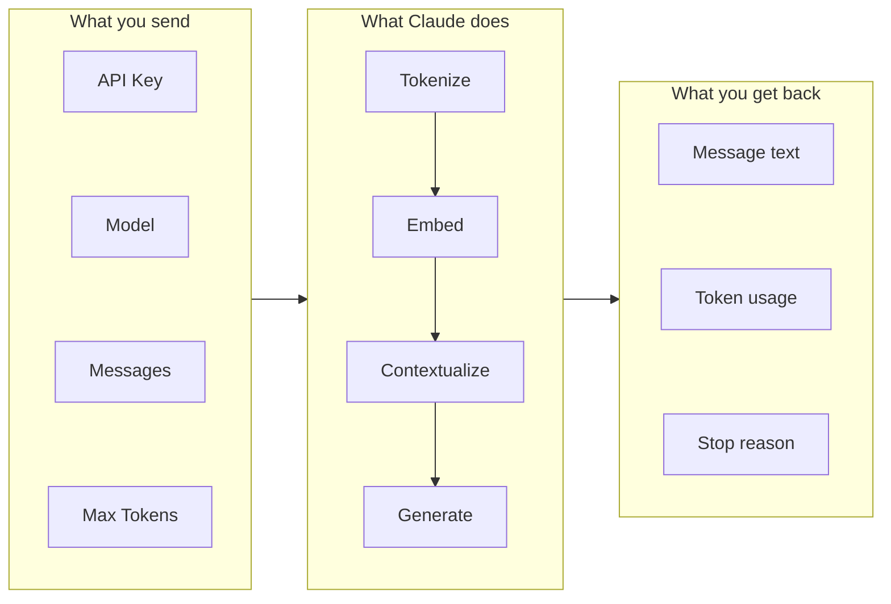

| Concept | One-line summary |
|---|---|
| **Five-step flow** | Client → Server → Anthropic → Model processing → Response back |
| **Four required fields** | API key, model, messages, max_tokens |
| **Four processing stages** | Tokenize → Embed → Contextualize → Generate |
| **Temperature** | 0 = deterministic, 1 = creative; pick range by task type |
| **Three stop conditions** | Max tokens, natural end, stop sequence |
| **Streaming** | `stream=True` or `client.messages.stream()` for real-time word-by-word output |
| **No memory** | Send the full message history every time for multi-turn |
| **System prompts** | Set role + rules via the `system` parameter |
| **Structured output** | Prefill assistant message + stop sequence = clean data, no commentary |
| **Response extraction** | `message.content[0].text` gets the generated text |
