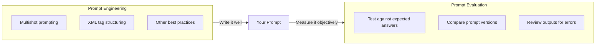
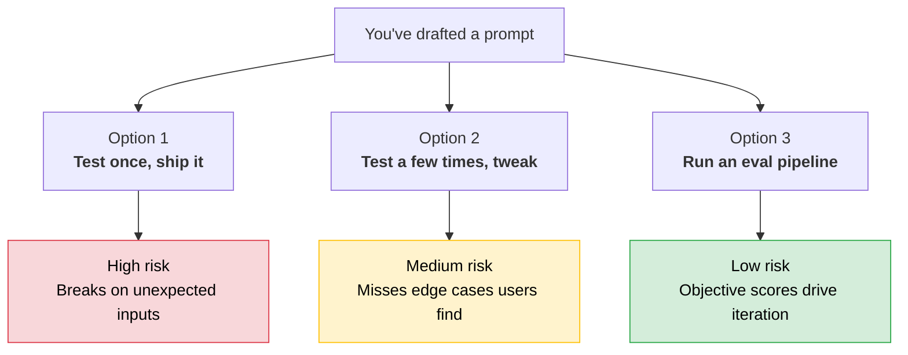
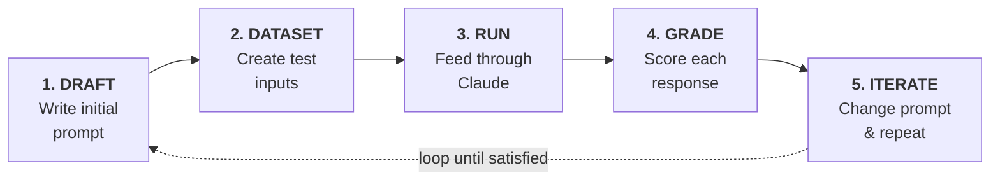
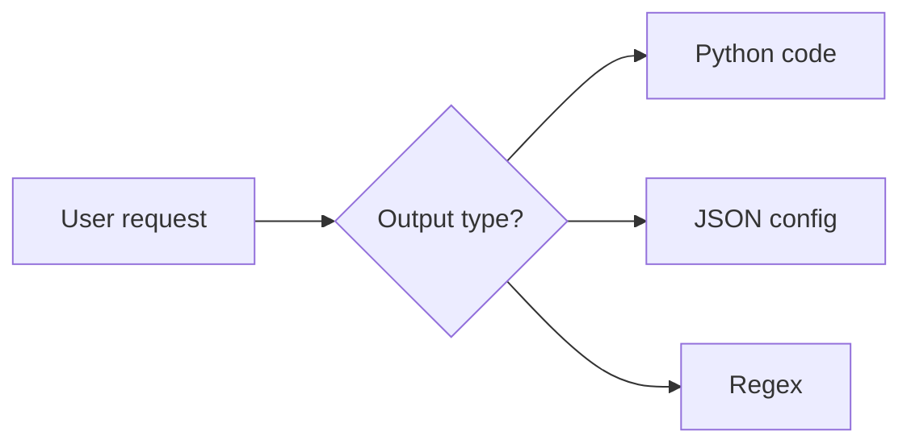
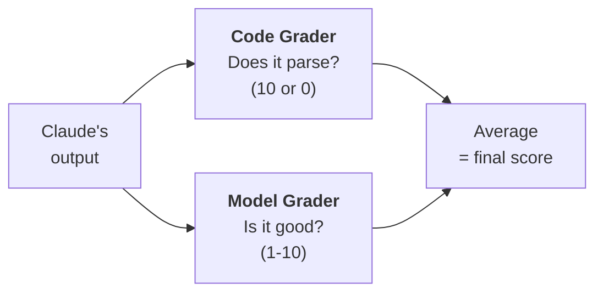
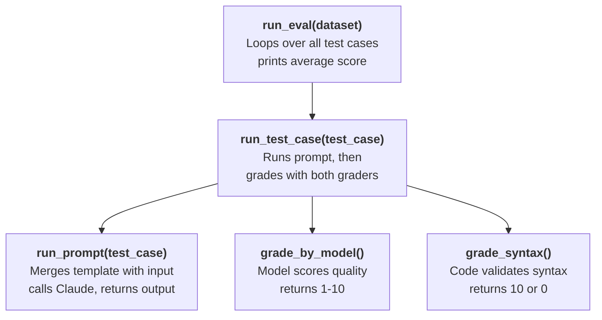
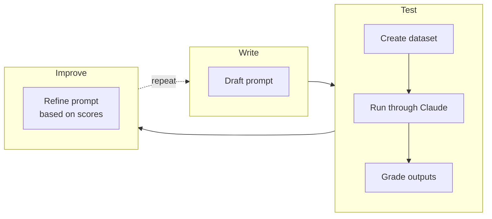

# Prompt Evaluation

Writing a good prompt is just the beginning. To build reliable AI applications, you need two skills: **prompt engineering** (writing better prompts) and **prompt evaluation** (measuring how well they work).

---

## Prompt Engineering vs Prompt Evaluation




|              | Prompt Engineering          | Prompt Evaluation                  |
| ------------ | --------------------------- | ---------------------------------- |
| **Focus**    | How to write prompts        | How to measure their effectiveness |
| **Approach** | Techniques & best practices | Automated testing & scoring        |
| **Output**   | A better prompt             | A number you can compare           |


---


## Three Paths After Writing a Prompt




> **The trap:** Options 1 and 2 feel sufficient during development. They aren't. Users will interact with your prompt in ways you never anticipated.


### The Evaluation-First Approach (Option 3)


| Benefit                      | Why it matters                   |
| ---------------------------- | -------------------------------- |
| Identify weaknesses early    | Catch problems before production |
| Compare versions objectively | Numbers, not gut feeling         |
| Iterate with confidence      | Measurable improvements          |
| Build reliable applications  | Fewer surprises after deployment |


More upfront investment. Pays dividends in production reliability.

---


## The Five-Step Evaluation Workflow




---


### Step 1: Draft a Prompt

Start with a simple baseline:

```python
prompt = f"""
Please answer the user's question:

{question}
"""
```

It doesn't need to be perfect. You're about to measure it.

---


### Step 2: Create an Eval Dataset

Your dataset is a list of sample inputs representing real-world usage. Each input gets interpolated into your prompt template.

```
┌──────────────────────────────────────────────────┐
│  Eval Dataset                                    │
├──────────────────────────────────────────────────┤
│  [0]  "What's 2+2?"                             │
│  [1]  "How do I make oatmeal?"                   │
│  [2]  "How far away is the Moon?"                │
└──────────────────────────────────────────────────┘
```

In production you might have tens, hundreds, or thousands of records. You can assemble them by hand or generate them with Claude.

---


### Step 3: Feed Through Claude

Merge each dataset entry with your prompt template and send to Claude:

```
 Prompt template          +  Dataset entry          =  Complete prompt
 ────────────────────────────────────────────────────────────────────
 "Please answer the         "What's 2+2?"             "Please answer the
  user's question:                                     user's question:
  {question}"                                          What's 2+2?"
```

Claude produces a response for each.

---


### Step 4: Feed Through a Grader

The grader examines both the original question and Claude's answer, then assigns a score (typically 1-10).

```
┌─────────────────────────────────┬──────────────────────┬───────┐
│  Question                       │  Claude's Answer     │ Score │
├─────────────────────────────────┼──────────────────────┼───────┤
│  "What's 2+2?"                  │  "2 + 2 = 4"        │  10   │
│  "How do I make oatmeal?"       │  (brief response)    │   4   │
│  "How far away is the Moon?"    │  (detailed response)  │   9   │
├─────────────────────────────────┼──────────────────────┼───────┤
│                                 │  Average score:      │  7.66 │
└─────────────────────────────────┴──────────────────────┴───────┘
```

---


### Step 5: Change Prompt and Repeat

Modify the prompt, re-run the pipeline, compare scores:

```python
prompt = f"""
Please answer the user's question:

{question}

Answer the question with ample detail
"""
```

```
  Version 1:  avg score = 7.66
  Version 2:  avg score = 8.70  ← improvement confirmed
```

> **The key benefit:** you can compare prompt versions numerically, use the best score, and iterate with confidence that changes are actual improvements.

---


## Building It: A Complete Eval Pipeline

Now let's build a real pipeline end to end. We'll evaluate a prompt that helps users write AWS-specific code in three formats:




**Requirement:** return clean output in one of these formats, with no extra explanations, headers, or footers.

---


### Helper Functions

These are the same helpers from the previous module, extended with `system`, `temperature`, and `stop_sequences` parameters we'll need throughout the pipeline:

```python
def add_user_message(messages, text):
    messages.append({"role": "user", "content": text})

def add_assistant_message(messages, text):
    messages.append({"role": "assistant", "content": text})

def chat(messages, system=None, temperature=1.0, stop_sequences=[]):
    params = {
        "model": model,
        "max_tokens": 1000,
        "messages": messages,
        "temperature": temperature,
        "stop_sequences": stop_sequences,
    }
    if system:
        params["system"] = system
    message = client.messages.create(**params)
    return message.content[0].text
```

---


### Step 1: Generate an Eval Dataset

Each test case is a JSON object with two fields:

- `"task"`: what Claude should accomplish
- `"format"`: the expected output type (`"python"`, `"json"`, or `"regex"`)

The `format` field is important. Our code grader will use it later to pick the right syntax validator.

````python
def generate_dataset():
    prompt = """
Generate an evaluation dataset for a prompt evaluation.
The dataset will be used to evaluate prompts that generate
Python, JSON, or Regex specifically for AWS-related tasks.
Generate an array of JSON objects, each representing a task.

Example output:
```json
[
    {
        "task": "Description of task",
        "format": "json" or "python" or "regex"
    },
    ...additional
]
```

* Focus on tasks solvable by a single Python function,
  a single JSON object, or a single regex
* Focus on tasks that do not require writing much code

Please generate 3 objects.
"""
    messages = []
    add_user_message(messages, prompt)
    add_assistant_message(messages, "```json")
    text = chat(messages, stop_sequences=["```"])
    return json.loads(text)
````

> **Tip:** Use a faster model like Haiku for dataset generation. It's cheaper and fast enough.

Save to file for reuse across runs:

```python
dataset = generate_dataset()
with open('dataset.json', 'w') as f:
    json.dump(dataset, f, indent=2)
```

Example generated dataset:

```json
[
  {
    "task": "Create a JSON config for an AWS Lambda function with database env vars",
    "format": "json"
  },
  {
    "task": "Write a Python function to extract the AWS region from an ARN string",
    "format": "python"
  },
  {
    "task": "Write a regex to validate an AWS EC2 instance ID (format: i-[alphanumeric])",
    "format": "regex"
  }
]
```

---


### Step 2: The Prompt Under Test

This is the prompt we're evaluating. We start simple. The eval pipeline will tell us how good it is and guide improvements:

````python
def run_prompt(test_case):
    prompt = f"""
Please solve the following task:

{test_case["task"]}

* Respond only with Python, JSON, or a plain Regex
* Do not add any comments or commentary or explanation
"""
    messages = []
    add_user_message(messages, prompt)
    add_assistant_message(messages, "```code")  # prefill for clean output
    output = chat(messages, stop_sequences=["```"])
    return output
````

The prefill (`` ```code ``) and stop sequence (`` ``` ``) work together to get raw code output without markdown wrapping. This is the same technique covered in the previous module.

---


### Step 3: Build the Graders

We use **two graders** together: a code grader for technical correctness and a model grader for quality. Their scores are averaged for a composite result.




#### Types of Graders


| Grader    | How it works                          | Best for                             | Tradeoff                                           |
| --------- | ------------------------------------- | ------------------------------------ | -------------------------------------------------- |
| **Code**  | Custom logic (syntax, format, length) | Format validation, syntax checks     | Fast & cheap, but limited to what you can code     |
| **Model** | Another API call evaluates the output | Quality, helpfulness, task following | Flexible, but costs tokens and can be inconsistent |
| **Human** | People review and score manually      | Depth, nuance, comprehensiveness     | Most accurate, but slow and expensive              |


#### Evaluation Criteria for Our Pipeline


| Criterion          | What it checks                                  | Grader |
| ------------------ | ----------------------------------------------- | ------ |
| **Valid Syntax**   | Output actually parses as Python / JSON / Regex | Code   |
| **Task Following** | Response directly addresses the task accurately | Model  |


---


#### Code Grader: Syntax Validation

Three functions, one per format. Each tries to parse the output. Success = 10, failure = 0.

```python
import json, ast, re

def validate_json(text):
    try:
        json.loads(text.strip())
        return 10
    except json.JSONDecodeError:
        return 0

def validate_python(text):
    try:
        ast.parse(text.strip())
        return 10
    except SyntaxError:
        return 0

def validate_regex(text):
    try:
        re.compile(text.strip())
        return 10
    except re.error:
        return 0
```

A dispatcher picks the right validator using the `"format"` field from the test case:

```python
def grade_syntax(response, test_case):
    fmt = test_case["format"]
    if fmt == "json":
        return validate_json(response)
    elif fmt == "python":
        return validate_python(response)
    else:
        return validate_regex(response)
```

---


#### Model Grader: Quality Assessment

Sends both the original task and Claude's solution to another API call for evaluation. Uses XML tags to clearly separate the inputs and asks for structured JSON output:

````python
def grade_by_model(test_case, output):
    eval_prompt = f"""
You are an expert AWS code reviewer. Evaluate this AI-generated solution.

Original Task:
<task>
{test_case["task"]}
</task>

Solution to Evaluate:
<solution>
{output}
</solution>

Provide your evaluation as a structured JSON object with:
- "strengths": An array of 1-3 key strengths
- "weaknesses": An array of 1-3 key areas for improvement
- "reasoning": A concise explanation of your overall assessment
- "score": A number between 1-10
"""
    messages = []
    add_user_message(messages, eval_prompt)
    add_assistant_message(messages, "```json")
    eval_text = chat(messages, stop_sequences=["```"])
    return json.loads(eval_text)
````

> **Why ask for strengths, weaknesses, and reasoning alongside the score?** Without this context, models tend to default to middling scores around 6. Forcing a justification produces more meaningful, differentiated scores.

---


### Step 4: Wire Everything Together

Now we connect the prompt, both graders, and the eval loop into a complete pipeline:




```python
def run_test_case(test_case):
    output = run_prompt(test_case)

    # Model grader: quality & task following
    model_grade = grade_by_model(test_case, output)
    model_score = model_grade["score"]
    reasoning = model_grade["reasoning"]

    # Code grader: syntax validity
    syntax_score = grade_syntax(output, test_case)

    # Composite score: average of both graders
    score = (model_score + syntax_score) / 2

    return {
        "output": output,
        "test_case": test_case,
        "score": score,
        "reasoning": reasoning,
    }
```

```python
from statistics import mean

def run_eval(dataset):
    results = []
    for test_case in dataset:
        result = run_test_case(test_case)
        results.append(result)

    average_score = mean([r["score"] for r in results])
    print(f"Average score: {average_score}")
    return results
```

---


### Step 5: Run It and Read the Results

```python
with open("dataset.json", "r") as f:
    dataset = json.load(f)

results = run_eval(dataset)
# → Average score: 8.17
```

Each result is a structured object:

```
┌──────────────────────────────────────────────────────────────┐
│  Result                                                      │
├──────────────────────────────────────────────────────────────┤
│  output     → Claude's raw code output                       │
│  test_case  → Original task + expected format                │
│  score      → Composite (model avg + syntax avg) / 2         │
│  reasoning  → Model grader's explanation of its score        │
└──────────────────────────────────────────────────────────────┘
```

Example output for the three test cases:

```
┌──────────────────────────────────────────┬─────────┬────────┬───────┐
│  Task                                    │ Model   │ Syntax │ Final │
├──────────────────────────────────────────┼─────────┼────────┼───────┤
│  Lambda JSON config with DB env vars     │    7    │   10   │  8.5  │
│  Python fn to extract region from ARN    │    6    │   10   │  8.0  │
│  Regex to validate EC2 instance ID       │    6    │   10   │  8.0  │
├──────────────────────────────────────────┼─────────┼────────┼───────┤
│                                    Average score:           │  8.17 │
└──────────────────────────────────────────┴─────────┴────────┴───────┘
```

Now you have a baseline. Change the prompt, re-run `run_eval(dataset)`, and compare the average score. If it goes up, your change helped. If it goes down, revert.

---


## Quick Revision




| Concept                       | One-line summary                                                              |
| ----------------------------- | ----------------------------------------------------------------------------- |
| **Engineering vs Evaluation** | Engineering = writing techniques; Evaluation = measuring effectiveness        |
| **The testing trap**          | Testing a few times feels sufficient but misses real-world edge cases         |
| **Five-step workflow**        | Draft → Dataset → Run → Grade → Iterate                                       |
| **Eval dataset**              | Sample inputs with `task` + `format`; hand-made or Claude-generated           |
| **Three grader types**        | Code (syntax/format), Model (quality/task-following), Human (nuance/depth)    |
| **Code grader**               | `json.loads()`, `ast.parse()`, `re.compile()`, returning 10 or 0              |
| **Model grader tip**          | Ask for strengths + weaknesses + reasoning alongside the score                |
| `grade_syntax`                | Dispatcher that picks the right validator using `test_case["format"]`         |
| **Composite scoring**         | `(model_score + syntax_score) / 2`. Adjust weights to your needs              |
| **The loop**                  | The score itself doesn't matter. What matters is whether you can improve it   |


