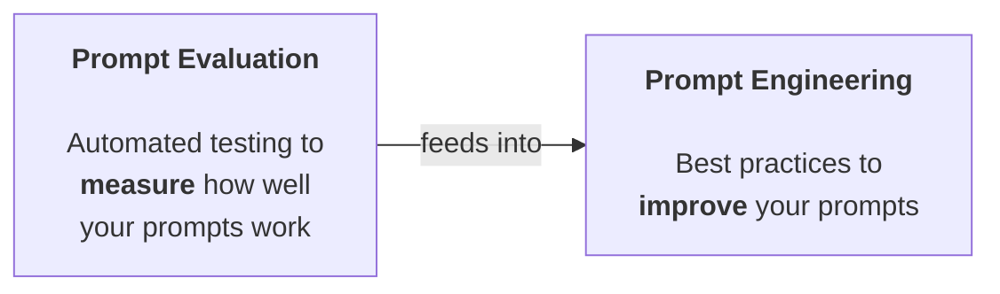
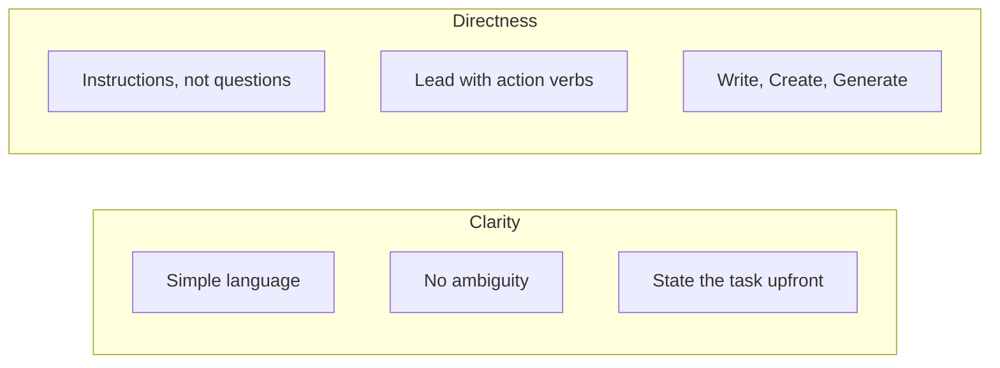
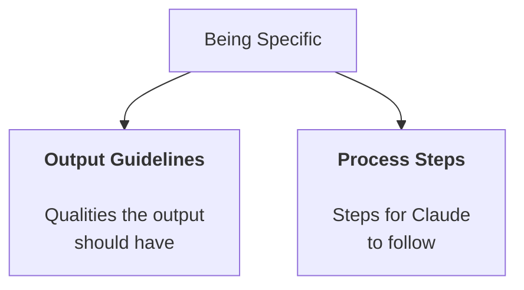
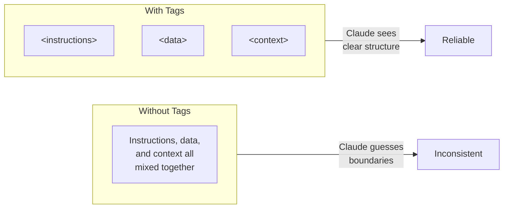
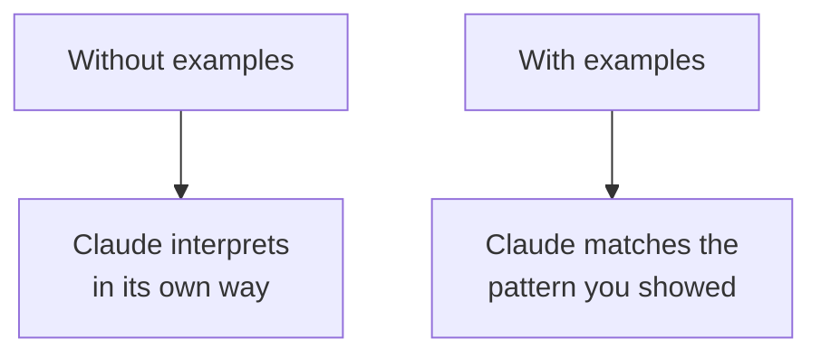

# Prompt Engineering

Start with a basic prompt, evaluate it, then systematically apply techniques to improve it. One change at a time, measured every step.



---

## The Iterative Improvement Process


> **The key:** one change at a time. If you apply three techniques at once and the score goes up, you don't know which one helped.

---

## Setting Up the Eval Pipeline

Running example throughout this module: **a prompt that generates one-day meal plans for athletes** (height, weight, goals, dietary restrictions).

```python
evaluator = PromptEvaluator(max_concurrent_tasks=5)

# Generate test cases
dataset = evaluator.generate_dataset(
    task_description="Write a compact, concise 1 day meal plan for a single athlete",
    prompt_inputs_spec={
        "height": "Athlete's height in cm",
        "weight": "Athlete's weight in kg",
        "goal": "Goal of the athlete",
        "restrictions": "Dietary restrictions of the athlete"
    },
    output_file="dataset.json",
    num_cases=3
)

# Run evaluation with criteria
results = evaluator.run_evaluation(
    run_prompt_function=run_prompt,
    dataset_file="dataset.json",
    extra_criteria="""
The output should include:
- Daily caloric total
- Macronutrient breakdown
- Meals with exact foods, portions, and timing
"""
)
```

> **Tip:** Keep test cases low (2-3) during development. Start concurrency at 3 to avoid rate limits.

---

## The Baseline Prompt

Start deliberately simple to establish a score to beat:

```python
def run_prompt(prompt_inputs):
    prompt = f"""
What should this person eat?

- Height: {prompt_inputs["height"]}
- Weight: {prompt_inputs["weight"]}
- Goal: {prompt_inputs["goal"]}
- Dietary restrictions: {prompt_inputs["restrictions"]}
"""
    messages = []
    add_user_message(messages, prompt)
    return chat(messages)
```

```
  Baseline score: 2.32 / 10
```

Vague, indirect, no guidance on format. Perfect starting point.

---

## Technique 1: Be Clear and Direct

The first line of your prompt matters most. Two principles:



| Instead of | Write |
|---|---|
| "I need to know about those solar panel things" | "Write three paragraphs about how solar panels work" |
| "What countries use geothermal energy?" | "Identify three countries that use geothermal energy. Include generation stats" |
| "What should this person eat?" | "Generate a one-day meal plan for an athlete that meets their dietary restrictions" |

Pattern: **direct action verb** + **specific task** + **key constraints**.

```
  Before: 2.32 / 10
  After:  3.92 / 10  ← +1.60
```

---

## Technique 2: Be Specific with Guidelines

Don't leave output to Claude's interpretation. Provide clear guidelines or steps.



| Type | When to use |
|---|---|
| **Output guidelines** | Almost every prompt. Your safety net for consistent results |
| **Process steps** | Complex problems, troubleshooting, decision-making, critical thinking |
| **Both together** | Professional prompts. Guidelines control format, steps ensure thorough thinking |

### Applied to Our Prompt

```
Guidelines:
1. Include accurate daily calorie amount
2. Show protein, fat, and carb amounts
3. Specify when to eat each meal
4. Use only foods that fit restrictions
5. List all portion sizes in grams
6. Keep budget-friendly if mentioned
```

```
  Before: 3.92 / 10
  After:  7.86 / 10  ← +3.94 (more than doubled)
```

> **The key:** specificity is the single biggest lever in prompt engineering.

---

## Technique 3: Use XML Tags for Structure

When prompts include a lot of content, Claude can struggle to tell which pieces belong together. XML tags create clear boundaries.



Use **descriptive** tag names: `<sales_records>` not `<data>`, `<athlete_information>` not `<input>`, `<my_code>` and `<docs>` not `<section1>` and `<section2>`.

### Applied to Our Prompt

```xml
<athlete_information>
- Height: {prompt_inputs["height"]}
- Weight: {prompt_inputs["weight"]}
- Goal: {prompt_inputs["goal"]}
- Dietary restrictions: {prompt_inputs["restrictions"]}
</athlete_information>

Generate a one-day meal plan based on the athlete information above.
```

Modest improvement for simple prompts. Significant impact as prompts grow complex with mixed content types.

---

## Technique 4: Provide Examples (Few-Shot Prompting)

Give Claude sample input/output pairs. **One-shot** (one example) or **multi-shot** (multiple examples).



Examples **show** rather than **tell**. Especially powerful for corner cases like sarcasm in sentiment analysis:

```xml
<example>
<sample_input>Great game tonight!</sample_input>
<ideal_output>Positive</ideal_output>
</example>

<example>
<sample_input>Oh yeah, I really needed a flight delay tonight! Excellent!</sample_input>
<ideal_output>Negative (sarcastic)</ideal_output>
</example>
```

### Finding Good Examples

Look at your highest-scoring eval outputs (9 or 10). Use those input/output pairs as examples. Always add context explaining **why** the output is good:

```xml
<ideal_output>
[Your example meal plan here]
</ideal_output>

This example is well-structured, provides detailed information
on food choices and quantities, and aligns with the athlete's
goals and restrictions.
```

| Practice | Why |
|---|---|
| **XML tags around examples** | Clear boundaries between input, output, and context |
| **Target failure cases** | Examples fix exactly where your prompt struggles |
| **Explain why it's ideal** | Claude learns the reasoning, not just the pattern |

---

## Tracking Progress

```
┌──────────────────────────────────┬────────────┬───────────┐
│  Version                         │  Score     │  Change   │
├──────────────────────────────────┼────────────┼───────────┤
│  Baseline ("What should they     │  2.32      │           │
│   eat?")                         │            │           │
│  + Clear and direct              │  3.92      │  +1.60    │
│  + Specific guidelines           │  7.86      │  +3.94    │
│  + XML tags                      │  (modest)  │  varies   │
│  + Few-shot examples             │  (high)    │  varies   │
└──────────────────────────────────┴────────────┴───────────┘
```

Techniques stack. The order matters: clarity → specificity → structure → examples.

---

## Quick Revision


| Technique | What it does | Key rule |
|---|---|---|
| **Be clear and direct** | Strong opening line with action verb | "Generate X" not "What about X?" |
| **Be specific** | Add output guidelines and/or process steps | Tell Claude exactly what to include |
| **XML tags** | Boundaries between content sections | Descriptive names like `<athlete_information>` |
| **Few-shot examples** | Input/output pairs showing ideal responses | Explain why the example is good |
| **One change at a time** | Single technique per iteration | Three changes at once = zero learning |

| Concept | One-line summary |
|---|---|
| **Iterative process** | Set goal → Write → Eval → Apply technique → Re-eval → Repeat |
| **Baseline first** | Start simple to establish a score to beat |
| **Specificity wins** | Guidelines are the single biggest lever for output quality |
| **Show, don't tell** | Examples demonstrate what instructions alone can't describe |
| **XML for complex prompts** | Tags matter most when mixing content types or interpolating data |
| **Stack techniques** | Each builds on the last: clarity → specificity → structure → examples |
