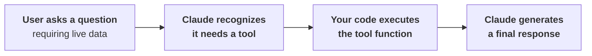
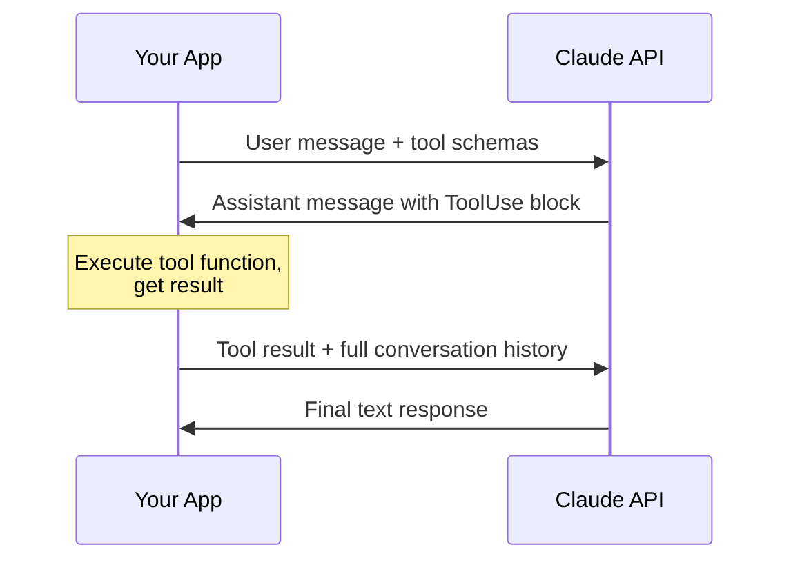
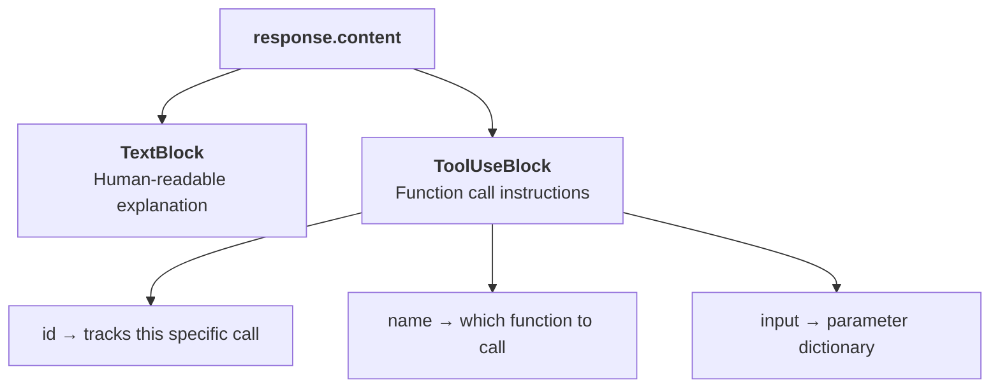
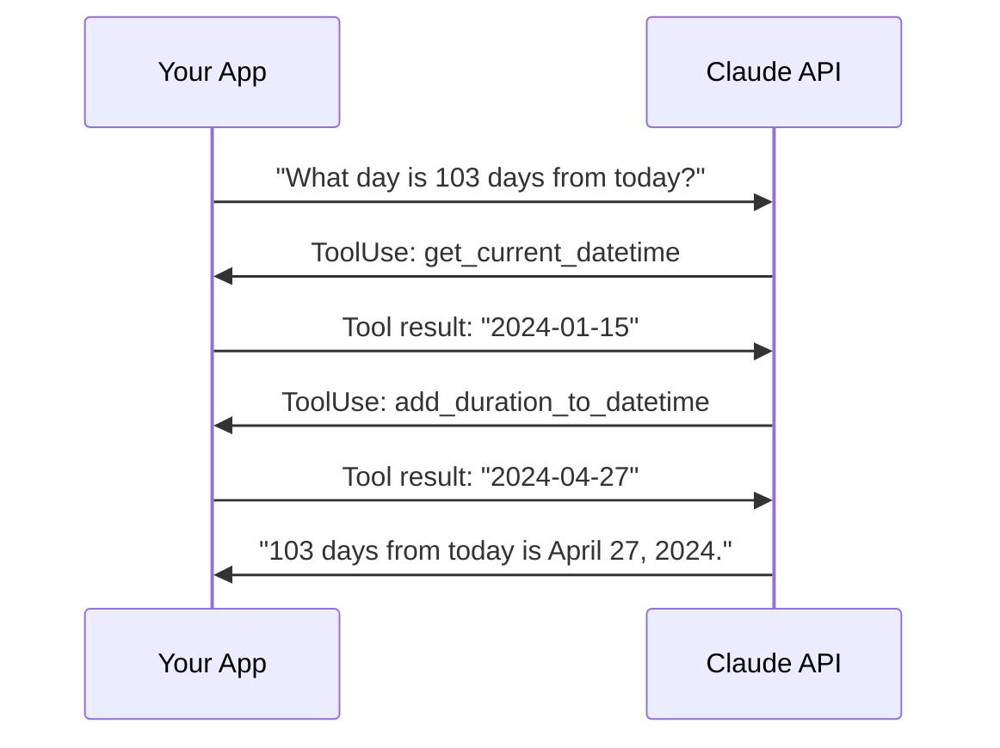
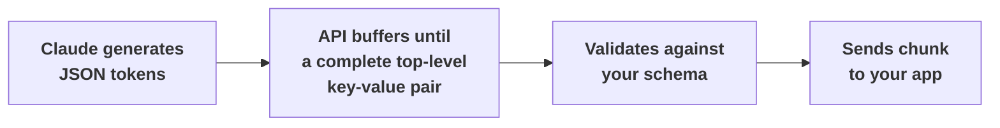
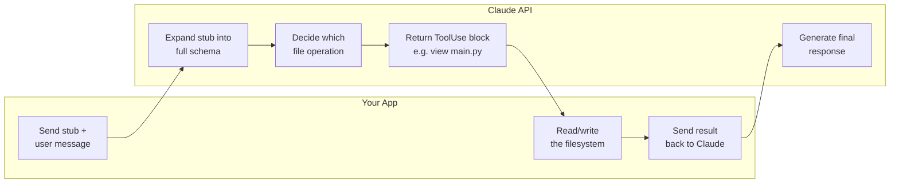
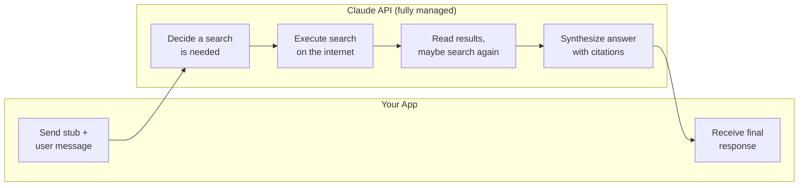
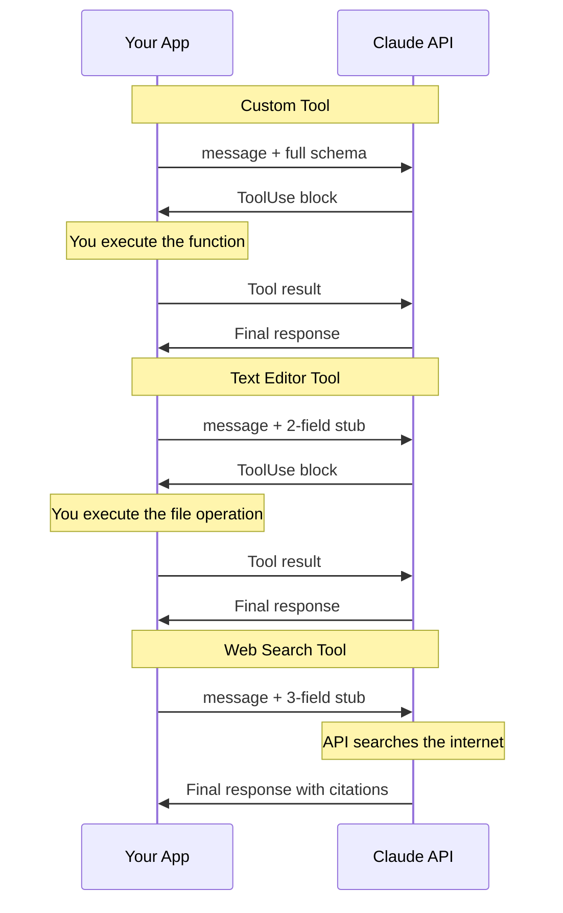
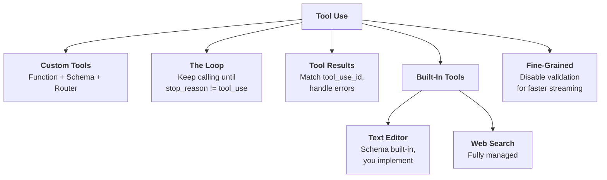

# Tool Use

Tools let Claude reach beyond its training data to access real-time information and perform actions in external systems. Without tools, Claude is stuck: ask for today's weather, and all it can say is "I don't have access to that."



---

## The Tool Use Loop

Tool use follows a structured back-and-forth between your application and Claude. There are four distinct steps, and your code orchestrates every one of them.



| Step | Who acts | What happens |
|---|---|---|
| **1. Initial request** | Your app | Send the user's question plus tool schemas describing available functions |
| **2. Tool request** | Claude | Returns a `ToolUse` block specifying which function to call and with what arguments |
| **3. Data retrieval** | Your app | Execute the actual function (API call, DB query, system command) and collect the result |
| **4. Final response** | Claude | Receives the tool result, combines it with context, and generates the answer |

> **The key:** Claude never executes code itself. It tells you what to call and with what inputs. Your code does the actual work.

---

## Running Example: A Reminder System

Throughout this module, you build a system where Claude can set reminders from natural language ("remind me about my doctor's appointment a week from Thursday"). This requires three tools because of three limitations:

| Limitation | Tool |
|---|---|
| Claude doesn't know the exact current time | `get_current_datetime` |
| Claude isn't reliable at date arithmetic | `add_duration_to_datetime` |
| Claude has no built-in way to set reminders | `set_reminder` |

> **Rule of thumb:** when the model has a limitation, extend it with a tool rather than trying to work around it in your prompt.

---

## Step 1: Write Tool Functions

A tool function is a plain Python function that your code calls when Claude requests it. Three best practices matter:

| Practice | Why |
|---|---|
| **Descriptive names** | Claude reads the function name to decide when to use it |
| **Input validation** | Raise clear errors so Claude can retry with corrected parameters |
| **Meaningful error messages** | Claude sees the error text and can self-correct |

Here is the first tool function for the reminder project:

```python
from datetime import datetime

def get_current_datetime(date_format="%Y-%m-%d %H:%M:%S"):
    if not date_format:
        raise ValueError("date_format cannot be empty")
    return datetime.now().strftime(date_format)
```

```
┌──────────────────────────────────────────────────┐
│  get_current_datetime()                          │
├──────────────────────────────────────────────────┤
│  date_format  → strftime format string           │
│  returns      → formatted current datetime       │
│  default      → "2024-01-15 14:30:25"            │
│  error        → ValueError if format is empty    │
└──────────────────────────────────────────────────┘
```

---

## Step 2: Define Tool Schemas

Claude can't inspect your Python code. You describe each tool with a **JSON schema** so Claude knows what arguments the function accepts and when to use it. JSON Schema is a widely-used data validation standard, not something specific to AI. The AI community adopted it because it already solves the "describe a function's parameters" problem.

A tool schema has three parts:

| Field | Purpose |
|---|---|
| **`name`** | Matches the function name exactly |
| **`description`** | 3-4 sentences: what it does, when to use it, what it returns |
| **`input_schema`** | Standard JSON Schema describing the function's parameters |

```python
from anthropic.types import ToolParam

get_current_datetime_schema = ToolParam({
    "name": "get_current_datetime",
    "description": (
        "Returns the current date and time formatted according to the "
        "specified format. Use this when the user asks about the current "
        "time or date. Returns a formatted datetime string."
    ),
    "input_schema": {
        "type": "object",
        "properties": {
            "date_format": {
                "type": "string",
                "description": (
                    "A string specifying the format of the returned datetime. "
                    "Uses Python's strftime format codes."
                ),
                "default": "%Y-%m-%d %H:%M:%S"
            }
        },
        "required": []
    }
})
```

> **Tip:** use Claude itself to generate schemas. Paste your function code and the Anthropic tool use docs, then ask it to write the schema. Follow the naming pattern `function_name` / `function_name_schema` to keep things paired.

Wrapping the dict in `ToolParam` from the Anthropic SDK adds type checking, catching errors before they hit the API.

---

## Step 3: Handle Multi-Block Responses

When Claude decides to use a tool, the response structure changes. Instead of a single text block, you get a **multi-block message** containing both text and a `ToolUse` block.



```
┌─────────────────────────────────────────────────────┐
│  Assistant Message (multi-block)                    │
├─────────────────────────────────────────────────────┤
│  Block 1: TextBlock                                 │
│    "Let me check the current time for you."         │
│                                                     │
│  Block 2: ToolUseBlock                              │
│    id     → "toolu_abc123"                          │
│    name   → "get_current_datetime"                  │
│    input  → {"date_format": "%H:%M:%S"}             │
│    type   → "tool_use"                              │
└─────────────────────────────────────────────────────┘
```

### Making a Tool-Enabled API Call

Pass your schemas in the `tools` parameter:

```python
messages = []
messages.append({"role": "user", "content": "What is the exact time, formatted as HH:MM:SS?"})

response = client.messages.create(
    model=model,
    max_tokens=1000,
    messages=messages,
    tools=[get_current_datetime_schema],
)
```

### Preserving Conversation History

Claude has no memory between calls. You must append the full multi-block response to your message list so the next call has complete context:

```python
messages.append({
    "role": "assistant",
    "content": response.content  # includes both TextBlock and ToolUseBlock
})
```

> **The trap:** if you strip out the `ToolUseBlock` and only keep the text, Claude loses track of which tool it called and what it was doing. Always preserve the entire `content` list.

---

## Step 4: Send Tool Results Back

After extracting the tool call and executing the function, you send the result back to Claude as a **tool result block** inside a user message.

```
┌─────────────────────────────────────────────────────┐
│  Tool Result Block                                  │
├─────────────────────────────────────────────────────┤
│  type         → "tool_result"                       │
│  tool_use_id  → must match the ToolUse block's id   │
│  content      → output from your function (string)  │
│  is_error     → False (or True if it failed)        │
└─────────────────────────────────────────────────────┘
```

> **The trap:** `content` must be a string. If your function returns a dict or number, serialize it with `json.dumps()` first. Passing a raw object will fail.

### Executing the Tool

Extract the input from the `ToolUse` block and unpack it into your function:

```python
tool_output = get_current_datetime(**response.content[1].input)
```

### Building the Result Message

Wrap the output in a tool result block and append it as a user message:

```python
messages.append({
    "role": "user",
    "content": [{
        "type": "tool_result",
        "tool_use_id": response.content[1].id,
        "content": "15:04:22",
        "is_error": False
    }]
})
```

Then make a second API call. You must still include the `tools` parameter even though you don't expect another tool call. Claude needs the schema to understand the tool references in the conversation history.

```python
final_response = client.messages.create(
    model=model,
    max_tokens=1000,
    messages=messages,
    tools=[get_current_datetime_schema]
)
```

> **The trap:** if Claude requested multiple tools in a single response, each `ToolUse` block gets a unique ID. You must return a matching tool result block for every one of them.

---

## Multi-Turn Tool Conversations

A single question can require multiple tools in sequence. "What day is 103 days from today?" needs two calls: `get_current_datetime` first, then `add_duration_to_datetime`.



### Detecting When Claude Wants a Tool

Check `response.stop_reason`. When it equals `"tool_use"`, Claude is requesting a tool call. When it's anything else, Claude is done.

### The Conversation Loop

Keep calling Claude until it stops asking for tools:

```python
def run_conversation(messages):
    while True:
        response = chat(messages, tools=[
            get_current_datetime_schema,
            add_duration_to_datetime_schema,
            set_reminder_schema
        ])
        add_assistant_message(messages, response)

        if response.stop_reason != "tool_use":
            break

        tool_results = run_tools(response)
        add_user_message(messages, tool_results)

    return messages
```

### Processing Tool Requests

Filter for `ToolUse` blocks in the response, execute each one, and collect the results:

```python
def run_tools(message):
    tool_requests = [block for block in message.content if block.type == "tool_use"]
    tool_result_blocks = []

    for tool_request in tool_requests:
        try:
            tool_output = run_tool(tool_request.name, tool_request.input)
            tool_result_blocks.append({
                "type": "tool_result",
                "tool_use_id": tool_request.id,
                "content": json.dumps(tool_output),
                "is_error": False
            })
        except Exception as e:
            tool_result_blocks.append({
                "type": "tool_result",
                "tool_use_id": tool_request.id,
                "content": f"Error: {e}",
                "is_error": True
            })

    return tool_result_blocks
```

> **Tip:** always return a tool result block for errors too. Setting `is_error: True` lets Claude know something went wrong so it can adjust or retry.

### Routing to the Right Function

A simple router maps tool names to implementations. Adding a new tool means adding one `elif`:

```python
def run_tool(tool_name, tool_input):
    if tool_name == "get_current_datetime":
        return get_current_datetime(**tool_input)
    elif tool_name == "add_duration_to_datetime":
        return add_duration_to_datetime(**tool_input)
    elif tool_name == "set_reminder":
        return set_reminder(**tool_input)
```

### Updated Helper Functions

Your helpers need to handle both plain strings and full message objects:

```python
from anthropic.types import Message

def add_user_message(messages, message):
    messages.append({
        "role": "user",
        "content": message.content if isinstance(message, Message) else message
    })

def add_assistant_message(messages, message):
    messages.append({
        "role": "assistant",
        "content": message.content if isinstance(message, Message) else message
    })

def text_from_message(message):
    return "\n".join([block.text for block in message.content if block.type == "text"])
```

### The Pattern for Adding New Tools

Once the loop infrastructure is in place, every new tool follows four steps:

| Step | What you do |
|---|---|
| **1** | Write the tool function |
| **2** | Define the tool schema |
| **3** | Add the schema to the `tools` list |
| **4** | Add a case to `run_tool` |

---

## Fine-Grained Tool Calling

When you combine tool use with **streaming**, Claude sends `InputJsonEvent` chunks as it generates tool arguments. Each event has two properties:

| Property | What it contains |
|---|---|
| **`partial_json`** | Just the latest chunk of JSON text |
| **`snapshot`** | The cumulative JSON built from all chunks so far |

By default, the API buffers and validates these chunks before sending them.



This means you see delays followed by bursts. The API waits for an entire top-level key (like `"abstract"`) to finish before releasing any of its tokens.

### Enabling Fine-Grained Streaming

Setting `fine_grained=True` disables the API-side validation and buffering. You get chunks as fast as Claude generates them:

```python
run_conversation(messages, tools=[save_article_schema], fine_grained=True)
```

| Mode | Buffering | Validation | Latency |
|---|---|---|---|
| **Default** | Waits for complete top-level key-value pairs | API validates against schema | Higher, bursty |
| **Fine-grained** | None | Disabled (your responsibility) | Lower, smooth |

> **The trap:** with fine-grained mode, Claude can generate invalid JSON (e.g., `undefined` instead of a number). Your code must handle `json.JSONDecodeError` gracefully.

```python
for chunk in stream:
    if chunk.type == "input_json":
        try:
            current_args = json.loads(chunk.snapshot)
        except json.JSONDecodeError:
            pass  # partial or invalid JSON, wait for more
```

Use fine-grained mode when you need to show real-time progress on tool argument generation. For most applications, the default validated mode is sufficient.

---

## Built-In Tools

Beyond custom tools, Claude provides two **built-in tools**. The schema is already baked into the model. You pass a tiny stub (2-3 fields), and Claude expands it internally. The two tools differ in one important way: who writes and runs the implementation.

| | Schema | Implementation | Execution |
|---|---|---|---|
| **Custom tool** | You write it | You write it | You run it |
| **Text editor tool** | Built into Claude | You write it | You run it |
| **Web search tool** | Built into Claude | Built into API | API runs it |

---

### Text Editor Tool

Gives Claude file manipulation capabilities: view, replace, create, insert, and undo.

**You pass a stub. Claude knows the full schema. But you still write and run the functions that touch the filesystem.**

```
┌─────────────────────────────────────────────────────┐
│  Operations Claude Can Request                      │
├─────────────────────────────────────────────────────┤
│  view       → file/directory contents or line range │
│  replace    → text in a file                        │
│  create     → new files                             │
│  insert     → text at specific lines                │
│  undo       → recent edits                          │
└─────────────────────────────────────────────────────┘
```

#### The Schema Stub

Two fields. That is the entire schema you pass:

```python
text_edit_schema = {
    "type": "text_editor_20250124",
    "name": "str_replace_editor",
}
```

The `type` string varies by model version. Claude expands this stub into the full tool specification behind the scenes.

#### How It Works



The same tool-use loop from custom tools applies. The only difference: you never wrote the schema. Claude already had it.

> **The key:** "built-in schema" does not mean "built-in execution." Claude tells you what file operation it wants. Your code performs it. Your code sends the result back.

---

### Web Search Tool

The web search tool is **fully managed**. You pass the stub, and the API handles everything: deciding when to search, executing the search, reading results, and returning a response with citations. You write zero implementation code.

> **Prerequisite:** enable the Web Search tool in your [Anthropic console settings](https://console.anthropic.com/settings/privacy) before using it.

#### The Schema Stub

Three fields:

```python
web_search_schema = {
    "type": "web_search_20250305",
    "name": "web_search",
    "max_uses": 5
}
```

`max_uses` caps how many searches Claude can perform per turn. Claude may do follow-up searches, so this prevents runaway API costs.

Restrict to trusted sources with `allowed_domains`:

```python
web_search_schema = {
    "type": "web_search_20250305",
    "name": "web_search",
    "max_uses": 5,
    "allowed_domains": ["nih.gov"]
}
```

#### How It Works



Compare this to the text editor flow above. Your app only appears at the start and end. Everything in the middle is handled by the API.

> **The key:** no `run_tools` function needed. No tool result block to send back. The API does the search and returns the finished answer.

#### Response Structure

Web search responses include block types you won't see with custom tools:

```
┌──────────────────────────────────────────────────────────────┐
│  response.content                                            │
├──────────────────────────────────────────────────────────────┤
│                                                              │
│  ServerToolUseBlock     → the exact query Claude searched    │
│                                                              │
│  WebSearchToolResultBlock                                    │
│  ├── WebSearchResultBlock  → result 1 (title + URL)         │
│  ├── WebSearchResultBlock  → result 2 (title + URL)         │
│  └── WebSearchResultBlock  → result 3 (title + URL)         │
│                                                              │
│  TextBlock              → Claude's synthesized answer        │
│    with Citation blocks → quoted text + source URL inline    │
│                                                              │
└──────────────────────────────────────────────────────────────┘
```

These blocks are designed for UI rendering. Display search results as a source list, show citations inline with their domain and quoted text.

---

### Comparing the Flows

How the three tool types look side by side in the tool-use loop:



> **Rule of thumb:** custom tools for your business logic. Text editor when Claude needs to work with files. Web search when Claude needs current information from the internet.

---

## Quick Revision



| Concept | One-line summary |
|---|---|
| **Tool use** | Structured way for Claude to request and receive external data |
| **The loop** | Your app sends a question, Claude requests a tool call, your code executes it, Claude responds |
| **Tool function** | A Python function with descriptive names, input validation, and clear error messages |
| **Tool schema** | JSON object with `name`, `description`, and `input_schema` that tells Claude how to call the function |
| **Multi-block message** | Response containing both a `TextBlock` (explanation) and a `ToolUseBlock` (function call instructions) |
| **Tool result block** | Sent back as a user message with `tool_use_id`, `content`, and `is_error` fields |
| **`stop_reason`** | Check for `"tool_use"` to know if Claude wants another tool call |
| **Conversation loop** | `while True` loop that runs tools and feeds results back until Claude is done |
| **Tool router** | Simple `if/elif` function mapping tool names to implementations |
| **Fine-grained mode** | Disables API-side JSON validation for faster streaming at the cost of your own error handling |
| **Text editor tool** | Built-in schema for file operations; you provide the implementation |
| **Web search tool** | Fully managed built-in tool for internet searches with domain restrictions and citations |
| **`ToolParam`** | Anthropic SDK type wrapper that adds type checking to your schema dict |
