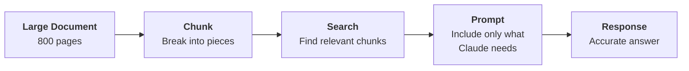
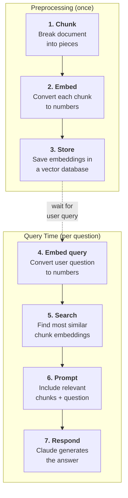
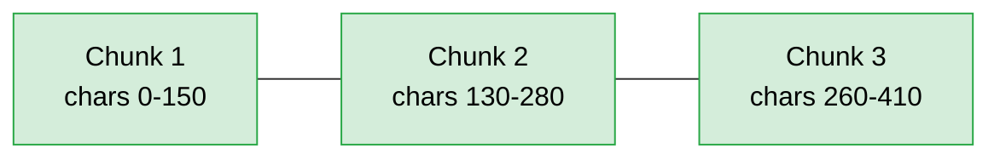
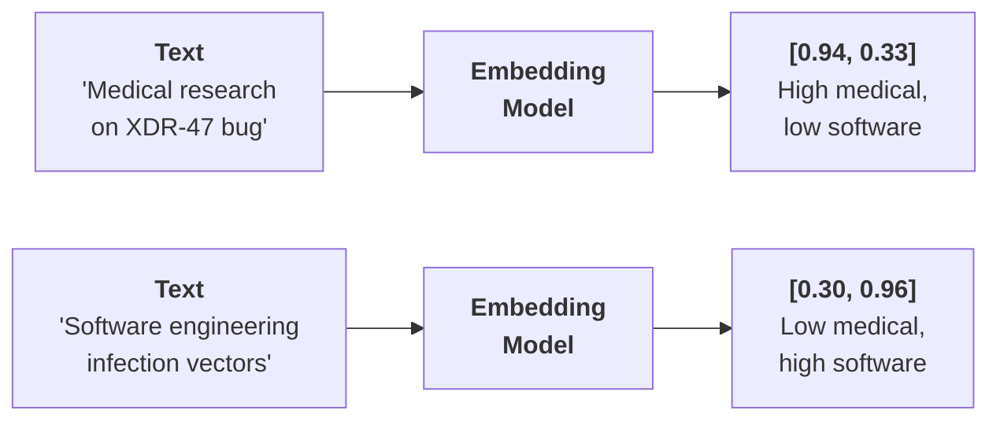
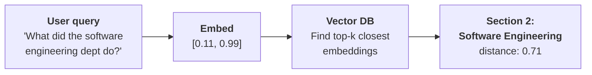
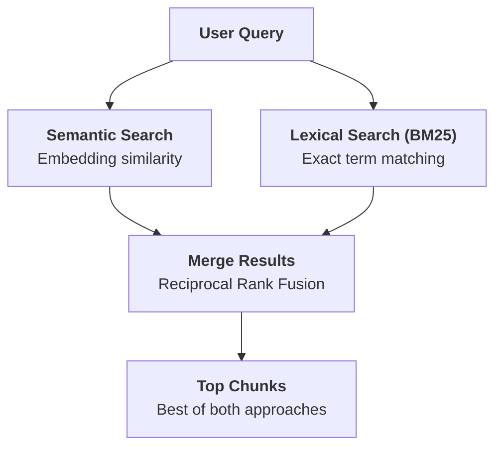
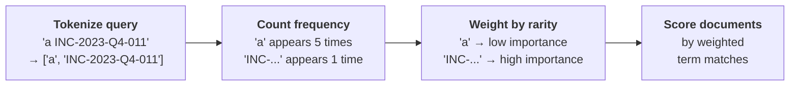
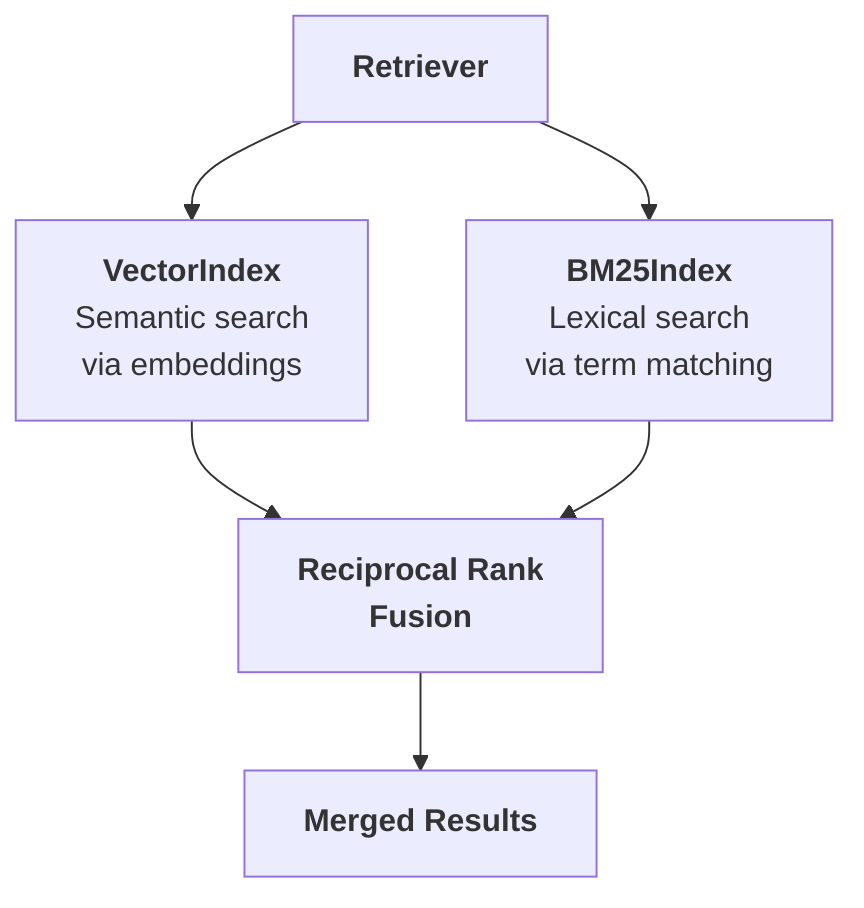
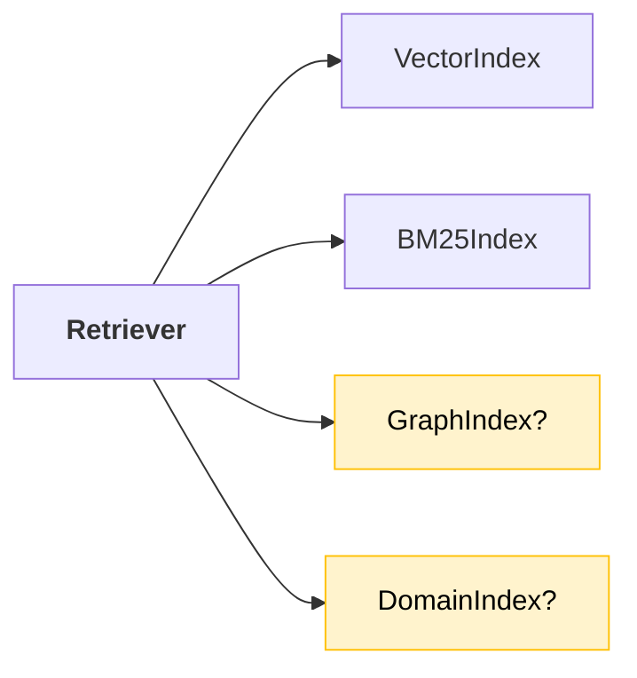
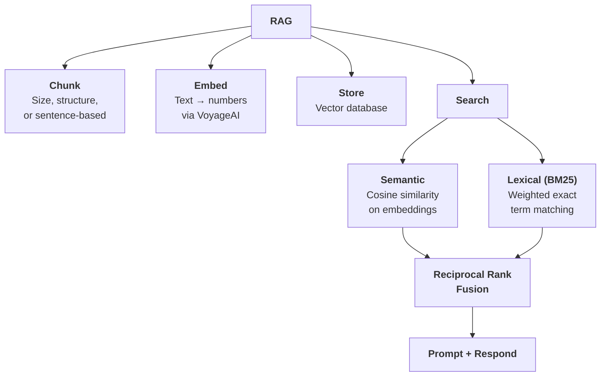

# Retrieval Augmented Generation

You have an 800-page financial document. A user asks "What risk factors does this company have?" You need to get the relevant information to Claude, but you can't stuff the entire document into a prompt.

**Retrieval Augmented Generation (RAG)** solves this: break the document into chunks, find the most relevant ones, and include only those in your prompt.



---

## Why Not Include Everything?

The naive approach: extract all text and stuff it into the prompt.

```python
prompt = f"""Answer the user's question about the financial document.

<user_question>{user_question}</user_question>

<financial_document>{financial_document}</financial_document>
"""
```

This breaks down fast:

| Problem | Impact |
|---|---|
| **Hard prompt length limit** | Document may exceed the context window |
| **Degraded accuracy** | Claude becomes less effective with very long prompts |
| **Higher cost** | More input tokens = more money |
| **Slower responses** | Larger prompts take longer to process |

RAG trades upfront complexity for scalability and efficiency. More work to build, but it handles documents that prompt stuffing never could.

> **The trap:** RAG chunks might not contain all the context Claude needs. If the answer spans two sections and your chunking split them apart, Claude only sees half the picture. Chunking strategy matters.

---

## The RAG Pipeline

RAG has two phases: **preprocessing** (done once, ahead of time) and **query time** (done per user question).



> **The key:** steps 1-3 happen once per document. Steps 4-7 happen every time a user asks a question. The preprocessing is the investment; fast, accurate search is the payoff.

---

## Step 1: Chunking

How you break up your documents directly impacts the quality of your entire system. A poor chunking strategy means irrelevant context gets inserted into your prompts, producing wrong answers.

```
┌─────────────────────────────────────────────────────────┐
│  Example: "How many bugs did engineers fix this year?"  │
├─────────────────────────────────────────────────────────┤
│  Good chunking → retrieves the Software Engineering     │
│                   section about system bugs              │
│                                                         │
│  Bad chunking  → retrieves the Medical Research section │
│                   because it mentions "bug" (a pathogen)│
└─────────────────────────────────────────────────────────┘
```

### Four Chunking Strategies

| Strategy | How it works | Strengths | Weaknesses |
|---|---|---|---|
| **Size-based** | Split into equal character lengths (add overlap to improve) | Works on any document type | Cuts mid-sentence, loses context |
| **Structure-based** | Split on headers, sections, paragraphs | Cleanest, most meaningful chunks | Only works with well-formatted docs |
| **Sentence-based** | Split into sentences, group N per chunk | Good middle ground for most text | Doesn't respect section boundaries |
| **Semantic-based** | Group consecutive sentences by meaning similarity using NLP | Produces the most relevant chunks | Computationally expensive, complex to implement |

#### Size-Based with Overlap

The most common production choice. Simple, reliable, works with any content type.

```python
def chunk_by_char(text, chunk_size=150, chunk_overlap=20):
    chunks = []
    start_idx = 0

    while start_idx < len(text):
        end_idx = min(start_idx + chunk_size, len(text))
        chunk_text = text[start_idx:end_idx]
        chunks.append(chunk_text)

        start_idx = (
            end_idx - chunk_overlap if end_idx < len(text) else len(text)
        )

    return chunks
```



The overlap (20 chars here) ensures context isn't lost at chunk boundaries.

#### Structure-Based

Best results when you control the document format. Split on Markdown headers:

```python
def chunk_by_section(document_text):
    pattern = r"\n## "
    return re.split(pattern, document_text)
```

#### Sentence-Based

A practical middle ground. Group sentences with optional overlap:

```python
def chunk_by_sentence(text, max_sentences_per_chunk=5, overlap_sentences=1):
    sentences = re.split(r"(?<=[.!?])\s+", text)
    chunks = []
    start_idx = 0

    while start_idx < len(sentences):
        end_idx = min(start_idx + max_sentences_per_chunk, len(sentences))
        current_chunk = sentences[start_idx:end_idx]
        chunks.append(" ".join(current_chunk))
        start_idx += max_sentences_per_chunk - overlap_sentences
        if start_idx < 0:
            start_idx = 0

    return chunks
```

> **Rule of thumb:** structure-based when you control the format. Sentence-based for general text. Semantic-based when you need the highest quality and can afford the compute. Size-based with overlap as the universal fallback.

---

## Step 2: Text Embeddings

After chunking, you need a way to find which chunks are relevant to a user's question. This is a search problem, and the solution is **text embeddings**.

A text embedding converts text into a list of numbers that represent its meaning. Text with similar meaning produces similar numbers.

```
┌──────────────────────────────────────────────────────────┐
│  Text Embedding                                          │
├──────────────────────────────────────────────────────────┤
│  Input:  "The team fixed critical bugs in Q4"            │
│  Output: [0.12, -0.45, 0.78, 0.03, ..., -0.22]          │
│                                                          │
│  Each number ranges from -1 to +1                        │
│  Each number scores some quality of the text             │
│  We don't know exactly what each dimension represents    │
│  Similar text → similar numbers                          │
└──────────────────────────────────────────────────────────┘
```



The embedding model outputs are **normalized** (scaled to magnitude 1.0) automatically. You don't need to handle this yourself.

> **Tip:** Anthropic doesn't provide an embedding model. The recommended provider is **VoyageAI**. Sign up for a separate account and API key.

---

## Step 3: Vector Database

Store your embeddings in a **vector database**: a specialized database optimized for storing and searching through lists of numbers.

```python
store = VectorIndex()

for embedding, chunk in zip(embeddings, chunks):
    store.add_vector(embedding, {"content": chunk})
```

> **The trap:** always store the original text alongside the embedding. Getting back a list of numbers is useless. You need the actual chunk text to include in your prompt.

---

## Step 4-5: Search with Cosine Similarity

When a user asks a question, embed their query with the same model and search for the closest chunk embeddings. You specify how many results you want with a `k` parameter (e.g., top 2).



```python
results = store.search(user_embedding, k=2)  # return top 2 matches

for doc, distance in results:
    print(distance, doc["content"][:200])
```

The vector database uses **cosine similarity** to rank results: it measures the angle between two embedding vectors.

```
┌──────────────────────────────────────────────────────┐
│  Cosine Similarity                                   │
├──────────────────────────────────────────────────────┤
│   1.0  → identical meaning                           │
│   0.0  → no relationship                             │
│  -1.0  → opposite meaning                            │
├──────────────────────────────────────────────────────┤
│  Cosine Distance = 1 - cosine similarity             │
│   0.0  → identical (closest)                         │
│   2.0  → opposite  (farthest)                        │
│                                                      │
│  Vector DBs often return distance, not similarity.   │
│  Lower distance = better match.                      │
└──────────────────────────────────────────────────────┘
```

---

## Step 6-7: Build the Prompt and Respond

Take the top chunks and combine them with the user's question:

```python
prompt = f"""Answer the user's question about the financial document.

<user_question>
{user_question}
</user_question>

<report>
{relevant_chunk}
</report>
"""
```

Claude now has focused context instead of 800 pages of noise.

---

## Hybrid Search: Semantic + Lexical

Semantic search alone has a blind spot: it understands meaning but can miss exact term matches.

```
┌─────────────────────────────────────────────────────────────┐
│  Query: "What happened with INC-2023-Q4-011?"               │
├─────────────────────────────────────────────────────────────┤
│  Semantic search returns:                                    │
│    1. Cybersecurity section (contains the ID)      [good]    │
│    2. Financial analysis section (no ID at all)    [bad]     │
│                                                              │
│  The financial section is "conceptually similar" to          │
│  incident analysis, but doesn't mention the actual ID.      │
└─────────────────────────────────────────────────────────────┘
```

The fix: run **both** semantic and lexical search in parallel, then merge results.



### How BM25 Works

**BM25** (Best Match 25) is a lexical search algorithm. It scores documents by how many of your query terms they contain, weighted by rarity.



| Step | What happens |
|---|---|
| **Tokenize** | Break query into individual terms |
| **Count** | How often each term appears across all documents |
| **Weight** | Rare terms get high importance, common terms get low |
| **Score** | Documents with more high-weight terms rank higher |

> **The key:** BM25 excels at specific identifiers, technical terms, and exact phrases. Semantic search excels at conceptual questions. Together they cover each other's blind spots.

```python
store = BM25Index()
for chunk in chunks:
    store.add_document({"content": chunk})

results = store.search("What happened with INC-2023-Q4-011?", 3)
```

---

## Multi-Index RAG Pipeline

The production architecture combines both search types behind a unified **Retriever** class.



Both indexes share the same API (`add_document()` and `search()`), so the Retriever just forwards calls:

```python
class Retriever:
    def __init__(self, *indexes):
        self._indexes = list(indexes)

    def add_document(self, document):
        for index in self._indexes:
            index.add_document(document)

    def search(self, query_text, k=1, k_rrf=60):
        # Get ranked results from each index
        # Merge with reciprocal rank fusion
        # Return top-k results
```

### Reciprocal Rank Fusion (RRF)

You can't just concatenate results from different search systems. They use different scoring scales. RRF normalizes by using **rank position** instead of raw scores.

```
RRF_score(d) = sum( 1 / (k + rank_i(d)) )  for each index i
```

Worked example with `k=1`:

```
┌──────────┬─────────────────┬───────────────┬────────────┐
│ Chunk    │ Vector rank     │ BM25 rank     │ RRF score  │
├──────────┼─────────────────┼───────────────┼────────────┤
│ Sec. 2   │ 1               │ 2             │ 0.833      │
│ Sec. 6   │ 3               │ 1             │ 0.750      │
│ Sec. 7   │ 2               │ 3             │ 0.583      │
└──────────┴─────────────────┴───────────────┴────────────┘

Section 2: 1/(1+1) + 1/(1+2) = 0.50 + 0.33 = 0.833  ← top result
Section 6: 1/(1+3) + 1/(1+1) = 0.25 + 0.50 = 0.750
Section 7: 1/(1+2) + 1/(1+3) = 0.33 + 0.25 = 0.583
```

Section 2 wins because it ranked well in **both** indexes. A chunk that only one search method likes won't dominate.

### Extensibility

Because every index implements the same `add_document()` / `search()` interface, adding a new search method (keyword index, graph search, domain-specific index) is plug-and-play. The Retriever and RRF handle the rest.



---

## Quick Revision



| Concept | One-line summary |
|---|---|
| **RAG** | Break docs into chunks, search for relevant ones, include only those in the prompt |
| **Why not stuff everything** | Context window limits, degraded accuracy, higher cost, slower responses |
| **Size-based chunking** | Split by character count with overlap; universal fallback |
| **Structure-based chunking** | Split on headers/sections; best quality but needs formatted docs |
| **Sentence-based chunking** | Group N sentences with overlap; good middle ground |
| **Semantic-based chunking** | Group sentences by meaning similarity; highest quality, highest compute cost |
| **Text embedding** | Numerical representation of meaning; similar text produces similar numbers |
| **Vector database** | Specialized store for embedding search; always store original text alongside |
| **Cosine similarity** | Measures angle between vectors; 1.0 = identical, 0 = unrelated |
| **Cosine distance** | `1 - similarity`; lower = more similar (what most vector DBs return) |
| **BM25** | Lexical search that weights terms by rarity; strong on IDs and exact phrases |
| **Hybrid search** | Run semantic + lexical in parallel; covers both conceptual and exact-match queries |
| **Reciprocal Rank Fusion** | Merge results from different search systems using rank position, not raw scores |
| **Retriever** | Unified class wrapping multiple indexes behind a shared interface |
