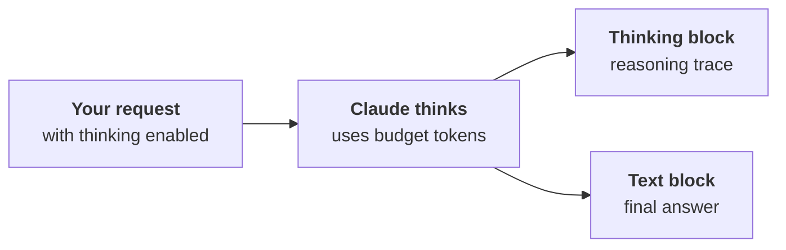
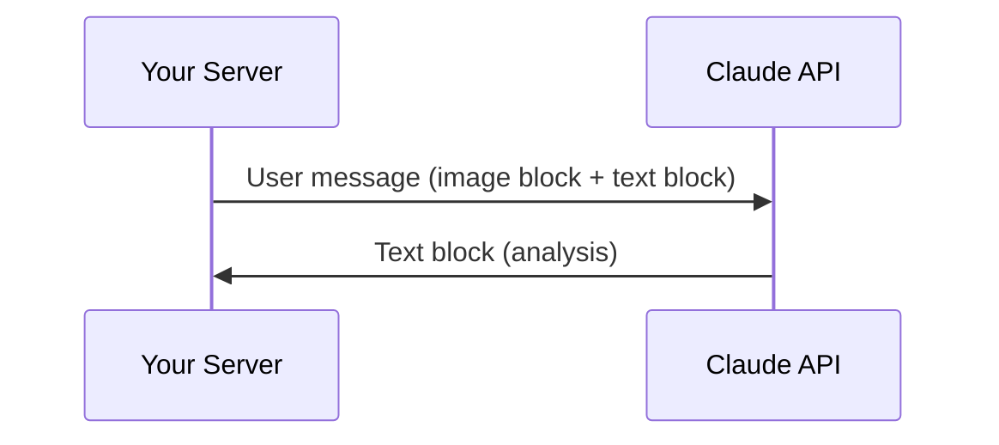
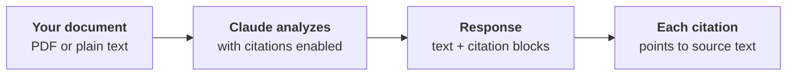
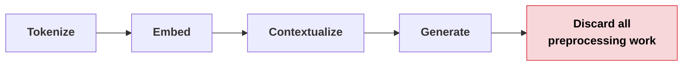
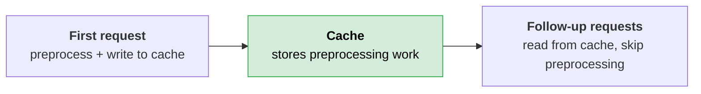
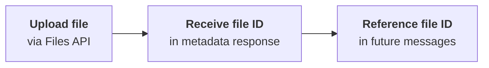
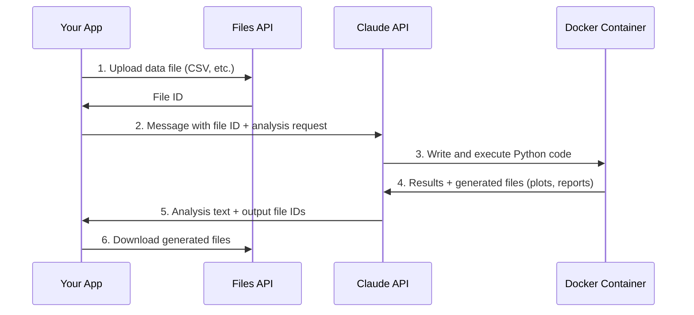
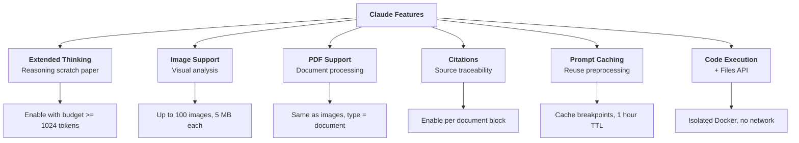

# Claude Features

Claude offers several features beyond basic text generation. Each one extends what you can do through the API: reasoning through hard problems, processing images and PDFs, citing sources, caching repeated content, and executing code.

---

## Extended Thinking

Extended thinking gives Claude a "scratch paper" to reason through complex problems before producing a final answer. You see both the reasoning process and the result.



With thinking enabled, the response contains two parts: the reasoning process and the final answer.

### When to Use It

Run your prompts without thinking first. If accuracy falls short after prompt optimization, enable thinking. It is not a starting point.

| Factor | Impact |
|---|---|
| **Accuracy** | Better on complex reasoning tasks |
| **Transparency** | You see Claude's thought process |
| **Cost** | Higher (you pay for thinking tokens) |
| **Latency** | Higher (reasoning takes time) |
| **Code complexity** | Response handling is more involved |

### Implementation

Add two parameters to your API call: a `thinking` configuration and a `thinking_budget`.

```python
params["thinking"] = {
    "type": "enabled",
    "budget": 1024  # minimum value is 1024 tokens
}
```

> **Rule of thumb:** your `max_tokens` must be greater than your `thinking_budget`.

Call it like this:

```python
chat(messages, thinking=True, thinking_budget=1024)
```

### Response Security

Each thinking block includes a cryptographic **signature**. This token proves you haven't modified the reasoning text, preventing tampering that could lead the model in unsafe directions.

### Redacted Thinking

Sometimes Claude's thinking gets flagged by internal safety systems. When this happens, you receive a **redacted thinking block** containing encrypted content instead of readable text. You can still pass this block back to Claude in future messages to preserve conversation context.

> **Tip:** you can force a redacted thinking block with a special trigger string for testing purposes. Make sure your application handles redacted responses without crashing.

### Feature Restrictions

Extended thinking is **not compatible** with some other features, notably message pre-filling and temperature. Check the [full compatibility list](https://docs.anthropic.com/en/docs/build-with-claude/extended-thinking#feature-compatibility) before combining features.

---

## Image Support

Claude can analyze images included in your messages: describe contents, compare multiple images, count objects, or perform complex visual analysis.

### Limits

| Constraint | Value |
|---|---|
| **Max images per request** | 100 (across all messages) |
| **Max file size** | 5 MB per image |
| **Max dimensions (single image)** | 8000 x 8000 px |
| **Max dimensions (multiple images)** | 2000 x 2000 px |
| **Input formats** | Base64 encoding or URL |
| **Token cost formula** | `(width px x height px) / 750` |

### Sending an Image

Include an image block alongside a text block in your user message:

```python
import base64

with open("image.png", "rb") as f:
    image_bytes = base64.standard_b64encode(f.read()).decode("utf-8")

add_user_message(messages, [
    {
        "type": "image",
        "source": {
            "type": "base64",
            "media_type": "image/png",
            "data": image_bytes,
        }
    },
    {
        "type": "text",
        "text": "What do you see in this image?"
    }
])
```



### Prompting for Accuracy

Simple prompts lead to poor results on visual tasks. The same prompt engineering techniques from text apply to images.

| Technique | What to do |
|---|---|
| **Step-by-step analysis** | Give Claude a methodology (e.g., "count row by row, then verify with a different method") |
| **One-shot examples** | Include a reference image with a known answer before the target image |
| **Detailed guidelines** | Break complex tasks into numbered analysis steps |

#### Example: Structured Prompt for Counting

```text
Analyze this image of marbles using this methodology:
1. Identify each unique marble one at a time. Assign each a number.
2. Verify by counting from the bottom-left corner, row by row, left to right.

What is the exact, verified number of marbles?
```

#### Example: Fire Risk Assessment

A practical application: automating fire risk scores from satellite imagery. Instead of "give me a fire risk score," a structured prompt walks Claude through residence identification, tree overhang analysis, defensible space assessment, and a 1-4 rating scale with explicit criteria for each level.

> **The key:** invest time in crafting structured prompts. Simple questions give unreliable results on complex visual tasks.

---

## PDF Support

Claude reads and analyzes PDF files directly, extracting text, images, charts, and tables.

### Sending a PDF

Nearly identical to image handling. The differences:

| Field | Image | PDF |
|---|---|---|
| **Block type** | `"image"` | `"document"` |
| **Media type** | `"image/png"` | `"application/pdf"` |

```python
import base64

with open("report.pdf", "rb") as f:
    file_bytes = base64.standard_b64encode(f.read()).decode("utf-8")

add_user_message(messages, [
    {
        "type": "document",
        "source": {
            "type": "base64",
            "media_type": "application/pdf",
            "data": file_bytes,
        }
    },
    {
        "type": "text",
        "text": "Summarize the document in one sentence"
    }
])
```

> **Tip:** Claude understands document structure, embedded images, charts, and table relationships. It is not just doing text extraction.

---

## Citations

Citations let Claude reference specific parts of your source documents, showing users exactly where each piece of information comes from. Without citations, users have no way to verify that Claude is referencing your provided document rather than its training data.



### Enabling Citations

Add `title` and `citations` fields to your document block:

```python
{
    "type": "document",
    "source": {
        "type": "base64",
        "media_type": "application/pdf",
        "data": file_bytes,
    },
    "title": "earth.pdf",
    "citations": {"enabled": True}
}
```

### Citation Structure

Each citation in the response contains:

| Field | What it tells you |
|---|---|
| **cited_text** | The exact text from your document that supports Claude's claim |
| **document_index** | Which document (useful with multiple documents) |
| **document_title** | The title you assigned |
| **start_page_number** | Where the cited text begins |
| **end_page_number** | Where the cited text ends |

You can build interactive UIs where users hover over citation markers to see where information came from.


### Plain Text Citations

Citations work with plain text too. Swap the source type and media type:

```python
{
    "type": "document",
    "source": {
        "type": "text",
        "media_type": "text/plain",
        "data": article_text,
    },
    "title": "earth_article",
    "citations": {"enabled": True}
}
```

With plain text, you get **character positions** instead of page numbers.

> **The key:** citations transform Claude from a black box into a transparent research assistant that shows its work. Use them when users need to verify information or trace claims back to source material.

---

## Prompt Caching

Prompt caching saves Claude's preprocessing work so it can be reused on follow-up requests with identical content. The result: faster responses and lower costs.

### Why It Matters

Every request without caching goes through four preprocessing steps before generating output:



After generating the response, all preprocessing work is discarded. In a conversation where you repeatedly send the same large document, Claude reprocesses identical content every time.

Caching stores the preprocessing results instead of discarding them.



| Benefit | Detail |
|---|---|
| **Faster responses** | Cached portions skip preprocessing |
| **Lower costs** | Cached input tokens cost less |
| **Automatic** | First request writes cache, follow-ups read it |

| Limitation | Detail |
|---|---|
| **Cache duration** | 1 hour only |
| **Requires identical content** | Any change invalidates the cache |
| **Minimum size** | Content must be at least 1024 tokens |

### Cache Breakpoints

Caching is **not automatic**. You must add a `cache_control` field to mark where caching should happen. Everything before the breakpoint gets cached.

> **The trap:** the shorthand text format doesn't support cache control. You must use the longhand block format.

Claude caches all processing up to and including the breakpoint. Content after the breakpoint is processed normally. For the cache to be useful, content must be identical up to the breakpoint. Even small changes invalidate the cache.

#### Caching Tool Schemas

Add cache control to the **last tool** in your list:

```python
if tools:
    tools_clone = tools.copy()
    last_tool = tools_clone[-1].copy()
    last_tool["cache_control"] = {"type": "ephemeral"}
    tools_clone[-1] = last_tool
    params["tools"] = tools_clone
```

#### Caching System Prompts

Convert your system prompt to a structured block:

```python
if system:
    params["system"] = [
        {
            "type": "text",
            "text": system,
            "cache_control": {"type": "ephemeral"}
        }
    ]
```

#### Caching Message Content

Use the longhand format and add `cache_control`:

```python
{
    "type": "text",
    "text": "Your long, repeated content here...",
    "cache_control": {"type": "ephemeral"}
}
```

Cache breakpoints can span across multiple messages and message types. You are not limited to text blocks: cache breakpoints work on system prompts, tool definitions, images, and tool use/result blocks.

### Cache Rules

Claude processes request components in this order: tools first, then system prompt, then messages.

| Rule | Detail |
|---|---|
| **Max breakpoints** | 4 per request |
| **Minimum cacheable size** | 1024 tokens total (sum of all blocks up to the breakpoint) |
| **Exact match required** | Even adding the word "please" invalidates the cache |
| **Processing order** | Tools first, then system prompt, then messages |
| **Cacheable block types** | Text, system prompts, tool definitions, images, tool use/result blocks |

### Reading Cache Usage

The API response tells you what happened:

```
┌──────────────────────────────────────────────────────────────┐
│  Cache Usage in Response                                     │
├──────────────────────────────────────────────────────────────┤
│  cache_creation_input_tokens = 1772  → wrote to cache        │
│  cache_read_input_tokens     = 1772  → read from cache       │
│  input_tokens                = 42    → processed normally     │
└──────────────────────────────────────────────────────────────┘
```

If you change your system prompt but keep the same tools, you see a partial cache read (tools) and a cache write (new system prompt). Only the changed portions get reprocessed.

> **Rule of thumb:** system prompts and tool definitions rarely change between requests. Cache them first for the biggest benefit.

---

## Code Execution and the Files API

Two features that work best together: the **Files API** for uploading and downloading files, and **Code Execution** for running Python in an isolated container.

### Files API

Instead of encoding files as base64 in every message, upload them once and reference them by ID.



This is useful when you reference the same file multiple times or work with large files.

### Code Execution

A server-side tool where Claude writes and runs Python code in an isolated Docker container. You include a predefined tool schema, and Claude decides when to execute code.

```python
tools = [{"type": "code_execution_20250522", "name": "code_execution"}]
```

| Property | Detail |
|---|---|
| **Environment** | Isolated Docker container |
| **Network access** | None |
| **Iterations** | Claude can execute code multiple times per response |
| **Output** | Results are captured and interpreted by Claude |

### Combining Both

The Docker container has no network access, so the Files API is the primary way to get data in and out.



### Example: Data Analysis Workflow

Upload a CSV file and ask Claude to analyze it:

```python
file_metadata = upload("streaming.csv")

messages = []
add_user_message(messages, [
    {
        "type": "text",
        "text": "Run a detailed analysis to determine major drivers of churn. "
                "Include at least one detailed plot summarizing your findings."
    },
    {"type": "container_upload", "file_id": file_metadata.id},
])

chat(
    messages,
    tools=[{"type": "code_execution_20250522", "name": "code_execution"}]
)
```

### Response Structure

The response contains multiple block types interleaved:

| Block type | What it contains |
|---|---|
| **Text blocks** | Claude's analysis and explanations |
| **Server tool use blocks** | The Python code Claude wrote and ran |
| **Code execution result blocks** | Output from running the code |
| **Code execution output blocks** | Generated files (plots, reports) with downloadable file IDs |

Claude may execute code multiple times in a single response, iteratively building up its analysis.

```python
download_file("file_id_from_response")
```


> **Tip:** code execution is not limited to data analysis. Use it for image processing, document transformation, mathematical modeling, or any task where Claude benefits from running and iterating on actual code.

---

## Quick Revision



| Feature | What it does | Key detail |
|---|---|---|
| **Extended Thinking** | Claude reasons on scratch paper before answering | Budget minimum 1024 tokens. Incompatible with pre-filling and temperature. |
| **Image Support** | Analyze images via base64 or URL | Max 100 images/request. Token cost = (w x h) / 750. |
| **PDF Support** | Read text, images, charts, and tables from PDFs | Uses `type: "document"` with `media_type: "application/pdf"`. |
| **Citations** | Link each claim to exact source text | Returns cited_text, page numbers (PDF) or character positions (plain text). |
| **Prompt Caching** | Skip preprocessing for repeated content | Max 4 breakpoints. Min 1024 tokens. Cache lives 1 hour. |
| **Code Execution** | Run Python in isolated Docker container | No network access. Use Files API to move data in/out. |
