# Model Context Protocol

MCP is a communication layer that gives Claude access to external tools, data, and prompts without you writing all the integration code. It shifts the burden of tool definitions and execution from your application to specialized **MCP servers**.

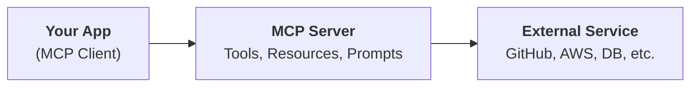

---

## Why MCP Exists

Without MCP, building a chatbot that accesses GitHub means writing every tool yourself: schemas, functions, error handling, and maintenance for every endpoint you need.

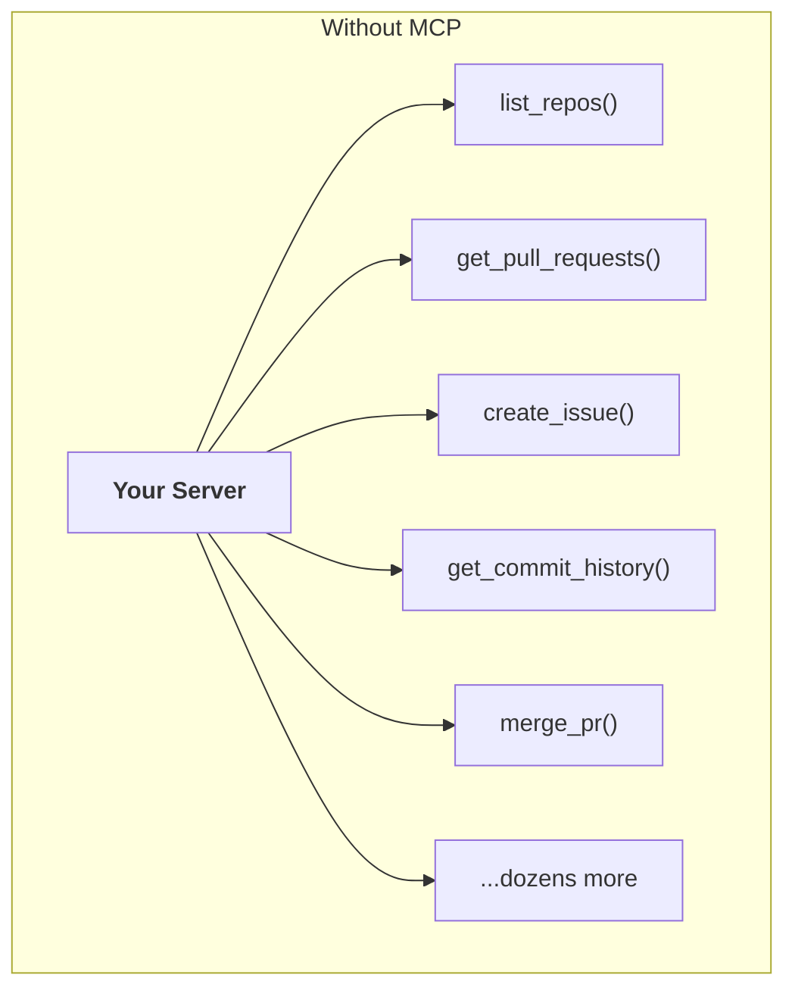

GitHub has massive functionality: repositories, pull requests, issues, projects, branches, reviews. Each tool requires both a schema definition and a function implementation. That is a lot of code to write, test, and maintain.


MCP flips this. Someone else authors and hosts the tools. You just connect.

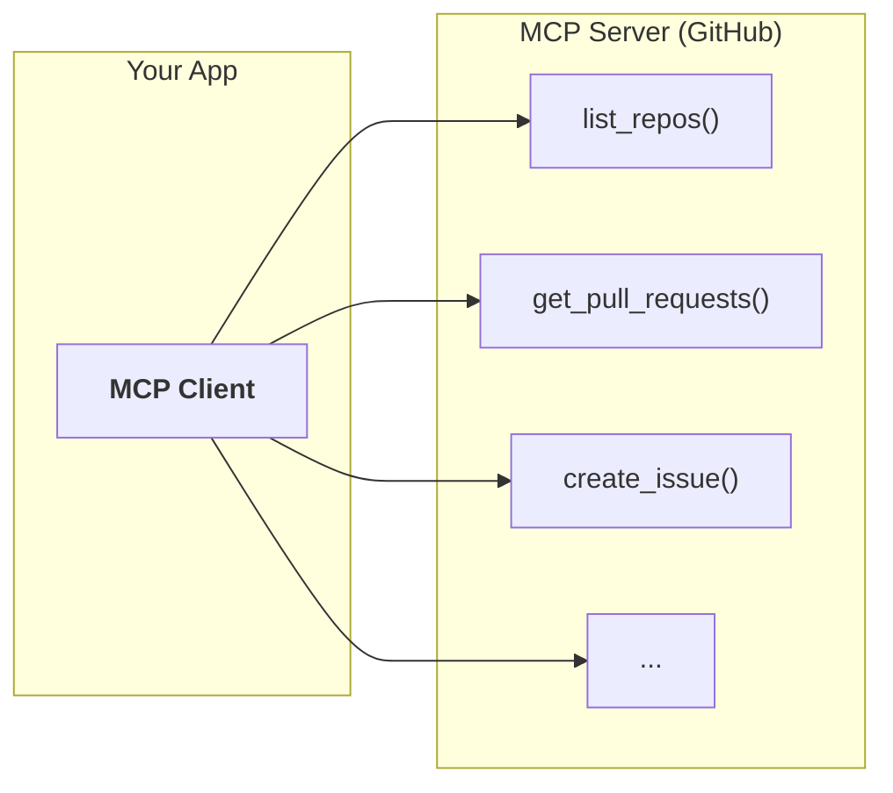


> **The key:** MCP servers provide tool schemas and functions already defined for you. You consume them rather than build them.

---

## Common Misconceptions

| Question | Answer |
|---|---|
| **"Isn't MCP just tool use?"** | No. Tool use is the mechanism Claude uses to call functions. MCP is about who writes and hosts those functions. With MCP, someone else has done that work. |
| **"Who authors MCP servers?"** | Anyone. Service providers often release official implementations (e.g., AWS, GitHub, Stripe). |
| **"How is this different from calling APIs directly?"** | Direct API calls require you to author every schema and function. MCP gives you pre-built tools ready to use. |

---

## Architecture

Three components make up the MCP architecture:

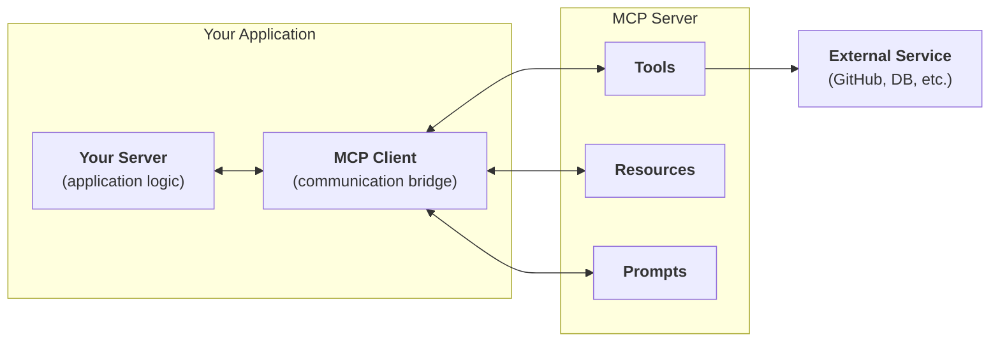

| Component | Role |
|---|---|
| **Your Server** | Application logic: receives user input, calls Claude, returns responses |
| **MCP Client** | Communication bridge between your server and MCP servers. Handles message passing and protocol details |
| **MCP Server** | Exposes tools, resources, and prompts. Wraps external service functionality |

> **Rule of thumb:** in real projects, you build either a client or a server, not both. You build a server to expose your service. You build a client to consume someone else's.

---

## Transport: How Client and Server Talk

MCP is **transport agnostic**. The client and server can communicate through different methods.

| Transport | When to use |
|---|---|
| **stdio** (standard I/O) | Client and server on the same machine. Most common for local development |
| **HTTP** | Client and server on different machines |
| **WebSockets** | Real-time, persistent connections |


---

## Message Types

Once connected, the client and server exchange specific message types defined in the MCP specification.

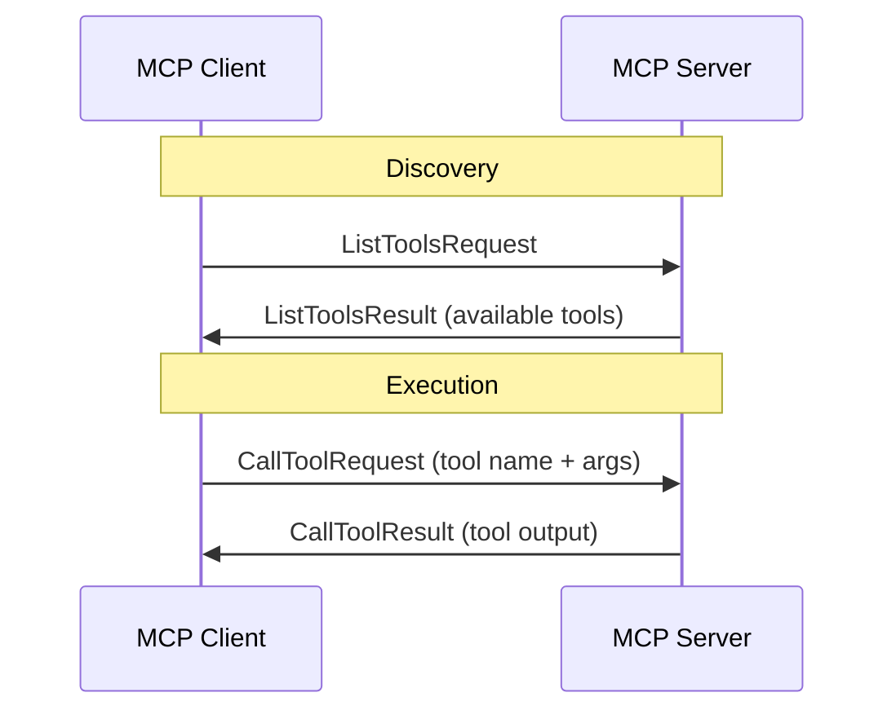

| Message | Direction | Purpose |
|---|---|---|
| **ListToolsRequest** | Client to Server | "What tools do you provide?" |
| **ListToolsResult** | Server to Client | List of available tool schemas |
| **CallToolRequest** | Client to Server | "Run this tool with these arguments" |
| **CallToolResult** | Server to Client | The tool's output |


---

## Complete Flow: End to End

Here is the full communication flow when a user asks "What repositories do I have?"

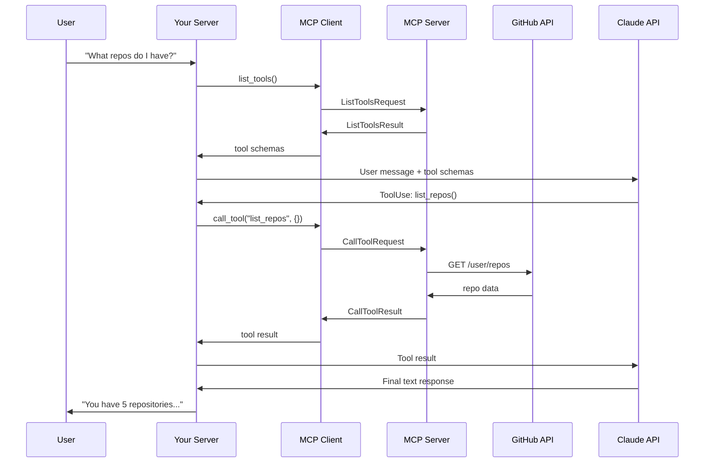

> **Tip:** your server never talks to GitHub directly. The MCP server handles that. Your server only talks to the MCP client and Claude.


---

## Project: CLI Document Chatbot

The hands-on project builds a CLI chatbot with two components: an MCP client handling user interactions and a custom MCP server managing document operations.

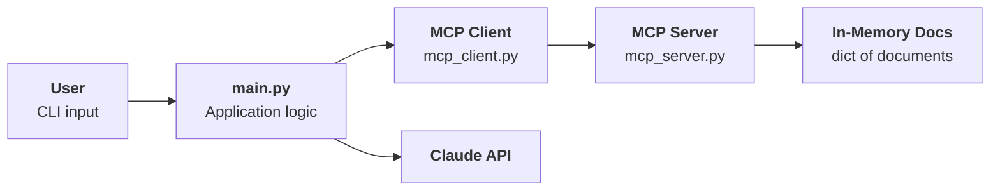

The server provides two tools (read and edit documents), two resources (list and fetch documents), and a formatting prompt. All documents are stored in a Python dictionary for simplicity.

```
┌──────────────────────────────────────────────────────┐
│  Project Structure                                   │
├──────────────────────────────────────────────────────┤
│  main.py          → entry point, wires everything    │
│  mcp_client.py    → MCPClient class                  │
│  mcp_server.py    → FastMCP server + tools           │
│  core/            → CLI app, Claude service, chat    │
│  .env             → API key + model config           │
└──────────────────────────────────────────────────────┘
```

---

## Defining Tools with the Python SDK

The MCP Python SDK turns tool creation from verbose JSON schemas into decorated Python functions.

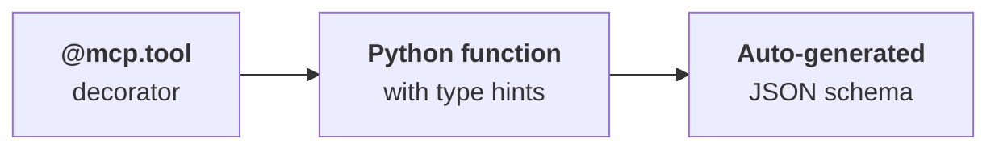

### Read Tool

```python
from mcp.server.fastmcp import FastMCP
from pydantic import Field

mcp = FastMCP("DocumentMCP", log_level="ERROR")

docs = {
    "deposition.md": "This deposition covers the testimony of Angela Smith, P.E.",
    "report.pdf": "The report details the state of a 20m condenser tower.",
    "financials.docx": "These financials outline the project's budget and expenditures.",
}

@mcp.tool(
    name="read_doc_contents",
    description="Read the contents of a document and return it as a string.",
)
def read_document(
    doc_id: str = Field(description="Id of the document to read"),
):
    if doc_id not in docs:
        raise ValueError(f"Doc with id {doc_id} not found")
    return docs[doc_id]
```

### Edit Tool

```python
@mcp.tool(
    name="edit_document",
    description="Edit a document by replacing a string in the documents content with a new string",
)
def edit_document(
    doc_id: str = Field(description="Id of the document that will be edited"),
    old_str: str = Field(description="The text to replace. Must match exactly, including whitespace"),
    new_str: str = Field(description="The new text to insert in place of the old text"),
):
    if doc_id not in docs:
        raise ValueError(f"Doc with id {doc_id} not found")
    docs[doc_id] = docs[doc_id].replace(old_str, new_str)
```

| SDK Feature | Benefit |
|---|---|
| **`@mcp.tool` decorator** | Registers the function as a tool and auto-generates the JSON schema |
| **`Field()` from Pydantic** | Adds parameter descriptions that help Claude understand what each argument expects |
| **Type hints** | Drive automatic schema generation and validation |
| **Error handling** | `ValueError` messages are returned to Claude, which can self-correct |

> **The key:** you write a normal Python function. The SDK handles the protocol. Compare this to the manual `ToolParam` approach from the tool use module.

---

## The Server Inspector

The MCP SDK includes a browser-based inspector for testing your server without connecting to a full application.

```bash
mcp dev mcp_server.py
```

This starts a dev server on port 6277. Open the URL in your browser.


### Testing Workflow

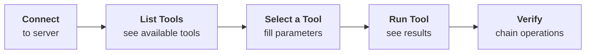

| Step | What you do |
|---|---|
| **Connect** | Click Connect to start the MCP server |
| **List Tools** | See all tools, resources, and prompts |
| **Test** | Fill in parameters and run individual tools |
| **Verify** | Chain operations (edit then read) to confirm behavior |


> **Tip:** the inspector is actively developed, so the UI may look different from these screenshots. The core testing functionality stays the same.

---

## Implementing the Client

The MCP client consists of two layers: a `ClientSession` (from the SDK) that manages the connection, and your `MCPClient` wrapper that provides a clean interface.

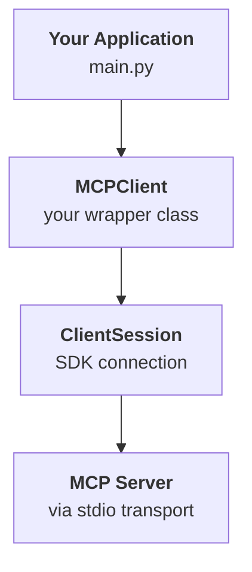

### Core Methods

Your client needs two methods to power the tool-use loop:

```python
from mcp import ClientSession, StdioServerParameters, types
from mcp.client.stdio import stdio_client

class MCPClient:
    async def list_tools(self) -> list[types.Tool]:
        result = await self.session().list_tools()
        return result.tools

    async def call_tool(
        self, tool_name: str, tool_input: dict
    ) -> types.CallToolResult | None:
        return await self.session().call_tool(tool_name, tool_input)
```

The `MCPClient` class uses `AsyncExitStack` for resource cleanup. When used as an async context manager, it connects on entry and cleans up on exit:

```python
async with MCPClient(command="uv", args=["run", "mcp_server.py"]) as client:
    tools = await client.list_tools()
    print(tools)  # [Tool(name="read_doc_contents", ...), Tool(name="edit_document", ...)]
```

```
┌──────────────────────────────────────────────────────┐
│  MCPClient Interface                                 │
├──────────────────────────────────────────────────────┤
│  list_tools()      → returns all tool schemas        │
│  call_tool()       → executes a tool by name         │
│  list_prompts()    → returns all prompt definitions   │
│  get_prompt()      → returns messages for a prompt   │
│  read_resource()   → fetches resource data by URI    │
│  cleanup()         → closes session and transport    │
└──────────────────────────────────────────────────────┘
```

---

## Defining Resources

Resources expose data from your MCP server, similar to GET endpoints in an HTTP API. Use them when you need to fetch information rather than perform actions.

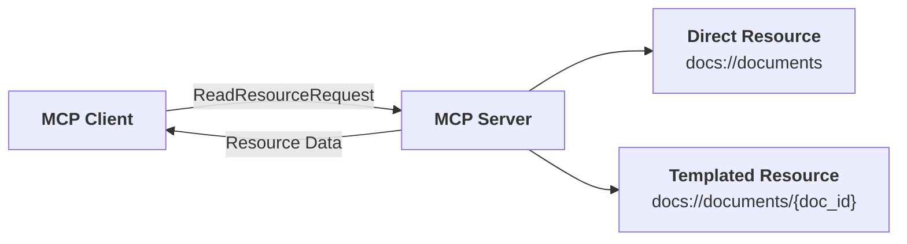

### Two Types of Resources

| Type | URI Pattern | Use case |
|---|---|---|
| **Direct** | `docs://documents` | Static endpoints: list all items, get config |
| **Templated** | `docs://documents/{doc_id}` | Parameterized queries: fetch a specific item |

### Implementation

```python
@mcp.resource("docs://documents", mime_type="application/json")
def list_docs() -> list[str]:
    return list(docs.keys())

@mcp.resource("docs://documents/{doc_id}", mime_type="text/plain")
def fetch_doc(doc_id: str) -> str:
    if doc_id not in docs:
        raise ValueError(f"Doc with id {doc_id} not found")
    return docs[doc_id]
```

The SDK automatically parses `{doc_id}` from the URI and passes it as a keyword argument. The `mime_type` hints to clients how to parse the response.


### Accessing Resources from the Client

```python
import json
from pydantic import AnyUrl

async def read_resource(self, uri: str) -> Any:
    result = await self.session().read_resource(AnyUrl(uri))
    resource = result.contents[0]

    if isinstance(resource, types.TextResourceContents):
        if resource.mimeType == "application/json":
            return json.loads(resource.text)
        return resource.text
```

The response `contents` list contains the resource data plus metadata. Check the MIME type to determine how to parse it.

> **The key:** resources are fetched directly and injected into prompts. No tool call needed. This makes interactions faster when you know exactly what data you want.

### Tools vs Resources

| | Tools | Resources |
|---|---|---|
| **Purpose** | Perform actions, side effects | Fetch data, read-only |
| **Who decides to use them** | Claude (via tool use loop) | Your application code |
| **Analogy** | POST/PUT/DELETE endpoints | GET endpoints |
| **Example** | `edit_document()` | `docs://documents/{id}` |

---

## Defining Prompts

Prompts are pre-built, high-quality instruction templates defined on the MCP server. They give better results than ad-hoc user input because they are carefully crafted and tested.

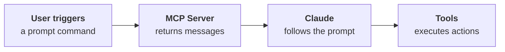

### Implementation

```python
from mcp.server.fastmcp.prompts import base

@mcp.prompt(
    name="format",
    description="Rewrites the contents of the document in Markdown format.",
)
def format_document(
    doc_id: str = Field(description="Id of the document to format"),
) -> list[base.Message]:
    prompt = f"""
    Your goal is to reformat a document to be written with markdown syntax.

    The id of the document you need to reformat is:
    <document_id>
    {doc_id}
    </document_id>

    Add in headers, bullet points, tables, etc as necessary.
    Use the 'edit_document' tool to edit the document.
    After the document has been edited, respond with the final version.
    """
    return [base.UserMessage(prompt)]
```

The `@mcp.prompt` decorator registers the function. Arguments are passed as keyword arguments when the client requests the prompt.

### Accessing Prompts from the Client

```python
async def list_prompts(self) -> list[types.Prompt]:
    result = await self.session().list_prompts()
    return result.prompts

async def get_prompt(self, prompt_name, args: dict[str, str]):
    result = await self.session().get_prompt(prompt_name, args)
    return result.messages
```

When a user selects a prompt (e.g., `/format`), the system:

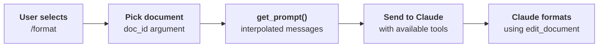


> **Rule of thumb:** prompts should represent your domain expertise. They are pre-tested, carefully worded instructions that produce better results than what users would write on their own.

---

## The Three Primitives

MCP servers expose three types of capabilities. Each serves a different purpose in the communication flow.

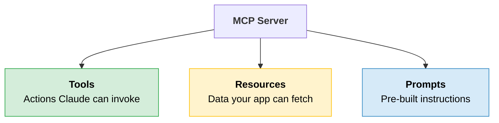

| Primitive | Who uses it | How it is accessed | Example |
|---|---|---|---|
| **Tools** | Claude decides to call them | Via the tool-use loop | `read_doc_contents`, `edit_document` |
| **Resources** | Your app fetches them directly | `read_resource(uri)` | `docs://documents`, `docs://documents/{id}` |
| **Prompts** | User selects them as commands | `get_prompt(name, args)` | `/format` with `doc_id` argument |

---

## Running the Server

Add this at the bottom of your `mcp_server.py` to make it runnable:

```python
if __name__ == "__main__":
    mcp.run(transport="stdio")
```

The `transport="stdio"` tells the server to communicate over standard input/output, which is how the client connects when both run on the same machine.

---

## Quick Revision

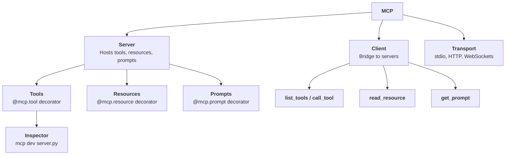

| Concept | One-line summary |
|---|---|
| **MCP** | Communication layer that shifts tool definitions and execution to specialized servers |
| **MCP Server** | Hosts tools, resources, and prompts that wrap external service functionality |
| **MCP Client** | Communication bridge between your application and MCP servers |
| **Transport** | How client and server talk: stdio (local), HTTP, or WebSockets |
| **Tools** | Decorated Python functions that Claude can invoke via the tool-use loop |
| **Resources** | Data endpoints (direct or templated) your app fetches directly into prompts |
| **Prompts** | Pre-built instruction templates that produce better results than ad-hoc input |
| **FastMCP** | Python SDK class that auto-generates JSON schemas from type hints and decorators |
| **Field()** | Pydantic helper that adds parameter descriptions for Claude |
| **Inspector** | Browser-based tool (`mcp dev`) for testing your server without a full application |
| **ListToolsRequest** | Client asks server what tools are available |
| **CallToolRequest** | Client asks server to execute a specific tool with arguments |
| **MCPClient wrapper** | Your class around `ClientSession` that handles connection lifecycle and cleanup |
