# Model Context Protocol

You already know how tool use works: you write a function, describe it with a JSON schema, and wire up a loop so Claude can call it. That works fine for three tools. Now imagine building a GitHub chatbot.

You need tools for repositories, pull requests, issues, commits, branches, reviews, projects, releases. Each one requires a schema and an implementation. That is dozens of functions you write, test, debug, and maintain as GitHub's API evolves.

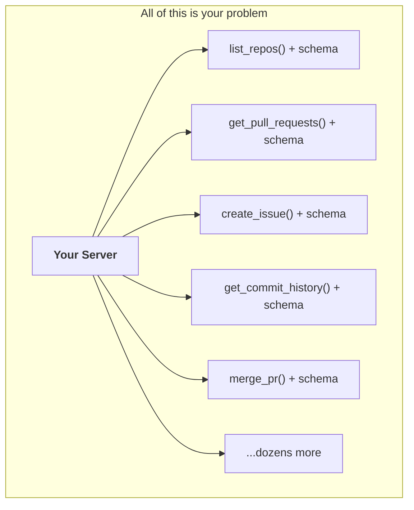

MCP exists to eliminate this burden. Someone else writes and hosts the tools. You just connect to them.

---

## What MCP Actually Is

**Model Context Protocol** is a standard that lets your application plug into pre-built servers that already contain the tools, data, and prompts you need. Instead of you authoring every GitHub function, a GitHub MCP server packages all of that up. You connect your app to it and immediately have access.

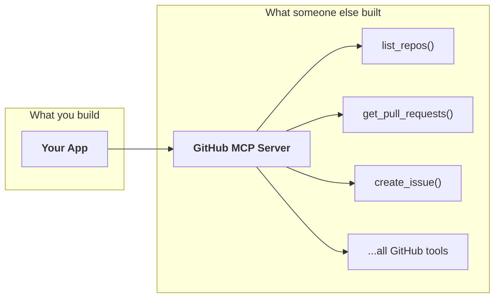

The trade is simple. Without MCP, you own every tool definition and function. With MCP, you consume tools that someone else already built and tested.

> **The trap:** "Isn't MCP just tool use?" No. Tool use is the mechanism Claude uses to call functions. MCP is about **who writes and maintains those functions**. With tool use alone, that is you. With MCP, that burden shifts to the server author.

---

## The Architecture

Three pieces make the system work. Understanding what each one does (and doesn't do) is the foundation for everything that follows.

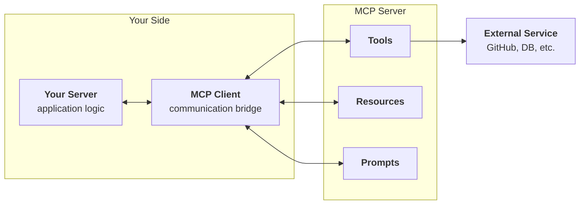

```
┌──────────────────────────────────────────────────────────────┐
│  Your Server                                                 │
│  What it does:  receives user input, calls Claude, returns   │
│                 responses. This is your application logic.   │
│  What it doesn't: talk to external services directly.        │
├──────────────────────────────────────────────────────────────┤
│  MCP Client                                                  │
│  What it does:  sits between your server and MCP servers.    │
│                 Handles all the message passing and protocol. │
│  What it doesn't: know anything about your business logic.   │
├──────────────────────────────────────────────────────────────┤
│  MCP Server                                                  │
│  What it does:  wraps an external service. Exposes tools,    │
│                 resources, and prompts for clients to use.   │
│  What it doesn't: know about Claude or your application.     │
└──────────────────────────────────────────────────────────────┘
```

> **Rule of thumb:** in a real project, you build either a client or a server, not both. Build a server to expose your service to others. Build a client to consume someone else's server.

### How Client and Server Connect

MCP is **transport agnostic**: the client and server can talk over different channels depending on where they run.

| Transport | Setup | When to use |
|---|---|---|
| **stdio** | Same machine, standard I/O | Local development. Most common. |
| **HTTP** | Network request/response | Client and server on different machines |
| **WebSockets** | Persistent connection | Real-time, bidirectional communication |

For local development (and the project below), stdio is the default. Both processes run on your machine and communicate through standard input/output.

---

## The Three Primitives

An MCP server doesn't just expose tools. It exposes three types of capabilities, each designed for a different part of the interaction.

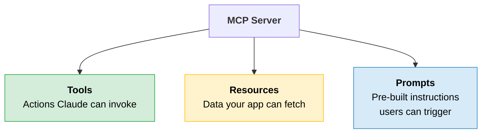

These three primitives exist because different things need data at different points in the flow, and through different mechanisms.

| Primitive | Who decides to use it | How it works | Example |
|---|---|---|---|
| **Tools** | **Claude** decides during the conversation | Claude sees the tool schemas, picks one, your code executes it via the MCP server | `edit_document("report.pdf", ...)` |
| **Resources** | **Your app** fetches them proactively | Your code requests data by URI and injects it into the prompt before Claude sees it | `docs://documents/report.pdf` |
| **Prompts** | **The user** selects them as commands | User picks a pre-built prompt template, arguments get interpolated, messages are sent to Claude | `/format report.pdf` |

Think of it this way:

```
┌─────────────────────────────────────────────────────────┐
│  Tools      = Claude asks for something mid-conversation│
│  Resources  = Your app pre-loads data into the prompt   │
│  Prompts    = User triggers an expert-crafted workflow  │
└─────────────────────────────────────────────────────────┘
```

> **Tip:** if you have used REST APIs, tools are like POST/PUT/DELETE (actions with side effects), and resources are like GET (read-only data retrieval).

---

## How the Pieces Talk: Message Types

The MCP client and server communicate through a small set of structured messages. Two pairs handle most of the work.

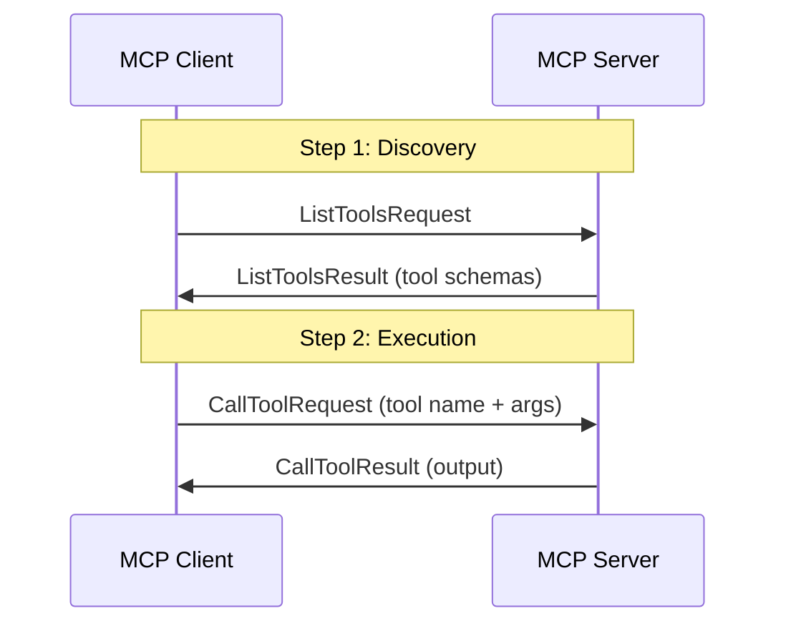

| Message | Direction | What it does |
|---|---|---|
| **ListToolsRequest** | Client to Server | "What tools do you have?" |
| **ListToolsResult** | Server to Client | Returns the list of tool schemas |
| **CallToolRequest** | Client to Server | "Run this tool with these arguments" |
| **CallToolResult** | Server to Client | Returns the tool's output |

This is the same tool-use loop you already know, but the client and server handle the plumbing. Your application just calls `list_tools()` and `call_tool()`.

---

## Running Example: CLI Document Chatbot

The rest of this module builds a CLI chatbot that manages documents. You build both the MCP server (to understand what goes inside one) and the MCP client (to understand how your app connects). In production, you would build one or the other.

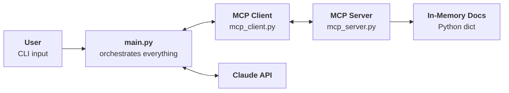

The server stores six documents in a Python dictionary (no database needed). It exposes tools to read and edit them, resources to list and fetch them, and a prompt to reformat them into Markdown.

```
┌──────────────────────────────────────────────────────┐
│  Project Structure                                   │
├──────────────────────────────────────────────────────┤
│  main.py          → entry point, wires everything    │
│  mcp_client.py    → MCPClient wrapper class          │
│  mcp_server.py    → FastMCP server + all primitives  │
│  core/            → CLI app, Claude service, chat    │
│  .env             → ANTHROPIC_API_KEY + CLAUDE_MODEL │
└──────────────────────────────────────────────────────┘
```

Start the app with:

```bash
uv run main.py     # if using UV (recommended)
python main.py     # if using standard Python
```

---

## Building the Server

The MCP Python SDK (`FastMCP`) handles all the protocol details. You write normal Python functions and the SDK generates JSON schemas, manages connections, and routes requests.

```python
from mcp.server.fastmcp import FastMCP
from pydantic import Field

mcp = FastMCP("DocumentMCP", log_level="ERROR")
```

One line creates a fully functional MCP server. The name `"DocumentMCP"` identifies it to clients.

### The Data Store

Documents live in a simple dictionary:

```python
docs = {
    "deposition.md": "This deposition covers the testimony of Angela Smith, P.E.",
    "report.pdf": "The report details the state of a 20m condenser tower.",
    "financials.docx": "These financials outline the project's budget and expenditures.",
    "outlook.pdf": "This document presents the projected future performance of the system.",
    "plan.md": "The plan outlines the steps for the project's implementation.",
    "spec.txt": "These specifications define the technical requirements for the equipment.",
}
```

Every tool, resource, and prompt you build below operates on this dictionary. In a real server, this would be a database, an API, or a file system.

### Server Primitive 1: Tools

Tools are functions that Claude can decide to call during a conversation. You define them with the `@mcp.tool` decorator.

**Read tool:** returns a document's contents.

```python
@mcp.tool(
    name="read_doc_contents",
    description="Read the contents of a document and return it as a string.",
)
def read_document(
    doc_id: str = Field(description="Id of the document to read"),
):
    if doc_id not in docs:
        raise ValueError(f"Doc with id {doc_id} not found")
    return docs[doc_id]
```

**Edit tool:** replaces text inside a document.

```python
@mcp.tool(
    name="edit_document",
    description="Edit a document by replacing a string in the documents content with a new string",
)
def edit_document(
    doc_id: str = Field(description="Id of the document that will be edited"),
    old_str: str = Field(description="The text to replace. Must match exactly, including whitespace"),
    new_str: str = Field(description="The new text to insert in place of the old text"),
):
    if doc_id not in docs:
        raise ValueError(f"Doc with id {doc_id} not found")
    docs[doc_id] = docs[doc_id].replace(old_str, new_str)
```

Compare this to the manual approach from the tool use module, where you wrote `ToolParam` dicts with nested `input_schema` objects. The SDK does that work for you.

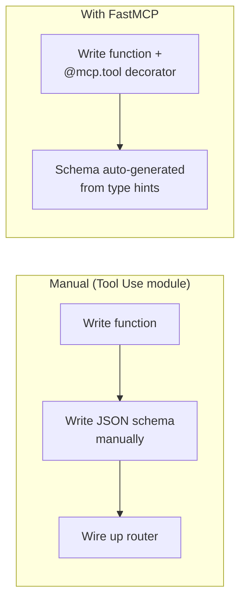

| What the SDK gives you | How |
|---|---|
| **Auto-generated JSON schema** | From type hints and `Field()` descriptions |
| **Parameter validation** | Pydantic validates inputs before your function runs |
| **Error propagation** | `ValueError` messages go back to Claude, which can retry |
| **No router needed** | The decorator registers the function automatically |

### Server Primitive 2: Resources

Resources expose data that your application (not Claude) fetches directly. The use case: you want to build a `@mention` feature where users type `@report.pdf` and the document's contents get injected into the prompt before Claude ever sees it.

Two types:

```python
@mcp.resource("docs://documents", mime_type="application/json")
def list_docs() -> list[str]:
    return list(docs.keys())

@mcp.resource("docs://documents/{doc_id}", mime_type="text/plain")
def fetch_doc(doc_id: str) -> str:
    if doc_id not in docs:
        raise ValueError(f"Doc with id {doc_id} not found")
    return docs[doc_id]
```

| Type | URI | What it returns | Analogy |
|---|---|---|---|
| **Direct** | `docs://documents` | List of all document IDs | `GET /documents` |
| **Templated** | `docs://documents/{doc_id}` | Contents of one document | `GET /documents/:id` |

For templated resources, the SDK parses `{doc_id}` from the URI and passes it as a keyword argument. The `mime_type` tells the client how to parse the response (`application/json` for structured data, `text/plain` for raw text).


> **The key:** why not just use a tool for this? Because resources skip the tool-use loop entirely. Your app fetches the data directly by URI and injects it into the prompt. No round-trip through Claude needed. Faster, cheaper, and the right choice when you already know which data you want.

### Server Primitive 3: Prompts

Prompts are pre-built instruction templates that users can trigger as commands. A user could type "convert report.pdf to markdown" and get a decent result. But a carefully tested prompt with specific formatting instructions, tool-use guidance, and output requirements will produce a consistently better result.

```python
from mcp.server.fastmcp.prompts import base

@mcp.prompt(
    name="format",
    description="Rewrites the contents of the document in Markdown format.",
)
def format_document(
    doc_id: str = Field(description="Id of the document to format"),
) -> list[base.Message]:
    prompt = f"""
    Your goal is to reformat a document to be written with markdown syntax.

    The id of the document you need to reformat is:
    <document_id>
    {doc_id}
    </document_id>

    Add in headers, bullet points, tables, etc as necessary.
    Use the 'edit_document' tool to edit the document.
    After the document has been edited, respond with the final version.
    """
    return [base.UserMessage(prompt)]
```

The function returns a list of `Message` objects. When a client requests this prompt with `doc_id="report.pdf"`, the server interpolates the argument and returns the fully constructed messages. The client sends those messages straight to Claude.

> **Rule of thumb:** prompts represent your domain expertise. They are not convenience wrappers. They are carefully tested instructions that produce better results than what users would write on their own.

### Making the Server Runnable

Add this at the bottom of `mcp_server.py`:

```python
if __name__ == "__main__":
    mcp.run(transport="stdio")
```

This tells the server to communicate over standard I/O, which is how the client connects when both run on the same machine.

---

## Testing with the Inspector

Before connecting the server to a full application, test it in isolation. The MCP SDK includes a browser-based inspector.

```bash
mcp dev mcp_server.py
```

This starts a dev server on port 6277. Open the URL in your browser.


The inspector lets you connect to your server and interact with every primitive individually.

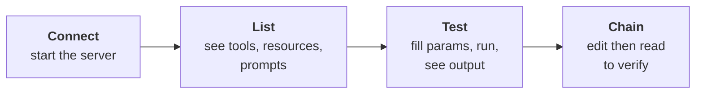

For example, to test the read tool: navigate to Tools, click `read_doc_contents`, enter `"deposition.md"` as the `doc_id`, and run it. The inspector shows the returned content. Then test the edit tool to replace some text, and run the read tool again to confirm the change persisted.


> **Tip:** the inspector UI is actively evolving, so screenshots may not match exactly. The core functionality (connect, list, test, verify) stays the same.

---

## Building the Client

Now for the other side. The MCP client is the bridge between your application and the MCP server. It handles connection setup, message passing, and cleanup.

### Architecture

The client has two layers:

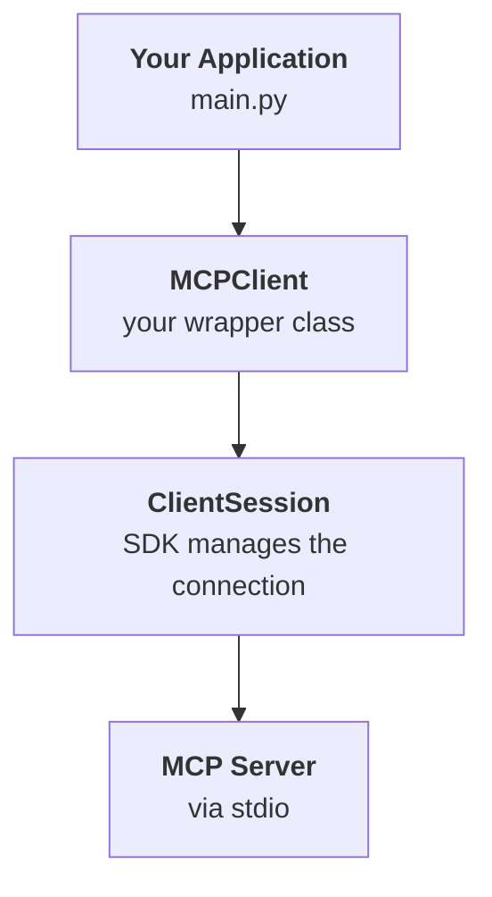

`ClientSession` (from the SDK) manages the raw connection. You wrap it in your own `MCPClient` class to handle lifecycle (connect on start, clean up on exit) and to provide a simpler interface for your application code.

### Connecting

The client uses `AsyncExitStack` to manage the connection lifecycle. When used as an async context manager, it connects on entry and cleans up on exit:

```python
async with MCPClient(command="uv", args=["run", "mcp_server.py"]) as client:
    tools = await client.list_tools()
    # use tools...
```

The `command` and `args` tell the client how to start the MCP server process. With stdio transport, both run on the same machine.

### Client Method 1: Tools

Two methods power the tool-use loop.

```python
async def list_tools(self) -> list[types.Tool]:
    result = await self.session().list_tools()
    return result.tools

async def call_tool(
    self, tool_name: str, tool_input: dict
) -> types.CallToolResult | None:
    return await self.session().call_tool(tool_name, tool_input)
```

`list_tools()` sends a `ListToolsRequest` to the server and returns the tool schemas. Your application passes these schemas to Claude so it knows what tools are available. `call_tool()` sends a `CallToolRequest` when Claude decides to use a tool.

### Client Method 2: Resources

```python
import json
from pydantic import AnyUrl

async def read_resource(self, uri: str) -> Any:
    result = await self.session().read_resource(AnyUrl(uri))
    resource = result.contents[0]

    if isinstance(resource, types.TextResourceContents):
        if resource.mimeType == "application/json":
            return json.loads(resource.text)
        return resource.text
```

The response contains a `contents` list. You take the first element and check its MIME type to decide how to parse it: `application/json` gets decoded into a Python object, plain text is returned as-is.

### Client Method 3: Prompts

```python
async def list_prompts(self) -> list[types.Prompt]:
    result = await self.session().list_prompts()
    return result.prompts

async def get_prompt(self, prompt_name, args: dict[str, str]):
    result = await self.session().get_prompt(prompt_name, args)
    return result.messages
```

`list_prompts()` returns all available prompt definitions (name, description, expected arguments). `get_prompt()` returns the fully interpolated messages for a specific prompt.

### The Complete Client Interface

```
┌──────────────────────────────────────────────────────┐
│  MCPClient                                           │
├──────────────────────────────────────────────────────┤
│  Tools                                               │
│    list_tools()      → all tool schemas              │
│    call_tool()       → execute a tool by name        │
│                                                      │
│  Resources                                           │
│    read_resource()   → fetch data by URI             │
│                                                      │
│  Prompts                                             │
│    list_prompts()    → all prompt definitions         │
│    get_prompt()      → interpolated messages          │
│                                                      │
│  Lifecycle                                           │
│    connect()         → start session                 │
│    cleanup()         → close session and transport   │
└──────────────────────────────────────────────────────┘
```

Each method on the client maps directly to a primitive on the server. The client is a thin bridge, not a place for business logic.

---

## The Complete Flow

Now that you understand both sides, here is what happens end-to-end when a user asks "What is in the report.pdf document?"

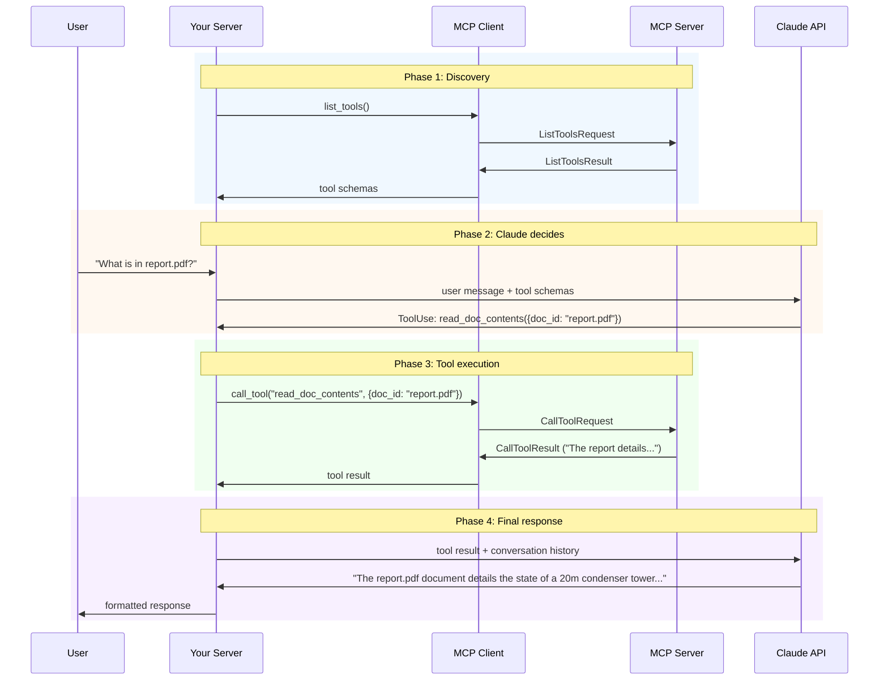

Four phases, each with a clear responsibility:

| Phase | What happens | Who does the work |
|---|---|---|
| **Discovery** | Get available tool schemas from the MCP server | MCP Client + MCP Server |
| **Claude decides** | Claude sees the tools and the user's question, picks a tool to call | Claude API |
| **Tool execution** | The chosen tool runs on the MCP server, results flow back | MCP Client + MCP Server |
| **Final response** | Claude uses the tool result to generate a human-readable answer | Claude API |

> **The key:** your server never touches the external service directly. The MCP server wraps that. Your server only talks to two things: the MCP client (for tools, resources, prompts) and Claude (for reasoning).

---

## Prompts in Action

When a user types `/format` in the CLI, the full chain looks like this:

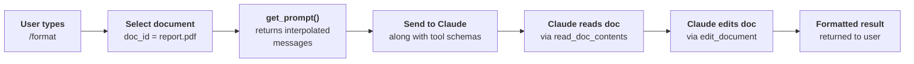

Notice how all three primitives can work together: the user triggers a **prompt**, which instructs Claude to use **tools**, and the application might pre-load context via **resources**. They are complementary, not competing.

---

## Quick Revision

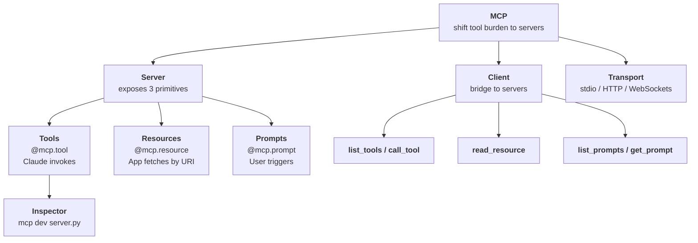

| Concept | One-line summary |
|---|---|
| **MCP** | Standard that shifts tool definitions and execution from your app to specialized servers |
| **MCP Server** | Wraps an external service, exposing tools, resources, and prompts for clients to consume |
| **MCP Client** | Communication bridge between your application and one or more MCP servers |
| **Transport** | How client and server connect: stdio for local, HTTP or WebSockets for remote |
| **Tools** | Functions Claude can invoke mid-conversation. Defined with `@mcp.tool` + type hints |
| **Resources** | Read-only data your app fetches by URI, skipping the tool-use loop entirely |
| **Prompts** | Pre-built instruction templates that produce better results than ad-hoc user input |
| **FastMCP** | Python SDK that auto-generates schemas, validates inputs, and manages the protocol |
| **Field()** | Pydantic helper adding parameter descriptions that help Claude understand arguments |
| **Inspector** | Browser-based testing tool (`mcp dev`) for verifying your server before wiring it up |
| **Direct resource** | Static URI (`docs://documents`) returning the same type of data every time |
| **Templated resource** | Parameterized URI (`docs://documents/{id}`) where the SDK extracts arguments |
| **MCPClient wrapper** | Your class around `ClientSession` that manages connection lifecycle and cleanup |
