# Agents and Workflows

Sometimes a single Claude call is not enough. When a task requires multiple steps, varied expertise, or feedback loops, you need a strategy for orchestrating several calls together. That strategy falls into one of two buckets: **workflows** and **agents**.

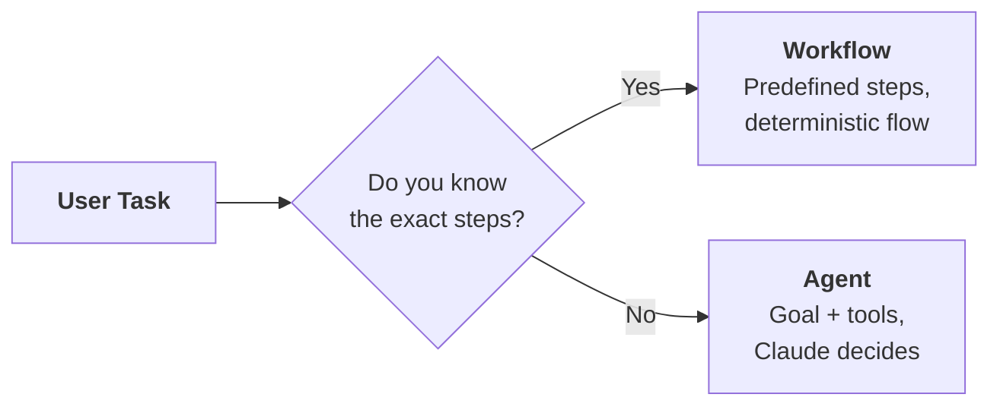

| Approach | When to use | You define | Claude decides |
|---|---|---|---|
| **Workflow** | You can picture the exact steps | The sequence of calls | Output at each step |
| **Agent** | You don't know the steps in advance | The goal and available tools | Which tools to call, in what order |

| | Workflows | Agents |
|---|---|---|
| **Benefit** | Claude focuses on one sub-task at a time, leading to higher accuracy | Far more flexible task completion: Claude combines tools in unexpected ways |
| **Benefit** | Easier to evaluate and test since you know each exact step | Handles novel situations not anticipated during development |
| **Benefit** | Predictable, reliable execution | Can ask users for additional input when needed |
| **Downside** | Less flexible, dedicated to solving specific task types | Lower successful task completion rate |
| **Downside** | Constrained UX: you need to know the exact inputs to the flow | Harder to instrument, test, and evaluate |
| **Downside** | More upfront planning and design work | Less predictable behavior |

> **Rule of thumb:** always focus on implementing workflows where possible, and only resort to agents when truly required. Users don't care that you built a fancy agent. They want a product that works consistently.

---

## Workflow Patterns

Four patterns cover the vast majority of multi-step orchestration. Each one solves a different structural problem.

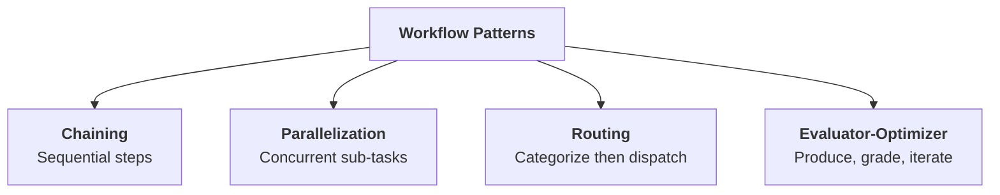

---

## Chaining

Break a large task into smaller, sequential sub-tasks. Each step feeds its output into the next.

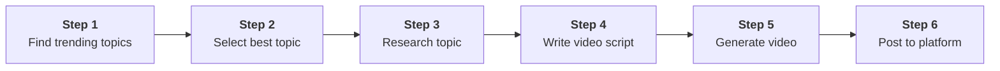

Each step is a focused Claude call (or a non-LLM processing step). Steps 1, 5, and 6 above might be API calls to external services rather than Claude calls. The point is that you control the sequence.

### Why Not One Big Prompt?

You might think: "Why not combine all the Claude steps into a single prompt?" Two reasons.

| Problem | What happens |
|---|---|
| **Lost focus** | Claude juggles multiple requirements and drops some |
| **Constraint violations** | Long prompts with many rules lead to inconsistent adherence |

### The Long Prompt Problem

Suppose you need an article that avoids emojis, never mentions AI authorship, and uses a professional tone. Even with all constraints stated clearly, Claude may violate some of them in a single pass.

The fix: chain a generation step with a revision step.

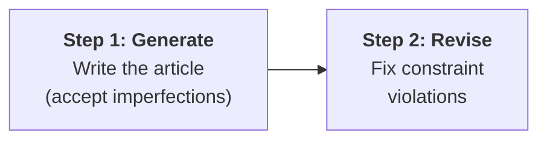

The revision prompt is specific and focused:

```
Revise the article provided below. Follow these steps:
1. Identify any text that identifies the author as an AI and remove it
2. Find and remove all emojis
3. Replace any cringey writing with professional technical prose
```

> **The key:** Claude handles one task well. Chaining lets you exploit that by giving it one task at a time.

### When to Chain

- Large tasks with multiple requirements
- Claude consistently ignores some constraints in long prompts
- You need non-LLM processing between steps (API calls, file I/O, validation)

---

## Parallelization

Split a task into independent sub-tasks, run them simultaneously, then aggregate the results.

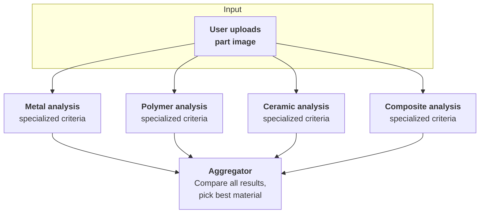

### Why Not Evaluate Everything at Once?

A single prompt asking Claude to consider metal, polymer, ceramic, and composite simultaneously forces it to juggle competing criteria. The result is shallow analysis across the board.

| Single prompt | Parallelized |
|---|---|
| Claude balances all criteria at once | Each call focuses on one material's criteria |
| Hard to improve one evaluation without affecting others | Tune each prompt independently |
| Adding a new material means rewriting the prompt | Adding a new material means adding one more parallel call |
| Inconsistent depth of analysis | Deep, focused analysis per material |

### The Pattern

```
┌──────────────────────────────────────────────────────┐
│  Parallelization                                     │
├──────────────────────────────────────────────────────┤
│  1. Split one task into N independent sub-tasks      │
│  2. Run all sub-tasks concurrently                   │
│  3. Aggregate results into a final decision          │
│                                                      │
│  Sub-tasks don't need to be identical.               │
│  Each can have its own prompt, tools, or criteria.   │
└──────────────────────────────────────────────────────┘
```

> **Tip:** parallelization is not just about speed. The real benefit is focused attention: Claude concentrates on one evaluation at a time, producing more thorough and reliable analysis.

---

## Routing

Categorize the input first, then send it to a specialized pipeline.

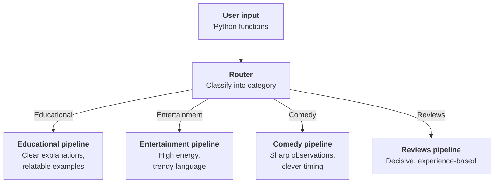

The router is a Claude call that outputs a category label. That label selects which specialized prompt template and pipeline to use next.

### Two-Step Process

| Step | What happens | Example |
|---|---|---|
| **1. Categorize** | Claude classifies the input | "Python functions" maps to "Educational" |
| **2. Dispatch** | Use the category to select a specialized prompt | Educational template generates a clear, example-driven script |

```python
categories = ["Educational", "Entertainment", "Comedy",
              "Personal vlog", "Reviews", "Storytelling"]

categorize_prompt = f"""Categorize the topic of a video into one of the
listed categories:
<topic>{user_topic}</topic>
<categories>{categories}</categories>"""

category = chat([{"role": "user", "content": categorize_prompt}])

# Select specialized template based on category
script = chat([{"role": "user", "content": templates[category]}])
```

> **The key:** user input goes to exactly one pipeline, not all of them. Each pipeline is optimized for its specific use case.

### When to Route

- Your app handles diverse request types needing different approaches (customer service bots, content generation tools, any app where the right response depends on understanding the request type)
- You can define clear, reliable categories
- The benefit of specialization outweighs the cost of the classification step

---

## Evaluator-Optimizer

A producer creates output, a grader evaluates it, and the cycle repeats until the grader accepts.

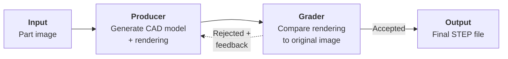

### Image-to-CAD Example

A practical workflow for converting a photo of a metal part into a 3D model (STEP file):

| Step | What happens |
|---|---|
| **1. Describe** | Feed the image to Claude, get a text description of the object |
| **2. Model** | Ask Claude to write CadQuery code to model the object |
| **3. Render** | Execute the code to produce a rendering |
| **4. Grade** | Ask Claude to compare the rendering against the original image |
| **5. Iterate** | If the grader finds issues, feed the feedback back to step 2 |

The grader's feedback is specific: "The left flange is too narrow" or "The hole pattern is missing from the top face." This focused feedback helps the producer make targeted corrections.

```
┌──────────────────────────────────────────────────────┐
│  Evaluator-Optimizer Pattern                         │
├──────────────────────────────────────────────────────┤
│  Producer   → Takes input, creates output            │
│  Grader     → Evaluates output against criteria      │
│  Feedback   → Specific issues sent back to producer  │
│  Iteration  → Repeat until grader accepts            │
└──────────────────────────────────────────────────────┘
```

> **Tip:** the evaluator-optimizer pattern is a reusable recipe. Any time you have a generation task with verifiable quality criteria, this pattern fits.

---

## Combining Patterns

These patterns are not mutually exclusive. A real application often layers several together.

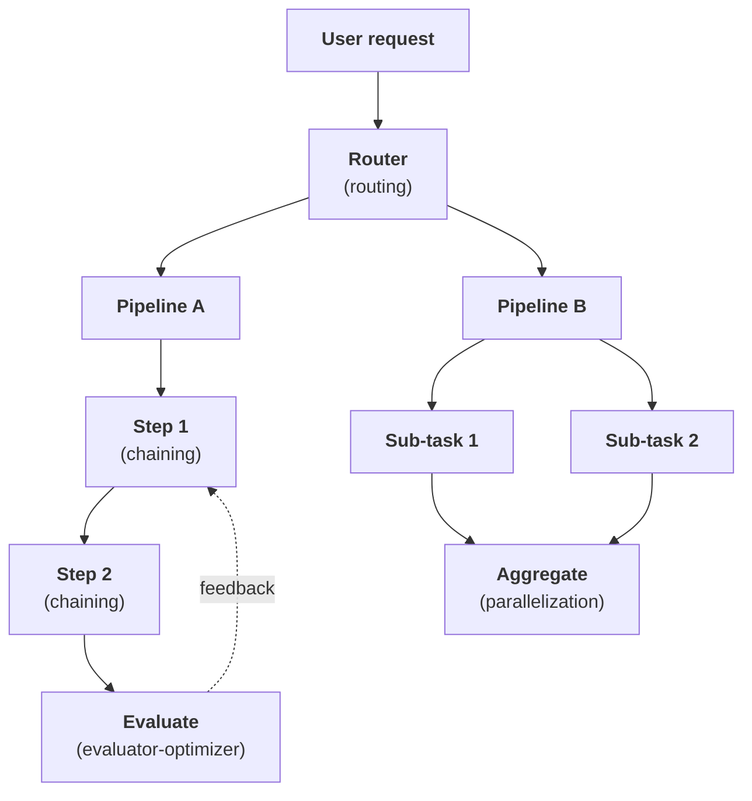

For example, a content platform might route by content type, chain generation steps within each pipeline, parallelize quality checks, and run an evaluator-optimizer loop on the final output.

---

## Agents

Agents flip the control model. Instead of defining the steps, you give Claude a **goal** and a **set of tools**, then let it decide how to accomplish the task.

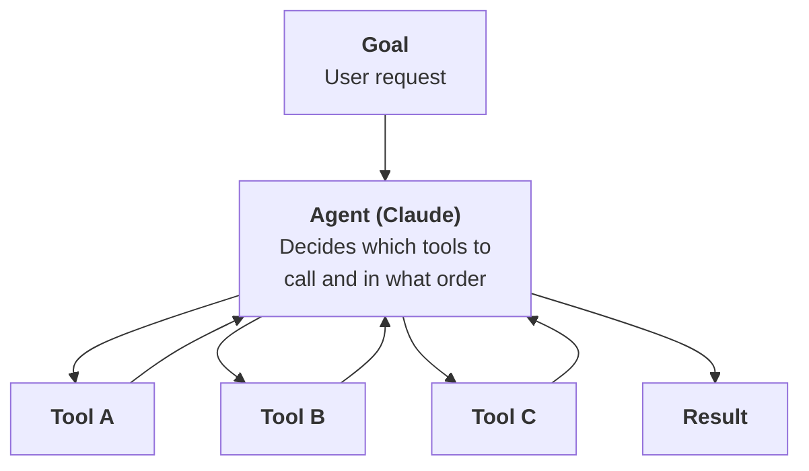

### How Tools Make the Agent

Simple tools combine into surprisingly powerful capabilities. Consider three datetime tools:

| Tool | What it does |
|---|---|
| **`get_current_datetime`** | Returns the current date and time |
| **`add_duration_to_datetime`** | Adds a duration to a given date |
| **`set_reminder`** | Creates a reminder at a specific time |

Claude chains these based on what the user asks:

| User request | Tools called |
|---|---|
| "What time is it?" | `get_current_datetime` |
| "What day is it in 11 days?" | `get_current_datetime` then `add_duration_to_datetime` |
| "Remind me about gym next Wednesday" | `get_current_datetime` then `add_duration_to_datetime` then `set_reminder` |
| "When does my 90-day warranty expire?" | Asks the user for purchase date first, then chains the tools |

### Tools Should Be Abstract

The most effective agents have generic, combinable tools rather than hyper-specialized ones. Claude Code demonstrates this perfectly.

```
┌──────────────────────────────────────────────────────┐
│  Claude Code's Tool Set                              │
├──────────────────────────────────────────────────────┤
│  bash     → Run any command                          │
│  read     → Read any file                            │
│  write    → Create any file                          │
│  edit     → Modify files                             │
│  glob     → Find files by pattern                    │
│  grep     → Search file contents                     │
└──────────────────────────────────────────────────────┘
```

No "refactor code" tool. No "install dependencies" tool. Claude figures out how to compose the basic tools to accomplish complex tasks. This abstraction lets it handle scenarios the developers never explicitly planned for.

The same principle applies when designing your own agents. A social media video agent might have:

```
┌──────────────────────────────────────────────────────┐
│  Video Agent Tool Set                                │
├──────────────────────────────────────────────────────┤
│  bash            → Access to FFMPEG for video work   │
│  generate_image  → Create images from prompts        │
│  text_to_speech  → Convert text to audio             │
│  post_media      → Upload content to platforms       │
└──────────────────────────────────────────────────────┘
```

Four generic tools, but they enable both simple flows (generate and post a video) and interactive ones (generate a sample image, get user approval, then proceed with full production). The agent adapts its approach based on user feedback, something a rigid workflow cannot do.

> **Rule of thumb:** provide tools that are abstract enough to combine in creative ways, but specific enough that Claude knows when to use each one.

### When to Choose an Agent

Use an agent when you need to handle unpredictable, varied user requests that require creative problem-solving. If you find yourself unable to enumerate the steps in advance, or the same tool set needs to serve wildly different goals, an agent is the right call.

For everything else, use a workflow. The full comparison is in the Benefits and Downsides table at the top of this file.

---

## Environment Inspection

Agents work blind unless you give them a way to observe the results of their actions. This is the principle of **environment inspection**: after every action, the agent should see what happened.

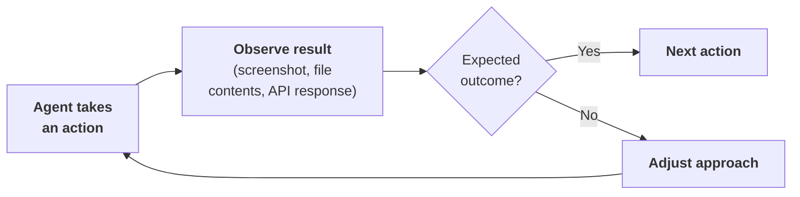

### Why It Matters

Claude cannot see the effects of its actions unless you provide feedback. Clicking a button might navigate to a new page, open a menu, or trigger an error. Without a screenshot, Claude has no idea what happened.

| Domain | Inspection method |
|---|---|
| **Computer use** | Screenshot after every action |
| **File editing** | Read the file before modifying it |
| **Video generation** | Extract frames with FFmpeg to visually verify output |
| **Audio placement** | Run whisper.cpp to generate timestamped captions |
| **API interactions** | Check response status and body |

### Read Before Write

Before modifying any file, read its current contents. This is not optional: Claude needs the existing structure to make safe changes without breaking existing functionality.

### Guiding Inspection via System Prompts

You can instruct agents to inspect their environment through system prompt instructions:

```
After generating a video:
1. Use FFmpeg to extract screenshots at 5-second intervals
2. Run whisper.cpp to verify dialogue placement and timing
3. Compare generated content against original requirements
```

### Benefits

| Benefit | What it enables |
|---|---|
| **Progress tracking** | Agent knows how close it is to completion |
| **Error handling** | Unexpected results detected and corrected |
| **Quality assurance** | Output verified before task is marked complete |
| **Adaptive behavior** | Agent adjusts its approach based on observations |

> **The key:** always ask "How will Claude know if this action worked?" and provide the tools to answer that question.

---

## Quick Revision

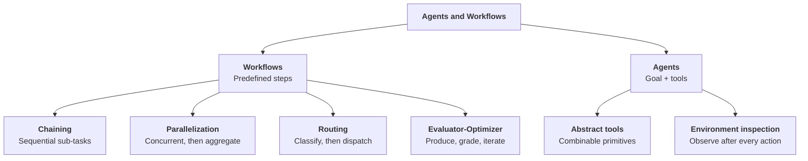

| Concept | One-line summary |
|---|---|
| **Workflow** | A predefined series of Claude calls to solve a specific problem through deterministic steps |
| **Agent** | Claude receives a goal and tools, then figures out the path to completion on its own |
| **Chaining** | Break a large task into sequential sub-tasks, each feeding output to the next |
| **Parallelization** | Split a task into independent sub-tasks, run concurrently, aggregate results |
| **Routing** | Classify the input first, then dispatch to a specialized pipeline |
| **Evaluator-optimizer** | Producer creates output, grader evaluates it, feedback loop repeats until accepted |
| **Abstract tools** | Generic, combinable tools that Claude chains creatively rather than hyper-specialized ones |
| **Environment inspection** | Agents must observe the results of their actions to know whether they succeeded |
| **Read before write** | Always read current file contents before modifying to avoid breaking existing functionality |
| **Long prompt problem** | Complex prompts with many constraints lead to violations; chaining a revision step fixes it |
