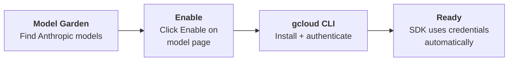

# Claude on Google Cloud

You access Claude models on Google Cloud through **Vertex AI**. The Anthropic SDK handles authentication automatically once your environment is configured. Four steps to get there.

---

## Step 1: Enable Anthropic Models in Vertex AI

Navigate to the [Vertex AI Dashboard](https://console.cloud.google.com/vertex-ai/dashboard) and click **Model Garden** in the left nav. Search for **"Anthropic"** in the search box and click the model you want to use.

---

## Step 2: Enable the Model

On the model information page, click the **Enable** button. If you don't see an Enable button, you already have access.


---

## Step 3: Install the gcloud CLI

If you don't already have it installed, follow the [official installation guide](https://cloud.google.com/sdk/docs/install).

---

## Step 4: Authenticate with the gcloud CLI

Log in and initialize:

```shell
gcloud init
gcloud auth login
```

Set your project ID and default credentials:

```shell
gcloud config set project YOUR_PROJECT_ID
gcloud auth application-default login
```

> **The key:** the Anthropic SDK picks up these credentials automatically when connecting to Vertex AI. No extra configuration needed.

---

## Quick Revision



| Step | What you do |
|---|---|
| **Enable models** | Vertex AI Dashboard, Model Garden, search "Anthropic", enable the model you need |
| **Install gcloud** | Follow the official install guide if not already installed |
| **Authenticate** | `gcloud init`, `gcloud auth login`, set project ID, set application-default credentials |
| **Use the SDK** | The Anthropic SDK detects Vertex credentials automatically |
