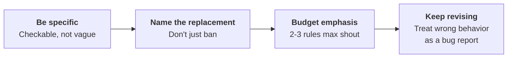
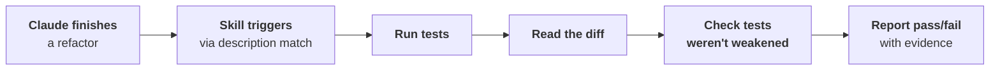
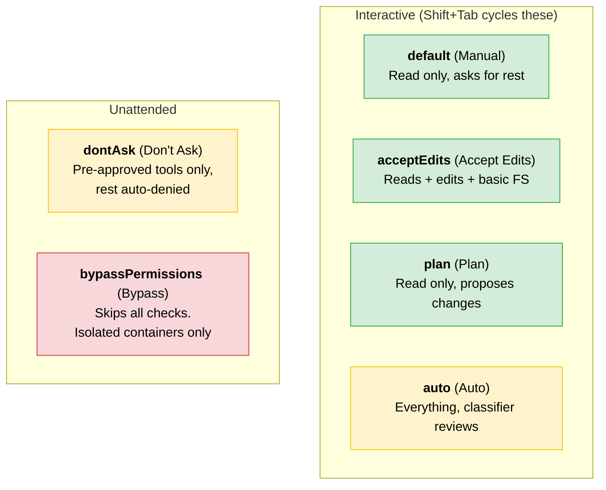
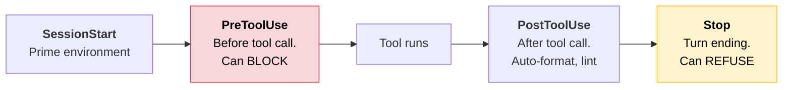
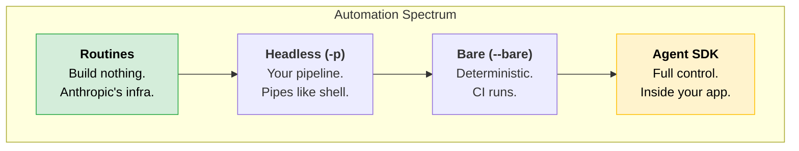
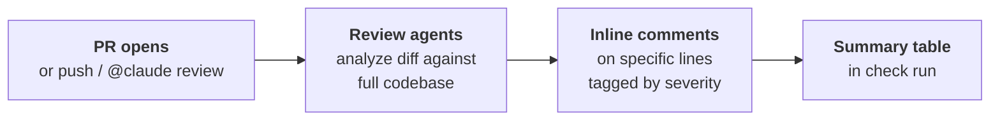
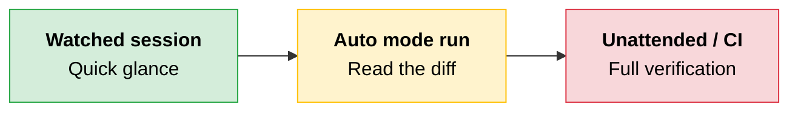
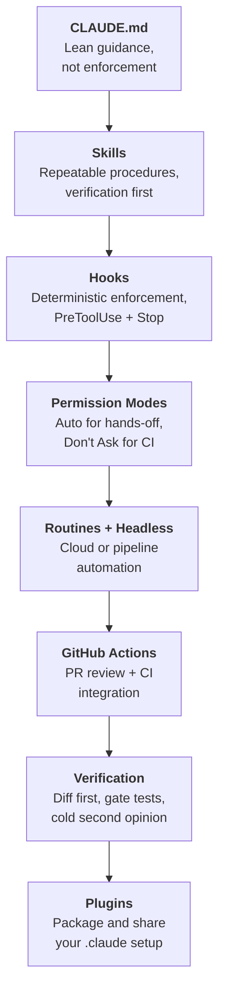

# Claude Code in Action

Your `.claude` directory is not just config. It is an operational surface: rules that stick, checks that fire, and automation that runs while you sleep. This module covers how to make Claude Code reliable, autonomous, and team-ready.

---

## CLAUDE.md: Guidance, Not Enforcement

CLAUDE.md is not enforced configuration. It is guidance. Every line competes with every other line for Claude's attention. The longer the file, the less reliably any single rule gets followed.

> **The key:** The leaner the file, the more of it Claude actually follows.

### Is CLAUDE.md Even the Right Tool?

Before adding a rule, ask: is this guidance or a hard line?

| Type | Example | Where It Belongs |
|---|---|---|
| **Guidance** | "Use named exports" | CLAUDE.md |
| **Hard rule** | "Never push to main" | Hook (PreToolUse) |
| **Convention** | "Put routes in `src/api/handlers`" | CLAUDE.md |
| **Safety gate** | "Run tests before finishing" | Hook (Stop) |

A hook is code that runs before Claude acts. It can actually block the action. CLAUDE.md just hopes Claude reads it.

### Four Locations, Stacked

Claude loads all four locations at launch. Nothing gets dropped.

```
┌──────────────────────────────────────────────────────────┐
│  Managed Policy   → Org-level, can't exclude it          │
├──────────────────────────────────────────────────────────┤
│  User (~/)        → Personal prefs, follows you anywhere │
├──────────────────────────────────────────────────────────┤
│  Project (./)     → Shared with team, checked into repo  │
├──────────────────────────────────────────────────────────┤
│  Local            → Git-ignored, your notes for this repo│
└──────────────────────────────────────────────────────────┘
```

**Local** is easy to overlook but useful. Temporary architectural decisions for your branch go here, not in the shared project file.

### Imports Organize, They Don't Shrink

Break a long CLAUDE.md into pieces with path imports:

```
@.claude/conventions/code-style.md
@.claude/conventions/testing.md
```

Claude expands these inline at launch. Everything still loads up front. Imports help you organize, not reduce context.

### Phrasing Rules That Stick



| Principle | Bad | Good |
|---|---|---|
| **Be specific** | "Follow best practices for API routes" | "Put new API routes in `src/api/handlers`, one per file" |
| **Name the replacement** | "Don't use default exports" | "Use named exports, not default exports" |
| **Budget emphasis** | Every rule says IMPORTANT | Only 2-3 rules use IMPORTANT |

> **Rule of thumb:** If you can't check whether a rule was followed, neither can Claude. Make every rule pass the "can I look and immediately tell?" test.

---

## Verification Skills

If there is one skill worth building first, it is a verification skill. It removes the dependency on you remembering to check Claude's work.

### The Shape of a Verification Skill



The last check matters most. A test can be quietly loosened to pass no matter what. The skill reads the diff and confirms tests were not weakened. "Done" means gates run and observed, not "the diff looks fine."

> **The trap:** Running tests and seeing green is not enough. A weakened test always passes.

### Skill Folders Hold More Than Instructions

A skill is not just `skill.md`. The folder can carry:

| File | Purpose | Loaded When |
|---|---|---|
| **skill.md** | Procedure (keep lean) | Skill triggers |
| **reference.md** | Detailed material, linked from skill.md | Claude needs depth |
| **check.sh** | Scripts Claude executes | Not loaded into context |

Only the skill descriptions load at launch. There is no cost to packaging every procedure you repeat.

### Where Each Rule Lives

| Rule Type | Surface | Why |
|---|---|---|
| Always-on conventions (naming, file locations) | CLAUDE.md | Applies to every task |
| Procedures tied to a task type | Skill | Triggered only when relevant |
| Rules Claude must not skip | Hook | Code that runs, not guidance |

---

## Permission Modes

Permission modes let you decide once what Claude can run without asking. Press **Shift+Tab** to cycle through the everyday modes.

### The Six Modes



| Mode | UI label | Allows Without Asking | Use When |
|---|---|---|---|
| `default` | Manual | Reads only | You want full control |
| `acceptEdits` | Accept Edits | Reads, edits, common FS commands | Iterating on code you review after |
| `plan` | Plan | Reads only | Research and proposal, no edits |
| `auto` | Auto | Everything (classifier reviews) | Hands-off supervised work |
| `dontAsk` | Don't Ask | Pre-approved tools only | CI, pipelines, no human present |
| `bypassPermissions` | Bypass Permissions | Everything, no checks | Isolated containers/VMs only |

> **Naming note:** Every mode has a **config value** you write in `settings.json` under `permissions.defaultMode` or pass to `--permission-mode`, and a **UI label** the interface shows. They differ most on the first one: the config value is `default`, but the CLI, both IDE extensions, and the desktop app all label it **Manual**, and Claude Code accepts `manual` as an alias. Expect either wording in a question stem.

### Auto Mode: Intent, Not Correctness

Auto mode uses a separate classifier model that reviews each action before it runs. It guards **intent**, not **correctness**.

```
┌─────────────────────────────────────────────────────────┐
│  Classifier BLOCKS              │  Classifier ALLOWS    │
├─────────────────────────────────┼───────────────────────┤
│  Production deploys/migrations  │  Local project edits  │
│  Force pushing                  │  Installing from lock │
│  Piping downloads into shell    │  Read-only requests   │
│  Sending data to external URLs  │  Pushing to own branch│
│  Destroying session files       │                       │
└─────────────────────────────────┴───────────────────────┘
```

> **The trap:** The classifier waves through broken code because broken is not dangerous. Pair auto mode with a stop hook that runs your tests. Auto guards intent before each action. The stop hook guards correctness after.

---

## Hooks

A hook is deterministic code that runs at a fixed point in the agentic loop. It turns a rule from "Claude usually listens" into "Claude can't skip it."

### Key Hook Events



| Event | Fires When | Can Block? | Common Use |
|---|---|---|---|
| **PreToolUse** | Before a tool call | Yes | Enforce rules, redact secrets |
| **PostToolUse** | After a successful tool call | Too late to stop | Auto-format, auto-lint |
| **Stop** | Claude wants to end its turn | Yes | Gate on test pass |
| **SessionStart** | Session begins (fresh or compact) | No | Prime environment, restore state |
| **PreCompact / PostCompact** | Before/after compaction | No | Audit context |

### PreToolUse: The Enforcement Primitive

PreToolUse can block or rewrite a tool call. Return JSON with `permissionDecision`:

| Decision | Effect |
|---|---|
| `allow` | Let the call through |
| `deny` | Stop the call |
| `ask` | Hand it back to the user |

You can also return `updatedInput` to **rewrite** the call instead of blocking it. This is how you redact a secret from a command and still let it run.

> **Tip:** `updatedInput` replaces the entire input object. Echo back unchanged fields or you lose them.

### Exit Codes Matter

| Exit Code | Meaning | Effect |
|---|---|---|
| **0** | Success | JSON parsed, plain text added to context on SessionStart |
| **2** | Blocking error | Stderr fed back to Claude. **This is the blocking code.** |
| **1** | Non-blocking | Logged, Claude carries on. Does NOT block. |

> **The trap:** Exit code 1 feels like an error but does not block. If you meant to stop something, exit 2.

### Pattern: Redact Instead of Block

Instead of denying a command with a secret, rewrite it:

```
Command: curl -H "Authorization: sk_live_abc123" https://api.example.com
Hook spots sk_live_ pattern
Rewrites to: curl -H "Authorization: REDACTED" https://api.example.com
```

The command still runs. The secret never makes it through.

### Pattern: Preserve State Across Compaction

Use `SessionStart` with the `compact` matcher (not PostCompact). Print a short summary of working files. That summary goes back into context so Claude picks up where it left off.

---

## Routines and Headless Mode

Once you trust Claude to do a task, stop doing it by hand. Two ways to hand it off:



### Routines: Saved Prompt in the Cloud

A routine bundles three things: a prompt, the repo, and connectors. No server, no script.

| Trigger Type | Example |
|---|---|
| **Cron schedule** | Every morning at 9am |
| **HTTP POST** | Your code kicks it off via API |
| **GitHub event** | New pull request lands |

Create via web at `claude.ai/code/routines` or from the terminal:

```
/schedule daily dependency audit at 9am
```

**Three limits to know:**

- Research preview. Behavior will change.
- Recurring schedule runs at most hourly.
- Each run starts from a fresh clone and can only push to `claude/` prefixed branches.

### Headless Mode: `-p` Flag

Runs Claude Code as a one-shot command with no interactive UI:

```bash
claude -p "summarize the changes in this diff"
```

The `-p` flag skips auto-discovery of hooks, skills, plugins, MCP servers, and CLAUDE.md. Faster startup, but you get only what you allow explicitly.

**Structured output** pairs a JSON schema with `--output-format json`:

```bash
claude -p "Extract exported functions from src/core/style.js" \
  --output-format json \
  --json-schema '{"type":"object","properties":{"functions":{"type":"array","items":{"type":"string"}}},"required":["functions"]}' \
  | jq '.structured_output.functions'
```

**Multi-step sessions** capture and resume the session ID:

```bash
claude --resume "$(jq -r .session_id /tmp/plan.json)"
```

**Deterministic CI runs** use `--bare` for repeatable, predictable output.

### When to Reach for What

| Tool | Use When |
|---|---|
| **Routines** | Same prompt, recurring trigger, no custom infra needed |
| **Headless (`-p`)** | Job needs your pipeline, piping data through scripts |
| **Bare (`--bare`)** | CI needs same results every run |
| **Agent SDK** | Work belongs inside your own product (TypeScript/Python) |

> **Rule of thumb:** Start with routines. Drop down the spectrum only when the job needs extra control.

---

## GitHub Actions and Code Review

Two ways to put Claude to work on pull requests. They solve different problems.

### Managed Path: Code Review

An Anthropic-hosted service. Nothing to build or host. Enabled by an org admin from Claude Code admin settings.



**Trigger options:**

- Once when PR opens
- On every push
- Only on `@claude review` comment

**Boundaries:**

- Never approves or blocks the PR. Judgment stays with a human.
- No managed autofix. Findings only. Apply fixes locally with `/code-review --fix`.
- Research preview (team and enterprise plans).

### DIY Path: GitHub Action

For custom CI beyond review: implementing changes, scheduled reports, any GitHub event.

Setup: run `/install-github-app` from Claude Code (requires repo admin).

```yaml
- uses: anthropics/claude-code-action@v1
  with:
    anthropic_api_key: ${{ secrets.ANTHROPIC_API_KEY }}
    trigger_phrase: "@claude"
    prompt: "Your instructions here"
    claude_args: "--max-turns 5 --model claude-sonnet-5"
```

**Key `claude_args` knobs:**

| Arg | Purpose |
|---|---|
| `--max-turns 5` | Hard cap on agent loop |
| Permission mode | Don't-ask for unattended jobs |
| Allowed tools | Read-only for reports, broader for implementation |

### Which Path to Pick

| Need | Use |
|---|---|
| PR reviews with inline findings | Managed Code Review |
| Claude implementing changes from comments | GitHub Action |
| Scheduled reports or cron jobs | GitHub Action |
| Anything beyond "just review" | GitHub Action |

---

## Verifying Unsupervised Runs

Verify in proportion to how much rope you gave the run.



### Verification Checklist

| Step | What You Do | Why |
|---|---|---|
| **Keep auto mode** | Don't bypass permissions for unattended work | Classifier still checks for dangerous actions |
| **Start with the diff** | Run `/code-review`, then `git diff` | A tidy summary hides unexpected file changes |
| **Gate on tests** | Stop hook that refuses to end turn on failure | Claude can't skip it or just claim tests passed |
| **Post-tool-use lint** | Hook that type-checks after every edit | Catches issues continuously, not just at the end |
| **Cold second opinion** | Fresh session reviews with no build context | Catches what the original run rationalized away |

> **The trap:** A clean write-up is not proof of clean code. Start with what changed, not with what Claude says changed.

### Hooks as Gates

```
Stop hook:  exit 2 on test failure  →  Claude reads failure, fixes it
PostToolUse hook:  lint after edit  →  Catches issues immediately
```

Exit 2 feeds the failure back to Claude. Claude fixes it without you asking. The check fires on every run, whether or not you remember.

---

## Plugins

A plugin packages a `.claude` setup (skills, subagents, hooks, MCP configs) into one installable unit.

### Installing Plugins

```bash
# Install a single plugin
/plugin install org-name@plugin-name

# Add a team marketplace (resolves all future installs)
/plugin marketplace add your-org/claude-plugins
```

### Security: Read Before You Install

> **The key:** A plugin runs code on your machine, with your privileges. Its hooks fire on every matching tool call.

A community plugin could ship a Stop hook that calls an external endpoint. Nothing warns you automatically.

| Source | Review Level |
|---|---|
| **Community marketplace** | Anthropic automated review (catches some, not all) |
| **Official marketplace** | Curated separately |

**Reviewed is not the same as trusted.** Check the plugin's hooks, agents, and MCP servers before enabling.

### How Plugin Components Stack

| Component | Behavior |
|---|---|
| **Hooks** | Stack with yours. Both fire on every matching call. |
| **Skills, agents, commands** | Namespaced under plugin name. No clash. |
| **settings.json** | Only agent and subagent status line keys honored |

> **Tip:** The agent key can promote a plugin's subagent to the main thread, changing how Claude Code behaves by default. Check what it sets before enabling.

### Packaging Your Own Plugin

Use the same `.claude` shape you already have. Add an optional manifest at `.claude-plugin/plugin.json`:

```json
{
  "name": "my-team-setup",
  "version": "0.1.0",
  "description": "Standard team conventions and checks",
  "author": { "name": "Your Name" }
}
```

**Name** is the only required field. It namespaces your skills (`team:skill-name`). **Version** it like any other dependency for updates and tracking.

---

## Quick Revision



| Concept | One-Line Summary |
|---|---|
| **CLAUDE.md** | Guidance that competes for attention. Keep it lean, specific, and checkable. |
| **Four CLAUDE.md locations** | Managed policy, user, project, local. All stack at launch. |
| **Imports** | Organize long files but do not reduce context. Expanded inline. |
| **Verification skills** | Auto-triggered checks that confirm tests pass and were not weakened. |
| **Skill folders** | Hold reference docs and scripts alongside skill.md. Only descriptions load at launch. |
| **Permission modes** | Six levels from Manual to Bypass. Shift+Tab cycles the everyday ones. |
| **Auto mode classifier** | Guards intent (dangerous actions), not correctness (broken code). |
| **Hooks** | Deterministic code at fixed points. PreToolUse blocks, Stop gates, exit 2 enforces. |
| **Exit code 2 vs 1** | Exit 2 blocks and feeds error back. Exit 1 does NOT block. |
| **Redact vs block** | PreToolUse can rewrite a command (strip secrets) instead of denying it. |
| **Routines** | Saved prompt + repo + trigger. Runs on Anthropic infra. Hourly max. |
| **Headless (`-p`)** | One-shot CLI, pipes like shell. Skips auto-discovery for fast startup. |
| **`--bare` flag** | Deterministic mode for CI. Same results every run. |
| **Agent SDK** | Embed Claude Code in TypeScript/Python apps. Full programmatic control. |
| **Managed Code Review** | Anthropic-hosted PR review. Inline findings, no autofix. Apply locally with `/code-review --fix`. |
| **GitHub Action** | `claude-code-action@v1` for custom CI. `@claude` mentions, cron, implementation. |
| **Verifying unsupervised runs** | Diff first, not summary. Gate tests in hooks. Cold second opinion from fresh session. |
| **Plugins** | One installable unit: skills + hooks + agents + MCP. Read before installing. |
| **Plugin security** | Hooks stack with yours. Reviewed is not trusted. Check before enabling. |
