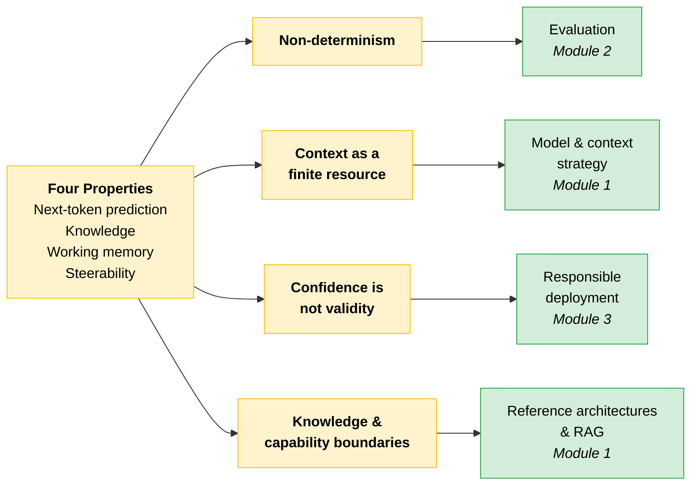
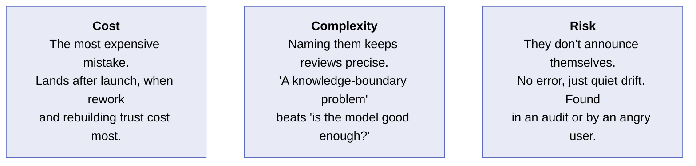
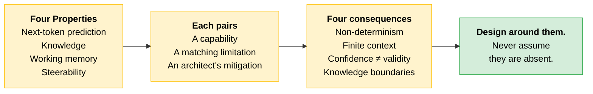

# How Claude Behaves

Before you decide what Claude should do in a solution, you need a clear picture of how Claude behaves. Four properties of the model shape every design decision that follows. None of them is a flaw to be fixed. Each is a force you design around, the way a structural engineer designs around the properties of their building materials.

> **The goal:** Recognize the four properties by name and understand each one's design consequences. You are not making design decisions yet. You are building the vocabulary you will need for the judgment exercises later in the module.

---

## The Four Properties

The same characteristic that makes Claude capable in one situation is the one that makes it fail in another. Read each property as a capability paired with its matching limitation, plus the mitigation an architect reaches for.

| Property | Capability | Limitation | Mitigation |
|---|---|---|---|
| **Next-Token Prediction** | Tasks built on common patterns | Precision on specifics | Citations, verifier loops, tool calls |
| **Knowledge** | Common, recent, consistent topics | Rare, niche, contested, changing | External system as source of truth |
| **Working Memory** | Anything inside the context window | A hard edge, with no access beyond it | Progressive loading, chunking, summarizing |
| **Steerability** | Short, concrete, verifiable instructions | Abstract instructions, computation | System prompts, structured outputs, code execution |

### Next-Token Prediction

**Capability.** Tasks built on common patterns: summarizing, reformatting, and explaining well-established concepts.

**Limitation.** Anything requiring precision on specifics. Claude can produce text that appears accurate but isn't. The risk concentrates around names, dates, citations, and statistics.

**Mitigation.** Use citations, uncertainty signaling, and generator-verifier loops. Route specific factual lookups through tool calls or authoritative sources rather than relying solely on the model's output.

### Knowledge

**Capability.** Topics in the training data that are common, recent, and consistently included. Here the model answers reliably from what it learned.

**Limitation.** Topics that are rare, niche, contested, or frequently changing. The model may present stale or incomplete information in the same confident tone it uses for established facts.

**Mitigation.** Use web search, retrieval (RAG), tool use, or MCP servers to make an external system the source of truth instead of the model. The shift is from checking the model's **parametric knowledge** to having the authoritative answer come from the retrieved source. When freshness or authority matters, re-introduce the data yourself rather than relying on training data.

### Working Memory

**Capability.** Anything that fits in the active context window.

**Limitation.** The context window is a hard edge. Once content falls outside it, the model has no access to that content at all.

**Mitigation.** Use progressive context loading, chunking, and front-loading of critical information. For extended work, projects help manage what stays in scope. Build the habit of summarizing across turns when context is getting long.

Two different errors happen at that edge, and they are easy to conflate. An **oversized request** is already too large to send and is rejected before generation. A **truncated generation** means the prompt fit, but output ran into the window ceiling and stopped early.

| Error | What happened | What you get back |
|---|---|---|
| Oversized request, token limit | Prompt exceeds the model's token limit | `400 invalid_request_error`, message says the prompt is too long |
| Oversized request, byte limit | Raw request body exceeds the API's byte limit | `413 request_too_large`, message says the request exceeds max bytes |
| Truncated generation | Prompt fit, generation hit the window ceiling | `model_context_window_exceeded` stop reason, output truncated |

> **Tip:** Check the `usage` field on every response, and use the token-counting API before you hit send.

### Steerability

**Capability.** Short, concrete, verifiable instructions with defined formats, explicit length limits, and clear roles.

**Limitation.** Abstract or ambiguous instructions, long reasoning chains, and tasks requiring precise numerical or logical computation. For high-stakes numerical accuracy, deterministic computation or tool execution should own the answer. The model may follow the letter of an instruction while drifting from its intent.

**Mitigation.** Use system prompts, structured outputs, and code execution for anything requiring logical precision. When intent and literal instruction might diverge, restate the goal explicitly alongside the instruction.

---

## From Property to Design Consequence

The course revisits each property later. Connect the properties to their design consequences now, so the link is in place before you need it.

| Design consequence | What it means | Where it gets revisited |
|---|---|---|
| **Non-determinism** | The same input can produce different outputs across runs. Evaluation frameworks exist because you cannot certify behavior you only observed once. | Evaluation work, Module 2 |
| **Context as a finite resource** | The window is a hard edge with a fixed token budget. What goes in, in what order, and what stays out are design decisions affecting both what the model can work with and what it costs to run. | Model and context strategy, later in Module 1 |
| **Confidence is not validity** | Claude can produce a wrong answer in the same fluent, assured tone it uses for a right one. Human-in-the-loop placement and verification are architectural choices, not afterthoughts. | Responsible deployment, Module 3 |
| **Knowledge and capability boundaries** | Reliable on topics that are common, recent, and consistent in training data. Unreliable on topics that are rare, private, or fast-changing. For the unreliable ones, make an external system the source of truth. | Reference architectures and RAG, later in Module 1 |

> **Exam trap:** Do not memorize this as a one-to-one grid. Two consequences restate a property almost directly: **Context as a finite resource** is Working Memory, and **Knowledge and capability boundaries** is Knowledge. The other two cut across several properties. **Confidence is not validity** draws on both Next-Token Prediction ("text that appears accurate but isn't") and Knowledge ("the same confident tone it uses for established facts"). **Non-determinism** is a property of the system as a whole. A question that forces a strict pairing is testing whether you memorized a grid or understood the properties.

---

## Scenario: A Failure That Began with a Misread Property

> [!CAUTION]
> **An architect saw a demo run cleanly five times in a row and concluded the behavior was deterministic.** On that basis the team shipped a financial reconciliation pipeline that treated each model output as a fixed, repeatable result, and built no checks around it.
>
> In the second week of production the outputs drifted: the same statement, re-processed, produced a different categorization. The discrepancy was discovered by chance, only when an analyst happened to re-run a batch.
>
> Nothing had changed in the input. Different outputs were produced because the model is a non-deterministic system and the architecture had been built as though it was deterministic.
>
> **The lesson:** Not that the model is unreliable. That a demo is not evidence of determinism, and that the four properties are present whether your architecture acknowledges them or not.

---

## Cost, Complexity, Risk

---

## Quick Revision

| Concept | One-liner |
|---|---|
| **Next-Token Prediction** | Great at common patterns, unreliable on specifics. Mitigate with citations and verifier loops. |
| **Knowledge** | Strong on common, recent, consistent topics. Weak on rare or changing ones. Use RAG, tools, or MCP as the source of truth. |
| **Working Memory** | The context window is a hard edge. What goes in, and in what order, is a design decision. |
| **Steerability** | Follows concrete instructions well. Drifts on abstract ones. Restate the goal alongside the instruction. |
| **Parametric knowledge** | What the model learned in training. The alternative is an authoritative answer from a retrieved source. |
| **Non-determinism** | Same input, different outputs across runs. You cannot certify behavior observed only once. |
| **Context as a finite resource** | A fixed token budget. Ordering and omission affect both quality and cost. |
| **Confidence is not validity** | Wrong answers arrive in the same fluent tone as right ones. Verification is architectural, not optional. |
| **Knowledge and capability boundaries** | Reliable on common and recent, unreliable on rare, private, or fast-changing. |
| **A demo is not evidence** | Five clean runs do not prove determinism. The properties are always present. |

### Exam Traps

Cover the third column and quiz yourself.

| If you see... | The trap | The right call |
|---|---|---|
| "The model hallucinated, so it's unreliable" | Concluding the model is unreliable | The lesson is not that the model is unreliable. The architect failed to design around next-token prediction. The missing mitigation is the bug. |
| `400 invalid_request_error` vs `413 request_too_large` | Treating them as one error | Both are oversized requests, rejected before generation. `400` means the prompt exceeded the token limit; `413` means the raw body exceeded the byte limit. |
| Output cut off mid-response | Reading it as an oversized request | The prompt fit. Generation hit the window ceiling: `model_context_window_exceeded` stop reason, truncated output. |
| Confident but wrong output. Add more RAG? | Reaching for retrieval reflexively | Depends on the topic. Rare, private, or fast-changing means a knowledge boundary, so retrieval fits. A common topic means verification and human-in-the-loop, not more retrieval. |
| A demo ran clean five times | Treating repeatability as proven | A demo is not evidence of determinism. The response is evaluation frameworks, not re-running until you get the answer you want. |

---

**Source:** Claude Certified Architect Professional, Module 1 (Claude Platform & Solution Design), screen set "The four properties architects design around."
