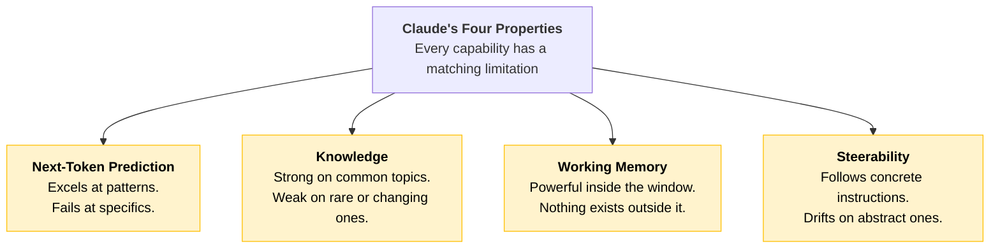
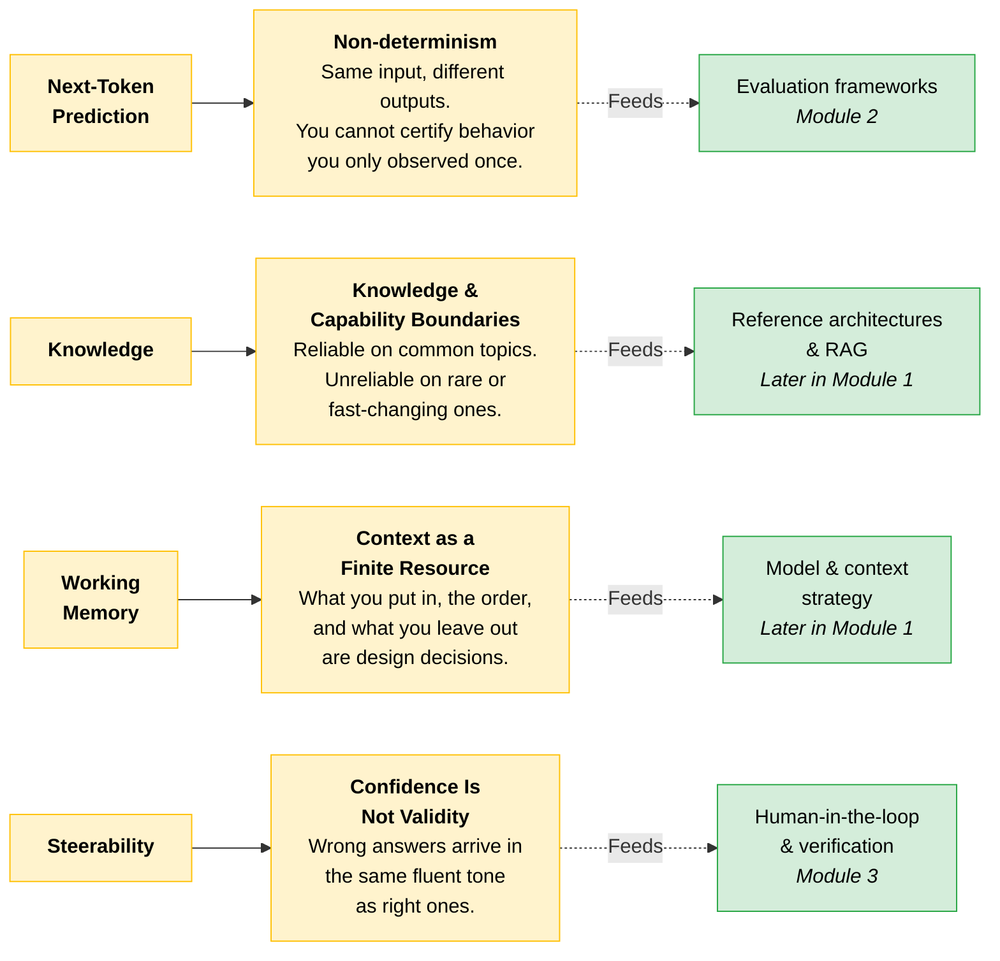
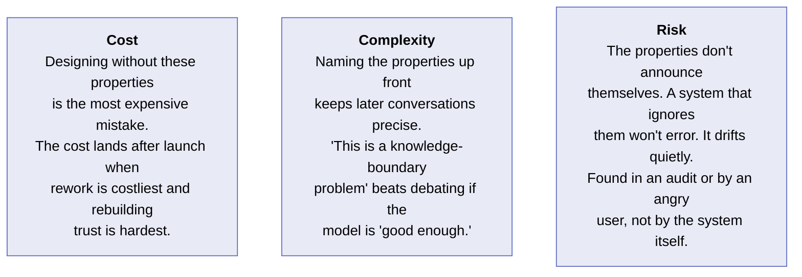
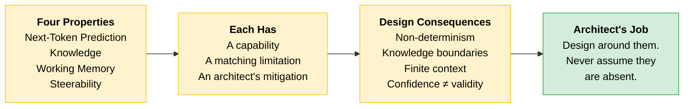

# How Claude Behaves

Four properties of the model shape every design decision that follows. None are flaws to fix. Each is a force you design around, the way a structural engineer designs around the properties of building materials.

> **The goal:** Recognize the four properties by name and understand each one's design consequences. You are not making design decisions yet. You are building the vocabulary for them.

---

## The Four Properties at a Glance

The same characteristic that makes Claude capable in one situation is the same one that makes it fail in another. Read each property below as a capability paired with its limitation and the mitigation an architect reaches for.

---

## The Four Properties in Detail

| Property | Capability | Limitation | Mitigation |
|----------|-----------|------------|------------|
| **Next-Token Prediction** | Summarizing, reformatting, explaining well-established concepts. Tasks built on common patterns. | Anything requiring precision on specifics. Names, dates, citations, statistics. Text appears accurate but isn't. | Citations, uncertainty signaling, generator-verifier loops. Route factual lookups through tool calls or authoritative sources. |
| **Knowledge** | Topics that are common, recent, and consistently represented in training data. | Rare, niche, contested, or frequently changing topics. Stale or incomplete information presented with the same confident tone. | Web search, RAG, tool use, or MCP servers to make an external system the source of truth. Re-introduce data yourself. |
| **Working Memory** | Anything that fits in the active context window. | The context window is a hard edge. Once content falls outside, the model has zero access to it. | Progressive context loading, chunking, front-loading critical information. Summarize across turns when context is getting long. |
| **Steerability** | Short, concrete, verifiable instructions with defined formats, explicit length limits, and clear roles. | Abstract or ambiguous instructions, long reasoning chains, precise numerical or logical computation. Follows the letter, drifts from intent. | System prompts, structured outputs, code execution for logical precision. Restate the goal alongside the instruction. |

Two distinct errors happen at the Working Memory edge:

| Error | When it happens | What you see |
|-------|-----------------|--------------|
| **Oversized request** | Prompt is too large to send | `400 invalid_request_error` (token limit) or `413 request_too_large` (byte limit). Rejected before generation. |
| **Truncated output** | Prompt fits, but generation hits the window ceiling | `model_context_window_exceeded` stop reason. Output cuts off mid-response. |

> **Tip:** Check the `usage` field on every response and use the token-counting API before you send to avoid hitting either limit.

---

## From Property to Design Consequence

Each property maps to a design consequence you will use later in the course.

| Property | Design Consequence | Where it applies |
|----------|--------------------|------------------|
| **Next-Token Prediction** | **Non-determinism.** Same input can produce different outputs. Evaluation frameworks exist because you cannot certify behavior observed only once. | Evaluation work (Module 2) |
| **Knowledge** | **Knowledge and capability boundaries.** Reliable on common, recent, consistent topics. For everything else, use web search, RAG, tools, or MCP as the source of truth. | Reference architectures & RAG (Module 1) |
| **Working Memory** | **Context as a finite resource.** The context window has a fixed token budget. What goes in, in what order, and what stays out are design decisions affecting quality and cost. | Model & context strategy (Module 1) |
| **Steerability** | **Confidence is not validity.** Claude can be wrong in the same fluent, assured tone it uses when right. Human-in-the-loop and verification are architectural choices, not afterthoughts. | Responsible deployment (Module 3) |

---

## Scenario: A Failure That Began with a Misread Property

> **The trap:** An architect saw a demo run cleanly five times in a row and concluded the behavior was deterministic. The team shipped a financial reconciliation pipeline that treated each model output as a fixed, repeatable result with no checks.
>
> In the second week of production the outputs drifted: the same statement, re-processed, produced a different categorization. The discrepancy was discovered by chance when an analyst happened to re-run a batch.
>
> Nothing changed in the input. Different outputs were produced because the model is non-deterministic and the architecture was built as though it was not.

The lesson: a demo is not evidence of determinism. The four properties are present whether your architecture acknowledges them or not.

---

## Cost, Complexity, Risk

---

## Quick Revision

| Concept | One-liner |
|---------|-----------|
| **Next-Token Prediction** | Great at patterns, unreliable on specifics. Mitigate with citations and verifier loops. |
| **Knowledge** | Strong on common topics, weak on rare or changing ones. Use RAG, tools, or MCP as the source of truth. |
| **Working Memory** | The context window is a hard edge. What goes in, and in what order, is a design decision. |
| **Steerability** | Follows concrete instructions well. Drifts on abstract ones. Restate the goal alongside the instruction. |
| **Non-determinism** | Same input, different outputs. You cannot certify behavior observed only once. |
| **Confidence is not validity** | Wrong answers sound just as fluent as right ones. Verification is architectural, not optional. |
| **A demo is not evidence** | Five clean runs do not prove determinism. The properties are always present. |

### Exam Traps

Cover the third column and quiz yourself.

| If you see... | The trap | The right call |
|---------------|----------|----------------|
| "The model hallucinated, so it's unreliable" | Blaming the model | The architect failed to design around next-token prediction. The missing mitigation is the bug, not the property. |
| `400 invalid_request_error` vs `model_context_window_exceeded` | Treating them as the same failure | `400` rejects before generation (prompt too large). `context_window_exceeded` truncates mid-response (output hit the ceiling). |
| "Same input gave different output, the model is random" | Confusing non-determinism with randomness | Non-determinism means variable outputs across runs. The response is evaluation frameworks, not retrying for the "right" answer. |
| A system fails. Which property was ignored? | Picking the wrong property | Know the pairings: Next-Token Prediction = Non-determinism, Knowledge = Knowledge Boundaries, Working Memory = Finite Context, Steerability = Confidence is Not Validity. |
| "The output was confident but wrong. Add more RAG." | Treating it as a Knowledge problem | Confidence is not validity is a Steerability consequence. The answer is human-in-the-loop and verification, not more retrieval. |
