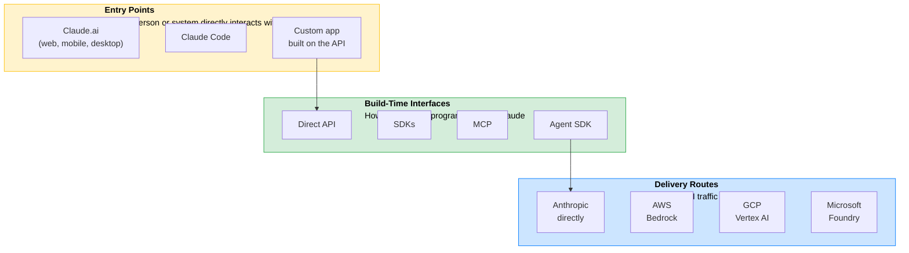
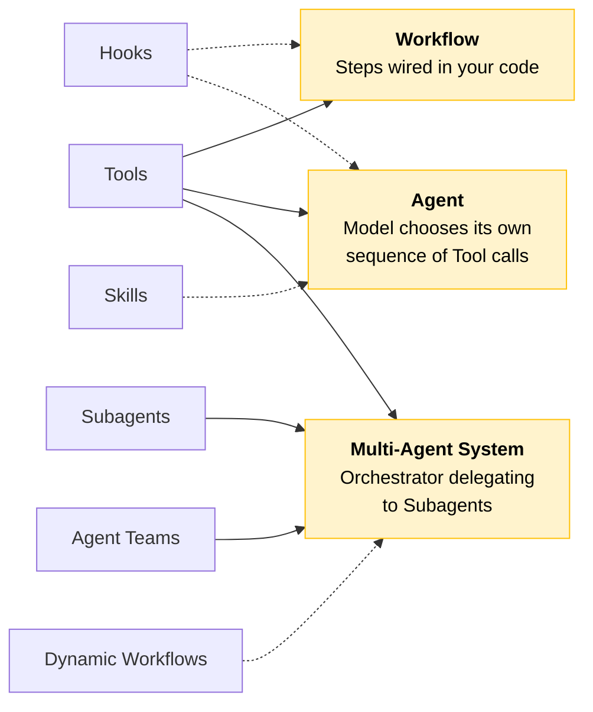
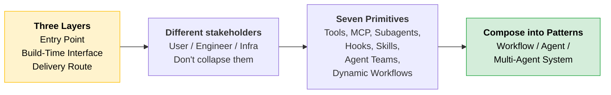

# Platform Map & Primitives

You know the four properties from the previous section. Now name the two remaining pieces of vocabulary before any design decision: the three layers a deployment passes through, and the seven primitives you assemble solutions from.

---

## Three Layers, Three Distinct Decisions

These layers are not alternatives. Every deployment involves all three. Confusing them is the most common source of muddled architecture conversations.



| Layer | Chosen for | Stakeholder |
|-------|-----------|-------------|
| **Entry Point** | The user and the work | End user, product owner |
| **Build-Time Interface** | The engineering team and the integration | Developer, tech lead |
| **Delivery Route** | Cloud commitments and compliance posture | Infrastructure, security, procurement |

A decision in one layer rarely dictates the others. These are three different conversations with three different stakeholders.

> **Rule of thumb:** Learn the names and the distinction now. Selecting among them under real constraints comes later, once you have a model, a pattern, and an architecture to fit them to.

### Scenario: Collapsing the Layers

> **The trap:** A retail banking proposal put Claude Code (an engineering entry point) in front of non-engineering branch staff because "it's all Claude." The same model does sit underneath every entry point, but the entry point is the wrapper. Claude Code was built for developers in a terminal, not for bank staff following a workflow. Collapsing the three layers into one erased the distinction that should have ruled the choice out immediately.

### Cost, Complexity, Risk

```
┌──────────────────────────────────────────────────────────────┐
│  Cost        → Picking the wrong layer because the           │
│                vocabulary was unclear means paying for the    │
│                wrong solution, then paying again to replace.  │
├──────────────────────────────────────────────────────────────┤
│  Complexity  → When the three layers are named precisely,    │
│                a design review isolates which decision is     │
│                contested. When blurred, the review argues     │
│                in circles.                                    │
├──────────────────────────────────────────────────────────────┤
│  Risk        → An entry point chosen before the user is      │
│                named is a common, avoidable architecture      │
│                error traceable to collapsing three layers     │
│                into one.                                      │
└──────────────────────────────────────────────────────────────┘
```

---

## Seven Primitives, Seven Jobs

Every pattern in this course (augmented call, workflow, agent) is an assembly of these primitives. Name them once here so later lessons become combinations of parts you already recognize.

```
┌───────────────────┬───────────────────┬───────────────────┬───────────────────┐
│  Tools            │  MCP              │  Subagents        │  Hooks            │
│  Act              │  Connect          │  Isolate /        │  Guarantee        │
│                   │                   │  Parallelize      │                   │
├───────────────────┼───────────────────┼───────────────────┼───────────────────┤
│  Skills           │  Agent Teams      │  Dynamic          │                   │
│  Package a        │  Coordinate       │  Workflows        │                   │
│  Procedure        │  Peers            │  Compose at       │                   │
│                   │                   │  Runtime          │                   │
└───────────────────┴───────────────────┴───────────────────┴───────────────────┘
```

| Primitive | Job | What it is |
|-----------|-----|------------|
| **Tools** | Act | A function the model can call to take an action or fetch a result from your code |
| **MCP** | Connect | A protocol for exposing a set of tools so multiple Claude clients can reach the same entry points |
| **Subagents** | Isolate / Parallelize | Hand a scoped sub-task to a separate context so work runs in isolation or in parallel |
| **Hooks** | Guarantee | Deterministic code that fires on defined events to enforce a rule the model cannot skip |
| **Skills** | Package a Procedure | A versioned, reusable unit (instructions plus optional scripts) that packages a repeatable procedure |
| **Agent Teams** | Coordinate Peers | Multiple agents working as coordinated peers, each owning part of a larger goal |
| **Dynamic Workflows** | Compose at Runtime | Assemble the steps of a workflow at runtime rather than fixing them in advance |

> **Tip:** Agent Teams and Dynamic Workflows extend older vocabulary of single agents and fixed workflows. You will see them named in current practitioner conversations even though many existing systems predate them.

### How Primitives Become Patterns

You are not choosing among primitives yet. Here is the preview of how they compose:



| Pattern | Core Primitives | Optional Primitives |
|---------|----------------|---------------------|
| **Workflow** | Tools | Hooks |
| **Agent** | Tools | Skills, Hooks |
| **Multi-Agent System** | Tools, Subagents, Agent Teams | Dynamic Workflows, Hooks |

When you reach the pattern selection lessons, you will be composing primitives you have already named, not meeting them for the first time.

### Scenario: Missing Shared Vocabulary

> **The trap:** In an architecture review, someone said "we'll use an agent." Five people heard five different things: a single tool-using model, a multi-step workflow, a team of subagents, Claude Code, and a chatbot. The design conversation stalled for twenty minutes before anyone realized they were describing different architectures with the same word.

Shared vocabulary eliminates this. The primitives table above is the starting point.

### Cost, Complexity, Risk

```
┌──────────────────────────────────────────────────────────────┐
│  Cost        → Reaching for a heavier primitive than the job │
│                requires is paid in latency, tokens, and      │
│                operational surface area on every request.     │
│                (e.g., agent team when a single tool call      │
│                would suffice)                                 │
├──────────────────────────────────────────────────────────────┤
│  Complexity  → Each primitive added is a part to build,      │
│                observe, and govern. Use the fewest            │
│                primitives necessary to meet the requirement.  │
├──────────────────────────────────────────────────────────────┤
│  Risk        → Without shared vocabulary, teams cannot        │
│                communicate effectively because they do not    │
│                agree on what the parts are.                   │
└──────────────────────────────────────────────────────────────┘
```

---

## Quick Revision



| Concept | One-liner |
|---------|-----------|
| **Entry Point** | What the user interacts with (Claude.ai, Claude Code, custom app) |
| **Build-Time Interface** | What the engineer codes against (API, SDK, MCP, Agent SDK) |
| **Delivery Route** | Where traffic terminates (Anthropic, Bedrock, Vertex, Foundry) |
| **Tools** | Let the model act: call a function, fetch a result |
| **MCP** | Expose tools so multiple clients share the same entry points |
| **Subagents** | Scoped sub-tasks in separate contexts for isolation or parallelism |
| **Hooks** | Deterministic enforcement the model cannot skip |
| **Skills** | Versioned, reusable procedures packaged for repeat use |
| **Agent Teams** | Coordinated peer agents, each owning part of a goal |
| **Dynamic Workflows** | Steps assembled at runtime, not hardcoded in advance |
| **Don't collapse layers** | Entry point, interface, and route are three conversations with three stakeholders |
| **Fewest primitives** | Each one added is a part to build, observe, and govern |

### Exam Traps

Cover the third column and quiz yourself.

| If you see... | The trap | The right call |
|---------------|----------|----------------|
| "Should we use an entry point or a delivery route?" | Picking one over the other | They are not alternatives. Every deployment involves all three layers. The answer is both. |
| Claude Code proposed for bank branch staff | "It's all Claude, same model underneath" | Wrong entry point for the user. Entry point is chosen for the user, not the model. Claude Code is for developers in a terminal. |
| "We'll use an agent" in an architecture review | Treating it as a complete architecture statement | It conflates primitives. Name which ones: "a tool-calling agent" or "subagents with an orchestrator." Missing vocabulary is the root cause. |
| "Enforce a rule the model must never violate" | System prompt with strong wording | Hooks. They are the only primitive that fires deterministically. The model cannot skip a hook. A system prompt can be ignored. |
| Fixed predictable steps vs sequence depends on intermediate results | Calling both "an agent" | Fixed steps = Workflow (you control sequence). Dynamic sequence = Agent (model controls sequence). Different primitives, different tradeoffs. |
