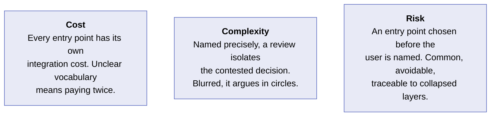
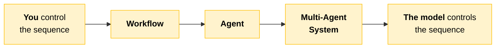
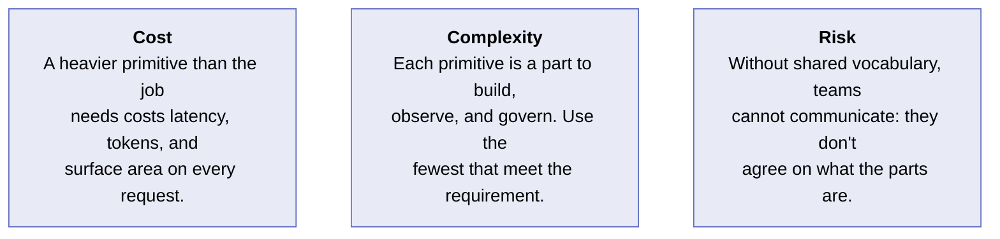
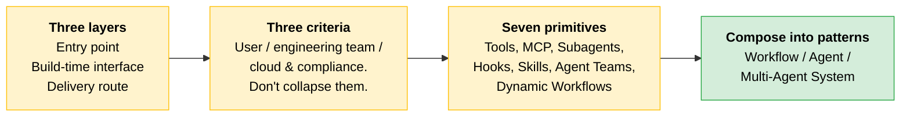

# Platform Map & Primitives

You know the [four properties](01-How-Claude-Behaves.md) from the previous section. Two pieces of vocabulary remain before any design decision: the three layers every deployment passes through, and the seven primitives you assemble solutions from.

Three of these terms get used interchangeably even though they sit at different layers of the architecture. This section teaches the names and the distinctions. Choosing between them comes later, once the rest of the design is in place.

---

## Three Layers, Three Distinct Decisions

These layers are not alternatives to one another. Every deployment involves all three, and confusing them is the most common source of muddled architecture conversations.

| Layer | What it is | Examples |
|---|---|---|
| **Entry point** | What a person or system directly interacts with. The wrapper that decides who can talk to Claude, and how. | Claude.ai (web, mobile, desktop), Claude Code, a custom application built on the API |
| **Build-time interface** | How an engineer programs against Claude. The layer the partner's code is written to. | The direct API, the SDKs, MCP, the Agent SDK |
| **Delivery route** | Where API traffic terminates. Determines whose infrastructure the request runs on. | Anthropic directly, AWS Bedrock, GCP Vertex AI, Microsoft Foundry |

> **Naming note:** The course names these as above, so expect that wording in a question stem. Current Anthropic naming is **Amazon Bedrock**, **Google Cloud Vertex AI**, **Microsoft Foundry**, and **Claude Agent SDK** (renamed from Claude Code SDK). Recognize both forms.

### Why Keeping the Layers Distinct Matters

Each layer is chosen against a different criterion, by a different person.

| Layer | Chosen for | Whose conversation it is |
|---|---|---|
| **Entry point** | The user and the work | End user, product owner |
| **Build-time interface** | The engineering team and the integration | Developer, tech lead |
| **Delivery route** | The partner's cloud commitments and compliance posture | Infrastructure, security, procurement |

> **The key:** Three different conversations with three different stakeholders. A decision in one layer rarely dictates the others.

For now, focus on the names and the distinctions. Selecting among them under real constraints comes later, once you have a model, a pattern, and an architecture to fit them to.

### Scenario: Collapsing the Layers

> [!CAUTION]
> **A proposal for a retail banking workflow put Claude Code, an engineering entry point, in front of a non-engineering audience because, in the author's words, "it's all Claude."**
>
> It is all Claude, in the sense that the same model sits underneath every entry point. But the entry point is the wrapper, and Claude Code was built for developers running a terminal, not for bank branch staff following a workflow.
>
> **The lesson:** Treating the three layers as one erased the distinction that should have ruled the choice out immediately.

### Cost, Complexity, Risk

---

## Seven Primitives, Seven Jobs

Every pattern and architecture in this course is an assembly of a small set of primitives. Name them once here, so later lessons become combinations of parts you already recognize.

Read each primitive as a single job. Rather than going deep on any one of them, keep a holistic view of all seven for now. Composing these primitives into a solution is a key architect skill.

| Primitive | Job | What it is |
|---|---|---|
| **Tools** | Act | A function the model can call to take an action or fetch a result from your code |
| **MCP** | Connect | A protocol for exposing a set of tools so multiple Claude clients reach the same entry points |
| **Subagents** | Isolate / parallelize | Hand a scoped sub-task to a separate context so work runs in isolation or in parallel |
| **Hooks** | Guarantee | Deterministic code that fires on defined events to enforce a rule the model cannot skip |
| **Skills** | Package a procedure | A versioned, reusable unit (instructions plus optional scripts) packaging a repeatable procedure |
| **Agent Teams** | Coordinate peers | Multiple agents working as coordinated peers, each owning part of a larger goal |
| **Dynamic Workflows** | Compose at runtime | Assemble the steps of a workflow at runtime rather than fixing them in advance |

> **Tip:** Agent Teams (coordinated peer agents) and Dynamic Workflows (runtime composition) extend the older vocabulary of single agents and fixed workflows. You will see them named in current practitioner conversations even though many existing systems predate them.

### Why Inventory Them Now

The patterns taught later in this module, the augmented call, the workflow, and the agent, are not abstract categories. Each is a particular assembly of these primitives.

| Pattern | What it is | Primitives named |
|---|---|---|
| **Workflow** | Steps wired in your code | Tools, often |
| **Agent** | The model choosing its own sequence of tool calls | Tools |
| **Multi-Agent System** | An orchestrator delegating to subagents | Tools, Subagents |

When you reach those lessons you will be composing primitives you have already named, not meeting them for the first time.

> **Testable distinction:** A **multi-agent system** is an orchestrator delegating to subagents. That is hierarchical. **Agent Teams** is a separate primitive: agents working as coordinated **peers**, each owning part of a goal. Delegation down is not the same shape as coordination across, so do not treat Agent Teams as a required part of every multi-agent system.

> **Exam trap:** The course names only the primitives listed above for each pattern. Do not assume a fixed "core vs. optional" grid mapping all seven primitives onto the three patterns. A workflow "often" uses tools; no pattern is defined here by a required primitive set.

### Scenario: Missing Shared Vocabulary

> [!CAUTION]
> **In an architecture review, someone said "we'll use an agent."** Five people in the room heard five different things: a single tool-using model, a multi-step workflow, a team of subagents, Claude Code, and a chatbot.
>
> The design conversation stalled for twenty minutes before anyone realized they were describing different architectures with the same word.
>
> **The lesson:** With a common understanding of the primitive vocabulary, the team operates with clarity and efficiency. The table above is the starting point.

### Cost, Complexity, Risk

---

## Quick Revision

| Concept | One-liner |
|---|---|
| **Entry point** | The wrapper deciding who talks to Claude and how. Chosen for the user and the work. |
| **Build-time interface** | The layer the partner's code is written to. Chosen for the engineering team and the integration. |
| **Delivery route** | Where traffic terminates and whose infrastructure it runs on. Chosen for cloud commitments and compliance posture. |
| **Tools** | Let the model act: a function it can call to take an action or fetch a result. |
| **MCP** | A protocol exposing tools so multiple Claude clients reach the same entry points. |
| **Subagents** | A scoped sub-task in a separate context, for isolation or parallelism. |
| **Hooks** | Deterministic code on defined events, enforcing a rule the model cannot skip. |
| **Skills** | A versioned, reusable unit packaging a repeatable procedure. |
| **Agent Teams** | Coordinated peer agents, each owning part of a larger goal. |
| **Dynamic Workflows** | Steps assembled at runtime rather than fixed in advance. |
| **Don't collapse layers** | Three conversations, three stakeholders. A decision in one rarely dictates the others. |
| **Fewest primitives** | Each one added is a part to build, observe, and govern. |

### Exam Traps

Cover the third column and quiz yourself.

| If you see... | The trap | The right call |
|---|---|---|
| "Should we use an entry point or a delivery route?" | Picking one over the other | They are not alternatives. Every deployment involves all three layers. |
| A multi-agent system described as "a team of peers" | Treating Agent Teams as part of every multi-agent system | A multi-agent system is an orchestrator delegating to subagents: hierarchical. Agent Teams is coordinated peers. Different shapes. |
| Claude Code proposed for bank branch staff | "It's all Claude, same model underneath" | True but irrelevant. The entry point is the wrapper, and it is chosen for the user and the work. |
| A cloud commitment or compliance requirement | Reworking the entry point | That is a delivery route decision: whose infrastructure the request runs on. Infra, security, procurement own it. |
| "We'll use an agent" in an architecture review | Treating it as a complete architecture statement | Name the primitives: a tool-calling agent, or an orchestrator delegating to subagents. |
| "Enforce a rule the model must never violate" | A strongly worded system prompt | Hooks. Deterministic code on defined events, enforcing a rule the model cannot skip. |

---

**Source:** Claude Certified Architect Professional, Module 1 (Claude Platform & Solution Design), screen sets "Entry points, build-time interfaces, delivery routes" and "The parts an architect assembles solutions from."
