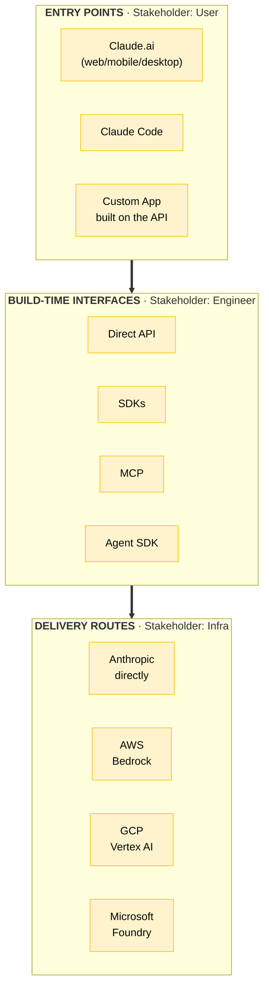
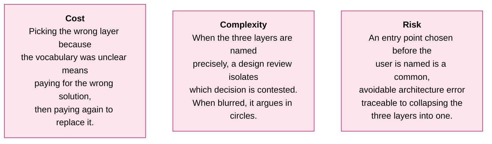
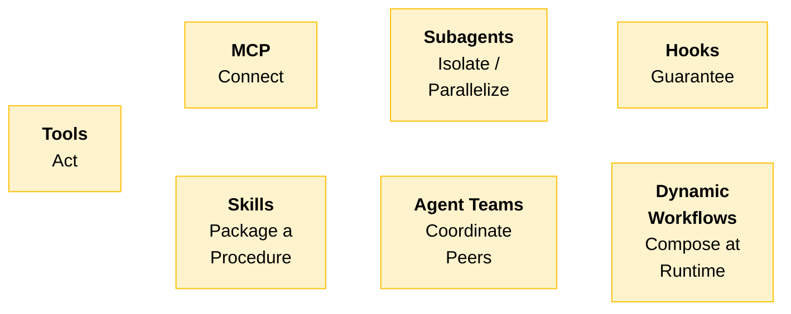
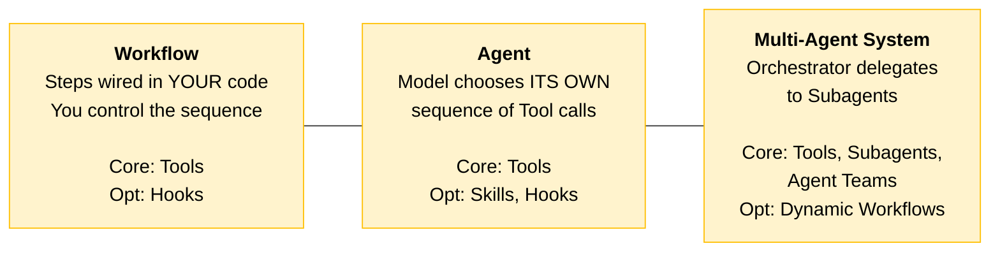
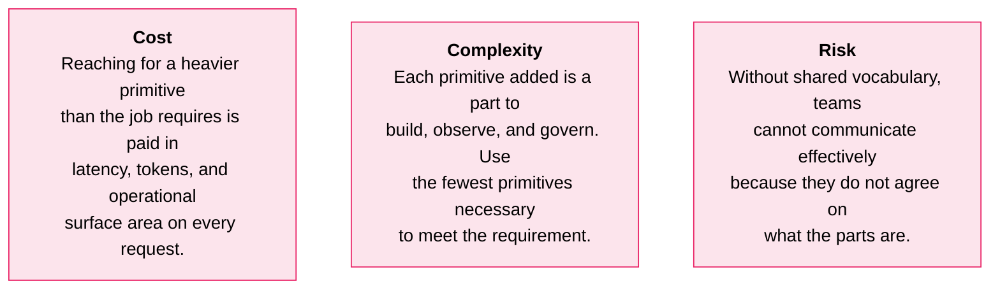
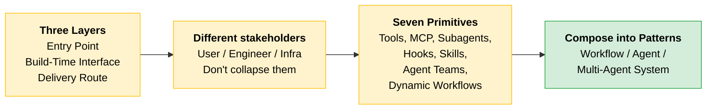

# Platform Map & Primitives

You know the four properties from the previous section. Now name the two remaining pieces of vocabulary before any design decision: the three layers a deployment passes through, and the seven primitives you assemble solutions from.

---

## Three Layers, Three Distinct Decisions

These layers are not alternatives. Every deployment involves all three. Confusing them is the most common source of muddled architecture conversations.

| Layer | Chosen for | Stakeholder |
|-------|-----------|-------------|
| **Entry Point** | The user and the work | End user, product owner |
| **Build-Time Interface** | The engineering team and the integration | Developer, tech lead |
| **Delivery Route** | Cloud commitments and compliance posture | Infrastructure, security, procurement |

> **The key:** A decision in one layer rarely dictates the others. These are three different conversations with three different stakeholders.

### Scenario: Collapsing the Layers

> **The trap:** A retail banking proposal put Claude Code (an engineering entry point) in front of non-engineering branch staff because "it's all Claude." The same model does sit underneath every entry point, but the entry point is the wrapper. Claude Code was built for developers in a terminal, not for bank staff following a workflow. Collapsing the three layers into one erased the distinction that should have ruled the choice out immediately.

### Cost, Complexity, Risk

---

## Seven Primitives, Seven Jobs

Every pattern in this course (augmented call, workflow, agent) is an assembly of these primitives. Name them once here so later lessons become combinations of parts you already recognize.

| Primitive | Job | What it is |
|-----------|-----|------------|
| **Tools** | Act | A function the model can call to take an action or fetch a result from your code |
| **MCP** | Connect | A protocol for exposing a set of tools so multiple Claude clients reach the same entry points |
| **Subagents** | Isolate / Parallelize | Hand a scoped sub-task to a separate context so work runs in isolation or in parallel |
| **Hooks** | Guarantee | Deterministic code that fires on defined events to enforce a rule the model cannot skip |
| **Skills** | Package a Procedure | A versioned, reusable unit (instructions plus optional scripts) that packages a repeatable procedure |
| **Agent Teams** | Coordinate Peers | Multiple agents working as coordinated peers, each owning part of a larger goal |
| **Dynamic Workflows** | Compose at Runtime | Assemble the steps of a workflow at runtime rather than fixing them in advance |

> **Tip:** Agent Teams and Dynamic Workflows extend older vocabulary of single agents and fixed workflows. You will see them named in current practitioner conversations even though many existing systems predate them.

### How Primitives Become Patterns

You are not choosing among primitives yet. Here is the preview of how they compose:

| Pattern | Core Primitives | Optional Primitives |
|---------|----------------|---------------------|
| **Workflow** | Tools | Hooks |
| **Agent** | Tools | Skills, Hooks |
| **Multi-Agent System** | Tools, Subagents, Agent Teams | Dynamic Workflows, Hooks |

> **The key:** A Workflow is you telling the model what to do step by step. An Agent is the model deciding its own steps. A Multi-Agent System is agents coordinating as a team. The control shifts from you to the model as you move right.

### Scenario: Missing Shared Vocabulary

> **The trap:** In an architecture review, someone said "we'll use an agent." Five people heard five different things: a single tool-using model, a multi-step workflow, a team of subagents, Claude Code, and a chatbot. The design conversation stalled for twenty minutes before anyone realized they were describing different architectures with the same word.

Shared vocabulary eliminates this. The primitives table above is the starting point.

### Cost, Complexity, Risk

---

## Quick Revision

| Concept | One-liner |
|---------|-----------|
| **Entry Point** | What the user interacts with (Claude.ai, Claude Code, custom app) |
| **Build-Time Interface** | What the engineer codes against (API, SDK, MCP, Agent SDK) |
| **Delivery Route** | Where traffic terminates (Anthropic, Bedrock, Vertex, Foundry) |
| **Tools** | Let the model act: call a function, fetch a result |
| **MCP** | Expose tools so multiple clients share the same entry points |
| **Subagents** | Scoped sub-tasks in separate contexts for isolation or parallelism |
| **Hooks** | Deterministic enforcement the model cannot skip |
| **Skills** | Versioned, reusable procedures packaged for repeat use |
| **Agent Teams** | Coordinated peer agents, each owning part of a goal |
| **Dynamic Workflows** | Steps assembled at runtime, not hardcoded in advance |
| **Don't collapse layers** | Entry point, interface, and route are three conversations with three stakeholders |
| **Fewest primitives** | Each one added is a part to build, observe, and govern |

### Exam Traps

Cover the third column and quiz yourself.

| If you see... | The trap | The right call |
|---------------|----------|----------------|
| "Should we use an entry point or a delivery route?" | Picking one over the other | They are not alternatives. Every deployment involves all three layers. |
| Claude Code proposed for bank branch staff | "It's all Claude, same model underneath" | Wrong entry point for the user. Entry point is chosen for the user, not the model. |
| "We'll use an agent" in an architecture review | Treating it as a complete architecture statement | Name which primitives: "a tool-calling agent" or "subagents with an orchestrator." |
| "Enforce a rule the model must never violate" | System prompt with strong wording | Hooks. Only primitive that fires deterministically. The model cannot skip a hook. |
| Fixed predictable steps vs dynamic sequence | Calling both "an agent" | Fixed steps = Workflow (you control). Dynamic = Agent (model controls). |
| "We need Agent Teams for this two-step task" | Reaching for the heaviest primitive | Use the fewest primitives. A single tool call may be all you need. |
