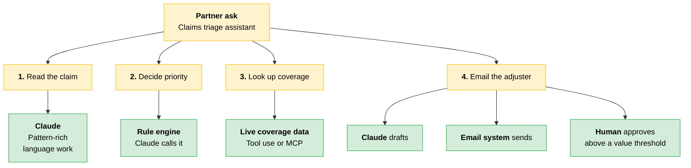
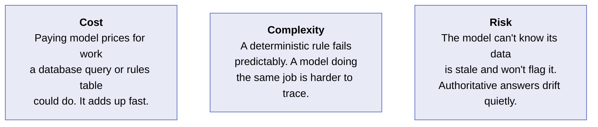
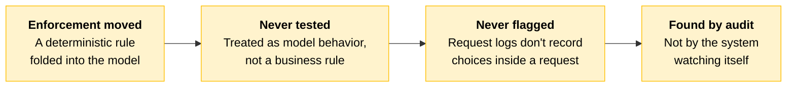
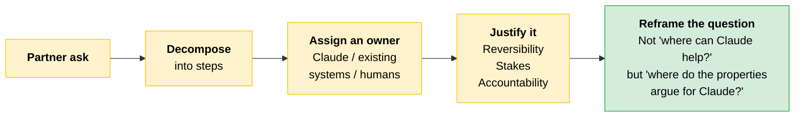

# Where Claude Fits

When you architect a solution for a partner you are already making three decisions: what the ask is, which systems you have available to address it, and where human judgment needs to be involved. This module adds a fourth: determining where Claude can help.

That fourth decision is the one architects get wrong, because they lack a deep understanding of Claude's predictable strengths and failure modes.

> **The goal:** A concrete decision framework that answers "where can Claude help" with specificity instead of enthusiasm.

---

## Three Owners

Every solution you architect with Claude lands in one of three buckets. Assigning them early is what sets you up for success.

| Owner | What belongs here |
|---|---|
| **What Claude does** | Work that benefits from language understanding, summarization, planning, drafting, or tool-mediated action |
| **What existing systems do** | Anything your partner has already paid to make reliable: the order-status service, the policy engine, the rules table, the database of record |
| **What humans do** | The judgment calls, the exception paths, the approvals, the moments where being right matters more than being fast |

> **The trap:** Collapsing all three into "what Claude does." Over-assigning work to Claude almost always makes the process more expensive, slower, and harder.

---

## Delegation: Can Claude, or Should Claude?

Decomposition produces a **delegation map**. For each part of the request you decide not just whether Claude *can* do it, but whether Claude *should own* it.

| Assignment | What it means |
|---|---|
| **AI-appropriate work** | Claude owns it outright |
| **Human-retained work** | A person owns it, and Claude stays out |
| **Collaborative work** | Claude drafts, a person decides |

Justify every assignment against three criteria:

| Criterion | The question it answers |
|---|---|
| **Reversibility** | Can a wrong call be undone? |
| **Stakes** | What does a wrong call cost? |
| **Accountability** | Who must answer for it? |

> **Testable distinction:** The three **owners** and the three **assignments** are different axes, not the same list twice. Owners answer *who performs the work*: Claude, an existing system, or a human. Assignments answer *how much Claude is trusted with*. "Collaborative" has no counterpart among the owners, and "existing systems" has no counterpart among the assignments. Do not line them up.

This is the discipline of **delegation**, the first of the four [AI Fluency competencies](../../Foundations/01-AI-Fluency-Framework-and-Foundations/README.md#1-delegation).

The four properties that tell you what Claude can be trusted with are [next-token prediction, knowledge, working memory, and steerability](01-How-Claude-Behaves.md). Taught earlier, applied here. Each one puts a question to every step you are about to assign.

| Property | What it asks of the step | Argues for Claude when |
|---|---|---|
| **Next-token prediction** | Is this pattern-rich language work, or does it need precision on specifics? | The step is interpretation, not exact recall |
| **Knowledge** | Does the answer live in training data, or in a system the partner maintains? | No live system already owns the answer |
| **Working memory** | Does everything the step needs fit inside the context window? | The step is self-contained |
| **Steerability** | Can the instruction be made concrete, bounded, and verifiable? | Format, limits, and role can be pinned down |

> **The key:** "Argues for Claude" means *better than the thing already doing this correctly*, not merely capable. If you cannot name a property that favors Claude over the incumbent system, the step is not Claude's. A single step can trip several properties at once, and different halves of one step can land differently.

---

## Scenario: Decomposing a Claims Triage Request

A partner asks for a "claims triage assistant that reads a claim, decides priority, looks up policy coverage, and emails the adjuster." An architect's first instinct might be to put all four steps in the "what Claude does" bucket. The four-properties lens stops that.



| Step | Properties in play | Which way they point | Owner |
|---|---|---|---|
| **Read the claim** | Next-token prediction, steerability | Both for Claude | Claude |
| **Decide priority** | Knowledge | Against Claude | Rule engine, called by Claude |
| **Look up policy coverage** | Knowledge | Against Claude, higher stakes | The system holding live coverage data |
| **Email the adjuster** | Working memory, steerability | Split | Claude drafts, email system sends, human approves |

**Read the claim.** Squarely in Claude's capability zone. Reading and interpreting a claim is pattern-rich language work, and with a constrained output schema both next-token prediction and steerability work in your favor.

**Decide priority.** Looks like a language task, but priority is a deterministic rule the partner already defines and maintains. It lives in a rule engine, not in Claude's training data. Routing it to Claude introduces an unnecessary knowledge limitation.

**Look up policy coverage.** The same problem as priority, at higher stakes. Policies change and coverage tables get updated, and the model has no reliable way to know when the version it learned in training stopped being current. The answer must come from the system holding the live coverage data, retrieved through tool use or an MCP server.

**Email the adjuster.** This step splits. Drafting the message is language work, so Claude does it. Sending belongs to the email system. A human reviews and approves anything above a value threshold, because if Claude decides alone its working-memory and steerability limitations both become risks.

> **The key:** Decomposition is driven by "where do the four properties argue for Claude over the system that already does this right?" and not by "where can Claude help?" That shift in framing is the concept this module builds toward.

### Cost, Complexity, Risk



---

## Case Study: When the Deterministic Check Quietly Drifted

When a team is excited about Claude, putting a deterministic check inside the model looks like the cleaner design: one component, fewer integrations, easier to demo. It is the kind of move a senior architect makes when the team is moving fast and the rule looks "easy enough" for the model.

### The Scoping Call

Two people make a reasonable call to simplify a design. In the moment it looks like a clean win.

> **Partner:** "We have a rule that any claim over £5,000 needs a senior adjuster. Today we're doing an SQL check against the claims table. Can Claude handle that instead?"
>
> **Architect:** "We can prompt Claude to extract the amount and route accordingly if it's over 5K. That keeps it in one step instead of reaching out to a separate system to check, so it's way simpler."
>
> **Partner:** "Perfect, that works for me."

What they actually did was hand a deterministic business rule, one that has to be right every time, to a probabilistic system, which is right most of the time but not all of the time. That gap did not surface during development.

### What Production Showed

```
┌────────────────────────────────────────────────────┐
│  Three months later                                │
├────────────────────────────────────────────────────┤
│  14,000   claims processed                         │
│      41   routed incorrectly                       │
│     all   41 shared the same root cause            │
└────────────────────────────────────────────────────┘
```

In all 41, the amount was not written as a clean number. It was tucked inside a sentence, like "damages estimated around five thousand pounds." The model treated "around five thousand" as a loose estimate rather than a figure that should trigger senior review, so those claims went to standard handling.

The rule was precise. The information it had to work with was not, and the model followed the letter of the rule instead of its intent. That is the [steerability limitation](01-How-Claude-Behaves.md#steerability) arriving in production.

### Why It Broke

The threshold never changed. What enforced it did.

| What enforced the rule | Correct how often |
|---|---|
| SQL check against the claims table | Every time |
| Claude extracting the amount and routing | Most of the time |

The gap between those two rows is where the 41 misroutes lived. Three failures stacked to keep it invisible.



The team never built test cases for the routing, because they had treated routing as something the model would just handle rather than a rule the business was counting on. That difference is the crux of it: a rule the business is counting on must be tested, watched, and owned by a human. Something you assume the model will handle is left alone until it breaks.

The kind of logging that would have caught a broken SQL check does not record the choices a model makes inside a single request, so nothing flagged the drift. The failure stayed invisible until someone went looking.

> [!CAUTION]
> **The lesson:** A rule that needs to be right every time was handed to a system that is right most of the time. That tradeoff is easy to miss during scoping, because the model handles the clean cases correctly and clean cases are what you see in demos and early testing. The cost of "most of the time" does not reveal itself until you audit, and by then the partner is calling.

---

## Quick Revision



| Concept | One-liner |
|---|---|
| **The fourth decision** | Beyond the ask, the systems, and the human judgment, you decide where Claude can help. |
| **Three owners** | Claude, existing systems, humans. Collapsing them into "what Claude does" makes solutions slower and more expensive. |
| **Existing systems** | Anything the partner already paid to make reliable. Default to it over the model. |
| **Delegation map** | The output of decomposition: an owner and a justification for every step. |
| **Can vs should** | Capability is not the test. AI-appropriate, human-retained, or collaborative is the test. |
| **Reversibility, stakes, accountability** | Can it be undone, what does it cost, who answers for it. |
| **The four properties** | Next-token prediction, knowledge, working memory, steerability. The lens you apply to every step. |
| **The reframe** | Not "where can Claude help?" but "where do the four properties argue for Claude over the system that already does this right?" |
| **"Argues for Claude"** | Better than the incumbent system, not merely capable. Cannot name a property that favors Claude? The step isn't Claude's. |
| **Deterministic vs probabilistic** | A rule that must be right every time does not belong in a system that is right most of the time. |
| **Split the step** | "Email the adjuster" is three owners: Claude drafts, the email system sends, a human approves above a threshold. |
| **Untested by assumption** | A rule the business counts on gets tested and watched. Work you assume the model handles is left alone until it breaks. |

### Exam Traps

Cover the third column and quiz yourself.

| If you see... | The trap | The right call |
|---|---|---|
| "Where can Claude help?" as the framing question | Answering it directly | Reframe it: where do the four properties (prediction, knowledge, working memory, steerability) argue for Claude *over the system that already does this right*? |
| A step that reads like language work, such as "decide priority" | Assigning it to Claude | Priority is a deterministic rule in the partner's rule engine. Claude calls it. Routing it to Claude adds an unnecessary knowledge limitation. |
| A deterministic threshold check proposed as a prompt | "One component, fewer integrations, simpler" | A rule that must be right every time does not go into a system that is right most of the time. |
| Three owners and three assignment categories | Lining them up as one taxonomy | Different axes. "Collaborative" has no owner counterpart; "existing systems" has no assignment counterpart. |
| A clean demo across many runs | Reading it as coverage | Demos show clean cases, which the model handles correctly. The cost of "most of the time" appears at audit. |
| "Email the adjuster" treated as one step | Giving the whole step to Claude | Split it. Claude drafts, the email system sends, a human approves above a value threshold. |
