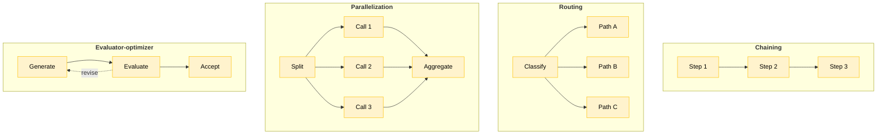
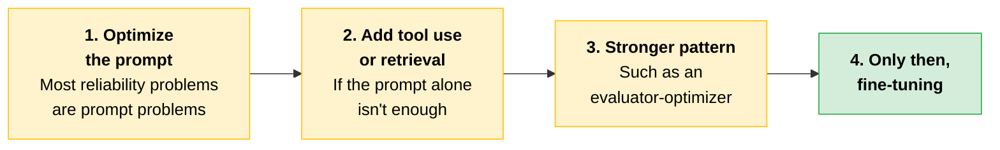
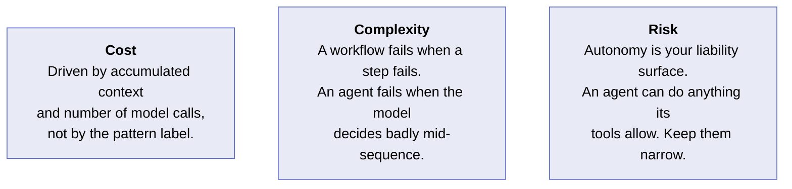
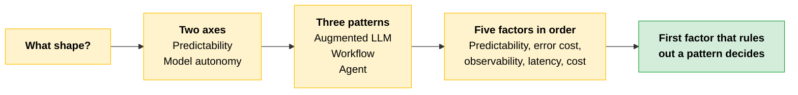

# Choosing a Pattern

Once you have established [what Claude owns](03-Where-Claude-Fits.md) versus what your systems and people own, the next decision is structural: what shape does Claude's involvement take?

There are three patterns. Each takes a different position on two axes: **predictability** (how predictable the path through the work is) and **model autonomy** (how much autonomy you are willing to hand to the model).

> **Naming note:** The first pattern appears as both **augmented LLM** and **augmented call**. Same thing. Expect either in a question stem.

---

## Three Patterns

### Augmented LLM

A single model invocation. You send the request, the model completes the task, and your code handles the wiring around it. You can add tool use, retrieval, or extended thinking to that call, but the model is still doing one bounded job in one pass. **The control flow never branches based on what the model decides.**

Use it when the task is well-defined, the output is something you can verify, and there is no reason to split the work across multiple steps.

### Workflow

You decompose the task into named steps and orchestrate them in your own code. Each step may or may not call Claude. Because the control flow lives in your code rather than inside the model, you can log it, test it, and reason about its behavior the same way you would any other piece of software.

Use it when error cost is real, observability matters, and the steps can be determined in advance.

### Agent

You give Claude a goal and a set of tools, and the model determines its own sequence of steps to reach that goal. The control flow lives inside the model, not in your code. **That is what makes it an agent rather than a workflow: the path through the work is not written in advance anywhere you can inspect.**

Use it only when the path through the work cannot be enumerated in advance, and only when the cost of an unexpected or inconsistent output is acceptable and recoverable.

> **The key:** In production, agents are bound by constrained tool entry points, per-turn budgets, explicit permissions, and stopping criteria. These constraints are not options. They are what keeps an agent from becoming a liability.

---

## Mapping Use Cases by Predictability and Autonomy

Plot any use case on the two axes.

```
  MODEL
 AUTONOMY
    │
HIGH│  ┌──────────────────────┐
    │  │ AGENT                │
    │  │ The model owns       │
    │  │ the trajectory       │
    │  └──────────────────────┘
    │
    │           ┌──────────────────────┐
    │           │ WORKFLOW             │
    │           │ Predictable shape,   │
    │           │ bounded judgment     │
    │           │ inside each step     │
    │           └──────────────────────┘
    │
    │                     ┌──────────────────────┐
    │                     │ AUGMENTED LLM        │
    │                     │ One bounded          │
    │                     │ model call           │
 LOW│                     └──────────────────────┘
    └──────────────────────────────────────────────▶
     LOW PREDICTABILITY          HIGH PREDICTABILITY
```

| Pattern | Quadrant | What that means |
|---|---|---|
| **Augmented LLM** | High predictability, low autonomy | You know the task, you know what good looks like, and the model executes it once |
| **Workflow** | The middle band | The overall shape is predictable, but each step may involve model judgment in a contained way |
| **Agent** | High autonomy, low predictability | The model owns the trajectory |

**When to reach for the agent corner.** When enumerating the steps in advance is itself the expensive part of the problem: open-ended investigation, long-horizon work, and tasks where the next move depends on what the last one turned up.

Claude Code is a production-proven example. It explores an unfamiliar codebase, decides which files to read based on what it has already found, and runs multi-step engineering work that no one could script ahead of time.

That is the capability agents unlock, and the cost is just as real. This is where non-deterministic failures concentrate in production, because the model's trajectory *is* the control flow and there is no code boundary where a guard can sit.

---

## Sub-Patterns Within Workflows

Choosing a workflow does not fully specify the design. There are four shapes a workflow can take, and each reflects a different assumption about how the steps relate to each other.



| Sub-pattern | When it earns its place |
|---|---|
| **Chaining** | The task decomposes into stages with clear handoffs, such as extract, then classify, then summarize. Each stage has a defined output the next stage consumes. |
| **Routing** | Inputs vary in kind, and different kinds require different handling. |
| **Parallelization** | Sub-tasks are independent and can run at the same time, so neither depends on the other's output. |
| **Evaluator-optimizer** | Quality is verifiable but a single attempt is not reliable enough. |

**Chaining.** A contract review pipeline: the first call extracts all obligations and deadlines from the raw document, the second classifies each by risk level, and the third drafts a summary memo for the lawyer.

**Routing.** An incoming support ticket arrives. A classifier reads it and routes billing questions to a retrieval index over account data, technical issues to a retrieval index over product documentation, and escalations directly to a human queue. One entry point, three handling paths.

**Parallelization.** A due diligence review across twelve supplier contracts. Each contract goes to a separate model call simultaneously, and all twelve results are aggregated into a single risk report. No call depends on another's output, so there is no reason to run them sequentially.

**Evaluator-optimizer.** A model drafts a response to a customer complaint. A second call grades the draft against a rubric (does it name the specific issue, take ownership, offer concrete next steps in the brand's tone) and checks the output structure. If it fails, the evaluator returns specific feedback and the generator rewrites. The loop exits when every rubric item passes or a retry limit is hit.

> **Rule of thumb:** These four are not mutually exclusive, and most production workflows combine more than one. Pick the simplest shape that meets the task's error tolerance and observability requirements. Revisit the choice once you have production data, and escalate only when measurement shows the simpler pattern falling short.

---

## Choosing: Five Factors in Sequence

Walk the five factors in order. For each one, ask whether it rules out any of the three patterns. **The first factor that rules out a pattern is the deciding one.**

> **How to read the table:** Low, Medium, and High describe what the factor *costs you* under that pattern, not how good the pattern is. Low is favorable.

| Factor | The question to answer | Augmented LLM | Workflow | Agent |
|---|---|---|---|---|
| **Predictability** | Can you enumerate the steps in advance? | Low: single bounded task | Low: you wrote the path | High: trajectory is unpredictable by design |
| **Error cost** | What does a wrong answer cost: a retry, an audit, a lawsuit? | Medium: exposes you to the model's output distribution without step-level guards | Low: deterministic guards sit between steps | High: exposes you to the full output distribution across multiple turns |
| **Observability** | Can your operations team see what happened and reconstruct why? | Medium: a single call is easy to log but opaque inside | Low: steps log as code does, with standard tooling | High: the trajectory reads like a transcript, and most current tooling is not built to alert on this |
| **Latency budget** | What is the user-visible deadline? | Low: fastest in standard configurations, though extended thinking or retrieval adds time | Medium: predictable but additive | High: runtime is open-ended, so budget for the worst case, not the median |
| **Cost** | What is the per-request token cost at your expected volume? | Low: fewest tokens per request | Medium: scales with step count | High: iterative reasoning, multi-turn tool use, retries, and growing context all add up. Poorly bounded agents are often the most expensive pattern. |

---

## Case Study: When the Team Wanted Flexibility and Got Non-Determinism

Agents are often chosen because a task *feels* open-ended, not because the task requires one. Feeling uncertain about how to structure the work is different from work whose steps genuinely cannot be determined in advance.

> **The trap:** If you could have written the steps in code, you could have used a workflow, and avoided taking on the complexity of non-deterministic control flow.

These three quotes come from one team's 90-day retrospective. Each names a different layer of the same mistake.

> "We picked an agent because we didn't want to constrain it too early. By month two we'd added so many guardrail tools we'd basically rewritten the workflow inside the agent loop, minus the logging."
>
> "Compliance came in and asked which step approved the disbursement. We pointed at a model turn. They asked which version of the model. We checked the trace. The version had rolled forward two weeks earlier and nobody had re-validated."
>
> "The actual paths through the system, when we mined the traces, fell into only four shapes. Four. We could have written that as a router and four chains and saved ourselves six months."

**They optimized for unknown future flexibility instead of known present shape.** When the team mined their traces at month three, the actual paths fell into four shapes, all enumerable from week one. The workflow they needed was a [router](#sub-patterns-within-workflows) with four [chains](#sub-patterns-within-workflows). They built an agent instead, then spent six months reconstructing that structure inside the loop.

**Non-determinism became a compliance problem.** When an auditor asked which step had approved a disbursement, the team could only point to a model turn. What the agent pattern specifically added was having no discrete, auditable step to point to. This is how agent autonomy becomes a compliance risk: not in normal operation, but when an external party needs a deterministic answer and the system can only produce a trajectory.

**An unpinned model version compounded the gap.** The auditor then asked which version of the model had run. The trace showed it had rolled forward two weeks earlier with no re-validation checkpoint.

> **Testable distinction:** Only **one** of those two compliance failures is about the agent pattern. Having no auditable step to point at is caused by the pattern. An unpinned model version with no re-validation gate is a **model-governance** gap that a workflow shipping the same way would have inherited identically. Do not attribute both to the pattern choice.

> [!CAUTION]
> **The lesson:** Choosing an agent when you are not sure it is the right pattern is not a safe default. An agent is right only when the steps genuinely cannot be determined in advance. If the steps are known up front, choosing an agent means paying for flexibility you will not use: extra tokens, extra latency, and audit gaps that surface when compliance asks something your traces cannot answer.
>
> Agents should not be avoided, they should be fit for purpose. Had the work been genuinely unpredictable, an agent would have been right for exactly that reason. This team's mistake was jumping to one when the four paths through their system were knowable from the start.

---

## Try Prompting Before Fine-Tuning

If prompting feels unreliable, the instinct for many engineers is to reach for fine-tuning. On Claude that is usually the wrong first move. Work the sequence.



Fine-tuning does have a place, in specific situations:

- The task runs at very high volume and inference cost is the real constraint.
- Latency is critical and a smaller specialized model will outperform a prompted general one.
- The output needs a consistent format and prompting has not solved it reliably.

Outside those situations, fine-tuning locks you to a fixed model version and narrows your options without much to show for it. Treat it as the last step in a deliberate progression, not a quick fix for a prompt that is not working yet.

> **Exam trap:** Fine-tuning Claude is **not broadly available**. Access is limited, varies by model and [delivery route](02-Platform-Map-and-Primitives.md#three-layers-three-distinct-decisions), and changes as Anthropic expands the program. Confirm current options with the Anthropic account team before recommending this path to a partner.

---

## Patterns Are Assemblies of Primitives

These three patterns are not abstract categories. Each is an assembly of the [seven primitives](02-Platform-Map-and-Primitives.md#seven-primitives-seven-jobs).

| Pattern | What it assembles |
|---|---|
| **Augmented call** | The model plus tools |
| **Workflow** | Primitives wired together in your own code |
| **Agent** | The model choosing its own sequence of tool calls |

Choosing a pattern is choosing how to compose those parts.

---

## Packaging: Prompt, Tools, or a Skill

Alongside choosing a pattern, decide how the capability is **packaged**. Three options sit on a spectrum.

| Option | What it is |
|---|---|
| **Prompt-only** | Instructions alone |
| **Direct tool use** | The model calls functions in your code |
| **Skills-based architecture** | A versioned, reusable Skill packaging the procedure, its instructions, and any scripts as one governed unit |

Reach for a Skill when the same procedure runs repeatedly, needs to be distributed across teams or products, or must be versioned and governed.

> **Testable distinction:** Pattern and packaging are **different axes**. Three patterns and three packaging options is a coincidence of counting, not a mapping. Any pattern can be packaged any of the three ways, and nothing here pairs "agent" with "Skill" or "augmented LLM" with "prompt-only."

Finally, apply the [delegation lens](03-Where-Claude-Fits.md#delegation-can-claude-or-should-claude) to the pattern itself: does this pattern grant Claude appropriate or excessive decision authority for the risk profile in front of you? An agent that can act autonomously is the right choice only when the **stakes and reversibility** of its actions justify the autonomy it is given.

---

## Cost, Complexity, Risk



**Cost.** Agents do not automatically cost more than workflows. What drives cost is how much context accumulates across the conversation and how many model calls are made. A poorly designed workflow can cost more than a well-designed agent. Design matters more than the pattern label.

**Complexity.** Workflows and agents fail in different ways. A workflow fails when a step in your code fails. An agent fails when the model makes a bad decision somewhere in a sequence of turns. That second failure is harder to spot and harder to diagnose, and your standard debugging tools will not catch it the same way.

**Risk.** An agent's autonomy is your liability surface. An agent can do anything its tools allow, including combinations you did not test for. The broader the tool permissions, the larger the space of things that can go wrong. Keep the tool entry point as narrow as the task allows.

---

## Quick Revision



| Concept | One-liner |
|---|---|
| **Augmented LLM** | One bounded model call. Control flow never branches on what the model decides. Also called an augmented call. |
| **Workflow** | Named steps orchestrated in your code. Loggable, testable, reasoned about like any software. |
| **Agent** | Goal plus tools; the model picks its own sequence. Control flow lives inside the model. |
| **The discriminator** | Where the control flow lives: your code (workflow) or inside the model (agent). |
| **Two axes** | Predictability of the path, and how much autonomy you will grant. |
| **Agent constraints** | Constrained tool entry points, per-turn budgets, explicit permissions, stopping criteria. Not optional. |
| **Chaining** | Sequential stages with clean handoffs. |
| **Routing** | A classifier picks the downstream path. |
| **Parallelization** | Independent sub-tasks run concurrently, then aggregate. |
| **Evaluator-optimizer** | Generate, grade, revise until a criterion passes or a retry limit hits. |
| **Five factors** | Predictability, error cost, observability, latency budget, cost. The first that rules out a pattern decides. |
| **Fine-tuning last** | Prompt, then tools or retrieval, then a stronger pattern, then fine-tuning. Not broadly available. |
| **Packaging** | Prompt-only, direct tool use, or a versioned Skill. A separate axis from pattern. |
| **Cost driver** | Accumulated context and number of model calls, not the pattern label. |
| **Flexibility you won't use** | Picking an agent for unknown future shape when the present shape is knowable costs tokens, latency, and audit gaps. |
| **Pattern vs governance failure** | No auditable step is the pattern's fault. An unpinned model version is not. |

### Exam Traps

Cover the third column and quiz yourself.

| If you see... | The trap | The right call |
|---|---|---|
| Low / Medium / High in the five-factor table | Reading them as a quality score | They describe what the factor costs you under that pattern. Low is favorable. |
| "Agents cost more than workflows" | Accepting it as a rule | Cost is driven by accumulated context and number of model calls. A poorly designed workflow can cost more than a well-designed agent. |
| A multi-step design, so it must be a workflow | Counting steps | Count nothing. Ask where the control flow lives: your code is a workflow, inside the model is an agent. |
| "Prompting is unreliable, let's fine-tune" | Jumping to fine-tuning | Prompt, then tools or retrieval, then a stronger pattern, then fine-tuning. It is also not broadly available. |
| An agent proposed because the task feels open-ended or complex | Treating that feeling as the test | The test is whether the steps can be enumerated in advance, and whether an unexpected output is acceptable and recoverable. Uncertainty about how to structure work is not unpredictable work. |
| An agent post-mortem naming two compliance failures | Blaming the pattern for both | Only "no auditable step to point at" comes from the pattern. An unpinned model version with no re-validation is a model-governance gap any pattern would inherit. |

---

**Source:** Claude Certified Architect Professional, Module 1 (Claude Platform & Solution Design), screen set "Composing primitives into augmented call, workflow, agent."
