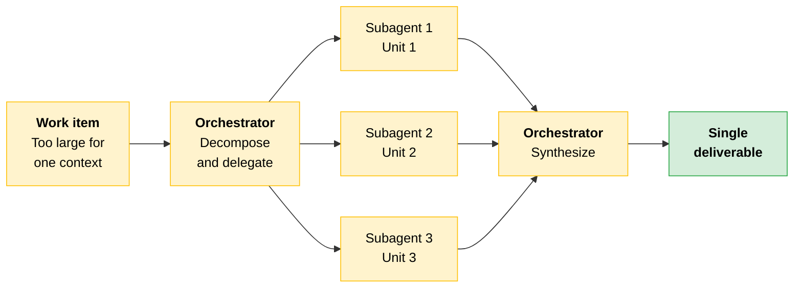
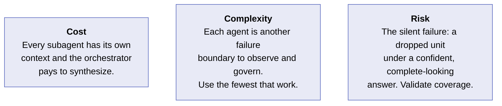
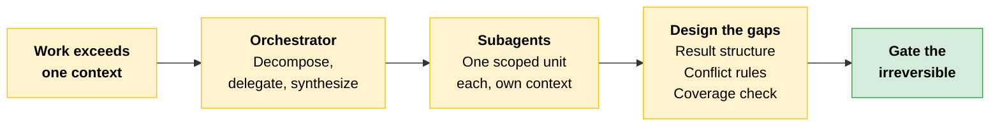

# Multi-Agent Systems and Orchestration

[Pattern selection](04-Choosing-a-Pattern.md) told you when to reach for an agent. Some problems are too large or too varied for a single agent to hold in one context. When that happens the design moves to multiple agents working together: an orchestrator that decomposes the work, and subagents that each carry part of it.

This section covers how those systems are structured, how they fail, and where a human belongs in the loop.

---

## Two Roles

| Role | Owns | Never does |
|---|---|---|
| **Orchestrator** | The goal. It decomposes the work, decides what to delegate, and synthesizes the results into a single answer. | The sub-task work itself. Its job is delegation and synthesis. |
| **Subagents** | A scoped sub-task. Each runs in its own context, does one piece, and returns a result. | Own the goal, or see the whole picture. |

> **The key:** Three things must be **designed, not assumed**: how the work is decomposed into sub-tasks, how each subagent's result is structured so the orchestrator can combine it, and how the orchestrator resolves conflicts or gaps when the results come back.

---

## The Worked Pattern: Fan-Out Over a Large Work Item

The most common multi-agent shape is a fan-out.



A parent agent faces a work item too large for one context: a 400-file codebase to audit, a 200-document corpus to summarize, a regulatory filing to check against fifty rules. The orchestrator splits the item into independent units, dispatches one subagent per unit (in parallel where the units do not depend on each other), then synthesizes the returned results into a single deliverable.

The win is twofold: each subagent works in a clean context sized to its unit, and independent units run concurrently.

---

## Error Recovery: The Recoverability Asymmetry

> **The architectural question:** where is each failure mode recoverable?

- A **subagent** failure is usually recoverable. If one unit fails, the orchestrator can retry it, route it elsewhere, or drop it and flag the gap, while the rest of the work proceeds.
- An **orchestrator** failure is usually not recoverable. If the agent that owns the goal and holds the synthesis loses its thread, the whole run fails, and partial subagent work may be stranded.

Design for that asymmetry. Make subagent work idempotent and retryable, and protect the orchestrator's state.

| Failure | Where it lands | Design response |
|---|---|---|
| A subagent returns a malformed or empty result | Subagent boundary (recoverable) | Validate each result. Retry or re-route the failed unit. Record the gap rather than failing the run. |
| Two subagents return conflicting results | Synthesis step (recoverable) | Give the orchestrator an explicit conflict-resolution rule, or escalate the conflict to a human. |
| The orchestrator loses the goal or its synthesis state | Orchestrator (often unrecoverable) | Protect orchestrator state. Checkpoint progress so a failed run can resume rather than restart. |
| Traces fragment across orchestrator and subagents | Observability (cross-cutting) | Propagate a shared trace identifier so a single run is reconstructable end to end. |

---

## Human-in-the-Loop Checkpoints

A multi-agent system can take many actions before a human ever sees the output, which makes checkpoint placement a deliberate design choice.

A **human-in-the-loop checkpoint** is a gate that pauses execution for review, positioned by the **risk and reversibility** of the action about to be taken. Place a gate before any irreversible or high-stakes action a subagent would otherwise take autonomously. Sample lower-stakes actions rather than gating each one.

> **The key:** The gate is part of the orchestration design, not bolted on afterward. Routing by stakes gets its full treatment in the [Responsible AI module](../../Professional/03-Responsible-AI-Safety-and-Risk-for-Architects/04-Review-Routing.md).

That positioning test is the [delegation lens](03-Where-Claude-Fits.md#delegation-can-claude-or-should-claude) again: reversibility and stakes decide how much a subagent is trusted to do alone.

---

## Case Study: When Fan-Out Hid a Dropped Unit

A compliance team built a multi-agent system to check a 50-section vendor contract against an internal policy checklist. The orchestrator fanned the work out to one subagent per section, each returning a pass or flag verdict, and synthesized a clean summary.

```
┌────────────────────────────────────────────────────────┐
│  50-section vendor contract review                     │
├────────────────────────────────────────────────────────┤
│   50   units dispatched, one subagent per section      │
│   48   results returned                                │
│    2   never came back (one timeout, one parse failure)│
│  ────                                                  │
│        Reported: "48 sections reviewed, 3 flagged"     │
│        Read as complete. Circulated to the legal lead. │
└────────────────────────────────────────────────────────┘
```

Two sections had never been reviewed. One subagent timed out and returned nothing. Another failed to parse a scanned page and returned an empty result. The orchestrator counted only the results it received, and nobody had told the synthesis step to reconcile the count against the fifty units dispatched.

### Why It Broke

Completeness was assumed, not verified. Three gaps lined up to let that through.

| Gap | What happened |
|---|---|
| **The count was never reconciled** | No rule said the number of results must equal the number of units dispatched, so 48 returned results became "48 reviewed" instead of "two are missing." |
| **A recoverable failure had nothing watching it** | A timeout and an empty parse result are both the recoverable case, but only when something retries the unit or flags the gap. No component owned the subagent boundary, so both passed silently. |
| **The output read as complete** | The summary was fluent and well-formed, which is exactly what made the gap invisible. |

That third row is [confidence is not validity](01-How-Claude-Behaves.md#from-property-to-design-consequence) arriving in production: a wrong answer delivered in the same assured tone as a right one.

> [!CAUTION]
> **The lesson:** A multi-agent system fails most dangerously when a confident summary is built over work that was never finished. The fix is a coverage check at synthesis: results returned must equal units dispatched, or the run flags the difference before anyone reads the summary.

---

## Cost, Complexity, Risk



**Cost.** Multi-agent systems multiply token spend. Every subagent has its own context, and the orchestrator pays to synthesize. Reach for the pattern when the work genuinely exceeds one context, not as a default.

**Complexity.** Each added agent is another failure boundary to observe and govern. The discipline is the fewest agents that meet the requirement, with clear ownership of the goal.

**Risk.** The dangerous failure is the silent one: a subagent drops a unit and the orchestrator synthesizes a confident, complete-looking answer over incomplete work. Validate coverage, do not assume it.

---

## Quick Revision



| Concept | One-liner |
|---|---|
| **When to go multi-agent** | The work is too large or too varied for a single agent to hold in one context. |
| **Orchestrator** | Owns the goal: decomposes, delegates, synthesizes. Never does the sub-task work itself. |
| **Subagent** | Owns one scoped sub-task in its own context, and returns a result. |
| **Designed, not assumed** | How work is decomposed, how results are structured, how conflicts and gaps get resolved. |
| **Fan-out** | The most common shape: split into independent units, one subagent each, then synthesize. |
| **The twofold win** | Clean context sized per unit, plus concurrency across independent units. |
| **Recoverability asymmetry** | Subagent failures are usually recoverable. Orchestrator failures usually are not. |
| **Idempotent and retryable** | The design response for subagent work, so a retry is always safe. |
| **Checkpoint progress** | The design response for orchestrator state, so a failed run resumes rather than restarts. |
| **Shared trace identifier** | Propagate one so a run is reconstructable across orchestrator and subagents. |
| **Human-in-the-loop checkpoint** | A gate that pauses for review, placed by risk and reversibility. Gate the irreversible, sample the rest. |
| **Coverage check** | Results returned must equal units dispatched, or the run flags the difference. |
| **The silent failure** | A confident, complete-looking synthesis over work that was never finished. |

### Exam Traps

Cover the third column and quiz yourself.

| If you see... | The trap | The right call |
|---|---|---|
| A fan-out summary that reads as complete | Trusting the fluency | Reconcile the count. Results returned must equal units dispatched, or the run flags the difference. |
| An orchestrator that also handles a couple of units itself | "It's more efficient" | The orchestrator never does the sub-task work. Its job is delegation and synthesis. |
| One subagent fails mid-run | Failing the whole run | Subagent failures are usually recoverable: retry, re-route, or drop and flag while the rest proceeds. Orchestrator failures are the unrecoverable ones. |
| Two subagents return conflicting results | Letting the orchestrator improvise | Synthesis needs an explicit conflict-resolution rule, or the conflict escalates to a human. |
| A big task, so fan it out to subagents | Multi-agent as the default | Reach for it when the work genuinely exceeds one context. It multiplies token spend and adds a failure boundary per agent. |
| Where to put the human gate | Gating every action, or none | Gate before irreversible or high-stakes actions. Sample the lower-stakes ones. |
