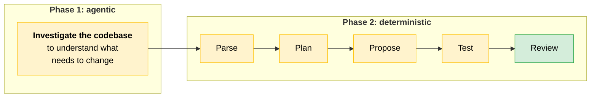
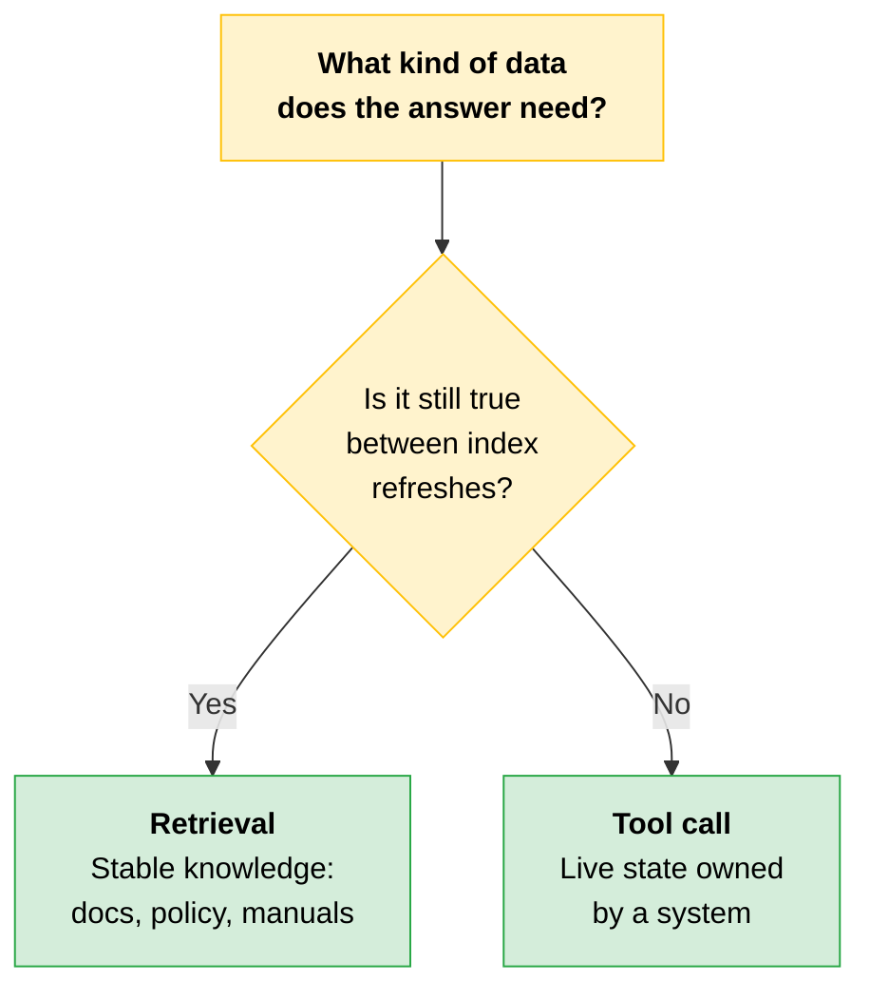
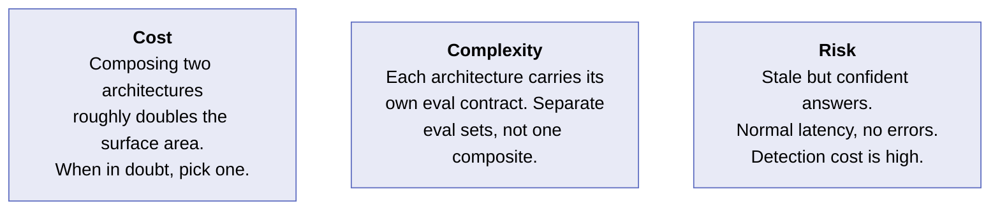
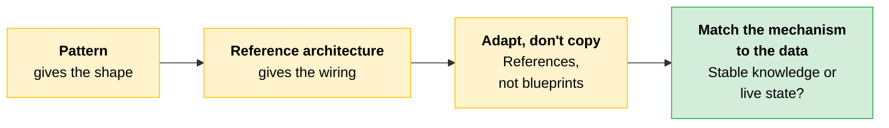

# Reference Architectures

[Choosing a pattern](04-Choosing-a-Pattern.md) gets you the right structure. Patterns give you the **shape**. The next question is how that structure connects to everything around it. Reference architectures give you the **wiring**.

A reference architecture is a documented pattern for how to wire an LLM application together to solve a recurring class of problem. Most partner problems map to one of a handful already proven in the Claude ecosystem.

> **The key:** Reference architectures are *references*, not blueprints to adhere to. The goal is not matching a problem to a fixed design and implementing it as drawn. Every partner workload is unique. Understand these well enough to generalize: take the shape that fits, adapt it to the workload in front of you, and recognize when a workload draws on more than one at once.

---

## Five Reference Architectures

| Architecture | What it wires up | One way projects go wrong |
|---|---|---|
| **Agent** | A goal plus tools; the model picks the calls and their order | Unbounded autonomy |
| **RAG** | A stable knowledge corpus, chunked and indexed | Applied to live state |
| **Document processing pipeline** | Structured extraction from semi-structured documents, commonly with an [evaluator-optimizer](04-Choosing-a-Pattern.md#sub-patterns-within-workflows) | No exception path |
| **Customer service / ticket triage** | Intent classification, then [routing](04-Choosing-a-Pattern.md#sub-patterns-within-workflows) to the right backend | Retrieval used for live order status |
| **Coding agent** | Agentic exploration, then deterministic edit, test, and review steps | Editing and committing with no human review gate |

The third column names one failure each. Several of these architectures have more than one, listed in full below.

> **Note on vocabulary:** **Agent** appears both as a [pattern](04-Choosing-a-Pattern.md) and as a reference architecture. Same concept at two altitudes: the pattern is the shape of Claude's involvement, the architecture is that shape plus the wiring around it. The course also uses "pattern" and "architecture" loosely in places, so read for which altitude is meant rather than assuming the words are exclusive.

### Agent

**What good looks like.** The model works toward a goal by deciding which tools to call and in what order. Autonomy is kept in check by limiting what the tools can do and setting a budget on how many turns the model gets. Reach for it when the path through the work cannot be written in advance: investigating a codebase, pulling from multiple research sources, or triaging complex customer cases. [File 04's fuller test](04-Choosing-a-Pattern.md#agent) adds the second half: an unexpected output must also be acceptable and recoverable.

**Where projects go wrong.** Unbounded autonomy: giving the model tools that change state with no human review, no turn limit, and no way to measure whether the goal was met.

### Retrieval-Augmented Generation (RAG)

**What good looks like.** A stable knowledge corpus (product manuals, internal docs, regulatory text) is chunked and indexed. When a question comes in, the most relevant chunks are retrieved and passed to the model as context.

**Where projects go wrong.** Using RAG to answer questions about live state: order status, inventory levels, ticket queues. The index is a snapshot. If the underlying data has changed since the last refresh, the answer will be wrong.

### Document Processing Pipeline

**What good looks like.** Structured extraction from semi-structured documents like claims, invoices, and contracts. The pipeline handles OCR, extracts fields against a schema, validates the output, and routes exceptions. An evaluator-optimizer is common here because first-pass extraction on edge cases is not reliable enough to trust without a check.

**Where projects go wrong.** No exception path. Low-confidence extractions go through the same pipeline as clean documents, with no human gate to catch the ones the model got wrong.

### Customer Service / Ticket Triage

**What good looks like.** Classify intent and what the user is asking for, then route to the right backend: a knowledge retrieval layer for documentation questions, a transactional API for live state queries like order status or account changes, and a human approval layer for high-consequence actions.

**Where projects go wrong.** Using retrieval for live order status instead of calling the API directly. No escalation path to a human. Deploying an agent variant before the simpler routed workflow has been properly measured.

### Coding Agent

**What good looks like.** The work splits into two phases.



The first phase is agentic, because the path through an unfamiliar codebase cannot be written in advance. The second phase is where **the actual edits** happen, and it follows deterministic steps: parse, plan, propose, test, review. [Subagents](05-Multi-Agent-Systems-and-Orchestration.md) handle isolated tasks with enough context to do the job but not so much that the steps become unmanageable.

**Where projects go wrong.** Letting the agent edit and commit without a human review gate. Not tracking regression rates against an eval set **for each language or framework** in the codebase. Treating the whole thing as a conversation rather than a structured pipeline with defined handoffs.

> **Covered next:** Full RAG implementation depth, including chunking strategies, embedding approaches, hybrid lexical-plus-semantic retrieval, and reciprocal rank fusion, is in [RAG pipeline design](07-RAG-Pipeline-Design.md).

---

## One Pattern or Several?

Real partner problems frequently sit at the boundary between two architectures. A routing workflow might hand certain intents to an agentic investigation loop. A document processing pipeline might use RAG over policy text when it hits an exception case. Drawing on more than one is sometimes the right answer.

What matters is *why* you are reaching for the second one. Do not think of patterns as pieces you snap together. Look at why each one works, and shape the idea to fit your problem.

| Reaching for a second pattern because... | Verdict |
|---|---|
| The two parts of your problem break in **different ways worth managing separately** | Legitimate |
| You have not decided what problem you are solving | Adapt a single pattern instead |

> **Exam trap:** Composing patterns to avoid making a decision is not a pattern you are applying. It is a design decision you are deferring.

---

## The Most Common Mistake: Retrieval Applied to Live State

The most common reference architecture mistake is using retrieval where a tool call belongs.

| Symptom | What you see |
|---|---|
| **Stale chunks** | Retrieved text that no longer reflects reality |
| **Results shift on refresh** | The same question answers differently after each index rebuild |
| **Contradicts the database** | The answer disagrees with the system of record |

A better embedding model or a shorter refresh interval will not fix this. Call the system that owns the live state directly, rather than retrieving a cached version of it.



> **Testable distinction:** [Knowledge](01-How-Claude-Behaves.md#knowledge) says to make an external system the source of truth instead of the model, and lists retrieval, tool use, and MCP as ways to do it. All three qualify. The question is *which* external system. RAG's is an **index**, refreshed on a schedule: that genuinely fixes training-cutoff staleness over a stable corpus, which is what RAG is for. What an index cannot own is data that changes independently of its refresh. For live state the external system has to be the **system of record**, reached by a tool call.

---

## Case Study: When Retrieval Got Reached For Instead of a Tool Call

The underlying skill here is **context engineering**: deciding which mechanism is responsible for getting each kind of data in front of the model. Retrieval over a vector index is one such mechanism, and this trace shows what happens when it is asked to own data it cannot own.

This happens when a team reaches for RAG because it worked on a previous use case, without asking whether the new one shares the same properties. RAG works when the answer lives in reference material that stays stable between index refreshes. It breaks for live state, because retrieval treats your data as text snapshots rather than as a system with current values. When those snapshots disagree, the model picks the most similar one and answers confidently. There is no way to know which snapshot is current.

### The Trace: Electronics Retailer Customer Service Assistant

```
User asks: "Where's my order?"

RETRIEVED CHUNK #1 (similarity 0.78)
  "Order #88412 was placed on the 11th of June and shipped on the
   12th via standard courier. Tracking number AB123..."

RETRIEVED CHUNK #2 (similarity 0.74)
  "Order #88412 is currently being processed. Expected dispatch
   within 24 hours."

MODEL OUTPUT
  "Your order shipped on the 12th of June via standard courier.
   Tracking: AB123..."
```

Both chunks were real strings that existed in the corpus at different points in time. The index conflated them.

The actual state: the order had shipped, been returned to depot due to a damaged label, and was awaiting re-dispatch. **That current state appears in neither chunk.** The corpus held two stale snapshots and no record of where the order actually was, because an index captures what was true when it was written, not what is true now.

A customer service tool to fetch live order status existed in the partner's API. It was not called.

### Why It Broke

| What broke | Why |
|---|---|
| **The category error** | Retrieval is right for knowledge: FAQs, policies, manuals. It is wrong for transactional state. Order status was not failing because retrieval is broken. It was failing because current state had been represented as historical text snapshots in the first place. |
| **A data-architecture failure, not a retrieval failure** | Live state was indexed as text, so the system searched a corpus of past snapshots rather than querying the system of record. |
| **Similarity is not truth** | Embedding similarity confidently merged two stale snapshots into one answer. A higher similarity score does not mean a truer answer. It means the retrieved text was semantically close to the query, which is a different thing once the underlying state has changed. |
| **The fix is a tool call** | Not a better chunker, a shorter refresh interval, or a higher similarity threshold. A tool call to the order-status service. The knowledge base keeps the FAQ content, the transactional database keeps the orders: two types of data, two access patterns, two mechanisms. |

> [!CAUTION]
> **The retrieval principle:** Retrieval is for stable knowledge, things that were true yesterday and will be true tomorrow. Tool use is for live state, things whose current value is owned by a system and changes independently of your index.
>
> Conflating them produces answers that are fluent, confident, and wrong in ways that are hard to detect, because the system shows no error signal. The model returned a response. The response looked correct. The customer got false information about their own order.

That last paragraph is [confidence is not validity](01-How-Claude-Behaves.md#from-property-to-design-consequence) again, this time with a stale index as the cause rather than stale training data.

---

## Cost, Complexity, Risk



**Cost.** Composing two reference architectures roughly doubles the surface area you must maintain. When in doubt, pick one.

**Complexity.** Each reference architecture carries its own **eval contract**. You need separate eval sets per architecture, not a single eval set for the composed system. A system that looks healthy at the top level can be masking failures in one of its components.

**Risk.** Misapplying retrieval to live state produces stale but confident answers. The system looks healthy from the outside: normal latency, no errors. Detection cost is high, because there is no signal that anything is wrong until a user notices the answer does not match reality.

---

## Quick Revision



| Concept | One-liner |
|---|---|
| **Pattern vs reference architecture** | The pattern is the shape. The reference architecture is the wiring around it. |
| **References, not blueprints** | Take the shape that fits, adapt it, and expect some workloads to draw on more than one. |
| **Agent architecture** | Goal plus tools; bound it by limiting what tools can do and budgeting turns. |
| **RAG architecture** | A stable corpus, chunked and indexed, retrieved into context. |
| **Document processing pipeline** | OCR, schema extraction, validation, exception routing. Usually with an evaluator-optimizer. |
| **Ticket triage** | Classify intent, then route: retrieval for docs, transactional API for live state, human for high consequence. |
| **Coding agent** | Agentic investigation first, then deterministic parse, plan, propose, test, review. |
| **Unbounded autonomy** | State-changing tools with no human review, no turn limit, and no measure of goal completion. |
| **No exception path** | Low-confidence extractions treated like clean ones, with no human gate. |
| **When to compose** | The two parts break in different ways worth managing separately. Not because the problem is undecided. |
| **The index is a snapshot** | It captures what was true when written, not what is true now. |
| **Similarity is not truth** | A higher score means semantically close, not more current. |
| **The retrieval principle** | Retrieval for stable knowledge, tool use for live state owned by a system. |
| **Eval contract** | Each architecture needs its own eval set. A healthy top level can mask a broken component. |
| **Context engineering** | Deciding which mechanism is responsible for getting each kind of data in front of the model. |

### Exam Traps

Cover the third column and quiz yourself.

| If you see... | The trap | The right call |
|---|---|---|
| RAG proposed for order status, inventory, or ticket queues | Treating it as a retrieval problem | Live state needs a tool call to the system of record. The index is a snapshot. |
| "Fix the stale answers with a better embedding model or a faster refresh" | Tuning the retrieval stack | A category error cannot be tuned away. Call the system that owns the state. |
| A retrieved chunk with a high similarity score | Reading the score as confidence in the answer | Similarity is not truth. It means semantically close to the query, not current. |
| Two architectures proposed for one problem | Assuming composition is sophistication | Legitimate only when the two parts break in different ways worth managing separately. Otherwise you are deferring a decision. |
| One eval set covering a composed system | Trusting a green top-level result | Each architecture carries its own eval contract. A healthy top level can mask a broken component. |
| An agent variant proposed for ticket triage | Reaching for the more capable design | Measure the simpler routed workflow first. Escalate only when measurement shows it falling short. |
