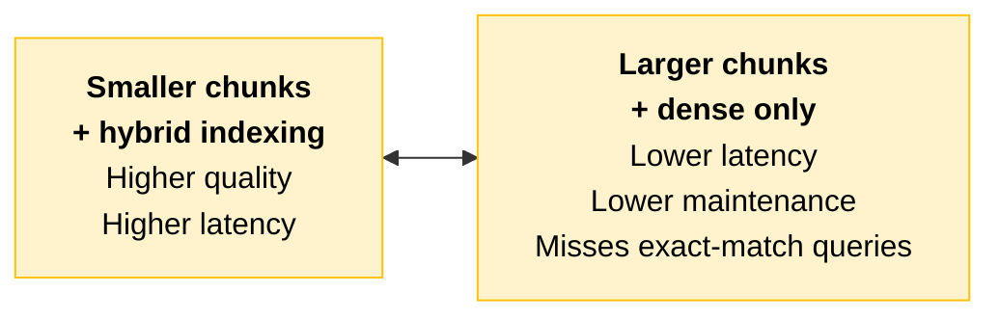
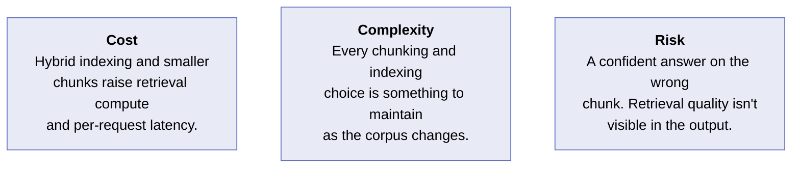
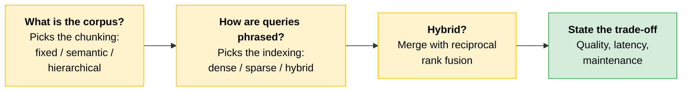

# RAG Pipeline Design

The [previous section](06-Reference-Architectures.md) named RAG as a known-good shape and showed where it is misapplied. This one goes a level deeper, into the design of the retrieval pipeline itself: how a corpus is broken into chunks, how those chunks are indexed, and how the retrieval strategy is matched to the query patterns the system will see.

---

## Chunking: Chosen by What the Corpus Is

A **chunk** is the unit that gets retrieved. The chunking approach is chosen by the structure of the source material, not by a default size.

| Approach | How it works | When it earns its place |
|---|---|---|
| **Fixed-size** | Split into uniform spans (with overlap) regardless of structure | Homogeneous, unstructured text where natural boundaries are weak. Simplest to operate. |
| **Semantic** | Split on meaning boundaries: topic shifts, sentence groups that hang together | Prose where a retrieved chunk must be self-contained to answer well. Reduces mid-idea cuts. |
| **Hierarchical** | Preserve document structure (sections, subsections) and retrieve at the level that fits | Structured documents like contracts, manuals, and policies, where section context carries meaning. |

> **The trap:** Picking a chunk size first. The structure of the corpus picks the approach, and the approach constrains the size.

---

## Indexing: Chosen by How Queries Are Phrased

Indexing decides what "similar" means when a query arrives. The strategy is chosen by the query pattern.

| Strategy | What it matches | When it earns its place |
|---|---|---|
| **Dense (embeddings)** | Semantic similarity: meaning, not words | Queries phrased differently from the source. Paraphrase, intent, and concept matching. |
| **Sparse (keyword, e.g. BM25)** | Exact terms: identifiers, codes, names | Queries that hinge on specific tokens: part numbers, statute citations, error codes. |
| **Hybrid** | Both, with the results combined | Mixed query patterns, which is the common production case. Recovers the exact-match results dense retrieval misses. |

### Merging Two Ranked Lists

A hybrid index returns two ranked lists, and they have to become one. **Reciprocal rank fusion** is the standard, low-tuning way to do it: each result is scored by its rank in each list, and the combined score favors items that rank well in both.

> **The key for an architect:** Combining dense and sparse results is a design decision with a known, defensible default. You are expected to name it, not to invent a scoring scheme.

---

## Articulating the Trade-Off

Every retrieval design trades off three things.

| Dimension | The question |
|---|---|
| **Retrieval quality** | Does the right chunk come back? |
| **Latency** | How long does retrieval add to each request? |
| **Maintenance** | How much does the pipeline cost to keep correct as the corpus grows and changes? |

The two ends of the dial:

There is no universally right point on that dial. There is only the point that fits **this** corpus and **these** queries, stated as a trade-off you can defend.

> **Exam trap:** "Improve retrieval quality" is not an answer on its own. Quality moves with latency, and every choice adds maintenance. The defensible answer names the corpus, the query pattern, and what you gave up.

---

## Cost, Complexity, Risk

**Cost.** Hybrid indexing and smaller chunks raise both retrieval compute and per-request latency. Size the pipeline to the query patterns you actually have, not to the most thorough one imaginable.

**Complexity.** Every chunking and indexing choice is something to maintain as the corpus changes. A pipeline that was correct at launch can degrade silently as documents are added.

**Risk.** The failure mode is a confident answer built on the wrong chunk. Retrieval quality is not visible in the output. It has to be measured against a labeled set, which is why this work ties straight to evaluation.

---

## Quick Revision

| Concept | One-liner |
|---|---|
| **Chunk** | The unit that gets retrieved. |
| **Chunking is chosen by the corpus** | Structure of the source material picks the approach, not a default size. |
| **Fixed-size** | Uniform spans with overlap. For homogeneous text with weak natural boundaries. |
| **Semantic** | Splits on meaning boundaries so a chunk is self-contained. Reduces mid-idea cuts. |
| **Hierarchical** | Preserves sections and subsections, and retrieves at the level that fits. For contracts, manuals, policies. |
| **Indexing is chosen by the query** | The phrasing of incoming queries picks dense, sparse, or hybrid. |
| **Dense** | Embeddings. Matches meaning, not words. For paraphrase and intent. |
| **Sparse (BM25)** | Matches exact terms. For part numbers, statute citations, error codes. |
| **Hybrid** | Both, combined. The common production case, because it recovers exact matches dense retrieval misses. |
| **Reciprocal rank fusion** | The standard, low-tuning merge for two ranked lists. Favors items ranking well in both. |
| **The three-way trade-off** | Retrieval quality, latency, maintenance. |
| **The dial** | Smaller chunks plus hybrid raise quality and latency together. Larger chunks plus dense-only lower latency and maintenance but miss exact matches. |
| **Silent degradation** | A pipeline correct at launch can decay as documents are added. |
| **Quality is invisible in the output** | It must be measured against a labeled set, which is why this ties to evaluation. |

### Exam Traps

Cover the third column and quiz yourself.

| If you see... | The trap | The right call |
|---|---|---|
| "What chunk size should we use?" | Answering with a number | The corpus structure picks the approach first. Fixed-size, semantic, or hierarchical, then a size that fits it. |
| Queries hinging on part numbers or error codes | Dense embeddings, because they are the modern default | Exact tokens need sparse (BM25), or hybrid. Dense retrieval misses exact matches. |
| A hybrid index returning two ranked lists | Inventing a scoring scheme | Reciprocal rank fusion is the known, low-tuning default. |
| "Make retrieval better" | Treating quality as a free dimension | Quality moves with latency and adds maintenance. Name the corpus, the query pattern, and the trade-off. |
| A retrieval pipeline healthy at launch | Assuming it stays correct | It degrades silently as the corpus grows. Quality is invisible in the output and needs a labeled eval set. |
