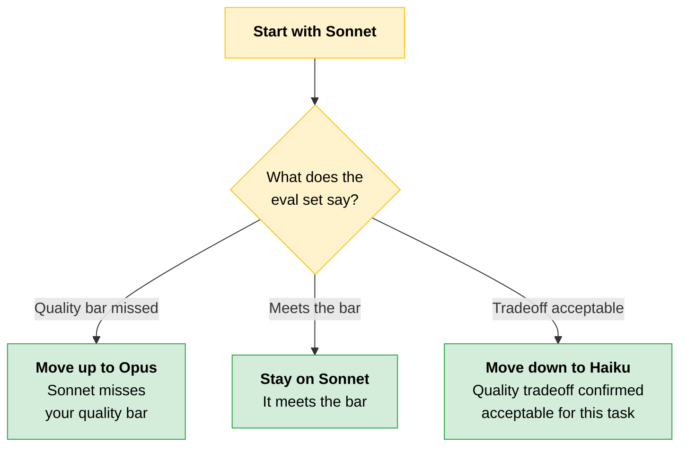
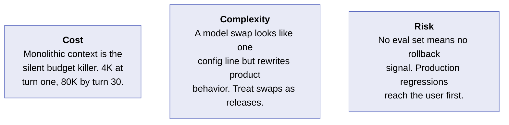
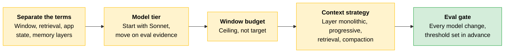

# Model, Context Window, and Context Strategy

By this point you have a [pattern](04-Choosing-a-Pattern.md) and a [reference architecture](06-Reference-Architectures.md), but not a shippable system. Three decisions remain, and each one determines what the same architecture costs at scale.

| Decision | What it determines |
|---|---|
| **Which model fits the task** | Capability against cost and latency, per call |
| **How much of the context window to actually use** | Whether you hit the working-memory cliff in production |
| **Progressive or monolithic context strategy** | How context reaches the model on every call |

These decisions compound across every request at production volume.

---

## Four Terms That Are Easy to Conflate

These terms get used interchangeably in practice. Conflating them produces reference architecture mistakes.

| Term | What it is | Who owns it |
|---|---|---|
| **Context window** | The model's active attention space | The model, per call |
| **Retrieval** | External knowledge fetched at query time | Your retrieval layer |
| **Persistent application state** | Order status, user records, account balances | Your system |
| **Summaries and memory layers** | Continuity across turns or sessions | Your application |

The context window is where reasoning happens. Everything inside it is available for reasoning; everything outside it doesn't exist to the model. It resets between calls unless your application explicitly manages continuity.

Retrieval augments the context window; it doesn't replace it. It pulls from a corpus the model doesn't hold in memory, and the model only sees what the retriever surfaces.

Persistent application state is owned and managed by your system, not the model. The model has no inherent access and requires a tool call to get it.

> **Testable distinction:** The model has no native memory between calls. Anything that persists across turns or sessions does so because your application stored it and passed it back in. Memory is an architectural choice, not a model capability.

---

## Model Selection: Start with Sonnet, Move Deliberately

The core Claude model family consists of **Opus**, **Sonnet**, and **Haiku**, each optimized for different cost, latency, and capability tradeoffs. Opus is the most capable of the three, suited for demanding reasoning, advanced coding, and research synthesis where Sonnet doesn't meet your quality bar.

> **Naming note:** Current Anthropic naming has since added a tier above Opus (Claude Fable 5, which appears in the thinking table below). The exam tests the Opus / Sonnet / Haiku framing, so learn that. Just recognize the family has grown past three tiers.

The default starting point is Sonnet. Every move away from it is gated by an eval set.



Move up to Opus only when an eval set tells you Sonnet isn't meeting your quality bar. Move down to Haiku only when an eval set confirms the quality tradeoff is acceptable for your specific task.

> **Rule of thumb:** Your decision to move models should always be measured, not reflexive.

---

## Context-Window Sizing: The Working-Memory Cliff

[Working memory](01-How-Claude-Behaves.md#working-memory) is the property with the hardest edge of the four. Inside the window, attention is available. Outside it, the model has no access at all. Things work until they don't, and then the transition is abrupt.

The context window is measured in **tokens**. How much text one token covers varies by model generation, tokenizer, and language, so treat any fixed characters-per-token ratio as a rough illustration, never a rule. Measure instead of estimating: every API response reports actual token counts in its `usage` field, and those measured counts are what the context limit and billing apply to.

Everything that enters the window is counted: your system prompt, the conversation history, retrieved documents, tool outputs, and the model's responses. This matters for two reasons. The window has a fixed token limit, and you're billed per token on every API call.

The practical implication is direct: do not budget the full window.

```
┌────────────────────────────────────────────┐
│  What to budget for                        │
├────────────────────────────────────────────┤
│    largest realistic conversation          │
│  + retrieved context                       │
│  + system prompt                           │
│  + working scratch                         │
│  + margin for growth                       │
├────────────────────────────────────────────┤
│  Total must sit well below the window      │
└────────────────────────────────────────────┘
```

> **The trap:** The context window is a ceiling, not a target. Designing towards the ceiling means you hit it in production.

---

## Context Strategy: The Spectrum from Monolithic to Progressive

Every production workload makes a choice, implicitly or explicitly, about how context reaches the model on each call. The choice sits on a spectrum between two poles: **monolithic** (everything in the prompt at once) and **progressive** (stage the context, load only what the next step needs). Two other patterns, retrieval and compaction, sit between the poles and show up often enough to treat as strategies in their own right.

| Strategy | In one line | Reach for it when |
|---|---|---|
| **Monolithic** | Load the full required context into a single prompt | Bounded tasks with predictable input size |
| **Progressive** | Carry forward only what the next step needs | Most production workloads. The right default. |
| **Retrieval (RAG)** | Fetch relevant chunks from an external store at query time | The corpus is too large to fit in context |
| **Compaction** | Periodically summarize or compress accumulated context | Long-running sessions that would hit the limit mid-task |

### Monolithic

**Where it earns its place:**

- Bounded tasks with predictable input size
- Stable prefixes that benefit from prompt caching
- Single-shot Q&A where retrieval latency isn't worth paying
- Reasoning that genuinely requires simultaneous access to all material

**Where it breaks down.** Conversations or tool loops where context accumulates turn over turn. Cost and latency scale linearly with input length. Attention quality can degrade on very long contexts well before the hard limit is reached.

### Progressive

**Where it earns its place:**

- Multi-turn dialogue and iterative refinement
- Agent loops where each step depends mainly on recent state
- Workflows that decompose into stages with narrow, well-defined handoffs

**Where it breaks down.** Tasks requiring long-range coherence across the full history, and decisions that depend on detail dropped in an earlier turn. Prompt caching is harder when carried-forward context mutates each turn. And the exact input the model saw at step N is no longer reconstructable, which complicates debugging.

### Retrieval (RAG)

**Where it earns its place:**

- Knowledge bases too large to fit in context
- Sources that change faster than the prompt is redeployed
- Domains where any single query needs only a small slice of available material
- Cases where source citation is a requirement

**Where it breaks down.** Queries requiring synthesis across many documents the retriever scores independently. Chunking that splits semantic units like tables, code blocks, or multi-paragraph arguments. Recall failures where the correct document never enters the top-k. And retrieval quality becomes a system you must evaluate and maintain.

### Compaction

**Where it earns its place:**

- Long-running agents and conversations where the full transcript is wasteful but recent state matters
- Phase transitions in multi-step workflows that can checkpoint to a clean summary
- Sessions that would otherwise hit context limits mid-task

**Where it breaks down.** Summaries drop load-bearing detail: exact identifiers, numeric values, prior decisions, edge cases mentioned once. The summarizer is itself a model call with latency, cost, and failure modes. Compaction is largely one-way, and measuring summary fidelity against the original transcript is an unsolved evaluation problem.

---

## In Practice, Strategies Combine

The four strategies are presented separately for learning clarity, but production systems almost always combine them. Each handles a different dimension of the context problem, so a well-designed system layers them deliberately rather than picking one.

A worked example, a long-running coding agent:

| Phase | What's happening | Strategy in play |
|---|---|---|
| **Session start** | Load the task description and the few files the user explicitly referenced | **Monolithic prefix.** Small, stable, loaded once. Ideal for prompt caching. |
| **Active work** | Each tool call (read file, run tests, edit) appends to the working context | **Progressive recent state.** The latest additions are what the next step needs. |
| **Discovery** | The agent realizes it needs a file it didn't load; searches the codebase, pulls in matches | **Just-in-time retrieval.** The corpus is too large to preload; only a relevant slice is fetched. |
| **Context filling** | Early exploration is taking up space; the conclusions matter, the verbatim tool outputs don't | **Compaction.** Summarize "what we tried and what we learned," keeping only what carries the work forward. |

No single strategy could carry this workload. Monolithic alone hits the context limit. Progressive alone has no way to surface code the agent didn't initially load. Retrieval alone loses the thread of what's been tried. Compaction alone has nothing to compact until other strategies have built up the trajectory.

When designing a context system, ask four separate questions:

| Ask | It drives |
|---|---|
| What does the model need at the start? | The monolithic baseline |
| What does it need from the most recent steps? | The progressive window |
| What might it need to fetch on demand? | The retrieval layer |
| What earlier material can be compressed without losing decision-relevant detail? | The compaction policy |

> **Exam trap:** Context strategy and context sizing are separate decisions that interact but don't determine each other. Treating them as one is where most context-management designs go wrong.

---

## What Extended Thinking Controls

**Extended thinking** is a per-request capability: the model works through the problem in a separate block of thinking tokens before it produces the final answer. The model reasons internally either way. What you're choosing is whether to spend tokens and latency on an expanded, billed reasoning pass.

How you control it has changed across model generations:

| Model | Control |
|---|---|
| Claude Opus 4.6 and later, Claude Sonnet 4.6 and later, Claude Sonnet 5 | **Adaptive thinking** with the `effort` parameter is the recommended control: you set how much reasoning effort to apply, not a token budget |
| Claude Fable 5 | Adaptive thinking is the only thinking mode |
| Claude Opus 4.6, Claude Sonnet 4.6 | The manual thinking-token budget (`budget_tokens`) is deprecated but still functional, as a transitional escape hatch |
| Claude Opus 4.7 and later, Claude Sonnet 5, Claude Fable 5 | `budget_tokens` is removed and returns a `400` error |

> **Note:** Model support changes. Verify against platform.claude.com at publish time.

The billing rules are exact and testable:

- Thinking tokens are billed as **output tokens** at the model's standard output rate, and generating them adds latency to the call.
- When extended thinking is not engaged, none of those tokens are generated and none are billed.
- The API may return a **summarized** representation of the thinking process rather than the full reasoning output. You are billed for the thinking tokens actually consumed during reasoning, not the length of the visible summary.

The decision rule is a cost and latency tradeoff. Run your evals without it first. If accuracy still isn't meeting your requirements after you've worked on the prompt itself, then consider enabling it.

> **Exam trap:** "It can't hurt" is the wrong reason to enable extended thinking. With it engaged you pay for thinking tokens and added latency on every call. The case for turning it on comes from a measured accuracy gap, or you're paying the cost with no proof it moves your accuracy metrics.

---

## Gate Every Model Change with an Eval

Any change to the model is a change to the system's behavior. A swap between two models is a code deployment and should be treated as such. At a minimum you need three things:

| Requirement | What it is |
|---|---|
| **Curated test set** | Prompts with known-good outputs, covering the real distribution of work the system sees |
| **Grading function** | Model-graded against a rubric, or programmatic where the check can be expressed in code |
| **Delta threshold** | Set in advance. Below it, you do not ship. |

> **The key:** Set the threshold before you run the eval. If you set it after, you are not setting a standard. You are writing the acceptance criteria after the build.

### Worked Case: A Sonnet to Haiku Downgrade, Done Well

A document-intelligence pipeline has been running on Sonnet for six months and has used its entire budget. The team wants to move to Haiku.

| Step | What the team did |
|---|---|
| **Build the eval set** | 250 representative documents with hand-validated extraction targets, stratified across the document types in production traffic. Sized so per-type scores stay meaningful, not just the overall average. |
| **Run both models** | Same document set, same grading rubric for every extraction. |
| **Read the regression signature** | Sonnet averages 0.94, Haiku 0.86. The variance concentrates in two document types, scoring 0.71 and 0.74. The rest come in within tolerance. |
| **Apply the pre-set criterion** | If any single document type drops below 0.85, the migration is rejected. Two types crossed the line, so the migration as proposed is rejected. |
| **Salvage** | Route those two document types to Sonnet via the existing classifier, and route the rest to Haiku. Cost drops materially without taking the regression. |

The takeaway is not the specific scores. The rollback criterion was decided before the data came in, so the team did not have to negotiate with itself when it arrived. And the stratified eval set surfaced a partial-migration option that a single overall score would have hidden.

---

## Scenario: Defaulting to Opus Everywhere

> [!CAUTION]
> **When the demo has to land and the partner is in the room, "use the best available model" is the smart-sounding answer.** It is also the path of least resistance during build: no eval set required, no choice to defend. Ninety days after launch, monthly cost is running at seven times the original modeling figure. Median latency on the user-facing path is 2.3 seconds against the 800-millisecond target the partner agreed to. Customer-satisfaction scores have not moved from the pre-launch baseline.
>
> Every call in the stack is using Opus. There is no per-step model selection in the architecture, because there was no per-step eval that would have made per-step selection necessary. Extended thinking is enabled on a routing classifier that needs no reasoning at all, adding measurable latency and cost to every request that passes through it.
>
> The team built an eval set retroactively, covering the work each pipeline step was actually doing. They routed the classifier to Haiku and confirmed no regression. They routed mid-pipeline summarization to Sonnet, no regression there either. They kept Opus on final response composition, the one place the eval said the higher tier earned its place. Monthly cost dropped 71%. Median latency dropped to 940 milliseconds. Satisfaction scores remained unchanged.
>
> **The lesson:** Not choosing a model is choosing the most expensive one. An eval set feels like extra work upfront, but it is the only thing that makes the model decision defensible.

Three failure mechanisms compounded, and each one is recognizable in advance:

| Mechanism | Why it compounds |
|---|---|
| **No model-tier decision in the architecture document** | "No decision" is itself an implicit decision, and the system defaults to the most expensive option. The absence of a deliberate choice is not neutral. |
| **Cost reviewed monthly, not during development** | The bill arrived weeks after launch, moving the cost conversation out of design and into change management. |
| **No eval set during the build** | When "use the best model" was proposed, the team had nothing to point to that would have grounded a different choice. The eval set is not just a release gate; it makes the tier decision defensible during design. |

> **Covered next:** Model selection and context strategy are two of the prompting-area levers. The other two, system-prompt design and prompt reuse, are in [Prompt architecture and reuse](09-Prompt-Architecture-and-Reuse.md).

---

## Cost, Complexity, Risk



**Cost.** Monolithic context is the silent budget killer. In a document-heavy pipeline, a conversation that starts with a 4,000-token prompt can be carrying 80,000 tokens by turn 30. Per-call cost grows with the conversation, and there is no visible signal until it shows up in billing.

**Complexity.** A model swap looks like a one-line configuration change, but it rewrites how the whole product behaves. Treat model swaps as releases.

**Risk.** No eval set means no rollback signal. A regression discovered in production is a regression that wasn't detected at all, because by the time you see it, the user already has.

---

## Quick Revision



| Concept | One-liner |
|---|---|
| **Context window** | The model's active attention space. Outside it, nothing exists. Resets between calls. |
| **Retrieval** | Augments the window, doesn't replace it. The model only sees what the retriever surfaces. |
| **Persistent application state** | Owned by your system. The model needs a tool call to reach it. |
| **Memory layers** | Application-managed continuity. An architectural choice, not a model capability. |
| **Model selection** | Start with Sonnet. Up to Opus or down to Haiku only on eval evidence. |
| **Working-memory cliff** | The hardest edge of the four properties. Works until it doesn't, then fails abruptly. |
| **Token counting** | Characters-per-token varies. Measure with the `usage` field, don't estimate. |
| **Window budgeting** | Largest realistic conversation, plus retrieval, system prompt, scratch, and margin. Ceiling, not target. |
| **Monolithic** | Everything in one prompt. Bounded tasks, stable cached prefixes. |
| **Progressive** | Carry forward only what the next step needs. The default for production. |
| **Retrieval (RAG)** | Fetch chunks at query time. For corpora too large or too fresh for the prompt. |
| **Compaction** | Summarize accumulated context. One-way, and fidelity is hard to measure. |
| **Layering** | Production systems combine all four deliberately. No single strategy carries a real workload. |
| **Strategy vs sizing** | Separate decisions that interact but don't determine each other. |
| **Extended thinking** | A billed, per-request reasoning pass. Enable only for a measured accuracy gap. |
| **Thinking billing** | Billed as output tokens actually consumed, not the visible summary length. |
| **Eval gate** | Test set, grading function, delta threshold. A model swap is a code deployment. |
| **Rollback criterion** | Set before the data comes in, so you never negotiate with yourself after. |

### Exam Traps

Cover the third column and quiz yourself.

| If you see... | The trap | The right call |
|---|---|---|
| "The window is 200K, so load everything" | Treating the ceiling as the target | Budget the largest realistic conversation plus margin. Designing to the ceiling means hitting it in production. |
| A new build proposing Opus on every step | "Use the best available model" | Start with Sonnet. Not choosing a tier is choosing the most expensive one. |
| "Enable extended thinking, it can't hurt" | Treating it as a free quality boost | It bills thinking tokens and adds latency on every call. Enable only for a measured accuracy gap, after working the prompt. |
| "Claude remembered the user from last session" | Crediting the model with memory | The model has no native memory between calls. Your application stored it and passed it back in. |
| A rollback threshold agreed after eval results arrive | Shipping because the average looks close enough | Set the threshold before the eval runs, or you're writing acceptance criteria after the build. |
| An overall eval average within tolerance | Approving the migration on one number | Stratify per type. A single score hides concentrated regressions and the partial-migration option. |
