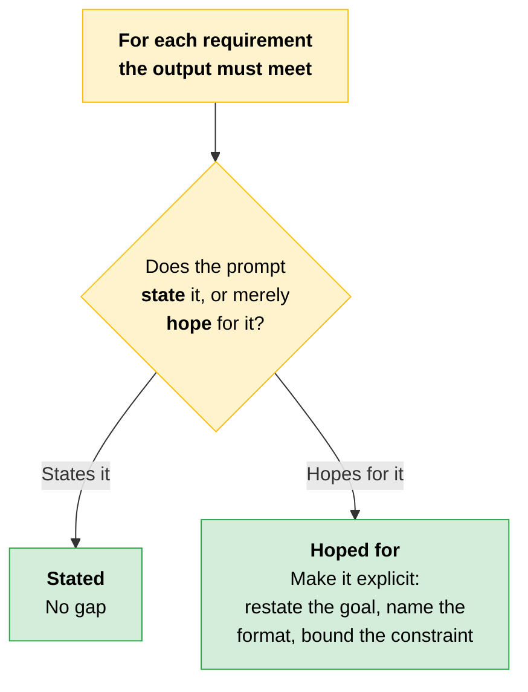
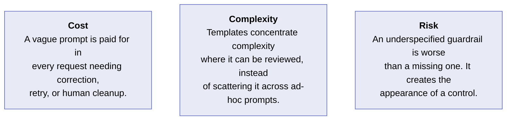
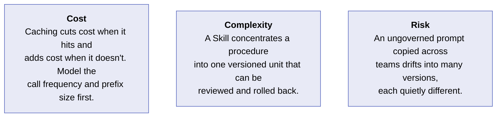
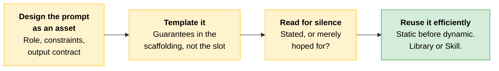

# Prompt Architecture and Reuse

[Model and context strategy](08-Model-Context-Window-and-Context-Strategy.md) covered choosing a model tier and a context strategy. The other major lever in that decision area is the prompt itself.

At enterprise scale the prompt is not a sentence you type. It is an asset you design: a system prompt, a reusable template, and the guardrails that keep both safe and consistent.

> **Scope:** This covers the first two of the three topics on prompting as an architectural discipline.

---

## System-Prompt Architecture for Enterprise Reuse

A system prompt for a one-off chat and a system prompt that hundreds of requests a day depend on are **different artifacts**. The enterprise version is designed for reuse, which means it has structure.

| Part | What it states |
|---|---|
| **Role and scope** | A clear statement of what the model is doing and what falls inside the job |
| **Constraints** | What the model must not do, and what it must always do |
| **Output contract** | The shape the response has to take |

> **The key:** When a system prompt is reused at scale, ambiguity is a defect multiplied across every request.

---

## Templates: Consistency and Safety, Enforced

A **template** is a system prompt with parameterized slots (the parts that change per request) and fixed scaffolding around them.

```
┌──────────────────────────────────────────────────────┐
│  FIXED SCAFFOLDING                                   │
│  role and scope, constraints, output contract        │
│  ┌────────────────────────────────────────────────┐  │
│  │  {{ slot }}   the variable content              │  │
│  │  {{ slot }}   supplied per request              │  │
│  └────────────────────────────────────────────────┘  │
│  FIXED SCAFFOLDING continues                         │
└──────────────────────────────────────────────────────┘
   The guarantees live in the scaffolding, never in the slot
```

The design goal is that the **fixed scaffolding carries the consistency and safety guarantees**, so that filling a slot cannot accidentally remove a constraint.

> **The key:** A well-designed template makes the safe path the default path. The person using it supplies the variable content and inherits the guardrails without having to re-author them.

---

## Description: The 4D Competency Applied to Prompt Design

**Description** is one of the four [AI Fluency competencies](../../Foundations/01-AI-Fluency-Framework-and-Foundations/README.md#2-description): the discipline of telling the model precisely what you want. Applied to prompt design, Description is what separates a prompt that works in a demo from one that holds in production.

A well-described prompt names three things.

| What it names | The question it settles |
|---|---|
| **The scope** | What is in and out of bounds |
| **The format** | The exact output contract |
| **The constraints** | The rules that must never be violated |

**Underspecification** is a gap the model fills with its own assumption, differently each time. It is the key failure to watch for.

### Diagnosing Underspecification Gaps

The architect's skill here is reading a prompt for **what it fails to say**. Where the prompt is silent, the model improvises, and improvisation is exactly the [non-determinism](01-How-Claude-Behaves.md#from-property-to-design-consequence) you do not want in a reused asset.



"Restate the goal alongside the instruction" is the same [steerability](01-How-Claude-Behaves.md#steerability) mitigation from the four properties, arriving here as a prompt-design technique.

> **Testable distinction:** A prompt-level constraint is not a guarantee. The source is blunt about it: *a constraint the model can quietly route around is not a constraint.* When a rule genuinely must not be skippable, that is what [Hooks](02-Platform-Map-and-Primitives.md#seven-primitives-seven-jobs) are for, deterministic code the model cannot bypass. Prompt guardrails raise the odds; hooks enforce.

### Cost, Complexity, Risk



**Cost.** A vague system prompt is paid for in every request that needs correction, retry, or human cleanup. Designing the prompt well once is far cheaper than diagnosing drift across thousands of calls.

**Complexity.** Templates concentrate complexity in one place where it can be reviewed and governed, instead of scattering it across ad-hoc prompts no one owns.

**Risk.** An underspecified guardrail is worse than a missing one, because it creates the appearance of a control without the substance. A constraint the model can quietly route around is not a constraint.

---

## Caching Mechanics an Architect Designs Around

Reusable prompts raise a question the one-off prompt never does: how do you reuse them efficiently, and how do you package them so a team can share and govern them?

### Case Study: A Cache That Never Hits

> [!CAUTION]
> **A team put their reusable analysis prompt into production and saw none of the cost savings caching was supposed to bring.** The cause was ordering. They had placed the per-request content, the document being analyzed, at the top of the prompt, ahead of the large fixed instruction block.
>
> Because the cache matches on a **stable prefix**, putting dynamic content first meant the prefix changed on every request and the cache never hit.
>
> **The fix:** reorder with fixed content first and dynamic content last.

```
   BROKEN                              WORKING
┌──────────────────────┐            ┌──────────────────────┐
│ {{ document }}       │  dynamic   │ large fixed          │
│                      │            │ instruction block    │
├──────────────────────┤            ├──────────────────────┤
│ large fixed          │            │  ← breakpoint →      │
│ instruction block    │            ├──────────────────────┤
└──────────────────────┘            │ {{ document }}       │
                                    └──────────────────────┘
  prefix changes every              prefix stable,
  request, cache never hits         cache hits
```

### The Four Mechanics

| Mechanic | What to design |
|---|---|
| **Cache breakpoints** | Caching works on a stable prefix. Mark the boundary between the fixed part (cacheable) and the variable part (not), and keep the fixed part genuinely fixed. |
| **Content ordering** | Static before dynamic, always. The large unchanging instruction block goes first, the per-request content after the breakpoint. |
| **TTL selection** | Match the cache lifetime to how often the fixed content actually changes and how frequently the prompt is called. Called constantly benefits from a longer-lived cache; called rarely may never amortize the write. |
| **When the write is not worth it** | Writing to the cache has its own cost. If a prompt is called infrequently or its fixed portion is small, caching can cost more than it saves. |

> **Exam trap:** Caching is a design decision, not a default to switch on everywhere.

This is the mechanism behind two claims in [file 08](08-Model-Context-Window-and-Context-Strategy.md#context-strategy-the-spectrum-from-monolithic-to-progressive): monolithic context earns its place partly on "stable prefixes that benefit from prompt caching," and progressive context makes caching harder "when carried-forward context mutates each turn."

---

## Modular Prompt Library or Skill?

There are two ways to make a prompt reusable across a team.

| | What it is |
|---|---|
| **Modular prompt library** | A shared collection of prompt fragments and templates that engineers assemble in their own code |
| **Skill** | A more formal, versioned, self-contained unit: a `SKILL.md` packaging the instructions, optional executable scripts, and version management, so the whole procedure travels as one governed artifact |

A Skill is the [reuse primitive](02-Platform-Map-and-Primitives.md#seven-primitives-seven-jobs) from the seven primitives, packaging a repeatable procedure, applied to prompting.

### The Reuse Decision

| Consideration | Lean toward a prompt library | Lean toward a Skill |
|---|---|---|
| **Repeatability** | An assembled, often-tweaked prompt per use | A stable procedure run the same way every time |
| **Distribution** | Shared within one codebase or team | Distributed across teams or products needing the same procedure |
| **Governance** | Lightweight, engineers own the fragments | Needs versioning, approval, and rollback, which Skills carry |

### Cost, Complexity, Risk



**Cost.** Caching can cut cost substantially when it hits and add cost when it does not. The economics depend on call frequency and prefix size, so model them before committing.

**Complexity.** A Skill concentrates a procedure into one versioned unit that can be reviewed and rolled back. A sprawl of copy-pasted prompts cannot.

**Risk.** An ungoverned prompt copied across teams drifts into many slightly different versions, each with its own quietly different behavior. Versioned reuse is the control.

---

## Quick Revision



| Concept | One-liner |
|---|---|
| **The prompt as an asset** | At scale it is designed, not typed. A system prompt, a template, and guardrails. |
| **System-prompt structure** | Role and scope, constraints, output contract. |
| **Ambiguity at scale** | A defect multiplied across every request. |
| **Template** | Parameterized slots inside fixed scaffolding. |
| **Guarantees live in the scaffolding** | Filling a slot must not be able to remove a constraint. |
| **Safe path is the default path** | The user supplies variable content and inherits the guardrails. |
| **Description** | The 4D competency: scope, format, constraints. What separates a demo prompt from a production one. |
| **Underspecification** | A gap the model fills with its own assumption, differently each time. |
| **Reading for silence** | For each requirement, does the prompt state it or merely hope for it? |
| **Underspecified guardrail** | Worse than a missing one. It looks like a control without being one. |
| **Cache breakpoint** | The boundary between the fixed cacheable prefix and the variable remainder. |
| **Static before dynamic** | Always. Dynamic content first means the prefix changes and the cache never hits. |
| **TTL selection** | Match cache lifetime to how often the fixed content changes and how often the prompt is called. |
| **When not to cache** | Infrequent calls or a small fixed portion. The write has its own cost. |
| **Prompt library** | Shared fragments engineers assemble in their own code. Lightweight governance. |
| **Skill** | A versioned, self-contained `SKILL.md` unit. For stable procedures distributed across teams. |
| **Prompt drift** | An ungoverned prompt copied across teams becomes many quietly different versions. |

### Exam Traps

Cover the third column and quiz yourself.

| If you see... | The trap | The right call |
|---|---|---|
| Caching enabled but no cost savings | Blaming the cache or the TTL | Check the ordering. Dynamic content ahead of the fixed block changes the prefix every request, so nothing hits. |
| "Turn caching on everywhere" | Treating it as a free default | The write has its own cost. Infrequent calls or a small fixed portion can cost more than it saves. |
| A strongly worded rule in a system prompt | Counting it as a guardrail | An underspecified guardrail is worse than none. If it must not be skippable, that is a hook, not a prompt line. |
| The same prompt copy-pasted across three teams | Treating it as reuse | That is drift. Versioned reuse, a Skill, is the control. |
| Choosing between a prompt library and a Skill | Picking by formality preference | Decide on repeatability, distribution, and governance needs. |
| "The prompt works in the demo" | Shipping it as a reused asset | Description first: does it name scope, format, and constraints? Where it is silent, the model improvises differently each time. |
