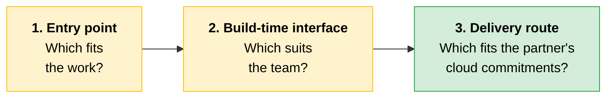
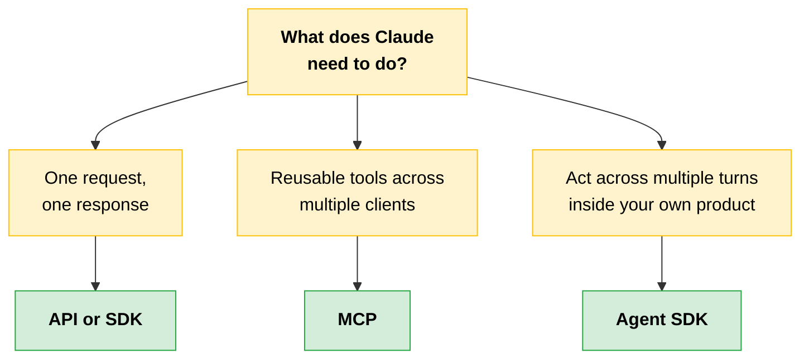
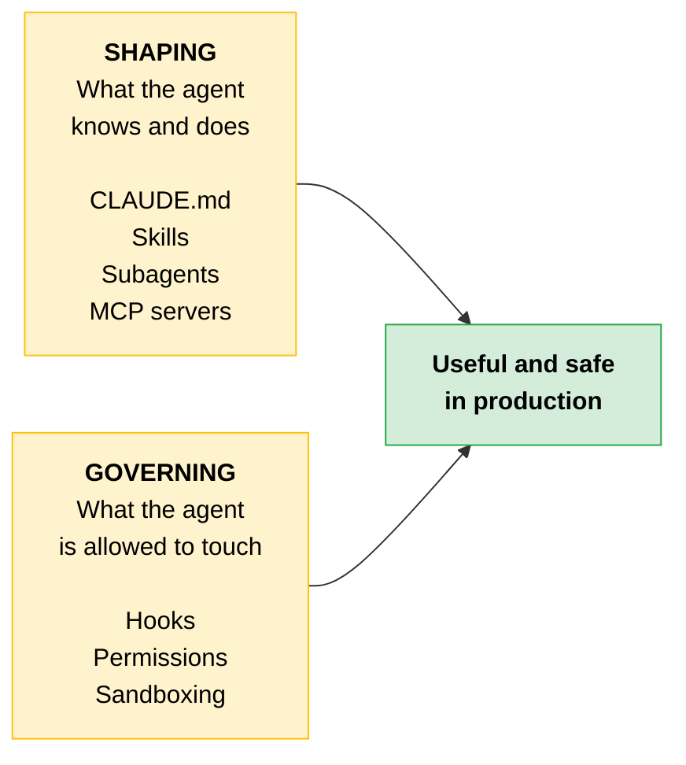
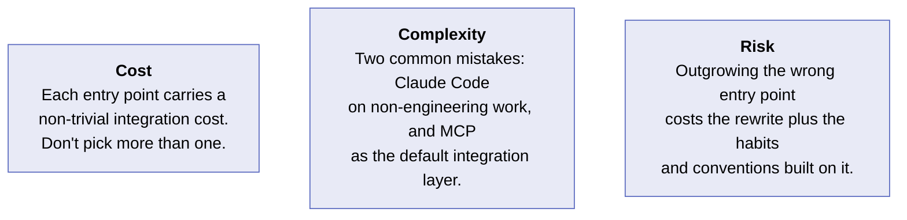
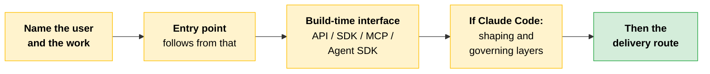

# Entry Points and Build-Time Interfaces

You have chosen the [model and context strategy](08-Model-Context-Window-and-Context-Strategy.md) and the [shape](04-Choosing-a-Pattern.md). Now choose how a partner consumes Claude. That is three separate decisions, made in sequence, and getting the order right prevents the most common architecture mistakes.

The [three layers](02-Platform-Map-and-Primitives.md#three-layers-three-distinct-decisions) were taught as vocabulary earlier. This is the selection work: choosing among them under real constraints. Decision 3 has its own section, in [delivery routes and regulated constraints](11-Delivery-Routes-and-Regulated-Constraints.md).

> **Before any of the three:** If the partner is subject to attorney-client privilege, HIPAA, GDPR, FedRAMP, or an internal data-residency policy, those constraints **rule entry points in or out before** cost, ergonomics, or build effort enter the conversation. That gate sits above this whole sequence, and Claude.ai is the entry point it eliminates most often. Run it first: [regulated-industry constraints](11-Delivery-Routes-and-Regulated-Constraints.md#regulated-industry-constraints).

---

## Claude Entry Points

An **entry point** is the wrapper that decides who can talk to Claude, what Claude can touch, and how much engineering the partner must do to get there. Think of them as the same intelligence packaged for different jobs.

> **The key:** Picking the wrong entry point does not break the work. It adds friction the partner will feel every day.

| Entry point | Audience | Core tradeoff |
|---|---|---|
| **Claude.ai** (web, mobile, desktop) | Knowledge workers, no code written | Zero build cost versus zero integration |
| **Claude Code** (terminal, IDE, desktop, web) | Engineers doing real development | Purpose-built for engineering |
| **Claude Cowork** (desktop) | Operations and admin roles needing actions on their machine | Real system actions versus supervision overhead |
| **Claude in Chrome** | Knowledge workers whose tasks live in web apps | (not stated) |
| **Claude for Excel** | Analysts and finance teams | (not stated) |

> **Verify before you build:** Beyond Claude.ai and Claude Code, Anthropic ships three entry points that extend Claude into specific applications or environments. Check current capabilities, supported configurations, and availability against Anthropic's documentation before building partner workflows on any of them.

### Claude.ai

The end-user chat product. A signed-in user opens a conversation, attaches files, uses **Projects** for shared context, and connects services like Slack, Outlook, or Google Drive through built-in connectors. The web app, the mobile app, and Claude Desktop all reach the same Claude.ai product.

This is the entry point for **applied AI users, not builders**: research, drafting, analysis, and review, with no code written.

It comes in consumer tiers (Free, Pro, Max) and in **Claude for Work**, which has two tiers of its own.

| Tier | What it adds |
|---|---|
| **Team** | Admin controls, SSO and SAML, domain capture, and a contractual commitment not to train on customer content |
| **Enterprise** | SCIM provisioning, configurable retention, audit logs, a Compliance API, and a HIPAA-ready option with a signed BAA |

**The tradeoff.** Zero build cost, but also zero integration: you get the product Anthropic ships, and you cannot embed it in another product or customize what gets exposed. The right tier depends on governance needs. Consumer tiers fit low-sensitivity work and individuals or small teams. Claude for Work fits organizations that need admin controls, SSO, and no-training commitments.

### Claude Code

An agentic coding tool that reads files, edits code, runs commands, and executes multi-step engineering tasks under configurable permission boundaries. It runs in a terminal, in IDE plugins (VS Code, JetBrains, others), on the desktop, and on the web at `claude.ai/code`. Same agent, wherever you work.

For engineers doing real development work: exploring codebases, refactoring across files, debugging, building features.

**The tradeoff.** Purpose-built for engineering. An outstanding option for code, and potentially the wrong shape for a customer-service product or any non-engineering workflow.

### Claude Cowork

A desktop agent for non-developers that works with local files and applications, automating file and task management on the user's machine under configurable permissions. Available on all paid plans (Pro, Max, Team, Enterprise) via the Claude Desktop app on macOS and Windows, with Linux support in beta.

For operations, admin, and other non-engineering roles that need Claude to take actions on their computer rather than just produce text in a chat window.

**The tradeoff.** Real system actions versus supervision overhead. Cowork operates on the user's machine directly, so permission scoping and human review matter more than they do in a chat-only entry point.

### Claude in Chrome

A browsing agent that operates inside the Chrome browser, navigating pages and taking actions on behalf of the user. For knowledge workers whose tasks are anchored in web applications rather than in files or codebases.

### Claude for Excel

A spreadsheet agent that operates inside Excel, working directly with cells, formulas, and structured data. For analysts, finance teams, and any role whose primary working tool is a spreadsheet.

---

## Build-Time Interfaces

Once the entry point is picked, the next decision is which programmatic layer the partner's code talks to.

> **The key:** The API, SDKs, MCP, and the Agent SDK are not alternatives to each other in every case. They **layer on one another**.

| Interface | What it is | Tradeoff |
|---|---|---|
| **Direct API** | The HTTP interface to Claude. The layer everything else sits on. | Maximum control versus maximum responsibility |
| **SDKs** | The same capability wrapped in language-native types and helpers | Ergonomics versus control |
| **MCP** | A protocol for exposing tools, prompts, and resources so any MCP-aware client can use them | Reusability across clients versus added architectural complexity |
| **Agent SDK** | A managed agent loop, the one that powers Claude Code, run from your own code | Managed loop versus custom orchestration |

### Direct API

A developer authenticates, sends a request with messages, a model name, and parameters, and gets a response back.

For teams building Claude directly into their own product. The partner's team owns everything: retries, streaming, tool use, observability, and the UI. It is the most foundational build-time interface, and the layer everything else sits on.

**Use it when** an SDK has not exposed a feature you need, or the team prefers raw HTTP.

### SDKs

Available in Python, TypeScript, Java, Go, Ruby, C#, and PHP. Same capability as the API, wrapped in language-native types and helpers that cut down on boilerplate: authentication, request formatting, retries, streaming, and tool-use plumbing in idiomatic code. **The agent loop, if any, is still the partner's code.**

The **default choice** for embedding Claude inside a product.

**The tradeoff.** SDK abstractions move at Anthropic's release cadence. If you need a raw API feature the SDK has not exposed yet, you drop back to HTTP anyway.

### MCP

An open protocol for exposing tools, prompts, and resources from one server, so any MCP-aware client (Claude.ai, Claude Code, the API, or a third-party client) can discover and use them.

> **The key:** MCP is not a calling convention for Claude in a single product. It is a **sharing convention across products**. Build the server once, connect it everywhere.

**Use it when** the same tool entry point is needed in two or more clients. If only one client will ever use it, MCP adds overhead without much payback.

The three capability types MCP exposes (tools, prompts, and resources, each controlled by a different party) are covered in [Foundations](../../Foundations/02-Building-with-the-Claude-API/07-Model-Context-Protocol.md).

### Agent SDK

Runs a managed agent loop, the same loop that powers Claude Code, from the partner's own application code. The package handles iteration, tool execution, and termination. Currently TypeScript (`@anthropic-ai/claude-agent-sdk` on npm) and Python (`claude-agent-sdk` on PyPI).

**Use it when** Claude needs to act over multiple turns inside the partner's own product, with the partner's application controlling the surrounding workflow, and the Claude Code CLI is the wrong shape. The common case is an internal agent embedded in a web app, not a terminal tool.

**The tradeoff.** The Agent SDK handles iteration and termination, but the partner gives up fine-grained control over the loop itself.

---

## Keeping These Terms Separate

Three pairs get conflated constantly. Each is a likely exam target.

### API and SDK: The Same Entry Point, Different Ergonomics

From Claude's perspective these are the same entry point. The SDK is an opinionated wrapper stacked over the API: language-native types, streaming and tool-use boilerplate handled, and the team works in their preferred stack rather than against raw HTTP.

The SDK is the default for most teams. **The only reason to drop to raw HTTP is a freshly shipped API feature that has not made it into the SDK yet.**

### MCP and API Tool Use: Different Layers, Not Alternatives

MCP is how a tool entry point is **exposed and discovered across multiple clients**. API tool use is how Claude **calls a tool inside a single request**. Under the hood, an MCP server exposes tools that any MCP-aware client calls using API tool use.

> **Testable distinction:** These are not alternatives. The choice is about reuse: MCP when one tool entry point must be reachable from multiple Claude clients, raw API tool use when the tools live inside one product only.

### Anthropic SDK and Agent SDK: One Wraps, One Runs

Partners and engineers use "SDK" for either, depending on context.

| | What it does |
|---|---|
| **Anthropic SDK** | A convenience wrapper over the API. Handles boilerplate. **Does not run an agent loop.** |
| **Agent SDK** | The managed runtime that **runs the loop**, the same one that powers Claude Code. The model picks a tool, runs it, sees the result, and keeps going until the task is done or a stop condition fires. |

The decision rule:

The three layers work together, not against each other.

---

## Claude Code: Customization and Governance Layers

Choosing Claude Code starts a second decision: which customization belongs at which layer. A **layer** here is a discrete configuration entry point controlling one aspect of how the agent thinks or acts. Each is independent, composable, and applied at a different point in the agent's execution.

The layers fall into two groups, and keeping them distinct is what makes an agent both useful and safe to run in production.

### Shaping: What the Agent Knows and Does

| Layer | What it does | When it belongs here |
|---|---|---|
| **CLAUDE.md** | A markdown file loaded into context at session start. Sets standing instructions, project conventions, and background knowledge. | Persistent context that applies to every task in the project: coding standards, repo layout, team conventions. |
| **Skills** | Markdown-defined procedures Claude Code invokes on demand rather than loading upfront, keeping the main context lean. | Repeatable workflows the team should not spell out each time: a commit-push-PR flow, a release-notes generator, a schema-migration procedure. |
| **Subagents** | Additional agents that carve out sections of a task, or isolated context-window helpers for bounded work like code review or codebase exploration that would otherwise clutter the main thread. | Work that should run with read-only tools, a restricted tool entry point, or a different system prompt from the main session. |
| **MCP servers** | External tools and data entry points connected over the standardized protocol. | When the same tool entry point needs to be reusable across clients, for example a team's Linear MCP server that should also work from Claude.ai. |

### Governing: What the Agent Is Allowed to Touch

| Layer | What it does | When it belongs here |
|---|---|---|
| **Hooks** | Scripts that fire on Claude Code lifecycle events (before or after a tool runs, at session start, on stop). | Deterministic gates the agent must not skip, where the guarantee has to come from code rather than from prompting. |
| **Permission boundaries and approval flows** | Six permission modes controlling what Claude Code can do without prompting. | Any environment where the cost of an unintended action is non-trivial. |
| **Sandboxing and restricted execution** | Containment around the workspace: filesystem boundaries, network egress rules, constrained command surfaces. | Any deployment where a wrong action would have real consequences and approval prompts alone are not a sufficient backstop. The environment should enforce the boundary, not just the agent's judgment. |

> **Testable distinction:** **Permissions** govern what the agent is allowed to touch. **Hooks** govern what must happen before or after an action. Different jobs, often confused.

#### The Six Permission Modes

| Mode | What it does |
|---|---|
| **Default** | Asks before each action. |
| **acceptEdits** | Approves file edits and common filesystem commands (`mkdir`, `touch`, `rm`, `mv`, `cp`, `sed`). Other Bash commands still prompt. |
| **Plan mode** | Locks the session to read-only until the user approves a plan. |
| **Auto mode** | A classifier approves safe actions and blocks risky ones. A research preview, working on all plans and admin-enabled on Team and Enterprise. Defaults to the Anthropic API as provider; an environment variable enables CSP providers. |
| **dontAsk** | Auto-denies anything that would prompt, and runs only what your allow rules cover. The mode for locked-down CI. |
| **bypassPermissions** | Skips all checks. Scoped to containers or CI only. |

---

## Skills as an Integration Mechanism

Skills are an integration mechanism, not only a packaging one. Beyond the [packaging role](09-Prompt-Architecture-and-Reuse.md#modular-prompt-library-or-skill), a Skill can be:

- attached to a request through the `container.skills` parameter
- published and versioned through the `/v1/skills` endpoint
- managed under version control like any other deployed asset

> **The trap:** Skills require the **Code Execution Tool** to run, so this integration pattern carries a sandboxed execution environment dependency. That is a real constraint, not a footnote.

When the integration decision is how a reusable procedure reaches Claude across entry points, a versioned Skill is one mechanism to weigh alongside MCP and direct tool use.

---

## Cost, Complexity, Risk

**Cost.** Each entry point carries a non-trivial integration cost. Do not pick more than one unless the partner's use case spans them.

**Complexity.** The two most common mistakes are reaching for Claude Code on non-engineering work, and treating MCP as the default integration layer regardless of whether the reusability it offers is needed. The entry point should follow the work, not precede it.

**Risk.** Outgrowing the wrong entry point is expensive, not just for the code that has to be rewritten, but for the conventions and user habits that built up around it. Starting over on a better entry point is cheaper than that, and starting on the right one is cheaper still.

---

## Case Study: When Claude Code Got Picked Outside Engineering

Claude Code makes a strong first impression. It executes complex, multi-step engineering tasks in a fraction of the time a developer would spend manually, and that capability is hard to unsee. The risk is reaching for it by default, when the work does not require it and a simpler integration would be sufficient.

[File 02 introduced this scenario](02-Platform-Map-and-Primitives.md#scenario-collapsing-the-layers) in one line. Here is the full architecture.

### The Proposed Architecture

A regional bank wanted an "operations assistant" for branch staff. The work: look up customer balances, schedule appointments, answer policy questions. Three components were proposed, and each drew an annotation.

| Proposed | The annotation |
|---|---|
| **Claude Code on branch laptops**, with a per-branch `CLAUDE.md` encoding local conventions | An engineering entry point for an operational workflow. Branch staff do not run terminals, so the entry point is mismatched with the user. |
| **MCP servers** for the customer database, appointment system, and policy corpus | MCP earns its place only when reused across clients. No other Claude clients existed in this bank. |
| **Subagents** running compliance checks on every interaction, with their own restricted tool entry point | Compliance assigned to the weakest deterministic guarantee. A high-consequence path should not run on subagents, which give weaker guarantees than server-side code. |

### The Architecture That Fits

A custom web application calling the API directly.

- Compliance lives in **deterministic server-side code**, where the guarantees are explicit rather than emergent
- The UI is authenticated via the bank's SSO and fits a banking workflow, not a developer workflow
- Tool calls are audited at the server boundary

That architecture was the right answer from screen one.

### Three Failure Mechanisms

| Mechanism | What went wrong |
|---|---|
| **The entry point was chosen before the user was named** | Branch staff need an interface that fits a banking workflow. That constraint should have determined the entry point before any other decision. |
| **MCP was carried forward from a prior project** | The reusability argument that justifies MCP did not apply. No other Claude clients in the bank would consume the same tool entry point, so the protocol layer paid integration cost for a capability nobody needed. |
| **The highest-consequence path got the weakest guarantees** | Compliance was assigned to the layer furthest from code-level certainty. The pattern was inverted. |

> [!CAUTION]
> **The lesson:** Entry point choice should follow the user and the work. Reaching for Claude Code or MCP just because the last project used them is paying for capabilities the partner does not need.

---

## Quick Revision

| Concept | One-liner |
|---|---|
| **Entry point** | The wrapper deciding who talks to Claude, what Claude can touch, and how much engineering it takes to get there. |
| **Order of the three decisions** | Entry point, then build-time interface, then delivery route. Order prevents the common mistakes. |
| **Claude.ai** | The end-user chat product. Applied AI users, not builders. Zero build cost, zero integration. |
| **Claude for Work tiers** | Team adds admin controls, SSO/SAML, domain capture, no-training commitment. Enterprise adds SCIM, retention config, audit logs, Compliance API, HIPAA-ready with a BAA. |
| **Claude Code** | Agentic coding across terminal, IDE, desktop, and web. Same agent, wherever you work. |
| **Claude Cowork** | Desktop agent for non-developers, acting on local files and apps. Supervision overhead is the tradeoff. |
| **Claude in Chrome / for Excel** | Browsing agent and spreadsheet agent, for work anchored in web apps or spreadsheets. |
| **Direct API** | The foundational layer everything else sits on. Maximum control, maximum responsibility. |
| **SDKs** | Seven languages. Same capability, language-native ergonomics. The agent loop is still your code. |
| **MCP** | A sharing convention across products, not a calling convention within one. Build once, connect everywhere. |
| **Agent SDK** | Runs the Claude Code loop from your own application code. TypeScript and Python. |
| **API vs SDK** | The same entry point, different ergonomics. Drop to HTTP only for a feature the SDK lacks. |
| **MCP vs API tool use** | Different layers. MCP exposes across clients; API tool use calls within a request. |
| **Anthropic SDK vs Agent SDK** | One wraps the API, one runs the loop. |
| **Shaping layers** | CLAUDE.md, Skills, Subagents, MCP servers. What the agent knows and does. |
| **Governing layers** | Hooks, permissions, sandboxing. What the agent is allowed to touch. |
| **Permissions vs Hooks** | Permissions govern what it may touch. Hooks govern what must happen before or after. |
| **Six permission modes** | Default, acceptEdits, Plan, Auto, dontAsk, bypassPermissions. |
| **Skills as integration** | `container.skills`, the `/v1/skills` endpoint, version control. Requires the Code Execution Tool. |

### Exam Traps

Cover the third column and quiz yourself.

| If you see... | The trap | The right call |
|---|---|---|
| Claude Code proposed for a non-engineering workflow | "It's the most capable option" | Entry point follows the user and the work. Branch staff do not run terminals. |
| MCP proposed with one consuming client | Treating MCP as the default integration layer | MCP earns its place on reuse across clients. One client means overhead with no payback. |
| A high-consequence check assigned to subagents | Trusting the agent layer with the guarantee | Deterministic server-side code, audited at the server boundary. Subagents give weaker guarantees than code. |
| "Use the SDK or the Agent SDK?" | Treating them as the same thing | The Anthropic SDK wraps the API. The Agent SDK runs the loop. One request means SDK; multi-turn in your product means Agent SDK. |
| A rule that must never be skipped, set in `CLAUDE.md` | Putting a guarantee in a shaping layer | That is a governing layer's job. Hooks fire deterministically; CLAUDE.md is context. |
| A Skill chosen as the integration mechanism | Missing its dependency | Skills require the Code Execution Tool, so the pattern carries a sandboxed execution environment. |
