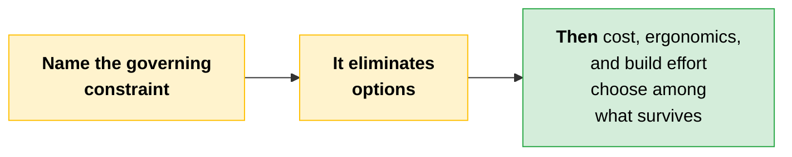
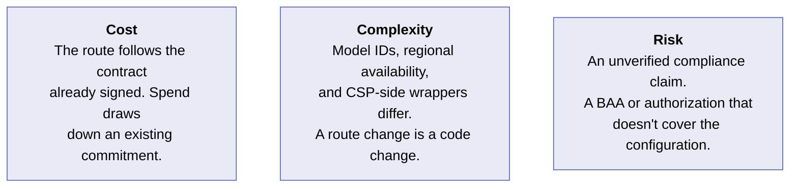
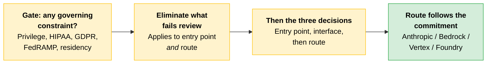

# Delivery Routes and Regulated Constraints

[Entry point and build-time interface](10-Entry-Points-and-Interfaces.md) are decisions one and two. One more sits underneath: where does the API traffic terminate?

The same Claude model is available through four delivery routes. What differs is which cloud account the spend lands in, which identity system handles authentication, which region the traffic terminates in, and which procurement contract the partner has already signed.

> **The key:** The decision rule is not about technical capability. The model behaves the same way on each route. The rule is about **what the partner has already committed to.**

---

## The Four Delivery Routes

| Route | Billed on | Authenticated by | Pick when |
|---|---|---|---|
| **Anthropic first-party** | Anthropic | An Anthropic API key | No binding cloud commitment, or newest features matter most |
| **AWS Bedrock** | The partner's AWS account | IAM | A committed AWS enterprise agreement |
| **GCP Vertex AI** | The partner's GCP project | Google Cloud credentials | The ML stack already lives in Vertex |
| **Microsoft Foundry (Azure)** | The partner's Azure subscription | Entra ID | A Microsoft enterprise agreement, identity via Entra ID |

If the partner already has a long-term AWS contract, Bedrock is usually the easiest path: the AI spend falls under an agreement they already have, and IAM works as-is. The same logic applies to Vertex on GCP and Foundry on Azure. If the partner lives in that cloud, use that route.

> **The tradeoff:** CSP-mediated routes (Bedrock, Vertex, Foundry) tend to lag the first-party API on new features by weeks, sometimes longer for major capabilities.

### Anthropic First-Party

The direct Anthropic API at `api.anthropic.com`, billed by Anthropic, authenticated with an Anthropic API key. SDKs in Python, TypeScript, C#, Java, Go, PHP, and Ruby wrap this entry point.

The **default choice** when no procurement constraint is pulling the other way: no binding cloud commitment, wanting the newest features the day they ship, or preferring to consolidate AI spend directly with Anthropic.

### AWS Bedrock

Claude served as a managed model on AWS. Called via the Messages API at `/anthropic/v1/messages` on AWS-managed infrastructure, billed on the partner's AWS account, authenticated through IAM. The previous Bedrock Runtime integration (`InvokeModel` / `Converse` via boto3 or the AWS SDK) remains available as the documented legacy path.

Regional availability matters, and **inference profiles** solve the cross-region routing problem.

Pick it when the partner has a committed AWS enterprise agreement, runs the rest of their stack on AWS, and wants AI spend to draw down against that commitment. Identity, networking, and audit all inherit from the existing AWS account.

### GCP Vertex AI

Claude served as a managed model in Google Cloud's **Vertex AI Model Garden**. Called via the Anthropic Vertex client or Google's SDK, billed on the partner's GCP project, authenticated with Google Cloud credentials. Models are enabled per project in the Model Garden console.

Pick it when the partner runs on GCP, the rest of their ML stack lives in Vertex AI, and they want a single billing and audit entry point across foundation models.

### Microsoft Foundry (Azure)

Claude served through Microsoft's Foundry catalog on Azure. Billed on the partner's Azure subscription, authenticated through Entra ID, deployed into the partner's Azure region. Foundry consolidates AI procurement on the same paper as the rest of their Microsoft estate.

> **Exam trap:** Foundry offers Claude in **two hosting forms**, and they have different compliance implications.
>
> | Hosting form | Where inference runs |
> |---|---|
> | **Hosted on Azure** (generally available) | The partner's Azure environment. As of writing: Opus 4.8, Sonnet 5, Haiku 4.5. Verify the current list. |
> | **Hosted on Anthropic infrastructure** | Anthropic-managed infrastructure, for the other models |
>
> Partners with strict data residency or GDPR requirements must verify the hosting form and compliance posture of the specific models they deploy before committing to this route.

> **Currency note:** Current Anthropic naming adds a fifth route not covered above: **Claude Platform on AWS**, which is Anthropic-operated with same-day API parity, billed through AWS and authenticated with SigV4/IAM. It is distinct from Amazon Bedrock, which is AWS-operated with a feature subset and `anthropic.`-prefixed model IDs. Learn the four routes above for the exam, and recognize that "AWS route" now means two different things.

---

## What Does Not Change Across Routes

The Claude model itself is the same regardless of route. **Prompting, evaluation strategy, tool use, and context-window behavior all transfer.**

What changes is the wrapper.

| What differs | Why the architect cares |
|---|---|
| **Model identifiers and version strings** | They differ across routes, so a route change is a code change |
| **Regional availability** | Differs per route, and drives residency conversations |
| **CSP-side features wrapping inference** | Inference profiles on Bedrock, model deployments in Foundry, Model Garden access controls in Vertex |

Those CSP-side concepts are ones the architect needs to know exist, even when the partner's engineering team owns the implementation.

---

## Regulated-Industry Constraints

Some entry point decisions are not at your discretion. When a partner is subject to attorney-client privilege, HIPAA, GDPR, FedRAMP, or an internal data-residency policy, those constraints rule entry points in or out **before** cost, ergonomics, or build effort enter the conversation.

**Claude.ai is the entry point this hits most often.** The consumer-grade product was not designed to satisfy every enterprise data-handling requirement out of the box. The API and SDK, routed through a partner-approved gateway with logging, retention, and identity controls in the partner's own infrastructure, are the entry points that survive most regulated reviews.

> **The key:** Name the governing constraint when you recommend an entry point, and let the constraint eliminate options before preferences do.

| Constraint | What it tends to rule out | What usually survives review |
|---|---|---|
| **Attorney-client privilege** | Consumer tiers of Claude.ai for privileged document review, and anything touching privileged material through a surface the firm cannot audit end to end. Claude for Work adds admin controls and audit logging, but the firm still has to confirm the configuration meets its own privilege-handling bar. | API or SDK behind the firm's own application, authenticated via SSO, routed through a firm-approved LLM gateway that logs every request. The firm owns the audit trail end to end, which is what privilege review turns on. |
| **HIPAA (PHI handling)** | Any entry point where a Business Associate Agreement is not in place **for the specific configuration in use**. A BAA covering one configuration does not extend to another. | API or SDK on a BAA-covered configuration via the delivery route already in use. BAA existence is not sufficient, because feature eligibility matters: beta features are generally excluded from BAA coverage unless explicitly listed as eligible. |
| **GDPR and data residency** | Delivery routes where the region of model execution cannot be pinned, and routes where data leaves the approved geographic boundary at any step. | A CSP-mediated route (Bedrock or Vertex) with the region pinned to a covered jurisdiction and DPA terms inherited from the existing cloud contract. Check Foundry specifically: its residency guarantees need verification against current documentation. |
| **FedRAMP / government** | Any path not on an authorized cloud environment at the required impact level. | Claude for Government (C4G) for FedRAMP High civilian workloads. Bedrock GovCloud for FedRAMP High and DoD IL4/5. Vertex Assured Workloads for FedRAMP High and IL2. |
| **Internal data-residency policy** | Routes outside the partner's approved cloud vendor list, regardless of underlying technical capability. | The delivery route on the partner's approved CSP. This is procurement, not engineering: the right route is whichever one their CIO has already cleared. |

> **Exam trap:** Two "it exists, therefore we are covered" errors sit in that table. A **BAA** covering one configuration does not extend to another, and beta features are generally outside BAA coverage. **Authorized government environments run on a model lag**, so the newest Claude models reach GovCloud and Assured Workloads after commercial release. Confirm which model the route actually offers.

> **Verify before committing:** Always confirm current authorization scope for each of these constraints with Anthropic.

> **Covered later:** [Module 3](../03-Responsible-AI-Safety-and-Risk-for-Architects/) goes deep on guardrail design, data handling, and the full regulated-industry framework. The job here is narrower: surface the constraint at the point in the design conversation where it eliminates options, which is right at the entry point and delivery-route decision.

---

## Cost, Complexity, Risk

**Cost.** The route mostly follows the paper the partner has already signed. Picking the CSP they are committed to lets AI spend draw down an existing commitment rather than opening a new line.

**Complexity.** Model identifiers, regional availability, and CSP-side features that wrap inference all differ. A route change is a code change, not a configuration toggle.

**Risk.** The dangerous move is an unverified compliance claim: assuming a BAA, an authorization, or a residency guarantee covers the configuration actually in use. Feature eligibility and hosting form both matter, and both need checking.

---

## Quick Revision

| Concept | One-liner |
|---|---|
| **Delivery route** | Where API traffic terminates: whose cloud account, identity system, region, and contract. |
| **The decision rule** | Not technical capability. The model is the same on every route. It is what the partner has already committed to. |
| **Anthropic first-party** | `api.anthropic.com`, Anthropic API key, Anthropic billing. Default with no procurement constraint. |
| **AWS Bedrock** | Messages API at `/anthropic/v1/messages`, IAM auth, AWS billing. `InvokeModel`/`Converse` is the legacy path. |
| **Inference profiles** | The Bedrock mechanism that solves cross-region routing. |
| **GCP Vertex AI** | Vertex AI Model Garden, GCP credentials, per-project model enablement. |
| **Microsoft Foundry** | Azure subscription billing, Entra ID auth, partner's Azure region. |
| **Foundry's two hosting forms** | Hosted on Azure (inference in the partner's environment) or hosted on Anthropic infrastructure. Different compliance implications. |
| **The CSP feature lag** | Bedrock, Vertex, and Foundry trail the first-party API by weeks, longer for major capabilities. |
| **What transfers across routes** | Prompting, evaluation strategy, tool use, context-window behavior. |
| **What differs across routes** | Model identifiers, regional availability, and CSP-side wrappers around inference. |
| **Constraint before preference** | Regulated constraints eliminate options before cost or ergonomics choose among them. |
| **BAA scope** | Covers a specific configuration, not the partner generally. Beta features are generally excluded. |
| **Government model lag** | GovCloud and Assured Workloads get new models after commercial release. |
| **Residency** | Pin the region, inherit DPA terms from the cloud contract, and verify the hosting form. |

### Exam Traps

Cover the third column and quiz yourself.

| If you see... | The trap | The right call |
|---|---|---|
| "Which route is technically better?" | Comparing capability | The model behaves the same on every route. The rule is the partner's existing cloud commitment. |
| "We hold a BAA, so HIPAA is covered" | Treating the BAA as blanket | A BAA covers a specific configuration. An uncovered route is ruled out, and beta features are generally excluded. |
| A FedRAMP workload needing the newest model | Assuming parity with commercial | Authorized government environments run on a model lag. Confirm which model the route offers. |
| Foundry proposed for a GDPR-bound workload | Treating Foundry as one thing | It has two hosting forms, and only one runs inference in the partner's Azure environment. Verify which, per model. |
| A residency requirement | Assuming any route can be pinned | Rule out routes where the region of model execution cannot be pinned. Bedrock or Vertex with the region pinned and DPA terms inherited from the cloud contract survives review. Check Foundry's hosting form specifically. |
| A route change treated as a config toggle | Assuming portability | Model identifiers and regional availability differ. Prompting and evals transfer; the wrapper does not. |
