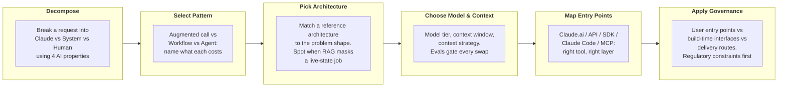

# Claude Platform & Solution Design

Master the design decisions that translate an ambiguous business problem into a defensible Claude solution architecture.

**Status:** Done

---

## Four Key Decisions

Before you build anything, you make four decisions:

| # | Decision | What you're answering |
|---|----------|-----------------------|
| 01 | What part of the work should Claude own? | What goes to Claude, what stays with existing systems, what stays with a human |
| 02 | What shape is the work? | Augmented call, automated workflow, or autonomous agent |
| 03 | Can you name the reference architecture? | Pick a known blueprint upfront or risk expensive pivots later |
| 04 | Where does your work interact with Claude? | Entry point, model, and context strategy that keep it working and cost-conscious |

---

## Learning Objectives

| Objective | One-liner |
|-----------|-----------|
| **Decompose** | Split work across Claude, existing systems, and humans using the four AI properties |
| **Select Pattern** | Pick augmented call, workflow, or agent and name the cost of each |
| **Pick Architecture** | Match a reference architecture to the problem. Catch retrieval doing a live-state job |
| **Choose Model & Context** | Defend your model tier, context window, and context strategy. Evals gate every swap |
| **Map Entry Points** | Know which entry point fits (Claude.ai, API, SDK, Claude Code, MCP) and what belongs at each layer |
| **Apply Governance** | Separate user-facing entry points, build-time interfaces, and delivery routes. Regulatory constraints rule first |
