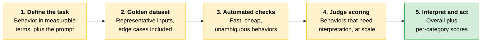
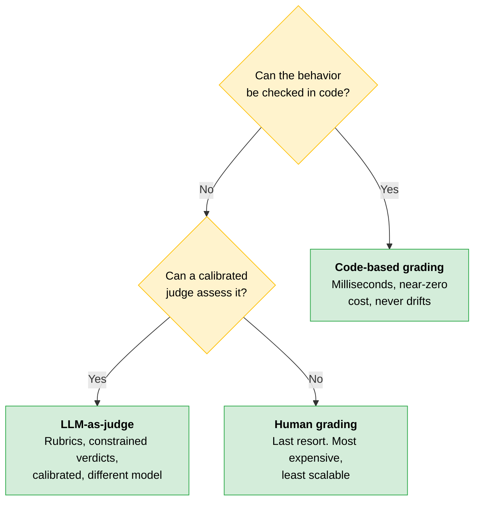
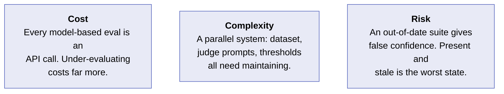
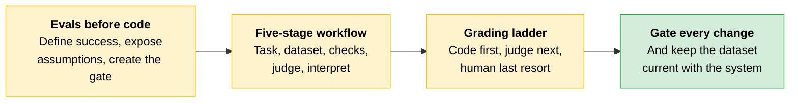

# Evals as Acceptance Criteria

[Module 1](../01-Claude-Platform-and-Solution-Design/README.md) gave you architecture decisions: patterns, integration points, and how your system should respond to different inputs. What you don't have yet is confidence that those decisions hold when the inputs are real and the users are unpredictable.

**Evals**, short for evaluations, are structured tests that check whether your system returns the expected and accurate output. They let you test your system's behavior before it goes to production or after model updates, so you discover problems before your users find them for you.

---

## Evals Before Code: Why the Order Matters

The definition sounds straightforward. The timing is what matters. The standard approach is to build the system, see if it looks right, and conduct tests later. Writing your eval suite before you write production code forces three things that are otherwise easy to defer:

| Forces you to... | Why it pays off |
|---|---|
| **State what success means** in measurable terms | No arguing later about whether the system "works" |
| **Expose design assumptions early** | Changing them is still cheap |
| **Give yourself a gate** | A model swap, prompt change, or new retrieval strategy can be shown to measurably improve the system |

An eval suite belongs at the beginning of your build, not at the end as a QA step.

> **The key:** If you cannot write an eval for a behavior, you have no reliable way to measure whether that behavior is present. Every change you make to the system becomes unverifiable.

---

## The Eval Workflow: Five Stages

A well-constructed eval workflow runs sequentially. Each stage produces an artifact that feeds the next.

| Stage | What happens | Artifact produced |
|---|---|---|
| **1. Define the task** | State the behavior you are evaluating in specific, measurable terms, and write the prompt you will test with | Task specification with prompt and pass criteria |
| **2. Build the golden dataset** | Assemble the inputs your system will encounter, including edge cases and counterexamples | Labeled dataset with expected outputs |
| **3. Run automated checks** | Pass each prompt through the system and compare output against the expected result programmatically | Pass/fail record per item |
| **4. Score with a judge** | A model-based judge assesses outputs that require interpretation | Score per item, with reasoning |
| **5. Interpret and act** | Aggregate scores show where the system is and whether a change moved it the right way | Overall score, per-category breakdown |

Two stages carry hidden quality requirements. In stage 1, a vague definition produces a vague eval: the concreteness of both the behavioral specification and the prompt is what makes the result meaningful. In stage 2, if the dataset is not representative, the scores are not meaningful.

Automated checks belong to behaviors that are unambiguous: format compliance, schema validation, and factual lookups against authoritative data. The judge handles tone, accuracy of reasoning, and appropriateness of edge-case responses.

> **The trap:** A change that raises the mean score while quietly degrading performance on edge cases or adversarial inputs doesn't make the system better. Read the per-category breakdown, not just the average.

---

## Three Eval Types: Code-Based, Model-Based, Human-Review

Some behaviors have a single correct answer: the output is valid JSON, or it isn't. Others, like tone or style, need interpretation. The three eval types trade speed against flexibility, and choosing the right one per behavior protects both accuracy and cost.

| Eval type | How it works | Cost |
|---|---|---|
| **Code-based** | A function checks the output programmatically | Very low: milliseconds per check, no API call |
| **Model-based** | A judge model scores the output against a rubric | Medium to high: one API call per item, at the judge model's per-token rate |
| **Human-review** | A human evaluator scores against a rubric or annotates freely | High: human time, limited throughput |

### Code-Based Evals

Schema validation, regex match, JSON parse, length check, assertion against authoritative data. Use them for any behavior that is unambiguous: format compliance, schema correctness, lookup accuracy, length constraints.

**Limitation.** A function cannot supply judgment. Tone, helpfulness, reasoning quality, and edge-case appropriateness are out of reach.

### Model-Based Evals

The judge model receives the original prompt, the system output, and a scoring rubric, and returns a score with reasoning. Use them for any behavior that requires interpretation: response quality, instruction following, reasoning accuracy, safety, and handling of ambiguous inputs. At scale, the per-item API cost adds up.

**Limitation.** Judge models can be inconsistent in borderline cases. Without forcing the judge to produce reasoning alongside the score, that inconsistency is difficult to detect.

> **Tip:** The judge prompt is itself a prompt that needs to be engineered and tested.

### Human-Review Evals

Structured (a scoring sheet) or unstructured (open annotations and feedback). Use them for high-stakes or novel behaviors where neither a function nor a judge model can be trusted: safety-critical edge cases, new capability areas without established rubrics, or any output where a wrong evaluation carries significant risk. Also useful for calibrating and validating model-based evals.

**Limitation.** Slow, expensive, and not scalable beyond sampled subsets. Human evaluators introduce their own inconsistency.

---

## The Grading Ladder

Not every behavior should be graded the same way. Reach for the cheapest reliable method first and climb only when the behavior demands it.

If a behavior can be checked in code, it should be. When you do climb to LLM-as-judge, make the judging rigorous:

- Detailed rubrics
- **Constrained verdicts**: a small fixed set of labels rather than free-form scores
- Calibration against human-labeled examples
- Grading with a *different* model than the one whose outputs you're evaluating, to avoid self-preference

Reserve human review for high-stakes or novel behaviors where neither code nor a calibrated judge is trustworthy yet.

### Judge Calibration: The Step Many Teams Skip

An LLM judge is itself a system that can be wrong. Before you trust its verdicts, calibrate it: run it against a set of human-labeled outputs and confirm its agreement with human judgment is high enough to rely on.

> **The trap:** An uncalibrated judge produces confident scores that may not be high quality at all. That is worse than no automated grade, because it *seems* trustworthy.

Favor volume over perfection. Many automatically gradable cases beat a handful of manually graded ones: broad, cheap coverage catches more regressions than a small, painstaking set, and it can run on every change.

---

## Defining Success Criteria

A business requirement like "summarize claims accurately" does not tell you what to measure. Turning it into an eval criterion takes four steps, shown here on a claims-processing example:

| Step | Applied to the claims example |
|---|---|
| **Identify the behavior specifically** | "Summarize claims accurately" becomes "extract the filer's name, claim number, incident date, and claimed amount from each document" |
| **Set the threshold** | 100% accuracy on structured fields, under 2% hallucination rate, response within schema 99.5% of the time |
| **Identify the failure modes** | A fake claim number, a missing incident date, a value from the wrong claim. Each failure mode becomes a category in your eval dataset |
| **Include adversarial inputs** | Documents with missing fields, handwritten sections, unusual formatting, non-standard layouts |

The threshold numbers come from the business requirement. Don't just choose what your first prototype happens to achieve. Guidance on setting eval thresholds lives at *platform.claude.com/docs/en/test-and-evaluate/develop-tests*.

> **The trap:** If your golden dataset contains only clean inputs, your eval scores will not predict production performance.

---

## Evals as the Gating Mechanism for Change

Every change to a production Claude system runs through the eval suite during development, before it moves to production. Model swap, prompt revision, context strategy change, retrieval configuration update: all of them. This is the only reliable way to know whether a change improved the system.

### Multi-Turn Evals Are a Separate Category

A single-turn eval set will not tell you how the system holds up across a conversation. Multi-turn evals score the system over a sequence of exchanges rather than a single prompt and response, checking:

- Whether the system keeps prior context straight across turns
- Whether it answers a follow-up without inventing details that were never said earlier
- Whether output quality holds as the conversation runs longer

Because the unit being scored is a whole conversation, this category needs its own golden dataset: full conversation transcripts with known high-quality responses at each turn, covering the follow-ups, topic shifts, and conversation lengths the system will see in production.

### Keep the Eval Set Current

A team building a document summarization workflow revised their summarization prompt but did not update their eval suite to match. The suite passed all required checks. Two days after the change went to production, field reports showed multi-clause legal sentences being truncated in summaries. The root cause: the eval set predated the prompt change and didn't match the behavior that changed.

> **Exam trap:** A passing eval suite that predates a change is measuring the old system. Run evals before every change, and keep the eval set current with the system it is measuring.

---

## Scenario: The Eval Suite That Measured the Wrong Thing

> [!CAUTION]
> **When a demo is working, declaring it "good enough" feels like a reasonable call.** Manual spot-checks take time, and the system seems to respond correctly on every input tested. The problem is that teams can only test inputs they thought of. Production surfaces the rest.
>
> A team built a contract review assistant for a professional services firm (this is a composite postmortem of a pattern that appears repeatedly in field deployments). They manually tested the assistant against ten contracts their team knew well, declared the system ready, and moved to production. The regression arrived two weeks later: the system was failing on contracts with non-standard obligation structures, extracting obligations from the wrong section. It had never been tested against that class of contract.
>
> The eval suite existed. It had been built at the start of the project from the same ten contracts the team used during development, which was not a representative sample of the full contract population. And when the prompt changed, the suite kept passing, but only because the golden dataset still reflected the old prompt's expected outputs. It had never been updated.
>
> **The lesson:** The suite was present but misconfigured in two ways: the dataset was not representative, and it was not kept current. Both problems are invisible until production exposes the gap. The system looked healthy in development because it was only tested on inputs it was already optimized for.

Three decisions led there, and each is recognizable in advance:

| Decision | Why it broke |
|---|---|
| **Dataset built from convenient inputs** | An eval suite that does not cover the production input distribution is measuring a different system than the one you are shipping |
| **Dataset not updated after the prompt change** | The suite kept passing because it was assessing behavior the prompt no longer produced. The scores looked stable because nothing was testing what had changed |
| **Spot-checks treated as an eval substitute** | Spot-checks confirm that a specific input produces a specific output. They cannot tell you whether the system behaves correctly on unknown inputs |

---

## Cost, Complexity, Risk

**Cost.** Every model-based eval is an API call. Cost is worth keeping in mind, but don't let it drive you toward a smaller eval set than your use case warrants. A production-breaking change that slips through an undersized suite costs far more than a few extra API calls. Size the dataset against what gives you confidence, and treat cost as a secondary constraint.

**Complexity.** Eval infrastructure adds a parallel system to maintain. The golden dataset must be kept current, the judge prompts must be engineered and tested, and the pass thresholds must be revisited when requirements change. For working implementation patterns, including grading designs and golden-answer comparison, see the Claude Cookbooks at *github.com/anthropics/claude-cookbooks/blob/main/misc/building_evals.ipynb*.

**Risk.** An out-of-date eval suite provides false confidence: it makes a change look safe when the checks measure behavior that no longer exists in the system. The highest-risk moment for a regression is when evals are present and out of date.

---

## Quick Revision

| Concept | One-liner |
|---|---|
| **Eval** | A structured test that checks whether the system returns the expected and accurate output. |
| **Evals before code** | Define success measurably, expose assumptions while cheap, and create the gate for every future change. |
| **Unverifiable behavior** | If you can't write an eval for it, you can't measure whether it's present. |
| **Five-stage workflow** | Define the task, build the golden dataset, run automated checks, score with a judge, interpret and act. |
| **Golden dataset** | Representative inputs with expected outputs, including edge cases and counterexamples. Not representative means not meaningful. |
| **Code-based eval** | Deterministic checks in milliseconds: schema, regex, parse, length, authoritative lookups. Can't judge interpretation. |
| **Model-based eval** | A judge model scores against a rubric, with reasoning. Inconsistent on borderline cases without forced reasoning. |
| **Human-review eval** | Highest cost, lowest throughput. For high-stakes or novel behavior, and for calibrating judges. |
| **Grading ladder** | Cheapest reliable method first: code, then calibrated judge, then human. |
| **Constrained verdicts** | A small fixed set of labels beats free-form scores. |
| **Self-preference** | Grade with a different model than the one being evaluated. |
| **Judge calibration** | Confirm agreement with human-labeled outputs before trusting the judge. Uncalibrated confidence is worse than nothing. |
| **Volume over perfection** | Broad, cheap, auto-gradable coverage catches more regressions than a small hand-graded set. |
| **Success criteria** | Specific behavior, threshold from the business requirement, failure-mode categories, adversarial inputs. |
| **Gating mechanism** | Every change runs the suite before production: model, prompt, context, retrieval. |
| **Multi-turn evals** | A separate category scoring whole conversations, with its own transcript golden dataset. |

### Exam Traps

Cover the third column and quiz yourself.

| If you see... | The trap | The right call |
|---|---|---|
| "Build the system first, add evals as a QA step" | Treating evals as post-build testing | Evals come before production code: they define success, expose assumptions, and gate every change. |
| A change that raised the mean eval score | Shipping on the average | Check the per-category breakdown. A higher mean can hide degraded edge cases and adversarial inputs. |
| A judge model scoring free-form, or grading its own outputs | Trusting an unrigorous judge | Constrained verdicts, detailed rubrics, calibration against human labels, and a different model to avoid self-preference. |
| An eval suite that keeps passing after a prompt change | Reading stable scores as safety | The suite may predate the change and measure behavior that no longer exists. Update the dataset with the system. |
| Pass thresholds matching what the prototype achieves | Letting the build set the standard | Thresholds come from the business requirement, not from what the first prototype happens to score. |
| A single-turn eval set for a conversational system | Assuming per-prompt quality implies conversation quality | Multi-turn evals are a separate category with their own golden dataset of full transcripts. |
