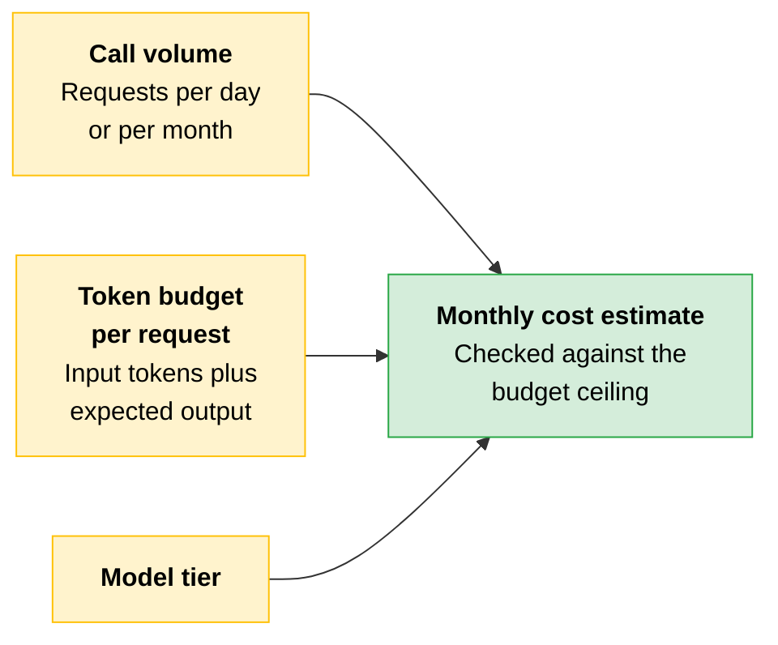
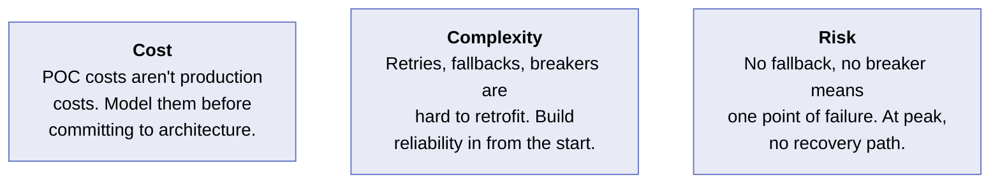
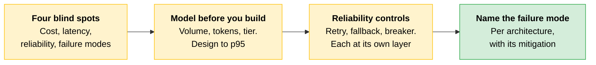

# From POC to Production

Your [eval suite](01-Evals-as-Acceptance-Criteria.md) tells you whether the system behaves correctly. It tells you nothing about whether it can afford to behave correctly at the volume your partner expects. That gap is the **proof of concept (POC) to production gap**, and it has four dimensions: cost, latency, reliability, and failure modes. All four are invisible in a demo.

A POC also gives you the first signal on whether the system moves the business metric it was designed to improve. Capture that signal deliberately: measure the outcome the partner cares about on your POC sample, before you model production cost.

> **The key:** A cost profile that fits the budget, on a system that produces no measurable improvement in the metric that matters, is still a failed deployment.

---

## Where a POC and a Production System Differ

A POC is designed to demonstrate capability. It runs at low volume, on clean inputs, with a patient user. A production system runs at the volume your partner's business generates, on real inputs, with users who have no tolerance for slow or incorrect responses.

| Dimension | Why it's invisible in a demo | What it looks like when it fails |
|---|---|---|
| **Cost** | A POC running 10 to 50 requests per day produces a negligible bill | Billing exceeds the budget signed off at project approval, and the architecture gets renegotiated after deployment |
| **Latency** | A demo runs one request at a time | SLA breaches and user abandonment |
| **Reliability** | No retry logic, no fallback, no circuit breaker. The developer refreshes and tries again | Any transient API failure takes the whole user-facing workflow down instead of degrading gracefully |
| **Failure modes** | A demo is tested on inputs the developer expects | Silent degradation, made-up outputs on edge cases, or complete failure on an untested input class |

Monthly cost projections at production volume are a different calculation entirely from a demo bill. Latency p95 under concurrent load is a different number from median latency on a single request. Latency that is acceptable for a demo can be unacceptable for a real-time user-facing workflow. And failure modes are specific to architecture type, which is why they get [their own section](#failure-modes-by-architecture-type) below.

---

## Cost and Latency Modeling

The cost and latency model is built **before** you finalize the architecture. Three inputs give you a monthly estimate you can check against your budget ceiling before any code is written.

### The Token Distribution Is Skewed

The token budget per request is where most cost models go wrong. Teams calculate the average token count on the inputs they have and assume that is the distribution. In practice, token distributions are often skewed: most requests are short, but a tail of long requests consumes a disproportionate share of total cost.

> **The trap:** A cost model based on average usage can underestimate the cost impact of long requests by a factor of two or three.

### Design to p95, Not the Median

Latency follows the same pattern. Median latency reflects the middle of the pack, but SLA breaches are usually caused by slower requests at the high end.

**p95** is the latency value below which 95% of requests complete. Only the slowest 5% fall above it. That makes it a more useful design target than the median.

### Caching Is the Biggest Lever

Prompt caching is the most effective cost and latency lever when the system prompt is long and stable. It preserves the processed **prompt prefix** for the cached tokens, so the API does not reprocess them on subsequent requests. Savings scale with both the length of the cached prefix and how often it is reused.

If cache reads are charged at 10% of the standard input token rate, for example, a long prefix reused across many requests produces the largest effective savings. Find the current cache read rate at *platform.claude.com/docs/en/about-claude/pricing*.

> **The trap:** Caching creates a consistency window. If the cached content needs to reflect live state, that window may violate the requirements of the use case. What is stored is the prompt prefix.

---

## Reliability Controls

Three controls belong in every production Claude system. They address different failure scenarios and sit at different layers of the call stack.

| Control | What it does | Where it belongs |
|---|---|---|
| **Retry with exponential backoff** | Retries transient errors with progressively longer delays | Close to the API call |
| **Fallback chain** | Routes to an alternative when the primary is unavailable | The orchestration layer |
| **Circuit breaker** | Trips when a dependency's error rate crosses a threshold | The service boundary |

**Transient error recovery with exponential backoff.** When a model returns a transient error, a rate limit `429`, a timeout, or a `5xx`, the system retries with progressively longer delays between attempts. This prevents a flood of retries from turning a brief hiccup into a prolonged outage. Set the maximum number of attempts and total wait time based on how much delay your use case can tolerate.

**Fallback chains.** If the primary model or endpoint is unavailable, the system routes the request to an alternative: a different model tier, or a cached response. It does not raise an error to the user. Fallback behavior should be tested as part of your eval suite.

**Circuit breakers.** A circuit breaker measures the error rate on a downstream dependency and trips when errors exceed an established threshold. Once tripped, requests fail immediately rather than waiting for a timeout. This keeps one degraded dependency from taking down the broader system.

> **Exam trap:** Placement is part of the control. Retries close to the API call, circuit breakers at the service boundary, fallback chains in the orchestration layer. Putting them in the wrong layer means protecting the wrong part of the system and leaving the right part exposed.

---

## Failure Modes by Architecture Type

[Agents](../01-Claude-Platform-and-Solution-Design/04-Choosing-a-Pattern.md#agent) handle tasks that cannot be completed in a single model call: they use tools, observe results, adjust plans mid-execution, and complete multi-step processes that require dynamic reasoning at each step. Claude Code is a production example. It navigates codebases, runs tests, applies fixes, and iterates across a workflow that is impossible in a single-turn architecture.

Each architecture breaks in its own way first.

| Architecture | What breaks first | Mitigation |
|---|---|---|
| **Agent** | Unbounded tool use and growing context | Per-turn token budgets, max tool call counts, explicit stopping criteria |
| **[RAG](../01-Claude-Platform-and-Solution-Design/07-RAG-Pipeline-Design.md)** | Retrieval quality drift | Keep retrieval quality in the eval loop; separate live-state from static-knowledge queries |
| **[Document processing pipeline](../01-Claude-Platform-and-Solution-Design/04-Choosing-a-Pattern.md#sub-patterns-within-workflows)** | No exception path for low-confidence extractions | Confidence scoring, then a human review queue |
| **[Orchestrator-workers](../01-Claude-Platform-and-Solution-Design/05-Multi-Agent-Systems-and-Orchestration.md)** | Blurred failure boundaries and fragmented traces | Defined recoverability boundaries, shared trace ID, coverage reconciliation |

### Agent

An agent that can call tools without budget constraints or turn limits will run up cost and latency in ways that stay invisible until a single request exceeds the budget ceiling.

Set per-turn token budgets, maximum tool call counts, and explicit stopping criteria. Constrain the tool set to the minimum required. And eval the agent's **stopping behavior**, not just its output quality.

### RAG

The retrieval layer degrades in three ways: documents added or removed from the index without reindexing, the query and document representation falling out of alignment, and an index refresh schedule that creates staleness for live-state queries.

Keep retrieval quality in the eval loop. Monitor retrieval precision and recall as system metrics, not just output quality. [Separate live-state queries from static knowledge queries](../01-Claude-Platform-and-Solution-Design/06-Reference-Architectures.md#the-most-common-mistake-retrieval-applied-to-live-state).

### Document Processing Pipeline (Evaluator-Optimizer)

A pipeline that routes all documents through the same flow regardless of extraction confidence will produce wrong outputs on edge cases at the same rate it produces correct outputs on clean documents.

Add confidence scoring to the extraction step. Route low-confidence extractions to a human review queue rather than downstream processing. Include edge cases and difficult documents in your eval set.

### Orchestrator-Workers

Failure boundaries between orchestrators and subagents blur, traces fragment, and a dropped subagent can fail silently at synthesis.

Define [recoverable versus unrecoverable](../01-Claude-Platform-and-Solution-Design/05-Multi-Agent-Systems-and-Orchestration.md#error-recovery-the-recoverability-asymmetry) boundaries: a subagent retries or flags, the orchestrator owns the unrecoverable case. Create a shared trace ID across all agents. Reconcile coverage at synthesis so results equal the units submitted.

### Model Version Pinning

Version pinning applies to every architecture in the table above equally. It is an operational discipline, not an architecture choice.

Pin model versions in your configuration, monitor the Anthropic model deprecation page at *platform.claude.com/docs/en/about-claude/model-deprecations*, and maintain a version-update runbook.

---

## Scenario: The Demo Cost Profile That Became the Production Bill

> [!CAUTION]
> **A POC is built to prove capability, not to model cost.** The team builds against a small dataset, runs a few hundred requests, and the bill is negligible. A POC bill at low volume is a sample, not a projection of production spend.
>
> These are three findings from one team's post-deployment review, 60 days after moving a document triage system to production. First, on cost: a POC running 10 to 50 requests per day can still inform a production cost estimate, but only if the numbers are scaled to expected production volume with appropriate error bounds. Presenting raw demo costs to a client without that extrapolation is where the risk lives.
>
> Second, on distribution: the team assumed the token distribution would be uniform. It wasn't. The long documents in the tail were consuming 80% of total token spend.
>
> Third, on reliability: when the endpoint returned a `529` at peak on day three, the whole workflow went down. There was no fallback, because nobody had tested what happened when the call failed.
>
> **The lesson:** The POC was treated as a production model in three dimensions at once: cost, input distribution, and reliability. All three are production-system properties that must be designed in separately, and a POC establishes none of them.

The three failures are distinct, but they compound in order:

| Failure | Why it happened |
|---|---|
| **The cost model was wrong** | It was built at the wrong volume |
| **The distribution assumption was wrong** | It was built on the wrong inputs |
| **The reliability gap was invisible** | Failure cases were never tested in development |

A POC answers "can the system do this." It does not answer "what does it cost to do this at scale" or "what happens when a dependency fails."

---

## Cost, Complexity, Risk

**Cost.** Don't assume your POC costs will match production. Model costs before committing to an architecture, not after the first billing cycle.

**Complexity.** Retries, fallback chains, and circuit breakers are much harder to add to a system that wasn't designed for them. Build reliability in from the start rather than scrambling after the first production incident.

**Risk.** A system with no fallback and no circuit breaker has one point of failure: the primary model endpoint. When that endpoint goes down at peak load, there is no recovery path. The entire user-facing workflow fails instead of degrading gracefully.

---

## Quick Revision

| Concept | One-liner |
|---|---|
| **POC-to-production gap** | Cost, latency, reliability, and failure modes. All four invisible in a demo. |
| **Business metric signal** | Measure the outcome the partner cares about on the POC sample, before modeling cost. |
| **Three cost inputs** | Call volume, token budget per request, model tier. Estimate before finalizing architecture. |
| **Skewed token distribution** | A tail of long requests dominates spend. Averages underestimate by two to three times. |
| **p95** | The value below which 95% of requests complete. A better design target than the median. |
| **Prompt caching** | Preserves the processed prompt prefix. Savings scale with prefix length and reuse rate. |
| **Consistency window** | Caching breaks live-state accuracy. What is stored is the prefix. |
| **Exponential backoff** | Progressively longer retry delays on `429`, timeout, or `5xx`. Sits close to the API call. |
| **Fallback chain** | Alternative model tier or cached response instead of an error. Sits in orchestration. Eval it. |
| **Circuit breaker** | Trips on error-rate threshold so calls fail fast. Sits at the service boundary. |
| **Agent failure mode** | Unbounded tool use and growing context. Bound turns, tokens, tools, and stopping criteria. |
| **RAG failure mode** | Retrieval quality drift. Monitor precision and recall as system metrics. |
| **Pipeline failure mode** | No exception path. Score confidence and route the low-confidence cases to humans. |
| **Orchestrator-workers failure mode** | Blurred boundaries, fragmented traces, silently dropped subagents. |
| **Model version pinning** | Operational discipline for every architecture: pin, monitor deprecations, keep a runbook. |

### Exam Traps

Cover the third column and quiz yourself.

| If you see... | The trap | The right call |
|---|---|---|
| A POC bill used as the production cost estimate | Reading a low-volume sample as a projection | Scale to expected production volume with error bounds, before finalizing the architecture. |
| A cost model built on average token count | Assuming a uniform distribution | The tail of long requests dominates spend and can underestimate cost two to three times. |
| Median latency quoted against an SLA | Designing to the middle of the pack | Design to p95. SLA breaches come from the slow end, under concurrent load. |
| Caching proposed to cut cost on a live-state workflow | Treating caching as a free lever | Caching creates a consistency window that can violate the use case's requirements. |
| Retry logic added at the orchestration layer | Assuming any layer will do | Retries close to the API call, breakers at the service boundary, fallbacks in orchestration. |
| An agent evaluated only on output quality | Judging results and ignoring the loop | Eval the stopping behavior too, and bound turns, tokens, and the tool set. |
| A POC that hits its cost target | Calling the cost model the readiness bar | Also confirm the POC moved the business metric. Cheap and ineffective is still a failed deployment. |
