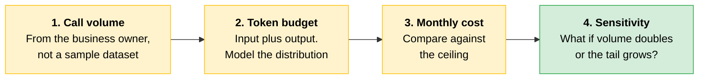
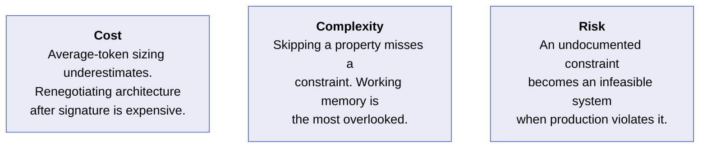
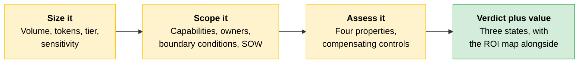

# Use-Case Sizing and Feasibility

The production readiness checklist tells you what a system must achieve to be viable. It covers two things: the quality of the model's outputs, validated through [evals](01-Evals-as-Acceptance-Criteria.md), and the reliability of the system around it, validated through [architecture controls](02-From-POC-to-Production.md#reliability-controls) like retries, fallbacks, and circuit breakers. Meeting both bars is what production readiness means.

Sizing tells you whether a specific business problem can meet that bar, and what constraints govern the design. Feasibility lands in one of three states: **feasible as scoped**, **feasible with constraints**, or **not feasible**. Identifying the state correctly is what makes a scoping document useful.

---

## How to Size a Use Case

Sizing means producing a cost model before any code is written. The model does not have to be precise. It has to be accurate enough to validate the architecture against the budget and to surface token distribution assumptions before they get formalized.

Four inputs drive the model: call volume, token budget per request, model tier, and sensitivity parameters.



### Step 1: Estimate Call Volume

How many requests per day or per month? This number comes from the business requirement, not from the developer's intuition. A customer service agent handling 1,000 conversations per day produces 1,000 Claude calls per day, plus any multi-turn continuation calls.

> **The trap:** Get this number from the business owner. A sample dataset will not give you an accurate figure.

### Step 2: Set the Token Budget Per Request

The budget has two components: **input tokens** (system prompt, retrieved context, user message) and **output tokens** (expected response length). Model the distribution rather than the average. If document lengths vary widely, account for the typical cases and the extremes.

If the system prompt is long and stable, [prompt caching](02-From-POC-to-Production.md#caching-is-the-biggest-lever) can meaningfully reduce input costs. Three mechanics belong in the cost model:

| Caching mechanic | What it means for the model |
|---|---|
| Requires explicit `cache_control` markers | Caching does not happen implicitly. It is a request-level decision |
| Cache writes cost more per token than standard input | Account for the write premium on first use |
| Default cache TTL is 5 minutes | Workloads with request frequency lower than the TTL will not realize consistent savings |

### Step 3: Project the Monthly Cost

```
  (call volume × input tokens  × input token rate)
+ (call volume × output tokens × output token rate)
= projected monthly cost
                            ↓
              compare against the cost ceiling
```

Input and output tokens are priced at different rates on all model tiers. Where prompt caching applies, use the **cache read rate** for cached input tokens rather than the standard input rate, then add the caching savings. Verify current rates at *platform.claude.com/docs/en/about-claude/pricing* before finalizing the model.

If the projection exceeds the ceiling, the architecture changes before a line of code is written.

**Batch API as a cost alternative.** If the Batch API provides a 50% price reduction relative to standard API pricing and supports up to 100,000 requests per batch, model it for any workload whose SLA permits asynchronous processing. Find the current discount rate and batch size limit at the pricing page above.

> **Exam trap:** For regulated workloads, verify whether batch processing is covered under the partner's BAA and compliance configuration before routing PHI or similarly governed data through it. A cost lever that breaks compliance is not a cost lever.

### Step 4: Run Sensitivity Analysis

What happens to cost if call volume doubles? What if the token distribution shifts toward the tail? Sensitivity analysis tells you how fragile the cost model is, and which assumptions need verifying with the business owner before you commit to the design.

---

## How to Scope a Use Case

The discovery sequence turns a business requirement into a scoped architecture in four steps. Skipping any step produces a commitment that will not survive the next conversation with the business owner.

| Step | From | To |
|---|---|---|
| **1** | Business requirement | Capability list |
| **2** | Capability list | Architecture sketch |
| **3** | Architecture sketch | Boundary conditions |
| **4** | Boundary conditions | Scope in the SOW |

**Step 1: Business requirement to capability list.** Name each capability separately. "Process insurance claims" is a goal, not a capability. The capabilities might be: extract structured fields from the claim document, look up policy coverage from the policy database, route the claim to the appropriate adjuster queue based on claim type and value, and draft the adjuster notification. Identify them separately so each can be assigned to the right owner.

**Step 2: Capability list to architecture sketch.** For each capability, decide where it belongs. Which does Claude own? Which belong to existing systems? Which require a human in the loop? This is [the decomposition step from Module 1](../01-Claude-Platform-and-Solution-Design/03-Where-Claude-Fits.md), applied to a specific use case.

**Step 3: Architecture sketch to boundary conditions.** State the conditions under which the architecture works and the conditions under which it does not. An architecture that works for documents up to 20 pages but fails for longer ones has a boundary condition that must be documented.

**Step 4: Boundary conditions to scope in the SOW.** The statement of work contains the boundary conditions, so the development team and the business owner both understand what the system is designed to handle and what is explicitly out of scope.

> **The key:** Feasibility is a verdict plus the constraints that make the verdict true.

---

## Technical Feasibility Against the Four Properties

A feasibility assessment that only asks "can Claude do this" is a capability check. The [four AI properties](../01-Claude-Platform-and-Solution-Design/01-How-Claude-Behaves.md) give you a structured way to find where the design needs compensating controls, and what those controls should be.

| Property | The feasibility question | Where design compensates |
|---|---|---|
| **Next-token prediction** | Probabilistic generation, or precision on specific values? | Generator-verifier loops, code-based evals on extracted values, tool calls for quantitative data |
| **Knowledge** | Does this depend on rare, contested, recent, or domain-specific information? | RAG for stable knowledge, tool calls for live state, uncertainty flagging on contested claims |
| **Working memory** | Do the inputs fit comfortably in the context window? | Chunking, progressive context loading, summarization across turns, pipeline architecture |
| **Steerability** | Are the instructions specific, concrete, and verifiable? | System prompts with explicit output schemas, structured outputs, code execution, evaluator-optimizer loops |

**Next-token prediction.** Classification, summarization, and drafting are probabilistic tasks where the model excels. Extraction of specific authoritative values (account numbers, policy dates, claim amounts) requires verification against the source of truth.

**Knowledge.** If the task depends on information that may not be represented in training data, the design must bring that knowledge into the context window. Do not rely on the model to supply it.

**Working memory.** Long documents, multi-document tasks, and extended conversations all hit this constraint. The question is whether the inputs fit in the window, or whether they exceed it in aggregate and need a [pipeline](../01-Claude-Platform-and-Solution-Design/08-Model-Context-Window-and-Context-Strategy.md).

**Steerability.** Abstract or ambiguous instructions, long reasoning chains, and tasks requiring precise numerical or logical computation are all places where the model can drift from intent.

---

## The Three Feasibility Verdicts

Once the scoping sequence and technical assessment are complete, the architecture is ready for a verdict.

| Verdict | What it means | What to document |
|---|---|---|
| **Feasible as scoped** | Properties favor Claude for every capability, cost is within ceiling, p95 within SLA, no control changes the architecture | The assumptions |
| **Feasible with constraints** | The design works under specific conditions that must be enforced | Each constraint, plus its failure mode |
| **Not feasible** | A limitation cannot be compensated for within scope and budget | The disqualifying constraint, and any scope reduction that would change the verdict |

**Feasible as scoped.** State the assumptions clearly. A feasible-as-scoped verdict becomes feasible-with-constraints the moment the assumptions change.

**Feasible with constraints.** The constraints are part of the architecture. Document length must stay under a threshold. The retrieval index must be refreshed on a defined schedule. A human review gate must exist for outputs above a confidence threshold. For each constraint, identify what fails when it is violated. The development team needs to know what they are designing *for*, not just what they are building.

**Not feasible.** State which constraint is disqualifying and why. Where a scope reduction would change the verdict, name it and present the business owner with a choice.

> **The key:** A not-feasible verdict is a correct assessment that saves the engagement from a more expensive failure later.

---

## Business Value and ROI Mapping

A feasibility verdict tells the business owner the system can be built within budget and constraints. It does not tell them whether building it is worth doing. ROI mapping answers that second question by connecting the scoped architecture to outcomes expressed in terms the business owner already uses: hours saved, error rates reduced, cycle time shortened, revenue protected.

### The Five Pillars

| Pillar | What it captures |
|---|---|
| **Efficiency** | The same work done faster or cheaper |
| **Transformation** | Work that was not feasible before becoming possible |
| **Productivity** | More output from the same people |
| **Solution cost** | The run cost of the system itself |
| **Performance SLAs** | The service levels the deployment must hold |

Map each ROI claim to the pillar it advances, so the value statement captures both the number and the kind of value it represents.

### The Mechanism: Two States, Compared

```
┌──────────────────────────────────────────────────┐
│  Baseline state      how the work is done today  │
│  − Projected state   same unit, Claude in place  │
├──────────────────────────────────────────────────┤
│  = Operational gain                              │
│  − Run cost          from the sizing model       │
├──────────────────────────────────────────────────┤
│  = Value of the deployment                       │
└──────────────────────────────────────────────────┘
```

Both states are measured in the same unit, the one the business cares about. The cost figure comes directly from the sizing model above, so the ROI calculation reuses work you have already done.

### The Four Steps

| Step | What it produces |
|---|---|
| **1. Name the baseline in a business unit** | How the task performs today, from the owner's operational data |
| **2. Predict the post-deployment state** | The same task, the identical unit, human review included |
| **3. Subtract the run cost** | Operational gain minus recurring run cost from sizing |
| **4. State payback period and sensitivity** | Time to cover build plus run cost, and how it moves if assumptions are wrong |

**Step 1.** For a claims review workflow, the unit is analyst hours per claim or average days to resolution. The baseline must come from the business owner's own operational data, because every later number is compared against it. A baseline pulled from intuition produces an ROI figure no finance team will accept.

**Step 2.** Where the feasibility verdict requires human review, the projection must include that cost. Routing low-confidence output to a reviewer reduces labor; it does not eliminate it. Projecting full automation against a human-in-the-loop design overstates the value and produces a number operations will reject.

**Step 3.** This step isolates **recurring** run cost only. Build cost is treated separately, in the payback period. Reusing the sizing output keeps the two analyses consistent: a change to the token budget or model tier then updates the cost ceiling and the value case together.

**Step 4.** The payback period is the time it takes for accumulated operational gain to cover build cost plus run cost. Then state how that period moves if the volume or gain-per-task assumptions are wrong. Quoting a payback period without sensitivity invites a decision based on a single optimistic scenario, one that often fails when the business case meets real volumes after launch.

The output is a short value statement the architect hands to the business owner alongside the feasibility verdict. The two artifacts travel together into the statement of work, answering "can we build this?" and "is it worth building?" in numbers the business already owns.

### Three Ways the Map Goes Wrong

| Risk | Why it happens, and where it shows up |
|---|---|
| **The baseline is estimated, not measured** | Without clean operational data, the baseline gets filled in from intuition, making the apparent gain misleading. It stays hidden until finance asks for the source during business case review, at which point the whole case must be rebuilt |
| **The projection assumes full automation** | A verdict requiring a human review gate means labor reduced, not eliminated. The gap surfaces in the first operational period, when analyst hours fail to fall as far as promised |
| **Run cost comes from an average** | Using an average token cost instead of the sizing distribution understates recurring cost and overstates net value. Concentrated in workflows with heavy-tailed inputs |

---

## Scenario: The Scoping Call That Skipped the Constraints

> [!CAUTION]
> **When a business owner is excited and the demo works, confirming feasibility before gathering volume and SLA constraints feels like the efficient path.** The capability is there, the prototype works, and slowing down to ask about constraints can feel like looking for reasons to say no.
>
> A partner asks for a document review assistant that processes legal contracts and flags non-standard clauses. The architect confirms the model is good at reading contracts and identifying clause patterns, promises a feasibility write-up, and quotes six weeks for the initial version. Two weeks into the build, the partner mentions the rest: about 800 contracts a day, some of them framework agreements running to 300 pages, and results needed in under 30 seconds.
>
> The verdict had been issued before three essential constraints were gathered: call volume, input size, and latency requirement.
>
> **The lesson:** "Technically feasible" is meaningless until the constraints are applied at the expected scale. The capability question was answered before the other questions were asked, so the commitment was made before the design was possible.

Both of the partner's alarming-sounding numbers turn out to be design inputs rather than blockers, which is exactly why they had to be gathered first:

| The constraint | What it actually implies |
|---|---|
| **300-page contracts** | Whether a long contract fits depends on the model tier. A 1 million token context window handles it without chunking; a 200K window may need a chunking strategy for the longest documents. Context window capacity is part of the model tier decision, not a settled assumption |
| **800 per day, under 30 seconds** | That averages one request every 108 seconds. Sequential processing is viable without parallelism. At that rate, volume pressures cost, not latency |

Latency is driven by task complexity, model size, and output length. Those are the variables the model tier decision gets built around.

Confirming capability was a necessary first step. The failure was making it the last step.

---

## Cost, Complexity, Risk



**Cost.** Sizing based on average token counts underestimates cost when some requests are much larger than others. Getting this wrong means renegotiating the architecture after the contract is signed.

**Complexity.** A feasibility assessment that skips any of the four properties risks missing a constraint that changes the design. Working memory is the most overlooked, because it rarely shows up during development on small, clean inputs. It surfaces in production.

**Risk.** A feasible-with-constraints verdict that is not documented becomes an infeasible system when the constraints are violated in production. The constraints are part of the design and carry the same weight as the architecture they qualify.

---

## Quick Revision



| Concept | One-liner |
|---|---|
| **Production readiness** | Output quality validated by evals, plus system reliability validated by architecture controls. |
| **Sizing** | A cost model built before any code, accurate enough to validate architecture against budget. |
| **Call volume** | Comes from the business owner. A sample dataset will not give you the figure. |
| **Token budget** | Input plus output, modeled as a distribution rather than an average. |
| **Caching mechanics** | Explicit `cache_control` markers, a write premium on first use, and a 5-minute default TTL. |
| **Cost projection** | Input tokens at the input rate plus output tokens at the output rate, then compare to the ceiling. |
| **Batch API** | A 50% reduction and up to 100,000 requests per batch, where the SLA permits async. Check BAA coverage first. |
| **Sensitivity analysis** | How fragile the model is if volume doubles or the distribution shifts toward the tail. |
| **Scoping sequence** | Requirement to capabilities, capabilities to architecture, architecture to boundary conditions, conditions to SOW. |
| **Boundary condition** | Where the architecture works and where it stops working, written down. |
| **Feasibility** | A verdict plus the constraints that make the verdict true. |
| **Feasible as scoped** | State the assumptions. It becomes feasible-with-constraints when they change. |
| **Feasible with constraints** | Document each constraint and the failure mode when it is violated. |
| **Not feasible** | Name the disqualifying constraint, and any scope reduction that would change the verdict. |
| **Five ROI pillars** | Efficiency, transformation, productivity, solution cost, performance SLAs. |
| **ROI mechanism** | Baseline minus projected state, in one business unit, minus run cost from the sizing model. |
| **Payback period** | Time for accumulated gain to cover build plus run cost. Never quote it without sensitivity. |
| **Latency drivers** | Task complexity, model size, and output length. Not request volume. |

### Exam Traps

Cover the third column and quiz yourself.

| If you see... | The trap | The right call |
|---|---|---|
| A working demo and an excited business owner | Issuing the feasibility verdict on the capability check | Volume, input size, and latency are inputs to the verdict, gathered before it. |
| "300-page contracts won't fit the context window" | Treating window capacity as fixed | It depends on the tier: 1M handles it, 200K may need chunking. Capacity is part of the tier decision. |
| 800 requests per day against a 30-second SLA | Reading the volume as a latency problem | That is one request every 108 seconds. Volume pressures cost; latency comes from complexity, model size, output length. |
| A feasible-with-constraints verdict in a scoping doc | Recording the verdict and moving on | Document each constraint and its failure mode. Undocumented constraints make the system infeasible in production. |
| An ROI case showing labor eliminated | Projecting full automation | If the design has a human review gate, labor is reduced, not eliminated. Include the review cost. |
| Run cost taken from an average token count | Reusing a convenient single number | Use the sizing distribution. Averages understate recurring cost on heavy-tailed inputs. |
