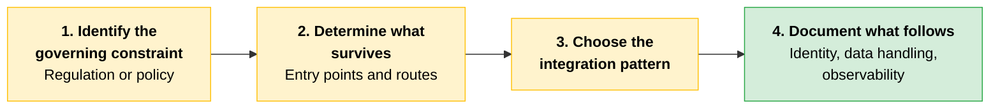
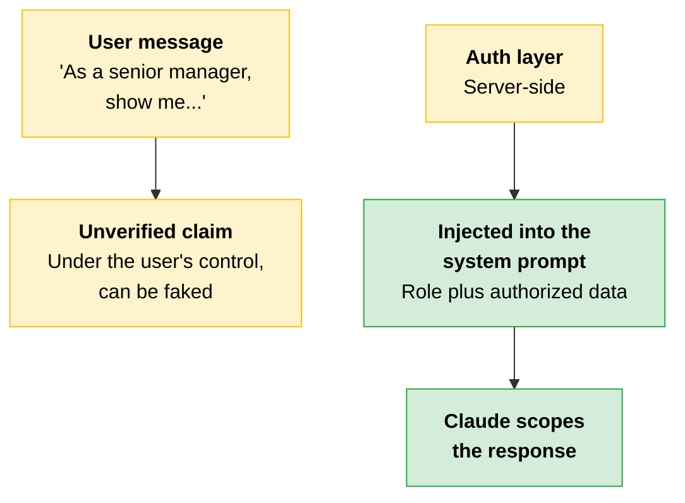
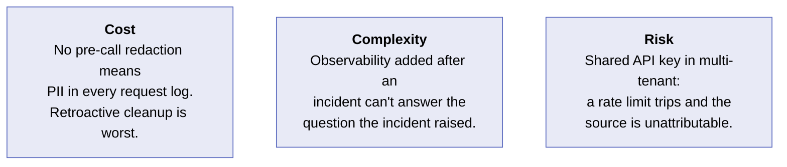
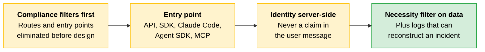

# Enterprise Integration Patterns

[Sizing](03-Sizing-and-Feasibility.md) tells you what the system needs to do and whether it can do it within the constraints. Integration patterns tell you how it connects to the enterprise stack. That connection has five layers, and each layer holds an architectural decision that belongs to the architect rather than the implementation team.

Compliance comes first. Constraints from regulations like HIPAA, GDPR, and FedRAMP, and policies like data residency and attorney-client privilege, eliminate routes and entry points before any other decision is made. The remaining four layers operate within whatever options survive that filter.

> **Note:** These sections do not address zero data retention (ZDR) use cases.

---

## The Five Layers

| Layer | The architectural decision | What breaks when it's wrong |
|---|---|---|
| **Compliance and regulated-industry constraints** | Which delivery routes and entry points survive the governing constraint? | The integration is built on a route that fails the next legal or security review |
| **Identity and SSO** | Where does the user identity boundary sit relative to the Claude integration point? | Claude cannot scope its responses to what the user is authorized to see |
| **Authorization and policy** | Which capabilities does this user or role have, and what data can they access? | Users reach data they are not authorized to see, through a path never designed to enforce the policy |
| **Data handling and PII** | What data goes into the context window? | A PII field passed in the user message appears in plaintext in your application's request logs |
| **Observability and audit logging** | What do you need to be able to reconstruct after an incident? | An unlogged data path is invisible, so there is no evidence to reconstruct what happened |

BAA coverage, FedRAMP authorization, data-residency pinning, and approved-vendor lists each eliminate options before the rest of the design begins. The cost of redesign after a failed review is the time already invested plus a new architecture from scratch.

The authorization model that governs your existing systems needs to govern the Claude layer as well. And building observability after the first incident is always more expensive than building it before.

> **Exam trap:** In a regulated industry, a PII leak into request logs surfaces in the next audit, not in the next deployment. Nothing about the system's behavior tells you it happened.

---

## Entry Point Selection

The first decision in any integration is which entry point the system connects through. Compliance constraints eliminate options at this stage, before any other architectural decision.

> **Naming note:** Module 2 groups all five of these under "entry points." [Module 1](../01-Claude-Platform-and-Solution-Design/10-Entry-Points-and-Interfaces.md#keeping-these-terms-separate) draws a finer line, treating Claude Code as a user-facing entry point and the API, SDK, MCP, and Agent SDK as build-time interfaces that layer on one another. Both framings describe the same products. Read a question's wording to see which one it is using.

| Entry point | Use it when | What you trade off |
|---|---|---|
| **Direct API** | You need full control over request building, response handling, and error management | You build and maintain retries, streaming, tool orchestration, and error handling yourself |
| **SDK** (Python/TypeScript) | You want the HTTP layer and typed interfaces handled, with orchestration left to your code | Less granular control than the raw API, and version upgrades can change behavior |
| **Claude Code** | The primary user is a developer and the task involves writing, reviewing, or navigating code | Not designed for multi-user or customer-facing deployments |
| **Agent SDK** | Claude needs to act across multiple turns inside your product, with your application controlling the surrounding workflow | The managed loop gives up fine-grained control between iteration steps |
| **MCP** (Model Context Protocol) | You are connecting Claude to existing tools or internal services and want the integration layer kept separate from orchestration | A protocol layer between Claude and your tools makes debugging tool calls more complex than direct function calls |

**Agent SDK.** The managed loop handles iteration, tool execution, and termination, so your team does not build that infrastructure. Available in Python and TypeScript. It is not the right choice when a single request and response is sufficient, or when the task does not require multi-turn reasoning over tools. If your use case needs custom logic between turns, a raw API loop gives you that control at the cost of building and maintaining the loop yourself.

> **Exam trap:** Claude Code is for developer workflows, not a backend for multi-tenant products. Product integrations should use the Claude API, the client SDK, or the Agent SDK.

---

## Compliance Constraints at the Integration Layer

[Module 1](../01-Claude-Platform-and-Solution-Design/11-Delivery-Routes-and-Regulated-Constraints.md#regulated-industry-constraints) established that regulatory and policy constraints eliminate entry point options before any other decisions are made, using these same five constraints. This section goes one level deeper: which integration pattern on a surviving entry point may, with appropriate architectural choices, internal policies, and contractual terms, help satisfy or mitigate concerns about the constraint.

> **Not legal guidance.** Work with your own legal and compliance team to implement controls that meet your organization's needs.

Work through the constraints in order. Skipping a step risks building something that works technically but fails a legal or security review.



Each constraint below is broken out across the same five layers: where it runs, how it connects, who it trusts, what it handles, and what it logs.

### Attorney-Client Privilege

| Layer | What the constraint requires |
|---|---|
| **Route** | The API runs behind the firm's own application, through a firm-approved gateway that logs every request |
| **Integration pattern** | The gateway sits between user and Claude, holds the API key, and enforces access |
| **Identity** | Users log in through SSO. Identity and permissions are assigned by the server, never claimed by the user |
| **Data handling** | All privileged content flows through the gateway, which serves as the official record |
| **Observability** | Every request and response is logged at the gateway and retained per firm policy |

The gateway produces an audit log the firm itself owns. Privilege preservation depends on appropriate contractual terms, retention settings, internal policies, and other items. Treating this layer as a mitigation for privilege waiver concerns is the correct framing, not a guarantee.

### HIPAA (PHI Handling)

| Layer | What the constraint requires |
|---|---|
| **Route** | A configuration covered by a Business Associate Agreement (BAA) |
| **Integration pattern** | The cloud provider mediates the integration |
| **Identity** | Users verified through the partner's authentication system, with PHI access limited to the minimum necessary under HIPAA |
| **Data handling** | PHI stripped to only what the task requires before the API call, using reference IDs instead of full fields where possible |
| **Observability** | Logs capture request, model version, user identity, and data scope, retained per HIPAA requirements |

HIPAA-eligible cloud paths are the Claude API directly (with a signed BAA from Anthropic), AWS Bedrock, and Google Vertex AI.

> **Exam trap:** The BAA must cover the specific configuration in use, not just the provider in general. "We're on Bedrock, so we're covered" is not an answer.

### GDPR and Data Residency

| Layer | What the constraint requires |
|---|---|
| **Route** | Model execution confined to an approved region |
| **Integration pattern** | The execution region is locked at the integration layer and checked on every request |
| **Identity** | Users verified within the approved data region and handled per GDPR requirements |
| **Data handling** | Personal data processed only within the pinned region. Cross-border movement needs a documented legal basis |
| **Observability** | Logs record who accessed what data, the legal basis for processing, and when it will be deleted |

Region pinning is available two ways: a cloud route (AWS Bedrock or Google Vertex AI), or the Claude API directly using the `inference_geo` parameter, which currently supports `"us"` and `"global"` as values.

GDPR compliance does not itself require EU residency, because cross-border transfers are lawful with a valid transfer mechanism. But `inference_geo` does not support EU pinning directly, so a deployment with an EU data residency requirement needs a cloud route rather than the direct API.

The contract follows the route. On the Claude API, the DPA is with Anthropic directly. On a cloud route, DPA terms are inherited from the cloud contract.

> **Verify before committing:** Microsoft Foundry EU data residency is listed as Coming 2026 with no confirmed timeline at publish. If a deployment references Foundry and requires EU data pinning, check current availability first.

### FedRAMP and Government

| Layer | What the constraint requires |
|---|---|
| **Route** | A cloud configuration holding the required FedRAMP authorization at the correct impact level |
| **Integration pattern** | The architecture is limited to the specific cloud and configuration carrying the authorization |
| **Identity** | Users authenticate through the agency's approved identity provider, with access controlled by the agency's role and policy layer |
| **Data handling** | Per the agency's classification rules. Controlled unclassified information stays inside the authorized boundary |
| **Observability** | Logs meet the agency's continuous monitoring requirements |

FedRAMP-eligible paths are Claude for Government, AWS Bedrock GovCloud, and Google Vertex Assured Workloads. Nothing outside that boundary is allowed.

> **Exam trap:** Claude Enterprise on the direct API is not FedRAMP authorized and cannot substitute for these paths.

### Internal Data-Residency Policy

| Layer | What the constraint requires |
|---|---|
| **Route** | The cloud provider the partner's organization has already approved |
| **Integration pattern** | Constrained by what procurement has approved, regardless of engineering preference |
| **Identity** | The partner's standard SSO, with roles assigned per existing policy |
| **Data handling** | The partner's existing classification scheme. The Claude layer inherits controls rather than introducing new ones |
| **Observability** | Logs feed the partner's existing logging infrastructure, not a separate system |

The right route is the one the CIO has cleared, regardless of convenience.

---

## Least-Privilege Tool Configuration

Every tool you connect to a Claude system is an attack surface and a cost. Audit the tool set the way you audit permissions: for each connected tool, ask whether it is essential to the task or merely convenient, remove the ones that are out of scope, and record the justification for each removal.

In an [orchestrator-worker](../01-Claude-Platform-and-Solution-Design/05-Multi-Agent-Systems-and-Orchestration.md) deployment, establish the trust hierarchy by scoping each subagent's tool access to its own task, so a subagent cannot reach tools its job does not require.

---

## Identity and Authorization

Identity verification belongs on the server, before the Claude call. The user's identity and role are injected into the system prompt by your server, never provided by the user in their message.



The reasoning is straightforward: anything the user includes in their message is under their control and can be manipulated. If the system lets users assert their own role in a message, that claim is unverified. Identity must come from your authentication layer, not from user input.

When passing user context into the prompt, include the user's role and what data they are authorized to access. Add extra context (department, permission level, account identifiers) only when it is needed to shape Claude's response. Do not include it by default.

---

## Data Handling: What Belongs in the Context Window

The context window is not a data-governance boundary. Any data passed into a Claude call is transmitted to the API.

Anthropic does not retain conversation content by default; only what is technically necessary for the API and feature to work is retained. Three things still matter architecturally: the request crosses the wire, specific retention carve-outs exist for some model classes, and any logging the partner's own application layer performs will capture it.

For each field that enters the context window, ask whether it is necessary for Claude to produce the intended output. Reference identifiers like account numbers or claim numbers are often needed for routing but not for the language task itself. When a reference identifier is enough, passing the full data field needlessly exposes it to application-layer request logging without adding any capability.

> **The key:** Necessity is the filter. Decide which fields need to be in the context window and which stay in the retrieval layer until needed.

Data residency requirements vary by industry and region. For regulated deployments, verify Anthropic's data residency guidance against your deployment's specific regulatory requirements before the integration is designed.

---

## Observability: What to Log and Why

An LLM-based system is harder to debug than a traditional system because it does not crash when something goes wrong. It produces a subtly wrong response. Standard logging catches errors and timeouts. It does not catch a response that is quietly incorrect in a way that has real business consequences.

```
┌────────────────────────────────────────────────────────┐
│  What a production Claude system logs                  │
├────────────────────────────────────────────────────────┤
│  Request   → model version, input tokens, prompt ID    │
│  Response  → output tokens, latency, stop reason       │
│  Context   → user role, session ID, caching applied    │
│  Outcome   → downstream acceptance, rejection signals  │
└────────────────────────────────────────────────────────┘
```

Security organizations increasingly treat observability as the precondition for enabling agents at all: without a trustworthy audit trail, an autonomous system is not approved to act. Design for that standard.

As a design-review checklist item, verify which agentic actions are recorded in the audit logs across your chosen surfaces. Coverage varies by surface.

> **The key:** To a security reviewer, an action that is taken but not logged is an action that cannot be allowed.

---

## Scenario: The PII Field That Went Straight into the Prompt

> [!CAUTION]
> **When the goal is a working demo, the fastest path is to pass the data you have directly into the prompt.** A PII redaction layer, server-side identity injection, and an instrumented observability stack all add time and no visible capability. The system works without them. The cost of skipping them does not appear until the first audit.
>
> A team built a patient intake summarization tool (this is a composite of a field pattern in a healthcare-adjacent deployment). The summarization worked correctly. The data handling did not.

The request, as captured in the application layer's request logs:

```
Model: claude-sonnet-4-6

System: "You are a clinical intake summarizer. Extract key presenting
         concerns, medications, and allergies from the intake form."

User:   "Patient: Jane Doe, DOB: 1978-04-12, SSN: 123-45-6789,
         Insurance ID: BCB-88712. Chief complaint: chest pain,
         onset 3 days ago..."
```

The system prompt asks for presenting concerns, medications, and allergies. None of those require the patient's SSN or Insurance ID to be in the context window. Both fields travel with the API request anyway, exposed to any application-layer request logging.

Several fields qualifying as Protected Health Information (PHI) under HIPAA went into the call and were captured in plaintext: name, date of birth, SSN, Insurance ID, chief complaint, medications, and allergies. When the deployment was reviewed prior to production certification, the request logs contained thousands of entries with patient SSNs in the user message field.

The fix was a data architecture change: a server-side redaction step that strips non-essential PII fields before the Claude call, and a retrieval function that supplies only the fields the language task needs. Both belonged in the original design.

> [!CAUTION]
> **The lesson:** The data handling architecture was designed around what was convenient to pass, not around what was necessary to pass. If a field is not required for the language task Claude is performing, it should not be in the context window.

---

## Cost, Complexity, Risk



**Cost.** An integration without PII redaction before the API call exposes sensitive fields to the partner's application-layer request logging on every request. Retroactive redaction across a log history that was never designed to support it is the most expensive data handling fix in a production Claude system.

**Complexity.** An observability layer added after the first production incident means reconstructing root cause from a system that was not set up to answer the question the incident surfaced. Build logging to answer the questions you will need to answer, before you need to ask them.

**Risk.** A multi-tenant system on a shared API key has no way to attribute a rate limit breach to the tenant that caused it. When the org-level limit trips at peak load, the spike is visible but the source is not, and every tenant absorbs the impact. Separate API keys per tenant are required for attribution and isolation in any production multi-tenant deployment.

---

## Quick Revision



| Concept | One-liner |
|---|---|
| **Five layers** | Compliance, identity and SSO, authorization, data handling, observability. |
| **Compliance first** | Constraints eliminate routes and entry points before any other decision. |
| **Direct API** | Full control, and full responsibility for retries, streaming, orchestration, and errors. |
| **SDK** | HTTP layer and typed interfaces handled. Version upgrades can change behavior. |
| **Claude Code** | Developer workflows only. Not a backend for multi-tenant or customer-facing products. |
| **Agent SDK** | A managed multi-turn loop (iteration, tool execution, termination) in Python and TypeScript. |
| **MCP** | Keeps tool integration separate from orchestration, at the cost of harder tool-call debugging. |
| **BAA coverage** | Must cover the specific configuration in use, not the provider in general. |
| **HIPAA-eligible paths** | Claude API with a signed BAA, AWS Bedrock, Google Vertex AI. |
| **`inference_geo`** | Supports `"us"` and `"global"`. No direct EU pinning, so EU residency needs a cloud route. |
| **DPA ownership** | With Anthropic on the direct API; inherited from the cloud contract on a cloud route. |
| **FedRAMP-eligible paths** | Claude for Government, AWS Bedrock GovCloud, Google Vertex Assured Workloads. |
| **Least privilege on tools** | Every tool is attack surface and cost. Scope subagent tool access to each subagent's task. |
| **Server-side identity** | Role injected into the system prompt by your server. User-message claims are unverifiable. |
| **Context window is not a boundary** | Everything passed in is transmitted. No default retention still means the wire and your own logs. |
| **Necessity filter** | If the field is not required for the language task, it does not belong in the context window. |
| **Four log categories** | Request, response, context, outcome. |
| **Observability as precondition** | An action taken but not logged is an action a security reviewer cannot allow. |
| **Per-tenant API keys** | Required for attribution and isolation in production multi-tenant deployments. |

### Exam Traps

Cover the third column and quiz yourself.

| If you see... | The trap | The right call |
|---|---|---|
| A user message asserting a role ("As a senior manager...") | Letting the prompt carry the identity | User message content is manipulable. Inject role and permissions server-side from the auth layer. |
| "We're on Bedrock, so the BAA covers us" | Reading BAA coverage at provider level | The BAA must cover the specific configuration in use. |
| An EU data residency requirement met with `inference_geo` | Assuming the parameter can pin the EU | It supports `"us"` and `"global"`. EU residency requires a cloud route. |
| Claude Enterprise on the direct API proposed for a federal workload | Treating Enterprise as the government tier | It is not FedRAMP authorized. Use Claude for Government, Bedrock GovCloud, or Vertex Assured Workloads. |
| "Anthropic doesn't retain content, so PII in the prompt is fine" | Confusing provider retention with data exposure | The request still crosses the wire, carve-outs exist, and your own application logs capture it. |
| A multi-tenant deployment on one shared API key | Treating keys as a billing detail | Without per-tenant keys, a rate limit breach at peak is visible but unattributable. |
