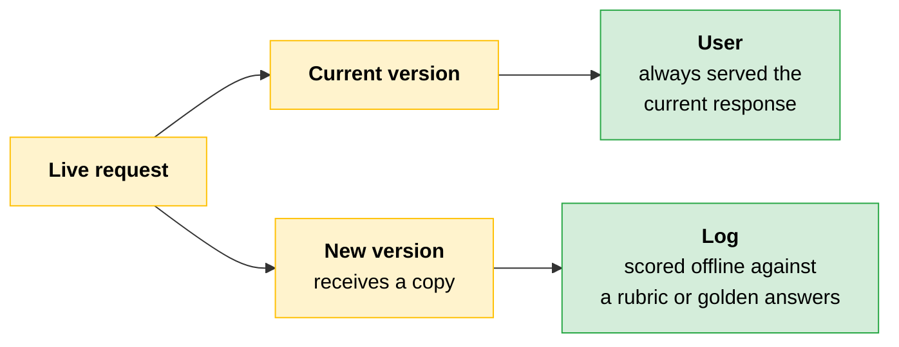
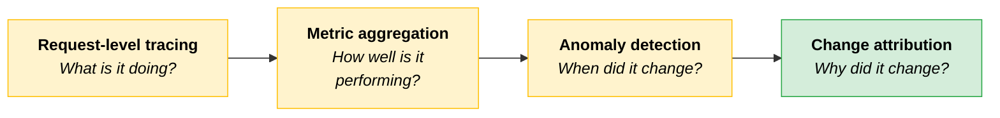
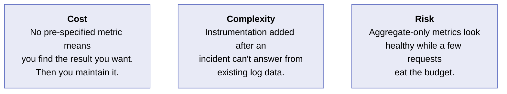
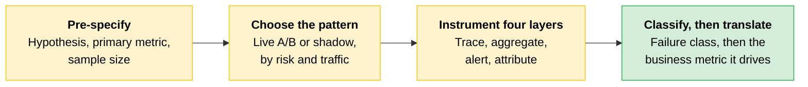

# A/B Testing and Observability at Scale

[Integration patterns](04-Enterprise-Integration-Patterns.md) get Claude into the enterprise stack. The question that follows is whether it is performing the way it should once it is there.

Observability answers the monitoring question. Structured A/B testing answers the improvement question. Without both, you are either flying blind or making changes you cannot measure.

---

## Structured A/B Testing for Live Claude Systems

An A/B test for a Claude system has the same structure as any experiment: a hypothesis, a treatment group, a control group, a metric, and a sample size large enough to make the result meaningful. The difference from traditional software A/B testing is that LLM outputs are probabilistic, which makes results noisier and interaction effects harder to control.

### The Hypothesis Has to Be Falsifiable

"The new prompt is better" fails on both counts: it names no treatment, no metric, and no threshold. A usable hypothesis reads like this:

> *"Replacing the instruction to summarize with an instruction to extract the three most important action items will increase task success rate by at least 5% without degrading response latency p95."*

That names the treatment, the metric, the threshold for success, and the constraint.

### The Four Components

| Component | What it requires |
|---|---|
| **Hypothesis** | A falsifiable statement naming the treatment, the expected direction of the primary metric, and constraints on secondary metrics |
| **Treatment and control assignment** | Random assignment of requests, held consistent for a given user or session |
| **Primary metric** | A single metric defined before the experiment runs |
| **Sample size** | Calculated from minimum detectable effect, baseline value, and required confidence level |

**Hypothesis.** Without one, any result can be interpreted as a win. You can always find a metric that moved in the right direction if you look at enough of them after the fact.

**Assignment.** Non-random assignment means the groups are not comparable, and inconsistent assignment within a session contaminates both. If the treatment group happens to receive more complex queries, an apparent win may be an artifact of input distribution.

**Primary metric.** Task success rate, cost per completion, latency p95, or a user satisfaction proxy. Choosing the metric after seeing results is **outcome-shopping**, and it turns an experiment into a retrospective correlation, which is a much weaker basis for a decision.

**Sample size.** For LLM systems, output variance is higher than for deterministic systems, so the required sample size is larger.

> **The trap:** An underpowered experiment cannot distinguish a real effect from noise. A team that runs until they see what they want will find what they were looking for, whether it is real or not.

---

## Reading Results Without Overclaiming

**Statistical significance** means the result is unlikely to have occurred by chance given the sample size. Whether it is large enough to matter is a separate question.

Two questions come before declaring a winner:

- Is the effect large enough to justify the operational overhead of maintaining the new version?
- Did any secondary metric degrade?

A prompt change that improves task success rate while increasing cost by 30% may not be a net win, depending on the deployment's budget constraints.

LLM experiments carry a failure mode classical A/B tests do not: **interaction effects** between the treatment and specific input types. A prompt change that improves performance on typical inputs may degrade performance on edge cases that appear rarely during the test period and frequently in a future seasonal spike.

> **The key:** Test period and input distribution alignment matters more in LLM experiments than in most other software contexts.

---

## Shadow Testing

A live A/B test sends real users to the new version, so a regression reaches some fraction of them before the experiment closes. **Shadow testing** removes that exposure: run the new version in parallel, send it a copy of live requests, and serve every user the current version's response. The new version's outputs are logged rather than returned, and you score them offline afterward.

The deployment decision gets made before a single user has seen the new version. Choosing between the two patterns comes down to how much risk the deployment can carry and how much traffic it sees.

| | Live A/B test | Shadow testing |
|---|---|---|
| **Use it when** | The deployment can absorb bounded exposure to a worse version, and traffic is high enough to reach significance in a reasonable window | A single bad output carries too much risk, or traffic is too low to support a live split before the change is needed |
| **The payoff** | Measurement against real user behavior, including downstream signals like acceptance and follow-up | No user is ever exposed to an unvalidated change |
| **The cost** | Some users see the worse version while the experiment runs | Loss of downstream signal. Scoring relies on an offline rubric or golden answers |

For a regulated-industry deployment, where exposing users to an unvalidated model change may not be permissible at all, shadow testing is often the only acceptable way to validate the change.

---

## Observability at Scale

Production observability for a Claude system answers four questions: what is the system doing, how well is it performing, when did it change, and why did it change? Each question needs its own layer of instrumentation.

**Request-level tracing.** Every request produces a trace with the model, model version, input token count, output token count, latency, stop reason, and any tool calls made. This is the raw material for everything else.

**Metric aggregation.** Aggregate the traces into what the dashboard displays: cost per request, latency p50 and p95, task success rate where the downstream system provides an acceptance signal, and error rate by error type. Per-request decomposition is critical, because aggregate metrics can look healthy while a small fraction of requests consumes most of the budget.

**Anomaly detection.** Set threshold alerts on the metrics that matter for the deployment. A cost spike exceeding 150% of the 7-day average deserves an alert. A latency p95 crossing the SLA threshold deserves an alert. **Model drift**, the gradual change in the distribution of model outputs over time, is harder to catch with threshold alerts and benefits from periodic distribution comparison.

**Change attribution.** When a metric moves, three causes look similar on the dashboard and need different fixes:

| Cause | What actually changed |
|---|---|
| **Model drift** | The model's behavior on stable inputs |
| **Data drift** | The input distribution |
| **Model update effects** | The model version, which behaves differently on existing inputs |

> **Exam trap:** Mixing up the three produces the wrong fix. Instrumentation has to be able to tell them apart.

---

## A Failure Taxonomy

Instrumentation tells you a metric moved. Diagnosis tells you what kind of failure moved it. Classify before attributing.

| Failure class | What happened | The fix |
|---|---|---|
| **Prompt failure** | The instruction was ambiguous or underspecified and the model filled the gap | The prompt, not the model |
| **Hallucination** | Confident, fluent content not grounded in the input or a reliable source | Grounding through retrieval, tool use, or verification |
| **Model mismatch** | The tier is wrong for the task, or was swapped without re-evaluation | Model selection, [gated by an eval](01-Evals-as-Acceptance-Criteria.md) |
| **Orchestrator-workers failure** | A subagent or orchestrator failed inside a multi-agent system | A trace spanning both, plus defined recoverability boundaries |

> **Testable distinction:** Stronger instruction will not resolve a hallucination. Grounding will. Reaching for prompt work on a grounding problem is the most common misclassification in this taxonomy.

In multi-agent systems, trace across the orchestrator and its subagents: a [recoverable subagent failure](../01-Claude-Platform-and-Solution-Design/05-Multi-Agent-Systems-and-Orchestration.md#error-recovery-the-recoverability-asymmetry) that retries or flags looks different from an unrecoverable orchestrator failure, and attribution requires a trace that spans both.

---

## Discernment

[Discernment](../../Foundations/01-AI-Fluency-Framework-and-Foundations/README.md#3-discernment) is one of the four AI Fluency competencies: the discipline of judging the quality of what the model produced rather than accepting it at face value.

Applied to a production system, it is the habit of classifying each output as **acceptable**, **needs revision**, or **needs override**, and feeding that judgment back into the evals and the monitoring.

> **The key:** A team without Discernment watches metrics move and never asks whether the underlying outputs were actually good.

---

## Connecting Observability Data to Business Value

The people who funded the deployment are not reading the request-level trace. They are reading a KPI dashboard measuring the outcome the deployment was designed to improve. The observability stack needs a translation layer between the two.

For a customer service agent, the business metrics might be average handle time, first-contact resolution rate, or customer satisfaction score. The observability stack measures latency, task success rate, and error rate. The translation layer maps between them:

| Technical metric | Business metric it drives |
|---|---|
| Task success rate | First-contact resolution |
| Latency | Average handle time |

Build this layer when the system is designed, not after the first business review. If technical and business metrics are not mapped at build time, the first business review raises a question about what is driving the change in handle time, and answering it requires retrospective reconstruction rather than a live query.

---

## Scenario: The 50-Session Winner That Wasn't

> [!CAUTION]
> **Running a proper A/B test takes time, sample size calculation, and possibly weeks to reach significance.** Comparing 50 sessions of the new version to 50 of the old takes an afternoon. That comparison is a confirmation check, not a meaningful test.
>
> A team running a customer service agent wanted to test a revised instruction in the system prompt (this is a composite of a pattern that surfaces in teams with a working system, an appetite to improve it, and no formal experimentation process). They ran the new version against 50 customer sessions and the old version against 50. Task success rate came in at 68% on the new version against 62% on the old. They declared a winner and deployed.
>
> Two weeks later, task success rate on the new version had settled at 61%. The 6-point gain had disappeared.
>
> **The lesson:** An underpowered experiment with metric selection after the fact produces confirmation rather than evidence. The result was noise, and the noise looked like a signal because the sample was too small to tell the difference.

Three problems, any one of which was enough to invalidate the result:

| Problem | Why it invalidated the result |
|---|---|
| **Sample size too small** | A 6-point difference on a high-variance metric needs a sample in the hundreds to reach significance. At 50 per group, the difference sat within the noise floor |
| **Input distribution not controlled** | The treatment group happened to contain fewer edge-case inputs than the control group, so part of the apparent gain was an artifact of routing |
| **Primary metric not pre-specified** | They compared task success rate because it moved in the right direction. Had it moved the other way, they would have looked at another metric |

---

## Cost, Complexity, Risk

**Cost.** Running an A/B test without pre-specifying the primary metric means you can always find a result you want. Underpowered experiments produce false positives, so a change that looks like an improvement gets deployed and the team maintains a version no better than what it replaced while absorbing the full operational overhead.

**Complexity.** Observability instrumentation added after the first production incident means the root cause question cannot be answered from the existing log data. Building the instrumentation correctly the first time costs less complexity than retroactive log reconstruction.

**Risk.** An LLM system with aggregate-only metrics can look healthy while a small fraction of requests consumes most of the budget and produces wrong outputs. Aggregate metrics protect against obvious failures. Per-request decomposition protects against the non-obvious ones.

---

## Quick Revision

| Concept | One-liner |
|---|---|
| **Falsifiable hypothesis** | Names the treatment, the metric direction, the threshold, and the secondary-metric constraint. |
| **Assignment** | Random per request, consistent per user or session, or the groups are not comparable. |
| **Outcome-shopping** | Choosing the primary metric after seeing results. Turns an experiment into a retrospective correlation. |
| **Sample size** | From minimum detectable effect, baseline, and confidence. Larger for LLMs because output variance is higher. |
| **Statistical significance** | Unlikely to be chance at that sample size. Says nothing about whether the effect is worth shipping. |
| **Two questions before shipping** | Is the effect worth the operational overhead, and did a secondary metric degrade? |
| **Interaction effects** | Treatment helps typical inputs and hurts edge cases that spike later. Align test period with input distribution. |
| **Shadow testing** | New version gets copied traffic, users always get the current response, outputs scored offline. |
| **Shadow tradeoff** | Zero user exposure, but no downstream signal. Often the only permissible option in regulated deployments. |
| **Four observability layers** | Request-level tracing, metric aggregation, anomaly detection, change attribution. |
| **Per-request decomposition** | Aggregate metrics hide the small fraction of requests consuming most of the budget. |
| **Threshold alerts** | Cost above 150% of the 7-day average, latency p95 crossing the SLA. |
| **Model drift** | Behavior on stable inputs changes gradually. Needs periodic distribution comparison, not just thresholds. |
| **Data drift** | The input distribution changed, not the model. |
| **Model update effects** | A new model version behaves differently on existing inputs. |
| **Failure taxonomy** | Prompt failure, hallucination, model mismatch, orchestrator-workers failure. Each has its own fix. |
| **Discernment** | Classify each output as acceptable, needs revision, or needs override, and feed it back into evals. |
| **Translation layer** | Maps technical metrics to the business metrics they drive. Built at design time, not at the first review. |

### Exam Traps

Cover the third column and quiz yourself.

| If you see... | The trap | The right call |
|---|---|---|
| 50 sessions per arm and a 6-point gain | Reading the gap as a result | High-variance metrics need hundreds per arm. At 50, the difference is inside the noise floor. |
| A metric chosen after the results came in | Reporting whichever number moved | Pre-specify one primary metric. Post-hoc selection is outcome-shopping. |
| A statistically significant improvement | Shipping on significance alone | Ask whether the effect justifies the operational overhead, and whether a secondary metric degraded. |
| A regulated deployment, or one bad output carrying real risk | Reaching for a live A/B split | Shadow test: copied traffic, users served the current version, offline scoring. |
| A healthy aggregate dashboard | Trusting the averages | Decompose per request. A small fraction can consume the budget and produce wrong outputs. |
| A metric that moved after a model version change | Calling it drift and moving on | Separate model drift, data drift, and model update effects. Each has a different mitigation. |
