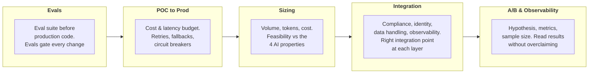

# Enterprise Integration & Production

Learn to take a designed solution from proof of concept to enterprise-ready production.

**Notes:** 5 | **Status:** In progress

Course length: 158 min.

[Module 1](../01-Claude-Platform-and-Solution-Design/README.md) introduced architectural concepts. This module goes deep on the specifics: it assumes a strong systems background, skips foundational concepts, and focuses on the decisions that separate a prototype from a production system.

---

## Notes in This Module

| Notes | Covers |
|---|---|
| [01-Evals-as-Acceptance-Criteria](01-Evals-as-Acceptance-Criteria.md) | The five-stage eval workflow, the three eval types, the grading ladder and judge calibration, success criteria, multi-turn evals, and evals gating every change |
| [02-From-POC-to-Production](02-From-POC-to-Production.md) | The four demo blind spots, cost and latency modeling with p95 and caching, the three reliability controls and their layers, failure modes per architecture, model version pinning |
| [03-Sizing-and-Feasibility](03-Sizing-and-Feasibility.md) | The four sizing steps, the scoping sequence to boundary conditions and SOW, feasibility against the four properties, the three verdicts, and ROI mapping |
| [04-Enterprise-Integration-Patterns](04-Enterprise-Integration-Patterns.md) | The five integration layers, entry point selection, the constraint-to-integration matrix, least-privilege tools, server-side identity, the necessity filter on data, and what to log |
| [05-AB-Testing-and-Observability](05-AB-Testing-and-Observability.md) | Experiment design and sample size, reading results without overclaiming, shadow testing, the four observability layers, the failure taxonomy, and the business-metric translation layer |

All five teaching screen sets are covered. Not yet written: the module's exercise and wrap-up screens (eval framework exercise, production readiness builder, glossary, recap).

---

## Five Things Before You Ship

The module is built around five tools, each applied at a specific moment in the build:

| # | Tool | When it applies |
|---|------|-----------------|
| 01 | A quality gate | Before you build |
| 02 | A cost and reliability model | Before you deploy |
| 03 | A feasibility framework | Before you commit |
| 04 | An integration architecture that survives security review | Before the enterprise lets you in |
| 05 | An experimentation method | Before you claim a change worked |

---

## Learning Objectives

| Objective | One-liner |
|-----------|-----------|
| **Evals** | Define success criteria and build the eval suite before writing production code. Distinguish model-based from code-based evals, and use evals as the gate for any change to a production system |
| **POC to Prod** | Map cost and latency to a budget, specify retries, fallbacks, and circuit breakers, and name the mitigation for each failure mode, including making agents production-reliable |
| **Sizing** | Estimate call volume, token consumption, and cost. Assess feasibility against the [four AI properties](../01-Claude-Platform-and-Solution-Design/01-How-Claude-Behaves.md), and scope the solution with explicit boundary conditions |
| **Integration** | Specify integration patterns for compliance (regulated industries, BAA coverage, data residency), identity (SSO/OAuth), authorization, data handling, and observability. Place the right integration point (API, SDK, MCP, Claude Code) at each layer |
| **A/B & Observability** | Plan and interpret an A/B test on a live Claude system: hypothesis, metrics, sample size, and a reading of the result that doesn't overclaim |

---

[Back to Professional](../README.md) · [Back to the study guide](../../README.md)
