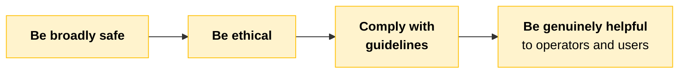
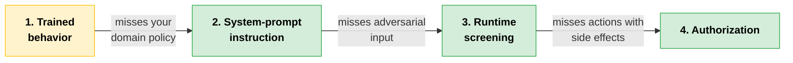
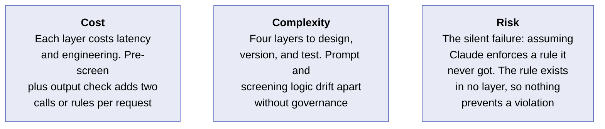
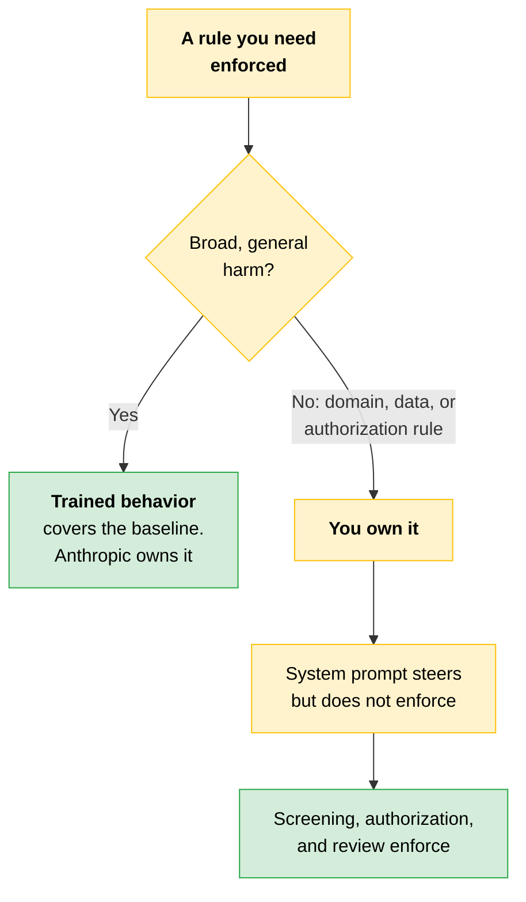

# Alignment: What Training Enforces, What You Own

Before you add a single control, settle one question: how much safe behavior is already handled by the model, and how much is still yours to build? Get this boundary wrong and you either build duplicate protections or assume the model is enforcing a rule it has never seen.

---

## What the Model Arrives With

Anthropic trains Claude against a **constitution**: a written document describing the values and behavior the model should exhibit. Anthropic revises it over time, and the most recent published version is from January 2026.

The document is used during training in two ways: to generate examples the model learns from, and to rank candidate responses. That shapes how Claude responds to ambiguous or sensitive requests. It does not necessarily catch bad outputs.

The constitution also sets a priority order for when goals conflict.

The ordering matters because a helpful answer is sometimes unsafe.

> **The nuance:** The ordering is holistic, not strict. Higher-priority goals generally take precedence when they conflict, but the model weighs them together rather than applying them in a rigid sequence.

So Claude arrives with a class of harmful output already reduced before you write a single prompt. That built-in layer handles broad, general-purpose harm. It does not cover your specific domain. Any policy specific to your users and your product is still yours to enforce.

---

## Two Layers With Distinct Purposes

**Training-time alignment** shapes model behavior before deployment. **Inference-time control** enforces the rules specific to your deployment.

| | Training-time alignment | Inference-time control |
|---|---|---|
| **What it does** | Steers Claude to refuse dangerous requests and default to safer responses | Enforces deployment-specific rules at runtime |
| **When it is set** | Before any deployment exists | When you configure the deployment |
| **What it knows** | Broad classes of harm | Your domain policy, data rules, authorization model |
| **Made of** | Constitution-guided training | System instructions, input and output checks, tool permissions, human review gates |
| **Effect** | Lowers baseline risk | Enforces your rules |

Training-time alignment is general by design, because it is set before any deployment exists. That is both a strength and a weakness. It does not know your partner's domain policy, data-handling rules, or authorization model.

A request can fit Claude's general alignment and still violate a deployment-specific rule: disclosing another customer's order information, or advising outside an approved script.

> **The key:** Claude cannot enforce a rule it was never given.

System instructions shape the model's behavior, but they are not enforcement. Deployment-specific policy is enforced only when those instructions are paired with runtime controls: screening, authorization, and review.

---

## The Four-Layer Stack

Treat safety as four layers stacked from Claude outward. Each one covers something the layer below cannot, and each one fails in a way the next must catch.

| Layer | Reliably covers | Does not cover | Owner |
|---|---|---|---|
| **1. Trained behavior** | Broad classes of harmful or unsafe output, applied to every request without configuration | Your domain policy, your data rules, your authorization model | Anthropic |
| **2. System-prompt instruction** | Role, tone, and stated constraints that steer Claude inside one request | Anything an adversarial or unusual input can talk Claude out of, since instructions are not enforcement | Architect |
| **3. Runtime screening** | Input and output screening that detects disallowed content | Actions with side effects, which screening does not authorize, and novel attacks a classifier misses | Architect |
| **4. Authorization** | Whether a specific action with a side effect is permitted for this caller in this context | Content quality and fairness | Architect |

One layer is Anthropic's. The other three are yours.

> [!CAUTION]
> **Claude refuses every harmful prompt you throw at it in testing, so you assume its training also covers your partner's data-handling policy.** You move on without building a separate enforcement layer.
>
> A team deployed an internal assistant for a partner whose data-handling policy prohibited users from accessing records belonging to other business units. In review, Claude refused every harmful prompt the team tried, so they assumed cross-unit disclosure was covered by the same safety behavior. They never built an authorization check for it.
>
> In production, a normal-looking, in-domain request asked for a forbidden record. Nothing about it looked harmful in general terms, so Claude answered.
>
> The rule the team believed was enforced did not exist anywhere. It was never part of Claude's training, and it was never encoded in a classifier, a system prompt, or an application control, because they assumed the model already covered it.
>
> **The lesson:** A domain policy is not trained alignment. Trained refusals cover broad harm, not deployment-specific rules. Any rule specific to your partner must be enforced in a layer you build.

---

## Cost · Complexity · Risk

---

## Quick Revision

| Concept | One-line summary |
|---|---|
| **Constitution** | Written document of values and behavior, used in training to generate examples and rank responses. Latest published version: January 2026 |
| **Priority order** | Broadly safe, ethical, comply with guidelines, genuinely helpful. Holistic, not a strict sequence |
| **Training-time alignment** | Set before deployment exists, so it is general by design. Lowers baseline risk |
| **Inference-time control** | System instructions, input and output checks, tool permissions, review gates. Enforces your rules |
| **The alignment boundary** | Trained behavior covers broad harm. Domain policy, data rules, and authorization are yours |
| **Four-layer stack** | Trained behavior, system-prompt instruction, runtime screening, authorization. Each catches the one below |
| **Ownership split** | Anthropic owns layer 1. The Architect owns layers 2, 3, and 4 |

### Exam Traps

| If you see... | The trap | The right call |
|---|---|---|
| Claude refused every harmful prompt in testing | Conclude the partner's domain policy is covered too | Trained refusals cover broad harm, not deployment-specific rules |
| The constitution's four goals | Treat them as a rigid sequence applied in order | The ordering is holistic; higher goals generally win but are weighed together |
| The rule is written in the system prompt | Call the policy enforced | Instructions steer inside one request. Enforcement needs screening, authorization, or review |
| An output filter is in place before a tool call | Assume the action is authorized | Screening detects content. Only authorization decides if a side-effecting action is permitted |
| A request that looks normal and in-domain | Expect trained alignment to block it | Nothing looks harmful in general terms, so Claude answers unless your layer stops it |
| Deciding who owns a control | Split ownership across Anthropic and the Architect per layer | Anthropic owns trained behavior only. The other three layers are yours |
