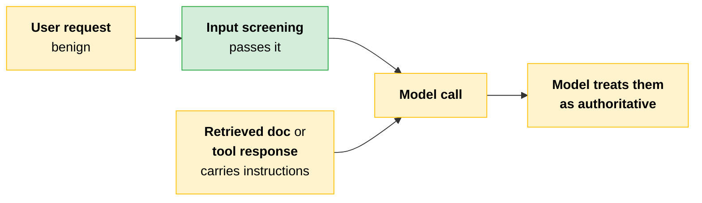
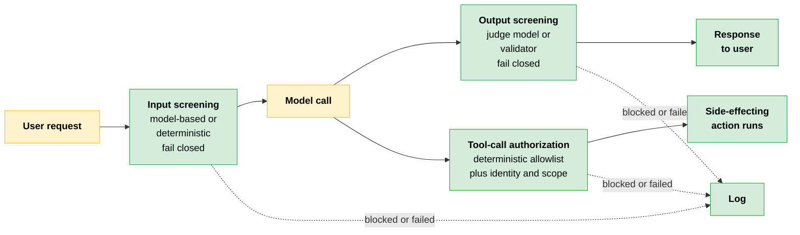
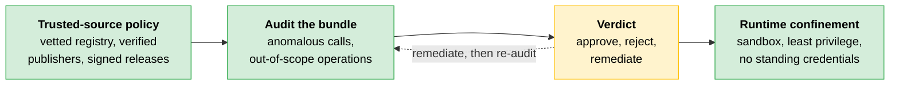
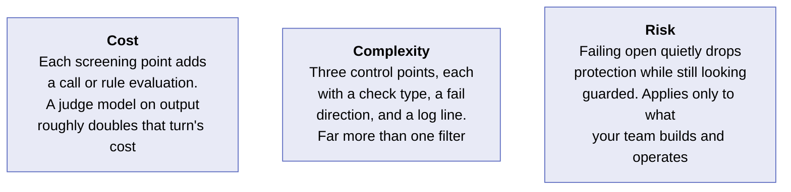
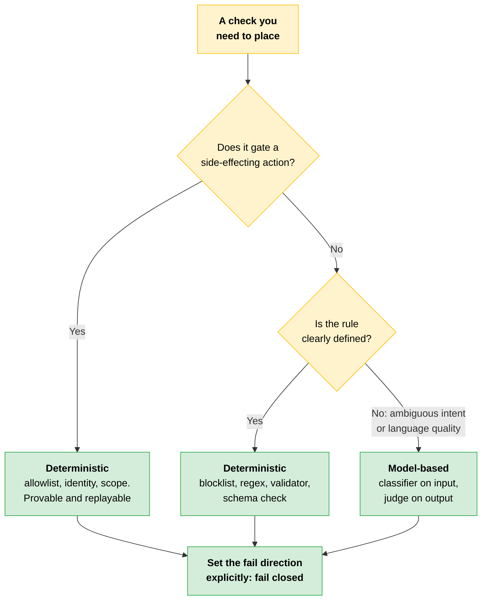

# Guardrails: Risks, Screening, and Authorization

[Alignment](01-Alignment.md) told you which layers are yours. This file is what goes in them: the risks you are defending against, the three points where controls sit, and what each control does when it fails.

---

## The Risk Categories That Recur

Most LLM-system risk falls into a small set of categories. Check every design against each one.

| Category | What happens |
|---|---|
| **Direct prompt injection** | A user crafts input that overrides the system's instructions and redirects its behavior |
| **Indirect prompt injection** | Malicious instructions arrive through retrieved content or tool outputs that the model treats as trusted, and input screening does not catch them |
| **Token-budget exhaustion** | Oversized or adversely padded inputs consume the context or output budget, truncating work or inflating cost |
| **Tool and action abuse** | The model is induced to call a side-effecting tool outside policy. This is the failure the action-authorization control exists to stop |
| **Data exposure** | Sensitive fields enter the context window or the logs where they should not, creating a leak independent of model behavior |

---

## System Vulnerability Assessment: Where to Look

Walk the request path and the data path together. The entry points to inspect:

- User input
- Retrieved content
- Tool outputs
- The model's own output
- The logs

At each one, ask two questions: what could an adversary do here, and which control stands in the way? Look for anywhere a plausible attack meets no control.

> **The Architect's deliverable:** You are expected to conduct and document a risk assessment for a proposed system as part of a security deliverable.

### The Risk Assessment as a Written Artifact

For each identified risk, record six things.

```
┌─────────────────────────────────────────────────────────────┐
│  Risk assessment entry                                      │
├─────────────────────────────────────────────────────────────┤
│  category            → one of the five above                │
│  affected component  → where in the path it lives           │
│  likelihood          → your judgment                        │
│  impact              → your judgment                        │
│  mitigation control  → what stands in the way               │
│  owner               → accountable person                   │
│  evidence artifact   → what a reviewer can inspect          │
└─────────────────────────────────────────────────────────────┘
```

That document is what the security reviewer signs off on.

---

## Where Guardrails Sit in a Request Path

A guarded request path has three decision points, each answering a different question.

| Control | Runs | Decides |
|---|---|---|
| **Input screening** | Before the model call | Whether the request should reach the model at all |
| **Output screening** | Before the response reaches the user | Whether what the model produced is safe to return |
| **Tool-call authorization** | Before any action with side effects | Whether this caller may perform this action in this context |

Side effects mean sending an email, writing to a database, issuing a refund.

> **The key:** These sit at different points and check different things. A control at one place does nothing for the others, which is why a single filter cannot cover the whole path.

### Model-Based or Deterministic, by Decision Point

| Decision point | Model-based check when | Deterministic check when |
|---|---|---|
| **Input screening** | Intent is ambiguous and you are catching jailbreak or prompt-injection patterns that rules cannot exhaustively capture. A lightweight model classifies the input | The rule is clear and defined: a blocklist, a regex, a length or format check. Faster, predictable, and cannot be talked out of its decision |
| **Output screening** | You are evaluating qualities like toxicity or policy compliance that need language understanding. A judge model scores the output | You are checking for a known string, a forbidden field, or a schema violation that a validator catches with certainty |
| **Tool-call authorization** | Rarely. Authorization should be deterministic so it is auditable | Almost always: an allowlist of permitted actions, identity checks, scope validation. The decision must be provable and replayable |

### Why You Chain Them

The two check types fail in opposite directions.

| Check type | How it fails |
|---|---|
| **Model-based classifier** | Can be evaded. A user can phrase an input in a way that bypasses even the strongest judge model |
| **Deterministic rule** | Brittle. It blocks exactly what it is programmed to detect and nothing more, missing anything it did not anticipate and over-blocking anything resembling a restricted pattern |

No control catches everything, so you deploy them in series. Name what each one misses, and cover that gap deliberately with a different control rather than leaving it open.

---

## The Second Injection Vector

User-input screening catches instructions the user sends directly. It does not catch instructions embedded in content the system retrieves or receives from tools.



In a [RAG system](../01-Claude-Platform-and-Solution-Design/07-RAG-Pipeline-Design.md), a malicious instruction in a retrieved document reaches the model after input screening has already passed the request. In an agentic system, a tool response can carry instructions the model treats as authoritative.

This is the dominant injection vector in enterprise deployments with retrieval or tool use. It requires a separate control: screen retrieved content and tool outputs before they are appended to the model's context, using the same model-based classifier you apply to user input.

> **The key:** The blind spot is different because the source is different. Identify it explicitly in your control design.

### Handling Refusals on the API

When streaming classifiers intervene, the Messages API reports it as `stop_reason: "refusal"`, accompanied by a `stop_details` object.

```json
{
  "stop_reason": "refusal",
  "stop_details": {
    "category": "cyber",
    "explanation": "..."
  }
}
```

The object carries a policy category and a readable explanation. Both fields are null when the refusal does not map to a named category.

| Behavior | What to do |
|---|---|
| **Category present** | Read it and route different refusal classes accordingly, not as one undifferentiated event |
| **`stop_details` absent** | Tolerate it and fall back to generic handling |
| **After any refusal** | Reset the conversation context before continuing |

Sending the next request on the same refused context returns further refusals. Remove or rephrase the turn that triggered the refusal, or clear the history.

> **Current practice note:** `stop_details` is available from Claude Opus 4.7 onward. The category set is enumerated in the stop-reasons documentation on platform.claude.com and, as of this writing, includes `cyber`, `bio`, `frontier_llm`, and `reasoning_extraction`. Re-check the list rather than hardcoding it, and verify current model support at platform.claude.com.

---

## Fail Open Versus Fail Closed

A control that screens requests fails the way any dependency fails. It times out, returns an error, or becomes unreachable under load. The difference is that a failing guardrail can still look healthy. A screening service that errors but passes traffic through keeps requests flowing while doing none of the work it was placed there to do.

So when a guardrail errors, the system does one of two things.

| | Fail open | Fail closed |
|---|---|---|
| **Behavior** | Passes traffic through unscreened | Blocks further actions until the control is healthy |
| **What you get** | The unprotected path | Deliberate degradation |
| **Appearance** | Still looks guarded | Visibly blocked |

If you have not made that choice explicitly, the surrounding code decides for you, and the default is almost always to let the request through.

> **The trap:** A guardrail that silently passes traffic when it errors is worse than one that blocks it. It gives you the reassurance of control while providing none of the protection.

This is the same reasoning as the [circuit breaker](../02-Enterprise-Integration-and-Production/02-From-POC-to-Production.md) from the production work. When a dependency in your stack is failing, degrade deliberately.

> **Testable distinction:** Fail open applies to operator-built guardrails, the components your team builds, hosts, and configures. Anthropic's built-in model safety controls are separate: they are not operator-configurable and they do not fail open.

---

## The Full Guarded Request Path



The request arrives. Input screening decides whether it reaches the model. The model produces a response. Output screening decides whether that response is returned. Any tool call the model emits passes through authorization before it runs.

Each gate can pass, block, or fail, and each fail resolves to the direction you chose. Every blocked or failed gate is logged, so an incident can be reconstructed from the record.

---

## Skill Supply-Chain Security

You will hear this objection in the field: "Skills are a black box. I can't see everything inside one until it runs, so how am I supposed to trust it?" Your job is to build a control that compensates.

A [Skill](../01-Claude-Platform-and-Solution-Design/09-Prompt-Architecture-and-Reuse.md) is reusable, distributable code paired with an instruction set, bundled together and dropped into your environment. That distribution model is what makes it a supply-chain risk.

An untrusted skill can carry a code-execution exploit: logic that runs commands, reaches the network, or touches files the moment it is invoked. Hidden malicious instructions inside the bundle are invisible to your input filters and prompt screening, because those watch the conversation and the threat was baked in upstream. Output monitoring might catch a downstream effect after the fact, but by then the code has run.

The defense moves earlier in the chain.



Open the bundle and read it for two things.

| What to look for | Examples |
|---|---|
| **Anomalous calls** | Network requests, shell execution, file-system access, credential reads |
| **Out-of-scope operations** | Behavior that does not match the job it claims to perform: a formatting skill that phones home, a summarizer that writes to disk |

The stated purpose of the skill is your audit baseline. Anything beyond it is a finding to investigate.

The audit tells you what is in the bundle. A skill that passes review clean can still reach out at runtime to fetch code that was never in the package you read. So the gate needs a net: run skills with least privilege in a sandbox, with limited file access, limited network, and no standing credentials they do not need. The audit decides what gets in. Runtime confinement contains what the audit missed. Neither works properly without the other.

A trusted-source policy shrinks the surface you must audit and stops untrusted bundles before they reach review.

> **The rule of candor:** Do not assume the platform screens skills for you. Read the documentation, confirm the scope of any automated scanning, and find out what it does and does not catch.

Every audit ends in an explicitly recorded verdict.

| Verdict | Means |
|---|---|
| **Approve** | Clean and cleared for use |
| **Reject** | Does not enter the environment |
| **Remediate** | A fixable problem was found. Strip the offending call, sandbox the operation, or pin a safer version, then re-audit |

You may never see everything a skill can do. The audit verdict and the trusted-source policy are the compensating controls that let you act responsibly anyway.

---

> [!CAUTION]
> **Output filtering is the control you can point to: a clean box on the architecture diagram, firing where a reviewer can watch it, at the end of the path where risk feels most concrete.** Add one classifier on the output and the diagram looks complete, so the review passes. The problem is that the most important thing the system does may have happened before that classifier ran.
>
> A customer service agent has access to an `issue_refund` tool. A user submits a request.
>
> ```text
> 1  request received            (no input screening configured)
> 2  model emits tool_use: issue_refund(order=...)
> 3  tool executes, refund issued (no authorization gate before the side effect)
> 4  output filter inspects generated text
>       → passes, because the action it described had already happened
> ```
>
> A refund is a financial action: the tool reverses a charge and returns money from the company to the customer's account. Only after the money moved did the output filter look at anything.
>
> A control could have sat in three places on this path: screening the request on the way in, authorizing the tool call before it executed, and filtering the response on the way out. This system had only the last one, and it sat downstream of the only action on the path that could not be undone.
>
> **The lesson:** A control at one point was treated as covering three. Output screening judges text, not actions. A side-effecting tool needs authorization before it runs, and an unscreened input has no gate at all.

---

## Cost · Complexity · Risk



---

## Quick Revision



| Concept | One-line summary |
|---|---|
| **Five risk categories** | Direct injection, indirect injection, token-budget exhaustion, tool and action abuse, data exposure |
| **Vulnerability assessment** | Walk the request and data paths: user input, retrieved content, tool outputs, model output, logs |
| **Risk assessment artifact** | Category, component, likelihood and impact, mitigation, owner, evidence. The reviewer signs this |
| **Three control points** | Input screening before the model, output screening before the user, authorization before any side effect |
| **Model-based check** | For ambiguous intent and language-quality judgments. Can be evaded |
| **Deterministic check** | For defined rules and all authorization. Brittle: catches only what it anticipated |
| **Indirect injection** | Instructions inside retrieved content and tool outputs. Screen them separately before they enter context |
| **Refusal handling** | `stop_reason: "refusal"` plus `stop_details`. Route by category, then reset the context |
| **Fail closed** | Block until the control is healthy. Choose it explicitly or the code chooses fail open for you |
| **Skill supply chain** | Trusted source, audit for anomalous and out-of-scope calls, recorded verdict, sandboxed runtime |

### Exam Traps

| If you see... | The trap | The right call |
|---|---|---|
| One output classifier on the diagram | Call the path guarded | Output screening judges text, not actions. Three points, three controls |
| A screening service erroring under load | Keep traffic flowing so requests do not break | Fail closed. A control that passes traffic while erroring is worse than no control |
| "Our guardrails fail open" as a blanket statement | Apply it to Anthropic's model safety controls too | Fail direction is yours only for operator-built controls. Anthropic's are not operator-configurable and do not fail open |
| Tool-call authorization in a design | Use a judge model for nuanced permission calls | Authorization is deterministic: allowlist, identity, scope. It must be provable and replayable |
| Input screening already in place on a RAG system | Assume injection is covered | Retrieved content and tool outputs bypass input screening. They need their own classifier |
| A refusal returned mid-conversation | Retry on the same conversation history | Reset the context first. The same refused context returns further refusals |
