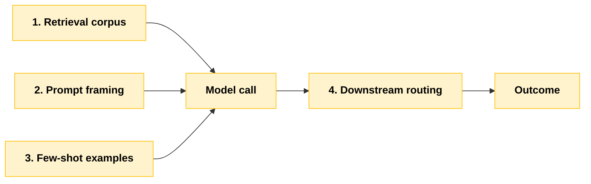
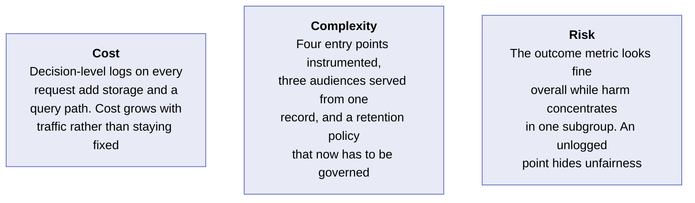
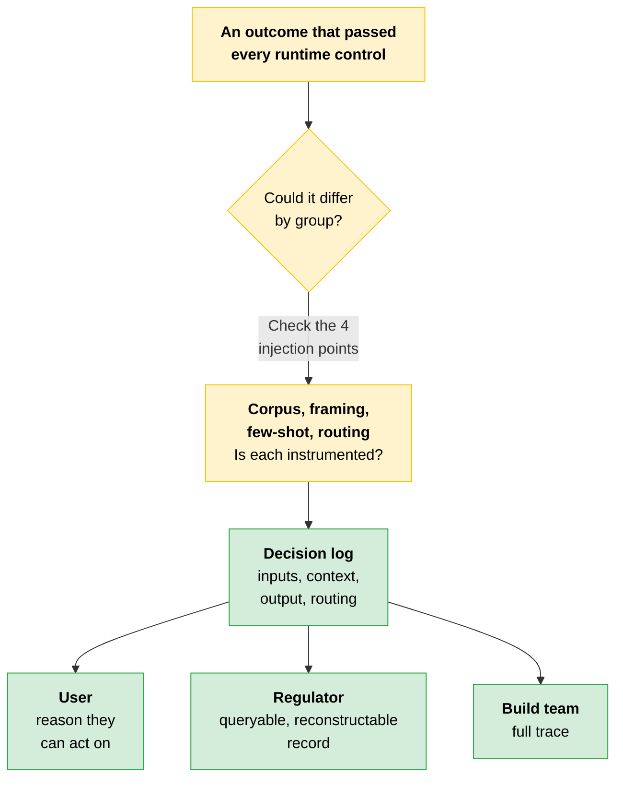

# Fairness and Transparency: Where Unequal Outcomes Enter

The [runtime controls](02-Guardrails.md) stop disallowed outputs from leaving the system, so users never see them. They do nothing about an output that passes every check and still produces different outcomes for different people.

That failure is harder to detect and harder to attribute, because on its surface it looks like a normal output.

---

## Unequal Outcomes Enter at Identifiable Points

Fairness gets easier to design for once you stop treating it as a single attribute of the model and start treating it as something that enters at specific points. A Claude system has four common ones.



| Injection point | How skew enters |
|---|---|
| **Retrieval corpus** | Over-represents or under-represents groups, so the context the model sees is already skewed |
| **Prompt framing** | Encodes an assumption that pushes outcomes in one direction |
| **Few-shot examples** | Carry the same skew the corpus does |
| **Downstream routing** | What happens to the output after it is produced can direct some groups down different paths |

Three sit before the model call. One sits after it.

> **The key:** Each of these is an injection point you can inspect. That is what makes fairness a true architectural property rather than a model attribute.

---

## Who Asks Determines What the System Explains

| Audience | What they need | What that requires you to capture |
|---|---|---|
| **An affected user** | A clear explanation of why a decision affecting them was made, expressed in terms they can act on | The inputs that drove the decision and the reason the outcome was reached, in a digestible form |
| **A regulator** | Evidence that the system treats comparable cases consistently, and that a specific decision can be reconstructed on demand | A durable, queryable record of inputs, outputs, and decision path |
| **Your build team** | Enough detail to find why a flagged decision went wrong and fix it | The full trace: prompt, retrieved context, model output, and every routing step, tied to existing observability |

Three audiences, three different slices of the same record.

---

## Decision Logging Makes Those Explanations Possible

To replay and explain a single decision, capture four things.

```
┌──────────────────────────────────────────────────────────┐
│  Decision log record                                     │
├──────────────────────────────────────────────────────────┤
│  inputs             → what drove the decision            │
│  retrieved context  → what the model saw                 │
│  model output       → what it produced                   │
│  routing            → every step the output went through │
└──────────────────────────────────────────────────────────┘
```

This is the same instrumentation as the [observability work](../02-Enterprise-Integration-and-Production/05-AB-Testing-and-Observability.md), applied to a different question.

> **Testable distinction:** Observability asks whether the system is healthy. Decision logging asks why a specific decision happened. The instrumentation is the same. The retention and the query path are different.

---

## The Checklist in Action

Run it against a credit-decision support system and the criteria stop being abstract.

- Which of the four entry points could skew this outcome, and is each instrumented?
- For an adverse decision, can you produce the inputs and the reason in terms the applicant can act on?
- If a regulator asks whether similar applicants were treated comparably, can you query the log and answer?
- Can your team pull the full trace for any flagged decision?

> **The test:** A "no" anywhere is a design gap.

---

## Discernment

[Discernment](../../Foundations/01-AI-Fluency-Framework-and-Foundations/README.md#3-discernment) is one of the four AI Fluency competencies: evaluating AI outputs and behaviors. In practice it means judging whether a model output is acceptable, needs revision, or needs override, rather than accepting it.

Applied to fairness, discernment is what lets a reviewer recognize a skewed or unjustified outcome instead of only confirming that a value was produced.

> **The key:** A transparency record is what makes that recognition possible in the first place.

---

> [!CAUTION]
> **Fairness looks like a property of the model.** The provider trained it, ran the bias evaluations, and published the results, so treating fairness as handled upstream feels reasonable. That framing holds up until your system pairs the model with your own retrieval corpus.
>
> A team used a model that passed its fairness evaluations. The skew entered at a point they had not thought to watch. One architect described the gap in the post-incident review:
>
> > "We assumed fairness was the model's job. The skew was in our retrieval corpus, and we had logged so little that we could not prove it."
>
> The unequal outcomes did not come from the model's training. They came from a corpus that over-represented some cases, an injection point nobody monitored because fairness had been assigned to the vendor.
>
> When the outcomes were questioned, there was no decision-level log to reconstruct what had happened. The team could neither explain the specific decisions nor rule out the corpus as the cause, which left them unable to answer the only question the regulator was asking: where did the skew come from?
>
> **The lesson:** Unequal outcomes enter at points the architect controls, and the retrieval corpus is one of them. Fairness and explainability are architecture requirements. Instrument them where skew can enter, because assuming they arrive with the model leaves those points unmonitored.

---

## Cost · Complexity · Risk



> **Data handling:** The decision log is itself in scope for the compliance register. Under HIPAA or GDPR, logged inputs and retrieved context contain sensitive personal data. Apply minimization, retention limits, and access controls to the log, and map it as a named control. Logging everything for transparency and pinning data for compliance are not in conflict: they need the same log, governed differently.

---

## Quick Revision



| Concept | One-line summary |
|---|---|
| **The fairness blind spot** | An output that passes every check and still produces different outcomes for different people |
| **Four injection points** | Retrieval corpus, prompt framing, few-shot examples, downstream routing |
| **Fairness as architecture** | Each injection point is inspectable, which makes fairness a design property rather than a model attribute |
| **Three audiences** | Affected user, regulator, build team. Each needs a different slice of the same record |
| **Decision log** | Inputs, retrieved context, model output, routing. Enough to replay one decision |
| **Observability vs decision logging** | Same instrumentation. One asks if the system is healthy, the other asks why one decision happened |
| **The checklist** | Instrumented points, actionable adverse-decision reason, queryable comparability, full trace on demand |
| **Discernment** | Judge an output as acceptable, needs revision, or needs override. The record makes that possible |
| **Log as regulated data** | The decision log is in scope for the compliance register: minimization, retention limits, access controls |

### Exam Traps

| If you see... | The trap | The right call |
|---|---|---|
| Every guardrail passed the output | Conclude fairness is covered | An unequal outcome looks like a normal output. Runtime controls do not detect it |
| The model passed the vendor's bias evaluations | Treat fairness as handled upstream | Skew enters at points you own. Your retrieval corpus is one the vendor cannot see |
| The overall outcome metric looks healthy | Call the system fair | Harm can concentrate in one subgroup while the aggregate stays fine |
| A regulator asks about comparable treatment | Produce the vendor's evaluation report | They need a durable, queryable record that reconstructs a specific decision |
| An affected user asks why they were declined | Hand over the full trace | The user needs inputs and a reason they can act on. The full trace is the build team's slice |
| HIPAA or GDPR data in the decision log | Treat transparency and compliance as conflicting goals | Same log, governed differently: minimization, retention limits, access controls, named in the register |
