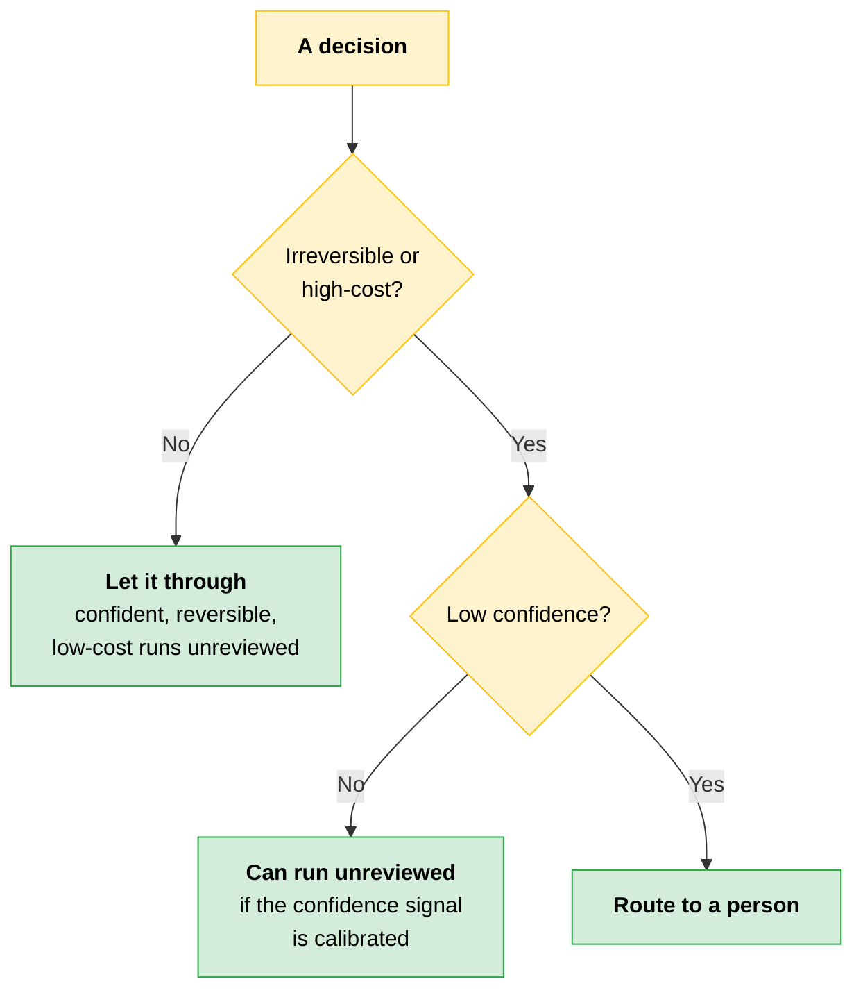
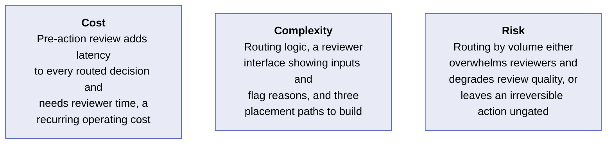
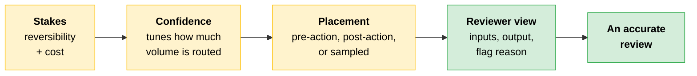

# Review Routing: By Stakes, Not by Volume

[Decision logging](03-Fairness.md) gave you a record of what each automated decision was based on: the inputs it saw, the path it took, the output it produced. A log explains decisions after the fact. It does not decide which decisions a person should weigh in on before they take effect.

> **Testable distinction:** A log explains a decision after the fact. A routing rule stops the wrong ones from taking effect at all.

Two questions here: which decisions warrant a human review step, and what that reviewer must see on screen to make the call quickly. The log is the raw material for that view, so this is about deciding what to surface from it and when, not instrumenting the system again.

---

## What Sets the Stakes

Treat human review as a budget. You have a finite amount of reviewer attention and must focus it on the highest-stakes items.

| Variable | What it is | Role |
|---|---|---|
| **Reversibility** | How easily a wrong decision can be undone | Sets the stakes |
| **Cost of a wrong decision** | What the mistake causes if it goes through uncorrected | Sets the stakes |
| **Confidence** | The score the system produces about its own output | Sits on top. Estimates how likely this output is to be wrong |

A choice that is hard to reverse and expensive when wrong is high stakes, regardless of how the system arrives at it.

> **The key:** Confidence does not change the stakes of a decision. It tells you how much of your volume should be routed to a person.

Combine the three into one rule.



Route decisions to a person when they are low-confidence and either irreversible or high-cost. A confident, easily reversed, low-cost decision can usually run without a human. A low-confidence, irreversible, high-cost decision almost always needs review.

### When the Variables Disagree

The decisions that consume your review budget are the ones where the variables conflict. A case can be high cost but easily reversed, or low confidence on something trivial to undo.

> **Rule of thumb:** Give greater weight to cost and reversibility, because they determine the consequences of a mistake. Let confidence decide how much of that high-stakes volume you can safely let through unreviewed.

Routing on confidence carries one assumption worth naming: the confidence signal must be calibrated for the rule to hold, and a model can be confidently wrong. Confirming that calibration is a task of its own.

---

## Where the Human Sits

Once a decision is routed to a person, you choose where they sit in the flow. Involving a human earlier is safer and slower.

| Placement | What it gives you | What it costs |
|---|---|---|
| **Pre-action approval** | The action cannot take effect until a person approves, so nothing irreversible happens unreviewed | Latency on every routed decision, and a person must be available. Does not scale to high volume |
| **Post-action audit** | The action runs immediately and a person reviews it afterward, so throughput stays high | The wrong action has already taken effect by the time it is caught. Suits reversible, lower-cost decisions only |
| **Sampled review** | A fraction of decisions are reviewed to monitor quality without slowing the process | A bad decision can slip through unsampled. It monitors the system rather than guarding individual outcomes |

---

## What the Reviewer Sees

A reviewer who cannot see why a decision landed in their queue may approve it without the judgment it needed. Give them three things.

```
┌──────────────────────────────────────────────────────────────┐
│  Reviewer view                                               │
├──────────────────────────────────────────────────────────────┤
│  inputs        → without these, they cannot tell if the      │
│                  output is correct                           │
│  model output  → what the system produced                    │
│  flag reason   → without this, they cannot tell an edge case │
│                  from routine traffic                        │
└──────────────────────────────────────────────────────────────┘
```

What you put in front of the reviewer determines whether the review is accurate.

### Consent Fatigue

**Consent fatigue** is what happens when a system asks for approval dozens of times in a row and reviewers start clicking through, approving items without reading them or giving the quality of review needed.

> **Current practice note:** Anthropic's research on agent autonomy found that requiring sign-off on every action adds friction without meaningful safety gain. The better approach is a person monitoring what is happening and stepping in when needed. One Anthropic pattern in agent workflows is to reduce per-step approvals and move review to higher-value checkpoints such as plan review or exception handling. The exact review design depends on the risk of the workflow. Verify current framing against `anthropic.com/research/measuring-agent-autonomy` and `anthropic.com/research/trustworthy-agents`.

That pattern is what led to plan-level review in Claude Code, where a person approves the plan rather than each step.

---

## Diligence

[Diligence](../../Foundations/01-AI-Fluency-Framework-and-Foundations/README.md#4-diligence) is one of the four AI Fluency competencies: ensuring responsible AI collaboration. Applied to deployment, it means three things.

- Maintaining explicit human accountability checkpoints
- Recognizing when automation pressure is eroding oversight
- Auditing workflows for gaps where AI acts without review, especially as automation scales

For agent workflows, the routing rule becomes a checkpoint pattern. A [human-in-the-loop checkpoint](../01-Claude-Platform-and-Solution-Design/05-Multi-Agent-Systems-and-Orchestration.md#human-in-the-loop-checkpoints) is a gate that pauses execution for review, positioned by that task's risk and reversibility. Place a gate before any irreversible or high-stakes action an agent would otherwise take autonomously, and sample lower-stakes actions instead of gating each one.

This is the same gate vocabulary multi-agent design depends on.

---

> [!CAUTION]
> **Deciding which decisions count as high stakes takes judgment, and routing everything to review removes that step.** It feels like the conservative default: easy to defend to a compliance reviewer or an auditor, and it requires no call about where the stakes sit. Routing everything feels safe precisely because it spares you from drawing the line.
>
> **Reviewer:** There are four hundred items in my queue today. Same as yesterday.
>
> **Lead:** Are you reading the inputs on each one?
>
> **Reviewer:** There's no way. I get the output and an approve button, that's it. I don't even see the inputs, or why this one landed with me. After the first hour I have to just hit approve to keep up with the pace.
>
> The design sent all outputs for review and gave the reviewer the output alone, with no inputs and no flag reason. The volume made careful review impossible, and the missing context made it pointless. A high-stakes decision in that queue got the same routine approval as a trivial one.
>
> **The lesson:** Two independent failures stacked here, and either one alone is enough. Fixing one still leaves review broken.

Both failures need their own fix.

| Failure | Why review breaks | The fix |
|---|---|---|
| **Volume** | When items routed to a person exceed what they can read in the time they have, oversight that covers everything reviews nothing, because the reviewer disengages to keep up | Route by stakes using confidence, reversibility, and cost, so the queue holds only decisions that warrant attention |
| **Missing context** | A reviewer with only the output and an approve button has nothing to check the output against, so even a short queue is hard to judge | Surface the inputs the decision was based on and the reason the item was flagged |

A small queue with no context fails. A well-built reviewer view drowning under volume fails too.

---

## Cost · Complexity · Risk



---

## Quick Revision



| Concept | One-line summary |
|---|---|
| **Log vs routing rule** | The log explains a decision afterward. The routing rule stops the wrong one from taking effect |
| **Review as a budget** | Reviewer attention is finite. Spend it on the highest-stakes items |
| **Reversibility and cost** | The two variables that set the stakes, independent of how the system reached the decision |
| **Confidence** | Estimates how likely this output is wrong. Tunes routed volume. Useful only if calibrated |
| **The routing rule** | Route when low-confidence and either irreversible or high-cost |
| **When they conflict** | Weight cost and reversibility. Confidence decides how much high-stakes volume goes through unreviewed |
| **Three placements** | Pre-action approval, post-action audit, sampled review. Earlier is safer and slower |
| **Reviewer view** | Inputs, model output, flag reason. Missing any one degrades the review |
| **Consent fatigue** | Dozens of approvals in a row turn review into clicking through. Move to plan-level or exception review |
| **Checkpoint pattern** | The routing rule as an agent gate, placed by risk and reversibility |

### Exam Traps

| If you see... | The trap | The right call |
|---|---|---|
| Every output routed to a human reviewer | Call it the conservative, defensible default | Volume beyond what a person can read turns review into approval. Route by stakes |
| High confidence on an irreversible, high-cost action | Let it through because the score is high | Cost and reversibility set the stakes. Confidence only tunes how much volume is routed |
| A confidence score in the routing rule | Use it as-is | It holds only if calibrated, and a model can be confidently wrong. Confirming calibration is its own task |
| An agent asking sign-off on every step | Treat per-step approval as maximum safety | It adds friction without meaningful safety gain and causes consent fatigue. Move to plan review or exception handling |
| A short queue with only an output and an approve button | Assume low volume makes review sound | Volume and missing context are independent failures. Fixing one still leaves review broken |
| Post-action audit on an irreversible decision | Count the audit as the control | The action already took effect. Irreversible decisions need pre-action approval |
