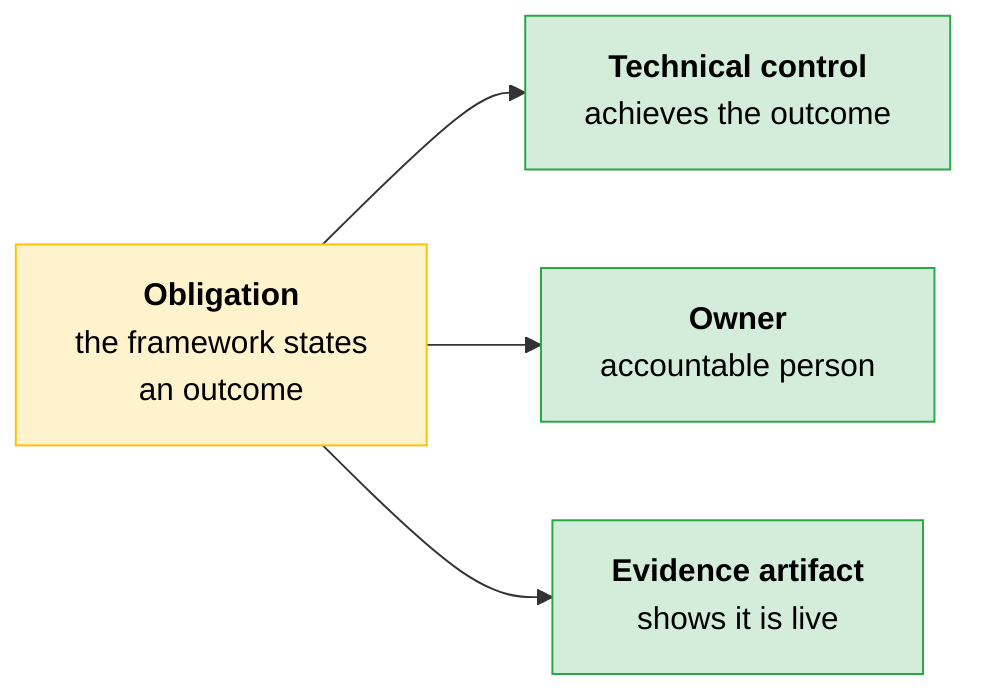
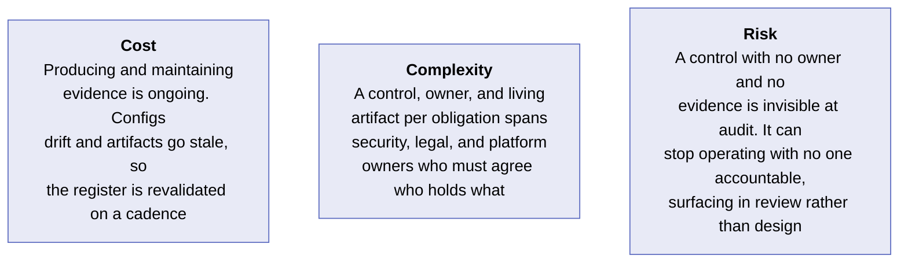
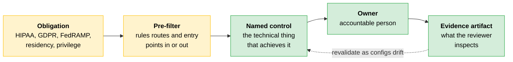

# Compliance: Obligation, Control, Owner, Evidence

The [compliance layer of the integration model](../02-Enterprise-Integration-and-Production/04-Enterprise-Integration-Patterns.md) used the governing obligation as a pre-filter. HIPAA, GDPR, FedRAMP, attorney-client privilege, or a data-residency policy each ruled [delivery routes and entry points](../01-Claude-Platform-and-Solution-Design/11-Delivery-Routes-and-Regulated-Constraints.md) in or out before cost or engineering preference entered the conversation.

That gets you to an entry point and a route that survives the obligation. The next step is narrower and harder. Each surviving obligation must become a control with a named owner.

> **The key:** A reviewer does not treat a compliant entry point as proof that the rule is being followed. They ask who owns the control and what evidence shows it holding in practice.

---

## A Regulation States an Outcome. You Supply the Control.

Frameworks such as GDPR, HIPAA, and FedRAMP state outcomes, not implementations. They say what must be true: protected data handled a certain way, access controlled, processing in an authorized environment. They leave the technical control to you.

Each obligation becomes three things you own.



> **The trap:** The evidence artifact is the one most often missed. It is also the one the reviewer checks.

---

## The Control Register

Each row is one obligation carried all the way to proof.

```
┌────────────────────────────────────────────────────────────┐
│  Control register entry                                    │
├────────────────────────────────────────────────────────────┤
│  obligation        → the framework and what it requires    │
│  technical control → how you achieve the outcome           │
│  evidence artifact → what a reviewer can inspect           │
│  owner             → who is accountable                    │
└────────────────────────────────────────────────────────────┘
```

| Obligation (framework) | Technical control | Evidence a reviewer accepts | Owner |
|---|---|---|---|
| **Protected health data handled under an agreement (HIPAA)** | A HIPAA-ready Enterprise plan or first-party API configuration covered by a signed Business Associate Agreement | The signed BAA, the admin setting showing HIPAA compliance enabled, and the eligible-feature list | Security lead |
| **US government workload at the required impact level (FedRAMP)** | An Anthropic-documented authorized route that meets the required impact level | The authorization record for the route and confirmation the workload runs exclusively on it | Platform owner |
| **Data handled and stored in an approved region (data residency)** | Supported regional processing and storage configured for the approved region | The residency configuration and a data-flow record showing where every copy lives | Data owner |
| **Decisions reconstructable on demand (transparency, cross-framework)** | The [decision logging](03-Fairness.md) from the fairness work, retained and queryable for the required period | A sample reconstruction of one decision from the live log | Architect |

Two rows carry a detail the table cannot hold. For HIPAA, the configuration counts only with HIPAA compliance enabled and only eligible features in scope. For residency, configuring the region is not the whole control: validate whether logs, caches, monitoring, and retention paths remain within the approved boundary.

> **Testable distinction:** Training use and retention are two separate claims. Data may be excluded from model training by default while still being retained or monitored for logging, abuse prevention, legal compliance, or configured audit purposes. Do not collapse them into one.

---

## The Evidence Artifact Makes the Handoff

The constraint-elimination reasoning from the integration work carries forward. Back then you eliminated delivery routes that could not survive a constraint. Now you record, for each obligation, the control that satisfies it and the artifact that proves it.

| A reviewer accepts | A reviewer does not accept |
|---|---|
| A signed agreement | A design document that identifies a control |
| A configuration screen | A control with no named owner |
| An authorization record | A control with no evidence artifact |
| A returned log query | |

> **The key:** A control no one can demonstrate is indistinguishable from one that is not running.

---

> [!CAUTION]
> **Passing the constraint pre-filter and being able to prove compliance are two different things.** The pre-filter gives a clean signal: the route is allowed, the entry point is cleared, the design moves. Proving each obligation is met produces nothing visible at design time, because the proof is an artifact you build, attach to an owner, and keep alive as configurations change. The moment that feels like a finish line and the moment a reviewer checks are often months apart.
>
> A team selected a compliant delivery route for a regulated workload and treated compliance as settled. They had mapped obligations to controls once, at design time, in a document. No owner was attached to the controls, and no logging was wired to show any control was operating.
>
> The data residency obligation is where the failure concentrated. The control was correct on paper: processing pinned to the approved region. Months later a logging configuration changed and started writing request metadata to a store in a second region.
>
> Nothing identified the change, because no one owned the residency control and no artifact tracked where data was landing. The gap surfaced at the audit, when a reviewer asked for evidence that data stayed in-region and the team produced a design document instead of a data-flow record.
>
> **The lesson:** A compliant route is a prerequisite, not proof. The residency control was real at design time and silently false in production, and nothing caught the difference because no artifact was watching it.

---

## Cost · Complexity · Risk



Review is the most expensive place to find a gap.

---

## Quick Revision



| Concept | One-line summary |
|---|---|
| **Outcome, not implementation** | Frameworks say what must be true and leave the technical control to you |
| **The three things you own** | A control that achieves the outcome, an accountable owner, an artifact showing it is live |
| **Entry point as pre-filter** | A compliant route is a prerequisite for the register, not proof of compliance |
| **HIPAA control** | HIPAA-ready plan or first-party API under a signed BAA, compliance enabled, eligible features only |
| **FedRAMP control** | An Anthropic-documented authorized route at the required impact level, used exclusively |
| **Residency control** | Regional processing and storage, plus validation that logs, caches, monitoring, and retention stay in boundary |
| **Transparency control** | The decision log, retained and queryable, evidenced by reconstructing one real decision |
| **Training use vs retention** | Excluded from training does not mean not retained. Two separate claims |
| **Accepted evidence** | Signed agreement, configuration screen, authorization record, returned log query |
| **Revalidation** | Configurations drift and artifacts go stale, so the register is rechecked on a cadence |

### Exam Traps

| If you see... | The trap | The right call |
|---|---|---|
| A compliant delivery route selected | Treat compliance as settled | The route is a prerequisite. Each obligation still needs a control, an owner, and evidence |
| A design document mapping obligations to controls | Offer it as proof at review | Reviewers accept a signed agreement, a config screen, an authorization record, or a log query |
| "Our data is not used for training" | Conclude it is not retained | Retention for logging, abuse prevention, legal compliance, or audit is a separate claim |
| A signed BAA for a HIPAA workload | Call the control complete | HIPAA compliance must also be enabled, with only eligible features in scope |
| Regional processing configured for residency | Consider the boundary proven | Logs, caches, monitoring, and retention paths can land data elsewhere. Validate and keep a data-flow record |
| A correct control with no named owner | Accept it because the control exists | Unowned controls stop operating unnoticed and surface as a gap at audit |
