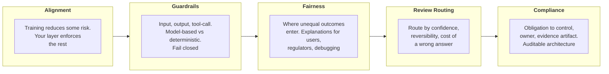

# Responsible AI, Safety & Risk for Architects

Design the full safety stack for a Claude system, placing each control and deciding what happens when one fails.

**Notes:** 5 | **Status:** Complete

Course length: 114 min.

[Module 2](../02-Enterprise-Integration-and-Production/README.md) ended with an operational production system: ownership assigned, a reference architecture and model chosen, the use case sized, evals built as acceptance criteria, and Claude wired into an enterprise stack. This module asks the security question that follows. What stops the system from refusing a valid request, producing an unfair outcome, or taking an action no one approved?

Safety here is not one filter. It is a set of controls, each covering a different part of the request path, each with a blind spot the next one has to catch. The Architect places each control and decides what happens when it fails.

> **The framing:** Claude arrives with broad safety behavior in place. It does not know the partner's data-handling rules, authorization model, or domain policy. Assuming Claude enforces a rule it was never given is the most common way a safety design fails.

The running context is a system that passes every architecture review and still fails in production, because the responsibility layer was incomplete, assumed, or correct at design time and wrong by the time someone audited it. The partners are enterprise buyers in regulated settings, where a control that looks solid in a demo becomes an audit finding when configurations drift or a reviewer asks for evidence the control is running.

---

## Notes in This Module

| Notes | Covers |
|---|---|
| [01-Alignment](01-Alignment.md) | The constitution and its priority order, training-time alignment versus inference-time control, the four-layer stack and who owns each |
| [02-Guardrails](02-Guardrails.md) | The five risk categories and the risk-assessment artifact, the three control points, model-based versus deterministic checks, indirect injection and refusal handling, fail closed, skill supply-chain security |
| [03-Fairness](03-Fairness.md) | The four injection points, what each audience needs explained, decision logging versus observability, the fairness checklist, discernment, the log as regulated data |
| [04-Review-Routing](04-Review-Routing.md) | Reversibility, cost, and confidence; the routing rule and what to weight when they conflict; three placements; the reviewer view; consent fatigue; diligence |
| [05-Compliance](05-Compliance.md) | Obligation to control, owner, and evidence artifact; the control register with HIPAA, FedRAMP, residency, and transparency rows; training use versus retention; what a reviewer accepts |

---

## Five Decisions in the Safety Stack

Each decision maps onto one section of the module, and each builds on the one above it.

| # | Decision | What you're answering | Failure if you skip it |
|---|----------|-----------------------|------------------------|
| 01 | **Alignment boundary** | Where is the line between what training already reduces and what your application layer must still enforce? | A domain policy assumed to be covered by trained alignment goes unenforced in every layer |
| 02 | **Guardrail placement** | Where on the request path do input screening, output screening, and tool-call authorization sit, and is each check model-based or deterministic? | A single filter at the end of the path misses the other two points; a control that fails open looks like protection and gives none |
| 03 | **Fairness and transparency** | Where can unequal outcomes enter, and what logging lets you explain a decision afterward? | The four injection points go uninstrumented, so no decision can be reconstructed |
| 04 | **Human-review routing** | Which decisions need a person, and what does that reviewer need to do the job? | Routing by volume floods the queue and reviews collapse into rubber-stamp approvals |
| 05 | **Compliance control register** | What is the named control, accountable owner, and evidence artifact for each obligation? | A control with no owner and no living artifact goes non-operational unnoticed, then surfaces as an audit gap |

The dependencies run downward. The boundary drawn in the first section is enforced by the controls in the second. The logging built for fairness is the same logging the reviewer uses in the fourth. The control register in the fifth draws on every instrumented layer above it. Choosing a compliant entry point is a prerequisite for the register.

---

## Learning Objectives

| Objective | One-liner |
|-----------|-----------|
| **Alignment** | Distinguish what the model's training reduces from what your application layer must still enforce |
| **Guardrails** | Place input screening, output screening, and tool-call authorization at the right points, choose model-based or deterministic checks, and make the system fail closed instead of open |
| **Fairness** | Identify where unequal outcomes arise and define the explanations users, regulators, and your debugging team each need |
| **Review Routing** | Route decisions to the right reviewer based on confidence, reversibility, and the cost of a wrong answer, so review effort lands on decisions that warrant it |
| **Compliance** | Map each obligation to a named control, an owner, and an evidence artifact, so the architecture can be accurately audited |

The module ends with a cumulative task: assemble all five layers into a defensible deployment from a single brief, the way you would in front of a security reviewer or compliance auditor.

---

[Back to Professional](../README.md) · [Back to the study guide](../../README.md)
