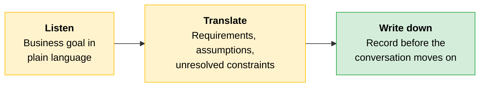
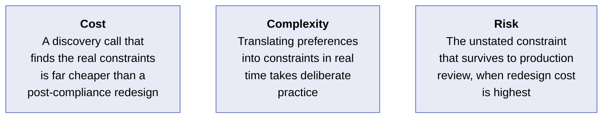
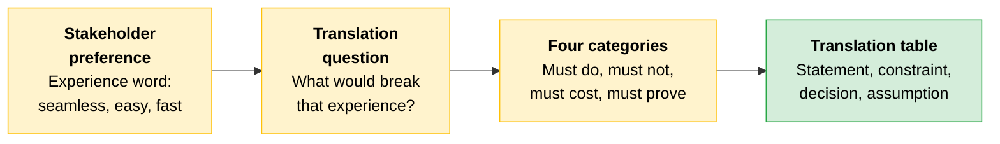

# Discovery: Preference to Constraint

A discovery call is a structured elicitation, not a conversation. You know how to evaluate the [pattern](../01-Claude-Platform-and-Solution-Design/04-Choosing-a-Pattern.md), the [deployment platform](../01-Claude-Platform-and-Solution-Design/11-Delivery-Routes-and-Regulated-Constraints.md), and the [control posture](../03-Responsible-AI-Safety-and-Risk-for-Architects/README.md). Discovery reveals whether you are solving the right problem.

A stakeholder describes the problem in business terms. Your job is to listen to what the business is trying to achieve, identify the constraints hidden inside that description, and leave the call with a record the design can follow.

---

## The Three-Step Filter

Discovery functions as a three-step filter: listen, translate, write down.



| Step | What you do | Why it matters |
|---|---|---|
| **Listen** | Hear the business goal in plain language. Pay attention to the meaning behind the word | Stakeholders describe the outcome they want, not the constraint you need to design for |
| **Translate** | Turn what you heard into requirements, assumptions, and unresolved constraints | This separates what the design must support from what still needs confirmation and what could block the solution later |
| **Write down** | Record each item before the conversation moves on | Without the filter, the design inherits your assumptions. The mismatch may not surface until changing trajectory is slow, hard, and expensive |

---

## The Core Move: Translation

The most important skill in discovery is translation. Stakeholders speak in preferences. Design decisions are made against constraints.

A stakeholder says, "We want this to feel seamless." If you write down "seamless" as the requirement, you have not learned enough to design anything. You only have the stakeholder's summary of the experience they want.

The real work starts with the next question: **what would make it feel not seamless?** That is where the hidden constraints begin to appear.

```
┌──────────────────────────────────────────────────────────────┐
│  "We want this to feel seamless"                             │
├──────────────────────────────────────────────────────────────┤
│  What breaks it?                                             │
│  ├── User waits too long       → latency target              │
│  ├── User re-enters known data → integration requirement     │
│  ├── Error message shown       → graceful failure path       │
│  └── User leaves the app       → single-application rule     │
└──────────────────────────────────────────────────────────────┘
```

Each answer sharpens the design. "Seamless" becomes a latency target, an integration requirement, a handoff rule, and a safe failure path. The stakeholder named the outcome in business language. You turned it into something the system can be built and measured against.

> **Rule of thumb:** When a stakeholder gives you an experience word (seamless, easy, fast, simple, intuitive), treat it as a signal that more discovery is needed, not as a requirement you can design against. Ask what would break that experience, what the user must never notice, what has to happen behind the scenes, and what must still be true when something goes wrong.

---

## Four Categories That Turn Discovery Into Requirements

Force every vague stakeholder statement into four buckets. A statement like "we want this to feel seamless" is not yet something you can design against. It hides one or more specific answers across these categories.

| Category | What you're asking | What it produces |
|---|---|---|
| **Must do** | What capabilities must the deployment deliver, as business outcomes? | The work Claude owns versus what stays with an existing system or a human |
| **Must not do** | What is prohibited? What must route to a human? | Boundaries and forbidden actions. Stakeholders rarely volunteer these, so ask explicitly |
| **Must cost** | What is the budget constraint, in terms the stakeholder controls? | A latency target, a per-interaction cost ceiling, a volume forecast. These become design constraints |
| **Must prove** | What evidence must the deployment produce? | Proof obligations. In regulated workflows, these are part of the requirement set. Identifying them in discovery is far cheaper than during a legal review weeks later |

> **The key:** "Seamless" may really mean a latency budget the user should not notice, a handoff that should not interrupt the flow, or a failure state that must not expose system internals. Once you discover those answers, you have requirements the team can design for, test, and defend.

---

## The Output: A Translation Table

Each item found in discovery becomes one row in a translation table. The row captures the stakeholder statement as it was said, the constraint it implies, the architectural decision that constraint forces, and any assumption you are documenting when the constraint has not yet been confirmed.

| Stakeholder statement | Implied constraint | Required architectural decision | Assumption to document |
|---|---|---|---|
| "We want this to feel seamless." | The experience must stay inside an agreed-upon latency budget. Failures must not expose system internals or break the flow | Set a p95 latency target as a design constraint, then design a graceful, internal-safe failure state | Assumes "seamless" refers to perceived responsiveness and continuity of flow. Confirm understanding |
| "It just needs to read the form and route it." | Routing may be a deterministic business rule | Keep the routing decision in the rule engine. Claude extracts, and the system routes | Assumes the routing logic is owned and maintained outside the model. Confirm owner |
| "Clinicians will review the output anyway." | A licensed human must authorize output before it becomes part of a record with legal, financial, or clinical consequence | Build a human-in-the-loop authorization step as a mandatory [checkpoint](../03-Responsible-AI-Safety-and-Risk-for-Architects/04-Review-Routing.md) | Assumes review is an architectural gate. Confirm authority and timing |
| "We are in healthcare, so be careful with data." | The workflow likely carries a proof obligation under a health-privacy regime | Treat audit-trail and data-handling evidence as a core requirement from day one | Assumes a covered workflow with a formal obligation. Confirm scope with compliance |

One row per item keeps the reasoning intact as the work moves from discovery into design, and it keeps assumptions visible.

---

## The Discovery Call That Became a Design Session

> [!CAUTION]
> **An Architect hears two stakeholder statements and starts sketching.**
>
> **Stakeholder:** "We run a regional hospital network. Nurses spend forever writing up patient interactions. We want Claude to draft the clinical note from their dictation."
>
> **Architect:** "Got it, that's just a clean augmented pattern. Claude takes the dictation, drafts the structured note, then writes it back. We can have a prototype next week."
>
> **Stakeholder:** "That sounds right. There's a review step in there somewhere, but it's just a quick check."
>
> **Architect:** "Sure, we'll add a review step. Let me start with the design."
>
> The sketch was plausible. Plausibility is what makes it dangerous. A stakeholder who hears a confident architecture assumes the Architect has the information to build it.
>
> What was missed: the "quick check" was a licensed clinician authorization gate, not a convenience feature (must not do). The dictation contained protected health information moving through the context window without the required handling (must prove). The network spanned two states with different record-retention rules, and the single-region design never accounted for either (must prove). Each constraint would have come out of a direct question in the must-not-do and must-prove categories, had the call not moved to sketching before those questions were asked.
>
> **The lesson:** Finish the four-category question set before proposing anything. Treat every "it's just a review" as a constraint to chase down, not a feature to bolt on.

### Cost, Complexity, Risk



---

## Quick Revision



| Concept | One-line summary |
|---|---|
| **Three-step filter** | Listen to the business goal, translate it into requirements and assumptions, write them down before the conversation moves on |
| **Translation** | A stated preference hides a constraint. Ask what would break the experience to find the constraint underneath |
| **Four categories** | Must do, must not do, must cost, must prove. Force every vague statement into these buckets |
| **Translation table** | One row per item: stakeholder statement, implied constraint, required architectural decision, assumption to document |
| **Experience words** | Seamless, easy, fast, simple, intuitive are signals that more discovery is needed, not requirements |
| **The dangerous sketch** | A plausible architecture proposed too early ends the questions the discovery call exists to ask |

### Exam Traps

| If you see... | The trap | The right call |
|---|---|---|
| A stakeholder says "we want it to feel seamless" | Treat "seamless" as a requirement you can design against | It is a preference that hides constraints. Ask what would break the experience to find the real requirements |
| "Clinicians will review the output anyway" | Add a review step as a convenience feature | Review is likely a required authorization gate. Chase down the authority, timing, and legal obligation |
| A confident design sketch emerges early in a discovery call | Treat it as productive progress | A plausible sketch ends the questions. Finish the four categories before proposing anything |
| The stakeholder mentions a regulated domain in passing | Note it and design for it later | Ask the must-prove questions now. Proof obligations identified in discovery are far cheaper than those found during compliance review |
| Discovery produced requirements but no documented assumptions | Assume nothing is uncertain | An undocumented assumption is an untested constraint. It surfaces when redesign cost is highest |
