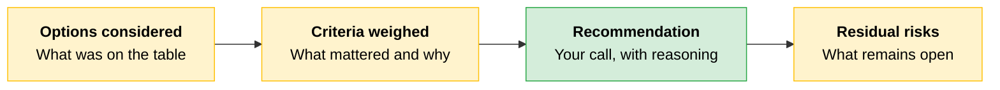
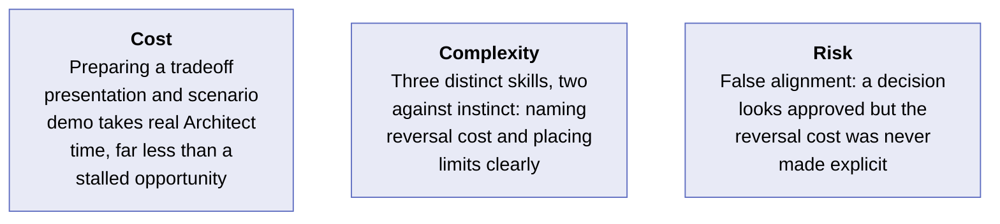
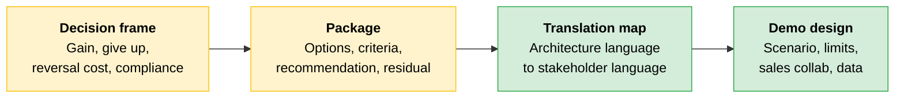

# Tradeoff Framing and Go-to-Market

[Discovery](01-Discovery.md) told you what the buyer needs. Turning those requirements into a decision a stakeholder can make is the next work. Your job is not to resolve the tradeoff before the meeting. Your job is to make decisions possible by describing the options clearly enough that the stakeholder can make an informed choice.

---

## The Decision Frame

Every meaningful design decision has a tradeoff. If you present only the conclusion, the decision looks clear but is weak. When the downside appears later, the stakeholder feels they approved a recommendation without understanding what came with it.

| # | Question | What it reveals |
|---|----------|-----------------|
| 1 | **What do we gain?** | The benefit the stakeholder is buying |
| 2 | **What do we give up?** | The cost or limitation that comes with the choice |
| 3 | **What does reversal cost?** | What happens if we choose this now but have to undo it later |
| 4 | **What does this do to compliance?** | In regulated environments, the effect on the compliance posture |

> **The key:** The third question is the one most presentations skip, and it is often the one that changes the meeting. It shifts the discussion from "what is the better technical answer?" to "what is the better business choice?"

Technical precision is necessary but not sufficient. The Architect may explain options in technical vocabulary (latency, logging depth, context size, retrieval pattern, deployment route), but the executive is asking a simpler question: "What happens to the business if we make the wrong choice?" The room does not need more detail. It needs translation.

---

## Present a Package, Not a Verdict

Present the decision as a package the stakeholder can act on. The stakeholder is not adopting your architecture. They are accepting a decision they will have to defend to their own leadership.

---

## Description Makes the Package Land

**Description** is one of the [four AI Fluency competencies](../01-Claude-Platform-and-Solution-Design/01-How-Claude-Behaves.md): communicating effectively with AI. Extended to the stakeholder side, the same discipline means telling the audience precisely what they need, in terms they can understand.

Three rules apply in practice:

| Rule | What it means |
|---|---|
| **Lead with the business outcome** | Not the architecture. The stakeholder cares about what the system does for them |
| **Frame limitations honestly** | A security stakeholder trusts a system whose limits are clearly stated |
| **Anticipate the peer-proof demand** | The stakeholder will need to justify the choice to others. They should leave with that justification in hand |

---

## The Tradeoff Translation Map

Use this map to shift from architecture framing to stakeholder decision language.

| Architectural decision | What you gain | What you give up | What a wrong, reversed choice costs |
|---|---|---|---|
| **Larger context window vs. retrieval over chunks** | Simpler initial design, the full document in view, fewer moving parts early on | Higher per-call cost and slower response times as production volume grows. Prompt caching can recover significant input cost for static content, so evaluate caching before treating per-call cost as fixed | Reworking the architecture after cost spikes in production, plus the credibility hit of explaining an avoidable expense surprise |
| **Trade logging detail for lower latency** | Faster perceived response and a smoother end-user experience | Reduced visibility into what happened in each interaction | In a regulated workload, a potential compliance gap requiring remediation |
| **Single delivery route vs. multi-platform** | Lower build complexity and one consistent authentication and logging profile | Less flexibility to meet different regional, compliance, or procurement needs | A delayed or blocked production cutover if the chosen route cannot satisfy a late-emerging data residency or deployment requirement |

The map exists to help the stakeholder see the consequence of their choice clearly enough to decide.

---

## Demo Design

A weak demo can undo what discovery earned. Two jobs look similar but produce different outcomes.

| Demo type | Question it answers | What it creates |
|---|---|---|
| **Capabilities demo** | "What can this system do?" | Interest |
| **Scenario-specific demo** | "What does this system do with my problem, my workflow, my constraints?" | Confidence |

The first creates interest. Only the second creates confidence. Design proof that the solution fits the buyer's context is part of the demo's job.

### Four Demo Design Decisions

> **Partner track:** The demo design decisions below are partner-track relevant and not tested by the Architect exam. The principles (scenario selection, limit placement) apply broadly to any stakeholder presentation.

Before building any screens, make four decisions. They determine whether the demo feels tailored or generic.

| Decision | What the Architect decides | Why it determines the outcome |
|---|---|---|
| **Scenario selection** | Choose a workflow the buyer will immediately recognize from their own operations, including familiar data shapes, approval steps, and edge cases | Buyers trust what feels familiar. Recognition is often more persuasive than a polished feature tour |
| **Limit placement** | Decide in advance which one or two limitations the demo will name, and frame them as intentional scope boundaries | If a buyer discovers a limitation mid-demo, confidence drops. If you name it early, it reads as discipline |
| **Sales team collaboration** | Shape the demo narrative with the sales team before building anything. They know what the buyer raised; you know what the system can realistically show | A demo built without sales answers questions the buyer never asked. A demo built without the Architect overpromises |
| **Data preparation** | Use information that resembles the buyer's data in structure and volume. For regulated buyers, use anonymized data with the same structural constraints | Buyers judge the demo by the data in it. Realistic field names and data patterns make the scenario argue for itself |

### Limit Placement

Of the four decisions, limit placement most often runs against instinct. Naming a weakness feels risky, so the temptation is to hide it or soften it. This usually backfires.

When a buyer asks "What does this not handle well?" a vague answer drops confidence. A clear, scoped answer shows discipline instead of defensiveness.

Prepare three answers for every limit you plan to name:

| Question | What it clarifies |
|---|---|
| What is the limit? | The boundary itself |
| Why does it exist? | The design reason or constraint behind it |
| What happens if the use case needs to go beyond it? | The path forward, not a dead end |

> **Tip:** In regulated industries (healthcare, financial services, public sector), a clear boundary signals rigor. A deflection signals risk.

---

## Joint Scoping with Applied AI

> **Partner track:** This section is partner-track relevant and not tested by the Architect exam.

A good scoping session is not a place to figure out the basics for the first time. It is a place to refine choices, test assumptions, and resolve questions that need specialist input. Arrive with three things prepared:

| Preparation | What it contains |
|---|---|
| **Documented requirements and constraints** | What came out of discovery: use case, workflow, stakeholders, data conditions, technical environment, compliance concerns, success criteria |
| **Proposed pattern(s) with tradeoffs named** | A point of view. The likely options, what each gives up, and where the risks sit |
| **Open questions for the Applied AI team** | Model behavior, architecture implications, scaling constraints, evaluation approach, safety considerations, or pattern fit |

In the demo, you earn trust by naming limitations clearly. In joint scoping, you keep that trust by bringing a structured view of the problem, the options, and the unanswered questions.

---

## Handling Technical Objections

Technical objections in a sales cycle fall into three categories. Each requires a different response.

| Category | What the buyer is asking | How to respond |
|---|---|---|
| **Capability** | Can the system do the thing at all? | Demonstrate or reference evidence that it can |
| **Governance and compliance** | Can the deployment be trusted, controlled, and evidenced? | Show the control posture and the evidence artifacts |
| **Design choice** | Why this choice instead of another? | Explain the tradeoff the choice resolves and what the alternative would have cost, using the same translation structure from the tradeoff presentation |

> **Partner track:** The go-to-market engagement map should treat demo design as a tracked workstream with scenario, identified limitations, confirmed data source, and sales-team sign-off as explicit deliverables. This matters most when a partner runs parallel opportunities or when Architects hand off mid-cycle, because continuity depends on what is documented.

---

## The Approval That Was Not an Informed Choice

> [!CAUTION]
> **A CTO approves a context-strategy tradeoff without understanding the reversal cost.**
>
> **Architect:** "We're recommending the larger context window, so the full policy document stays in view on every call. It keeps the design simpler and avoids a retrieval layer."
>
> **CTO:** "What does the cost per call look like?"
>
> **Architect:** "About four cents per interaction at the model tier we're using. If the policy document is static across calls, prompt caching could bring the input portion down significantly."
>
> **CTO:** "Fine, approved. Let's keep it simple."
>
> Six weeks later, on the production invoice, the CTO writes to the account team: "I approved a direction, not a number. Nobody told me four cents times our call volume was a five-figure monthly line. If the document was static, why weren't we caching it? And if we were going to build around full-context anyway, I needed to know what unwinding that would cost once the system depended on it."
>
> The presentation named what the design gained (simplicity) and answered the per-call cost as asked. What it never named was the third element: what happens to the business when this choice meets production volume and must be reversed after the system is built around it. The CTO approved a per-call number, not a monthly bill, and not the cost of unwinding.
>
> **The lesson:** An accurate presentation can still answer the wrong question. Name all three elements every time. Name the reversal cost especially when the design feels obviously simpler.

### Cost, Complexity, Risk

---

## Quick Revision

| Concept | One-line summary |
|---|---|
| **Decision frame** | Four questions: what do we gain, give up, what does reversal cost, what does it do to compliance |
| **Reversal cost** | The third question most presentations skip and the one that most often changes the meeting |
| **Package, not verdict** | Present options considered, criteria weighed, recommendation, and residual risks so the stakeholder can defend the choice |
| **Description** | Lead with the business outcome, frame limitations honestly, anticipate the peer-proof demand |
| **Tradeoff translation map** | Shift from architecture framing to stakeholder decision language for each choice |
| **Scenario-specific demo** | A capabilities demo creates interest. Only a scenario demo creates confidence |
| **Limit placement** | Name limitations early and frame them as intentional scope boundaries. Discovered mid-demo, they drop confidence |
| **Three objection categories** | Capability, governance/compliance, and design-choice objections each need a different response type |

### Exam Traps

| If you see... | The trap | The right call |
|---|---|---|
| A tradeoff presentation that names the gain and the cost | Assume the stakeholder has enough to decide | The reversal cost is missing. Without it, the stakeholder approved a direction, not a fully informed choice |
| A stakeholder approves a per-call cost figure | Treat the cost question as answered | Per-call cost times production volume is a different number. Translate to the unit the stakeholder actually controls |
| A demo shows a polished feature walkthrough | Assume the buyer is impressed and the deal advances | A capabilities demo creates interest, not confidence. Only a scenario-specific demo answers "does this fit my problem?" |
| A limitation surfaces mid-demo | Minimize it and move on quickly | Confidence drops when a buyer discovers a limit. Name limits early and frame them as intentional scope boundaries |
| "The CTO approved it" after a technical presentation | Treat the architecture as locked in | An approval without stated reversal cost is not an informed choice. The decision can unravel when the consequence appears |
