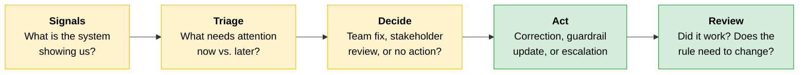
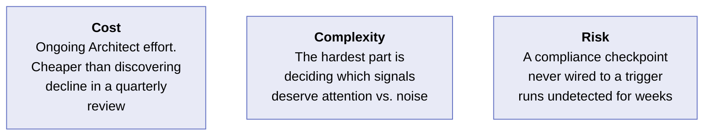
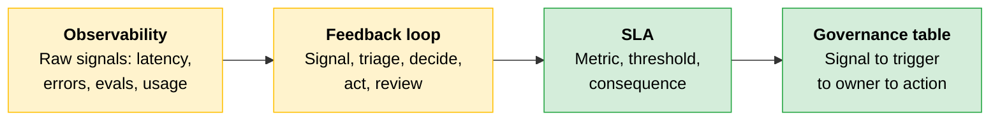

# Feedback Loops: From Signal to Action

Production [observability](../02-Enterprise-Integration-and-Production/README.md) and the audit trail record what a live deployment is doing. This topic covers filtering those signals, deciding when to escalate beyond the team, and defining what the SLA requires when performance falls below standard. In lifecycle terms, the feedback loop is the monitoring-and-iteration stage of the deployment lifecycle.

---

## A Live Deployment Drifts

A customer support assistant launches in solid shape. It answers quickly, stays in tone, handles the common questions well. Over time, usage patterns change, new prompt styles appear, and customer issues become more complex. Some responses slow down. Some answers start missing the mark.

Nothing breaks dramatically, which is what makes drift hard to catch. Quality erodes gradually rather than all at once. A team without a feedback loop may not see the decline until users already feel it.

---

## The Feedback Loop Sits Above the Observability Stack

Observability gives you the raw material: latency, error rates, eval scores, usage patterns. A signal by itself is not yet a decision. One spike may be noise. Another may point to a real problem. A third may be important only if it keeps happening.

The feedback loop answers five questions:



| Step | Question | Judgment call |
|---|---|---|
| **Signals** | What is the system showing us? | Which metrics to watch |
| **Triage** | What needs attention now, and what can wait? | Separate noise from signal |
| **Decide** | Does the issue need a team fix, a stakeholder review, or no action? | Route to the right owner |
| **Act** | What correction, guardrail update, or escalation is required? | Choose iterate versus re-architect |
| **Review** | Did the response work and does the rule need to change? | Close the loop or escalate further |

Think of it like a control room in a train station. The sensors tell you where the trains are late, but someone still must decide whether a delay is minor, whether passengers need to be informed, and whether the schedule needs to change. That judgment layer is what makes the system manageable instead of just measurable.

---

## SLAs Name Three Things

Once the feedback loop decides that something matters, the SLA defines what happens when it crosses the line. An SLA makes three things clear.

```
┌──────────────────────────────────────────────────────────────┐
│  SLA structure                                               │
├──────────────────────────────────────────────────────────────┤
│  metric       → what are we measuring?                       │
│  threshold    → what counts as a breach?                     │
│  consequence  → what happens when a breach occurs?           │
└──────────────────────────────────────────────────────────────┘
```

### Thresholds Trace to Something Tangible

The threshold should never be arbitrary. It should trace back to a source the stakeholder already agreed to.

| Metric | Traces back to |
|---|---|
| **Latency** | The user-experience expectation identified in [discovery](01-Discovery.md) |
| **Availability** | How critical the deployment is to the business |
| **Quality** | The [eval results](../02-Enterprise-Integration-and-Production/README.md) and acceptance criteria already established |

If the number cannot be tied to one of these sources, it is probably just a target someone chose because it sounded reasonable.

> **Tip:** Traceability keeps the SLA defensible. When a threshold is challenged, you point to the discovery constraint or eval baseline it came from, not to a guess.

### Cost Is the Expectation That Breaks Most Often

Production volume routinely runs one to two orders of magnitude above the pilot, so a cost that looked trivial in the proof of concept becomes a five-figure monthly line at scale. Pre-empt it: give the stakeholder a consumption forecast at expected production volume, name the spend-control posture (caching, model tiering, budget alerts), and frame the [model-tiering](../01-Claude-Platform-and-Solution-Design/08-Model-Context-Window-and-Context-Strategy.md) narrative before the first invoice rather than after it.

---

## Regulated Deployments Add Scheduled Checkpoints

In regulated deployments, some reviews must happen even when nothing has gone wrong. A healthcare workflow with a documentation obligation may require periodic output audits on a defined schedule. A data-residency deployment may need scheduled confirmation that the environment still meets residency rules.

These are design-time obligations, not tasks to add later. If they are not built early, they become far more expensive to establish when someone asks for proof.

> **The key:** Build the governance table before launch. It is the mechanism that turns policy into an operating routine.

### Production-Signal Governance Table

| Signal type | Review trigger | Architect action | Regulated-industry checkpoint |
|---|---|---|---|
| **Output quality** (eval score) | Score crosses the threshold drawn from the eval suite | Diagnose whether the cause is prompt, data, or model drift, then decide to iterate versus re-architect | Periodic output audit against the documentation standard, on an established schedule, regardless of score |
| **Latency p95** | Crosses the budget set from user-experience requirements | Investigate the bottleneck, then tune or escalate to a stakeholder review if the budget itself is wrong | Usually none, unless latency is masking a logging or traceability gap |
| **Cost per interaction** | Crosses the budget envelope agreed in discovery | Identify the driver, then bring a [tradeoff](02-Tradeoff-Framing-and-GTM.md) to the stakeholder if the budget needs revisiting | Usually none, unless cost controls are part of a regulated operating constraint |
| **Data-residency configuration** | Scheduled confirmation | Confirm and record residency posture and flag any drift immediately | Residency confirmation on the established schedule |

---

## The Observability Stack That Replaced the Feedback Loop

> [!CAUTION]
> **An Architect builds a rigorous observability stack and concludes that stakeholder feedback is covered.**
>
> The dashboards are live, the alerts are configured, and the data is flowing. Here is what the alert log shows against the stakeholder review calendar over a ninety-day window.
>
> | Window | Observability stack recorded | Stakeholder review calendar | What the loop should have done |
> |---|---|---|---|
> | Weeks 1-3 | Eval score steady at baseline. Latency and cost nominal | Launch review held in week 1 | Nominal. No escalation needed |
> | Weeks 4-7 | Eval score drifting down week over week. Error rate flat, so no hard alert fires | No review scheduled or held | A quality-drift trigger should have escalated to an Architect review by week 5, then onward to a stakeholder review once diagnosis confirmed the drift |
> | Weeks 8-12 | Score still declining. Stakeholder reports the output is "less useful lately" | Quarterly review finally surfaces it in week 12 | By design, the loop would have caught this seven weeks earlier |
>
> Every metric the deployment needed was already being collected. The eval score was visibly drifting downward since week four. What was missing was the decision layer: no governance rule mapped a slow quality drift to a review trigger. The drift never crossed an error-rate threshold, so no alert fired. A drift with no trigger is invisible until a human happens to notice.
>
> **The lesson:** Monitoring is not a feedback loop. A dashboard collects and displays signals. A feedback loop maps each signal to a trigger, an owner, and a required action. Build the governance table that includes both the slow drifts and the hard failures.

### Cost, Complexity, Risk



---

## Quick Revision



| Concept | One-line summary |
|---|---|
| **Feedback loop** | A decision layer above the observability stack that maps signals to triage, decision, action, and review |
| **Five steps** | Signals, triage, decide, act, review. Each step is a judgment call, not an automated rule |
| **SLA structure** | Metric, threshold, consequence. The threshold traces to a discovery constraint or eval baseline |
| **Cost as the broken expectation** | Production volume runs 1-2 orders of magnitude above pilot. Pre-empt with a consumption forecast |
| **Scheduled checkpoints** | Regulated deployments require reviews on a schedule, not just at a threshold. Build them before launch |
| **Governance table** | Maps each signal to a trigger, an owner, and an action. Exists before launch. Covers slow drifts and hard failures |
| **Monitoring vs. feedback loop** | A dashboard collects and displays. A feedback loop decides what matters and routes it to someone who acts |

### Exam Traps

| If you see... | The trap | The right call |
|---|---|---|
| A deployment with dashboards, alerts, and logging in place | Assume the feedback loop is covered | Observability collects signals. A feedback loop maps each signal to a trigger, an owner, and an action. They are different layers |
| An eval score drifting down slowly with no hard alert firing | Assume the system is healthy because no alert triggered | A slow drift with no trigger is invisible. The governance table must cover gradual quality decline, not just threshold breaches |
| An SLA threshold that sounds reasonable but has no documented source | Accept it as defensible | A threshold traces to a discovery constraint, eval baseline, or business-criticality assessment. Otherwise it is a guess |
| A regulated deployment launching without scheduled review rows | Plan to add them when a reviewer asks | Scheduled checkpoints are design-time obligations. Adding them after launch is far more expensive than building them in |
| Cost per interaction is within the pilot budget | Assume cost is under control | Pilot volume and production volume differ by orders of magnitude. Forecast at production scale before launch |
