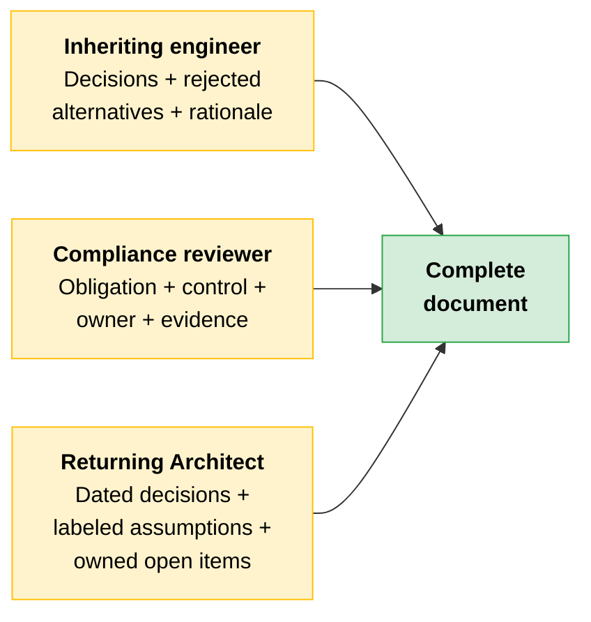
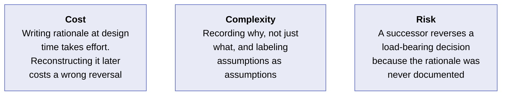
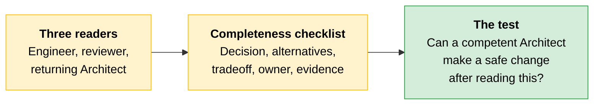

# Documentation: Surviving the Handoff

The [feedback loop](03-Feedback-Loops.md) keeps the system healthy while you are running it. Documentation is what keeps it functioning after you are gone. Either the design carries its own reasoning into the handoff, or that reasoning disappears the moment you leave. In lifecycle terms, documentation is the handoff stage of the deployment lifecycle.

---

## Three Readers, One Document

Architecture documentation serves three readers. A document built for one and not the others is incomplete even when it is detailed.

| Reader | What they need | What breaks if it is missing |
|---|---|---|
| **Inheriting engineer** | Decisions made, alternatives rejected, and the reason each rejection happened | They reverse the right decision for the wrong reason, or defend the wrong decision because they cannot tell which tradeoff it was resolving |
| **Compliance reviewer** | Each obligation, the technical control that satisfies it, the owner, and the evidence artifact | They find an assertion that a control exists but no evidence it is operating. The assertion fails the review |
| **Returning Architect** | Dated decisions, explicitly labeled assumptions, open items with owners and resolution criteria | They cannot tell which choices are load-bearing and which are preferences. A safe change becomes a guess |

---

## What Each Reader Needs

### The Inheriting Engineer: Rejected Alternatives

A design delivered without its rejected alternatives cannot be understood by someone who was not in the room. The rejected options explain why the design is shaped the way it is. Without them, the successor sees only the final form and has no way to distinguish a load-bearing choice from a preference.

> **Rule of thumb:** If you chose option A over option B, write down option B and name the tradeoff that ruled it out. The successor's first instinct will be to try option B.

### The Compliance Reviewer: Evidence Over Assertions

The compliance reviewer does not accept assertions. They require evidence. A statement that a control exists is not enough on its own. The document must carry each regulatory obligation, the technical control that satisfies it, the owner of that control, and the evidence artifact that demonstrates the control is operating.

This is the [regulated deployment control register](../03-Responsible-AI-Safety-and-Risk-for-Architects/README.md) carried forward into the living document that governs the deployment's production life.

### The Returning Architect: Navigable Without a Briefing

Decisions are dated. Assumptions are explicitly labeled as assumptions rather than embedded as facts. Open items have owners and resolution criteria. The document stands on its own.

> **The key:** The completeness test is practical. After reading the document, can a competent Architect who was not present at the design sessions make a safe change to the system? If the answer is no, the document is not complete.

---

## The Documentation Completeness Checklist

| Field | What it captures | Reader it primarily serves |
|---|---|---|
| **Decision** | The architectural choice that was made, including the date | All three readers |
| **Rejected alternatives** | The options that were considered but not chosen | Inheriting engineer |
| **Tradeoff named** | The tradeoff the decision resolved: gains, costs, and [reversal implications](02-Tradeoff-Framing-and-GTM.md) | Inheriting engineer and returning Architect |
| **Owner** | The person or team responsible for the decision or control going forward | Compliance reviewer and inheriting engineer |
| **Evidence artifact** | The artifact that demonstrates a control is actually operating | Compliance reviewer |
| **Audit-ready status** | Whether the available evidence is current and sufficient for review | Compliance reviewer |

> **Tip:** A diagram carries what the system is. Without the rationale for the decisions, the diagram cannot tell the successor which choices are load-bearing and which are preferences. The moment you leave the engagement is the moment that reasoning is gone if it was never documented.

---

## The Design Rationale That Lived in the Architect's Head

> [!CAUTION]
> **An Architect leaves a financial-services engagement twelve weeks after launch. Their replacement inherits a thorough architecture diagram with no rationale attached.**
>
> | Stage | What happened | What the document carried |
> |---|---|---|
> | **Launch** | Original Architect designs a context strategy specifically to keep regulated data in-region | An architecture diagram showing the final design |
> | **Handoff** | Original Architect leaves in week twelve. No design sessions are recorded | The diagram, with no rejected alternatives and no rationale |
> | **Change** | Replacement hits a performance issue and switches context strategies to fix it | Nothing explains why the original strategy was chosen |
> | **Failure** | The switch reintroduces a data-handling pattern that breaks the data-residency rule | The reason the original design avoided that pattern existed only in the departed Architect's head |
>
> The replacement was competent and acted reasonably on the information they had. The diagram told them what the system was, not why it was that way. The original context strategy was a deliberate choice to satisfy a residency constraint, and that reasoning was never written as a decision with a named tradeoff and a rejected alternative. The replacement could not tell that the strategy they were changing was load-bearing for compliance, so they reversed the right decision for an understandable wrong reason.
>
> **The lesson:** A design without its rationale is a design that cannot be safely changed. Record the decision, the rejected alternatives, and the tradeoff each resolved. If it is never written, it leaves with you.

### Cost, Complexity, Risk

---

## Quick Revision

| Concept | One-line summary |
|---|---|
| **Three readers** | Inheriting engineer, compliance reviewer, returning Architect. Serving only one makes the document incomplete |
| **Rejected alternatives** | The options not chosen and the tradeoff that ruled them out. Without these, a successor cannot tell which choices are load-bearing |
| **Evidence over assertions** | A compliance reviewer requires an artifact demonstrating a control is operating, not a statement that it exists |
| **Completeness test** | Can a competent Architect who was not in the room make a safe change after reading the document? |
| **Completeness checklist** | Decision, rejected alternatives, tradeoff named, owner, evidence artifact, audit-ready status |
| **Diagram vs. rationale** | A diagram shows what the system is. The rationale shows which choices can be safely changed |

### Exam Traps

| If you see... | The trap | The right call |
|---|---|---|
| A thorough architecture diagram with no text explaining the decisions | Assume the design is well documented | A diagram carries what the system is, not why. Without rationale, a successor cannot tell load-bearing choices from preferences |
| Documentation lists decisions but not rejected alternatives | Assume the decisions speak for themselves | The rejected options explain why the design is shaped the way it is. Without them, a successor reverses the right decision for the wrong reason |
| A compliance section states "data-residency controls are in place" | Treat the assertion as evidence | A reviewer requires an evidence artifact demonstrating the control is operating, not a statement that it exists |
| The original Architect knows why every decision was made | Assume the reasoning will be available when needed | If the rationale is never written, it leaves with the person. Documentation must stand alone |
| A handoff document is detailed but undated and labels nothing as an assumption | Treat it as current and factual | Decisions need dates. Assumptions need explicit labels. Open items need owners. Without these, the returning Architect cannot separate fact from assumption |
