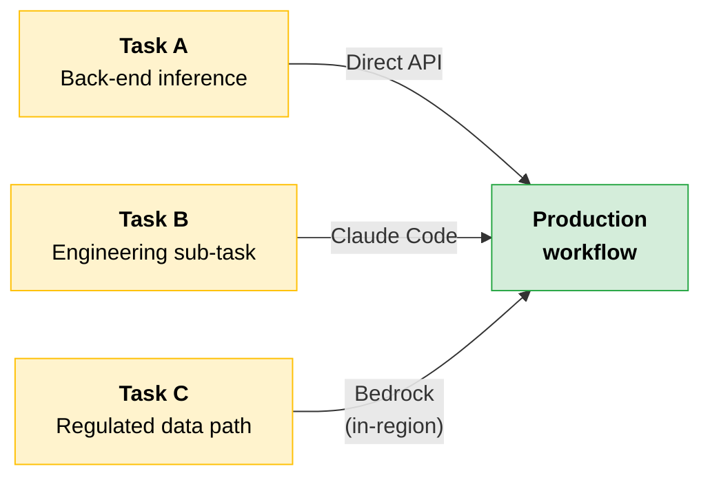
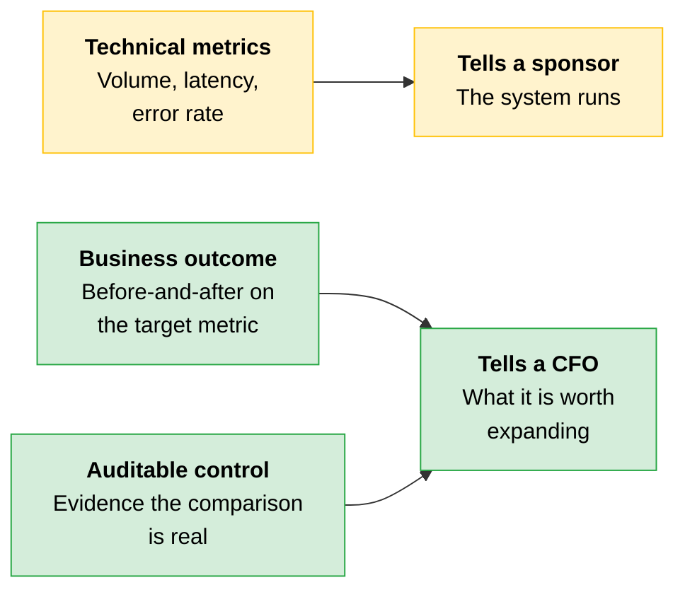
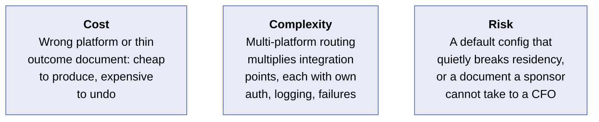
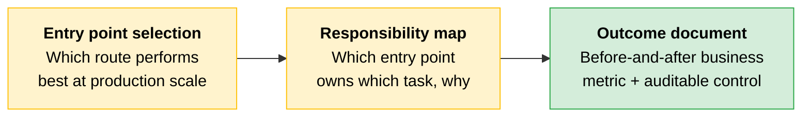

# Entry Point Selection and the Outcome Document

[Entry point selection](../01-Claude-Platform-and-Solution-Design/11-Delivery-Routes-and-Regulated-Constraints.md) was introduced earlier as a compliance pre-filter. This topic returns to that decision with the full production context. The question is no longer which route survives the compliance pre-filter. It is which route performs best across the latency, cost, and compliance dimensions of a live multi-platform deployment.

The outcome document turns the deployment's results into an artifact that survives the engagement. In lifecycle terms, this is where you close the loop.

> **Tip:** Entry-point capabilities change. Every specific claim in this section should be re-verified against the current Anthropic documentation at build time.

---

## The Entry Point Question Changes at Scale

A deployment that spans more than one entry point exposes problems a single-entry-point system does not.

| Problem | What causes it |
|---|---|
| **Model identifier mismatch** | Model ID strings differ across routes |
| **Feature lag** | A route mediated by a cloud provider may trail the direct API on new features |
| **Residency misconfiguration** | Regional availability on Bedrock and Vertex requires explicit configuration. Defaulting to a global endpoint is the common pattern that breaks a data-residency requirement |

An Architect designing across entry points needs a documented **entry-point-responsibility map** before writing the first line of integration code.

---

## The Entry-Point-Responsibility Map

An app that integrates multiple Claude entry points in one workflow must specify which entry point handles which task and the reason. A workflow that uses the API for back-end inference, Claude Code for an engineering sub-task, and a Bedrock endpoint for a regulated data path is not unusual at enterprise scale.

Each entry-point boundary is an integration point with its own authentication, logging, and failure-mode profile.

> **Rule of thumb:** The entry-point-responsibility map makes boundaries explicit and prevents the most common multi-entry-point failure: an entry point chosen for one task gradually taking on another because the routing logic was never documented.

---

## Deployment Entry-Point Decision Matrix

| Platform | Latency profile | Compliance posture | When to pick it |
|---|---|---|---|
| **Direct Anthropic API** | Newest features first, fewest additional hops | Strong default, but confirm coverage by configuration | Default unless a procurement or residency rule points elsewhere |
| **AWS Bedrock** | Region-configurable, possible feature lag versus direct | Fits AWS-centric procurement and region rules when configured explicitly | Partner standardized on AWS and needs in-region execution |
| **GCP Vertex AI** | Region-configurable, possible feature lag versus direct | Fits GCP-centric procurement and region rules when configured explicitly | Partner standardized on GCP with a Vertex procurement path |
| **Microsoft Foundry (Azure)** | Varies by hosting form: hosted-on-Azure runs inference in the partner's Azure environment (GA); hosted-on-Anthropic routes to Anthropic infrastructure | Verify residency and coverage per route. Do not assume from the platform name | Partner procurement or residency posture requires that specific route |

---

## The Outcome Document

Customer outcome documentation makes the deployment's value understandable to people who were not on the build. Technical metrics alone do not make this document. The before-and-after business outcomes and the reuse notes are what turn it into a reusable asset.

### Customer Outcome Documentation Template

| Field | What it records |
|---|---|
| **Use case with scope boundary** | What the deployment does and what it does not |
| **Metric before** | The business metric as it stood before deployment |
| **Metric after** | The same metric after deployment, measured using the same definition |
| **Control in place** | What makes the before-and-after comparison auditable rather than merely asserted |
| **Measurement owner** | Who owns ongoing measurement after the engagement closes |
| **Reuse potential** | How the pattern transfers to other customers or engagements as IP |

> **Partner track:** The "reuse the pattern for other customers or engagements" framing and the Reuse-potential field are partner-track relevant. The rest of the outcome document template is on-blueprint.

The document exists for a specific reader: the sponsor who must justify the deployment upward. Volume, latency, and error rate tell a sponsor that the system runs. A before-and-after on the business metric the use case targeted, backed by an auditable control, tells a CFO what it is worth expanding.

---

## The Outcome Document That Measured the Wrong Thing

> [!CAUTION]
> **An Architect closes an engagement using the metrics easiest to export from the observability stack.**
>
> The sponsor took the document to their CFO to justify expanding the deployment.
>
> **Sponsor:** "Here's the deployment. Forty thousand requests a month, sub-two-second average latency, error rate under half a percent."
>
> **CFO:** "That tells me it runs. What did it do for us? What were claim processing times before this, and what are they now? Because that's the number that justifies spending more."
>
> The sponsor had no answer. The document measured that the system worked, but not what it changed.
>
> Volume, latency, and error rate are real and worth tracking, but none of them are a business outcome. The fields that would have made the document usable were the before-and-after on the business metric (claims-processing time) and the control that made the comparison auditable. Without the before number, there is no story. Without the control, the after number is an assertion.
>
> **The lesson:** The easy-to-export metrics are rarely those that justify cost. Capture the before metric at the start, name the control that makes the comparison auditable, and add the reuse note, so the document can do the one job a technical dashboard cannot.

### Cost, Complexity, Risk

---

## Quick Revision

| Concept | One-line summary |
|---|---|
| **Entry point at scale** | The question shifts from compliance pre-filter to which route performs best across latency, cost, and compliance in production |
| **Cross-platform problems** | Model ID mismatches, feature lag, and residency misconfiguration from defaulting to a global endpoint |
| **Entry-point-responsibility map** | Documents which entry point handles which task and why, preventing undocumented scope creep across boundaries |
| **Decision matrix** | Direct API by default; Bedrock or Vertex when procurement or residency requires it; Foundry requires per-route verification |
| **Outcome document** | Six fields: use case, metric before, metric after, control, measurement owner, reuse potential |
| **Technical vs. business metrics** | Volume, latency, and error rate tell a sponsor the system runs. Only a before-and-after business metric tells a CFO what it is worth expanding |
| **Capture before early** | The before metric must be recorded at the start of the engagement. Without it, the outcome document has no story |

### Exam Traps

| If you see... | The trap | The right call |
|---|---|---|
| A multi-platform deployment with no entry-point-responsibility map | Assume each route is self-contained | Each boundary has its own auth, logging, and failure profile. Without the map, an entry point chosen for one task silently takes on another |
| A Bedrock or Vertex deployment using a global endpoint | Assume regional availability is automatic | Regional availability requires explicit configuration. A global endpoint default is the common pattern that breaks data residency |
| An outcome document reporting volume, latency, and error rate | Treat the deployment as justified for expansion | Those metrics say the system runs, not what it changed. The before-and-after business metric is what justifies spending more |
| "Metric after" shows improvement with no control named | Accept the improvement as evidence | Without an auditable control, the after number is an assertion, not proof |
| A Microsoft Foundry route selected because "Azure handles residency" | Assume residency coverage from the platform name | Hosted-on-Azure and hosted-on-Anthropic are different routes with different residency profiles. Verify per route |
