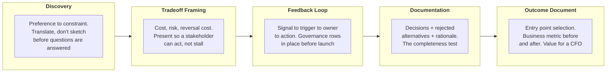

# Stakeholder Engagement, Lifecycle & GTM

Lead the stakeholder conversations that decide whether a working system actually ships, adopts, and outlasts your involvement.

**Duration:** 178 Minutes | **Notes:** 5 | **Status:** In progress

[Module 3](../03-Responsible-AI-Safety-and-Risk-for-Architects/README.md) ended with a governed, auditable Claude deployment: alignment boundaries drawn, guardrails placed, fairness instrumented, review routing designed, and a compliance register in place. This module asks the question that follows. What happens when the design meets the people who fund it, approve it, inherit it, and judge whether it was worth it?

None of the prior work resolves what happens in rooms with stakeholders: the discovery conversation where the real requirements are set, the approval meeting where a tradeoff is won or lost, the handoff where your design either survives your absence or quietly degrades.

> **The framing:** A technically correct architecture that cannot be explained, defended, handed off, or measured in business terms will stall at the first executive review. The Architect's job does not end at the system diagram. It ends when a reader who was never in the room can make a safe change, and a sponsor who never saw the build can judge the value.

---

## Notes in This Module

| Notes | Covers |
|---|---|
| [01-Discovery](01-Discovery.md) | The three-step filter, translating preferences into constraints, the four question categories, the translation table, the dangerous plausible sketch |
| [02-Tradeoff-Framing-and-GTM](02-Tradeoff-Framing-and-GTM.md) | The four-question decision frame, reversal cost, the tradeoff translation map, scenario-specific demo design, limit placement, handling technical objections |
| [03-Feedback-Loops](03-Feedback-Loops.md) | The five-step decision layer above observability, SLA structure and threshold traceability, the production-signal governance table, scheduled regulatory checkpoints |
| [04-Documentation](04-Documentation.md) | Three readers, rejected alternatives, evidence over assertions, the completeness checklist, diagrams versus rationale |
| [05-Entry-Point-and-Outcome-Document](05-Entry-Point-and-Outcome-Document.md) | Multi-platform entry-point selection at production scale, the responsibility map, the decision matrix, the outcome document template, business metrics versus technical metrics |

Not yet written, following the module outline:

| Planned note | Covers |
|---|---|
| **Cumulative: Stakeholder to Outcome** | Taking a regulated multi-platform deployment from a stakeholder's first sentence to an outcome document that justifies expansion |

---

## Five Topics in the Lifecycle

Each topic extends from the last. The constraint set from discovery is what the tradeoff presentation defends. The feedback loop keeps the compliance controls current as the deployment runs. The documentation rationale keeps those decisions from being silently reversed by a successor. The outcome document draws on every layer above it.

| # | Topic | What you're answering | Failure if you skip it |
|---|-------|-----------------------|------------------------|
| 01 | **Discovery** | What does the stakeholder actually need, stated as a testable, bounded constraint? | A discovery call ends in a design sketch before translation is done; the plausible sketch makes the stakeholder assume the questions have been answered |
| 02 | **Tradeoff framing & GTM** | What does each architectural choice gain, give up, and cost to reverse? | A presentation missing the reversal cost stalls the executive review instead of reaching a decision |
| 03 | **Feedback loop** | Which signals change behavior, whose behavior, and on what trigger? | A compliance checkpoint does not surface until a reviewer comes looking for the record, because no trigger was defined |
| 04 | **Documentation for handoff** | Can a successor who was not in the room make a safe change after reading this? | A diagram shows what the system is but not which choices are load-bearing; the successor silently reverses a critical decision |
| 05 | **Entry point & outcome document** | Which deployment route fits production, and what makes the value legible to a non-technical sponsor? | Volume, latency, and error rate tell a sponsor the system runs, but not what it is worth expanding |

---

## Learning Objectives

| Objective | One-liner |
|-----------|-----------|
| **Discovery** | Run a structured discovery conversation and translate stakeholder preferences into architectural requirements and documented assumptions that trace to the business case |
| **Tradeoff framing** | Present each architectural choice with a cost, a risk, and a reversal cost so executive and procurement reviews reach a decision instead of stalling |
| **Feedback loop** | Build a governance table that maps each signal to a trigger, an owner, and an action, with compliance checkpoints in place before launch |
| **Documentation** | Record decisions, rejected alternatives, and the tradeoff each resolved so a successor can make a safe change without having been in the room |
| **Entry point & outcome** | Select the deployment route comparing API, Bedrock, Vertex, and third-party options, then produce an outcome document that makes the value legible to a non-technical sponsor |

> **Partner track:** Objective 4 covers leading the Architect's role in a partner go-to-market motion: discovery, scenario-based demo, technical objection handling, and joint scoping. It is partner-track relevant and not tested by the Architect exam.

---

## Lifecycle Mapping

The five topics map onto the project lifecycle. Identifying the phase a decision belongs to is what lets you judge when one phase is ready to move to the next.

| Lifecycle phase | Topics that do the work |
|-----------------|------------------------|
| **Discovery & design** | Discovery, tradeoff framing |
| **Monitoring & iteration** | Feedback loop |
| **Handoff** | Documentation for handoff and audit |
| **Close the loop** | Entry point selection, outcome document |

---

[Back to Professional](../README.md) · [Back to the study guide](../../README.md)
