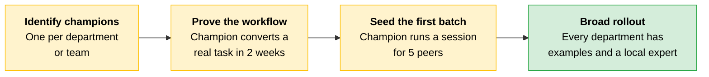
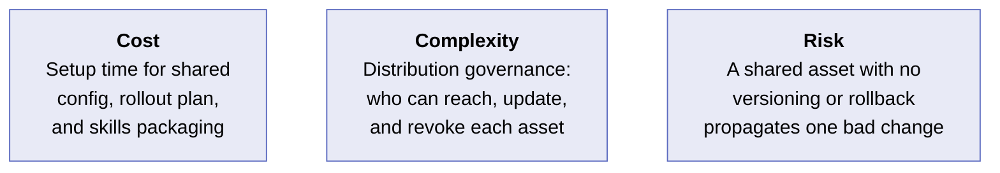
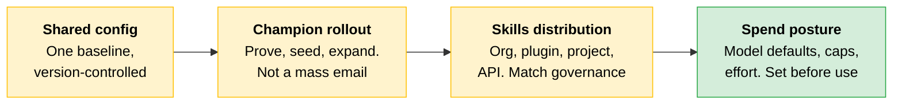

# Team Setup: Environment, Rollout, Skills, and Spend

You can configure Claude for yourself in minutes. Configuring it for a team is different. A team needs shared defaults so everyone starts from the same baseline, reusable assets that can be updated and revoked centrally, and spend that stays bounded as usage scales across dozens of people.

Four decisions belong to the Architect: environment, rollout, skills distribution, and spend. Skip one and the gap compounds across every team member who inherits the default.

---

## Deploy the Environment as a Shared Configuration

A team environment is a shared configuration: a baseline every developer starts from, not a collection of personal setups. For Claude Code, that means the team agrees on a project-level baseline: a shared CLAUDE.md, an agreed set of tools and MCP servers, and a permission posture. People start from the same place rather than discovering ad hoc settings and drifting apart.

That baseline is something you can review, version, and improve once for everyone.

> **Rule of thumb:** If a setting affects how Claude behaves for any team member, it belongs in the shared configuration, not in individual setups.

---

## Roll Out Through Champions, Then Batches

Team adoption rarely succeeds as a single all-hands switch-on. The pattern that works is a **champion-seeded rollout**.

| Phase | What happens | Why it matters |
|---|---|---|
| **Identify champions** | Grant access first to one person per department or team | The champion absorbs early friction and becomes the first line of support, so the Architect is not the only person answering questions |
| **Prove the workflow** | Champion converts a real workflow (code-review assist, test-generation step) over two weeks | Real examples beat demo scripts. The champion builds the local evidence that adoption is worth the effort |
| **Seed the first batch** | Champion runs a 45-minute session for five peers in their department | Peer-led adoption sticks. The champion has already tuned the shared CLAUDE.md and can show what works in context |
| **Broad rollout** | Enable the remaining team members | Every department now has a working example, a local expert, and a shared configuration the champion has already tuned |

> **The trap:** A mass-email rollout for a 200-person engineering org produces a spike of confused first-time prompts and a quiet retreat to old habits. Champions absorb the friction that would otherwise kill adoption.

---

## Skills Distribution: Reuse at Team Scale

[Skills](../01-Claude-Platform-and-Solution-Design/README.md) are repeatable procedures that appear as versioned, reusable units. At team scale, the architectural question is: how do you distribute a skill so the team can access it, how do you grant and revoke access, and how do you roll it back if it misbehaves?

Four mechanisms exist. The one you choose depends on who uses the skill and how much governance you need.

| Distribution mechanism | Best when | Governance and rollback |
|---|---|---|
| **Org-provisioned Skill** (Organization settings > Skills) | A capability should reach everyone in the organization | Owner-managed availability and removal across the org. Users can toggle individual skills off but cannot remove them. No version pinning or native rollback; updates require manual re-upload |
| **Plugin assigned to a group** | A procedure or tool set should reach specific teams, or needs governed rollout | Group targeting, install preferences (required, installed by default, available), and version-controlled updates from a connected repo. Strongest governance option for group-scoped distribution |
| **Claude Code project Skill** | A tool or convention one team shares across its own projects | A filesystem artifact in the project repo (`.claude/skills/`), versioning with the repo and scoped to the projects that carry it |
| **API Skill** (Messages API container) | A capability called programmatically by the partner's own products | Governed in the calling system. Supports explicit version pinning. Reuse is machine-to-machine rather than human-facing |

> **Testable distinction:** Centrally managed Claude Code configuration (server-managed settings delivered from Anthropic's servers on an hourly polling cycle) is a settings mechanism, not a skills distribution path. Don't confuse the two.

Packaging a team workflow as a distributable skill is how a good local practice becomes a team standard. The procedure travels as one governed artifact instead of undocumented know-how, and updates propagate through versioning rather than re-explaining.

---

## Set the Spend Posture Before the First Bill

Team setup includes cost guardrails. Set these intentionally rather than inheriting defaults.

| Control | What it governs |
|---|---|
| **Model defaults** | Which model a session starts on |
| **Model allowlists and restrictions** | Which models the team may switch to |
| **Effort guidance** | How hard the model works on a task |
| **Spend, rate, and per-user caps** | Consumption bounds across the team |

[Module 2](../02-Enterprise-Integration-and-Production/README.md) showed that leaving model choice unmanaged can quietly route work to a more capable, more expensive tier than the task requires. At team scale, that choice multiplies across every member and every request.

---

## Scenario

> [!CAUTION]
> **A platform team packaged its release-notes procedure as a skill, bundled it into a plugin, and assigned it to its forty-engineer group.** A week later a well-meaning edit changed the prompt and the skill began producing notes in the wrong format across every team that used it. The skills were pushed as a flat bundle without the version-controlled updates and rollback a plugin provides, so the fix required a manual re-edit while bad output kept shipping. The skill was a good idea distributed without the governance it required.
>
> **The lesson:** A shared asset with no version and no way back is a liability the moment more than one person depends on it. When a shared asset needs versioning, group targeting, or rollback, distribute it inside an organization-managed plugin and identify an owner.

---

## Cost, Complexity, and Risk

| Dimension | Detail |
|---|---|
| **Cost** | Standing up a team environment costs setup time up front, but is far cheaper than later reconciling forty configurations that have drifted apart |
| **Complexity** | The hard part is distribution governance: who can reach, update, and revoke each shared asset. Decide this per asset |
| **Risk** | The biggest failure mode is a shared asset with no versioning or rollback, so one bad change propagates to the whole team before anyone can stop it |

---

## Quick Revision

| Concept | One-line summary |
|---|---|
| **Shared configuration** | A project-level baseline (CLAUDE.md, tools, permissions) that every developer starts from, not a personal setup |
| **Champion rollout** | One champion per department proves the workflow, seeds the first batch, then broad rollout follows |
| **Org-provisioned Skill** | Reaches everyone in the org. No version pinning; updates require manual re-upload |
| **Plugin to a group** | Group targeting, install preferences, version-controlled updates. Strongest governance for group-scoped distribution |
| **Claude Code project Skill** | Lives in `.claude/skills/`, versions with the repo, scoped to the projects that carry it |
| **API Skill** | Called programmatically, supports explicit version pinning, machine-to-machine reuse |
| **Spend posture** | Model defaults, allowlists, effort guidance, and per-user caps set before the team starts using the system |

### Exam Traps

| If you see... | The trap | The right call |
|---|---|---|
| "How should you distribute a skill to all org members?" | Choosing a plugin assigned to a group because it has the strongest governance | Org-provisioned Skill is the simplest path when the capability should reach everyone |
| "What provides version-controlled updates and group targeting?" | Confusing org-provisioned Skills (no version pinning) with plugins | Plugins assigned to a group provide install preferences, group targeting, and version-controlled repo updates |
| "Centrally managed Claude Code configuration delivers skills to the team" | Treating server-managed settings as a skills distribution mechanism | Centrally managed config is a settings mechanism (hourly polling), not a skills distribution path |
| "A mass rollout is the fastest way to enable a 200-person org" | Assuming speed of enablement equals adoption success | Champion-seeded rollout absorbs friction, builds local examples, and avoids the confused-first-prompt retreat |
| "A shared skill only needs an owner, not versioning" | Assuming ownership alone prevents bad updates from propagating | A shared asset with no version and no rollback propagates one bad change to every consumer before the owner can act |
