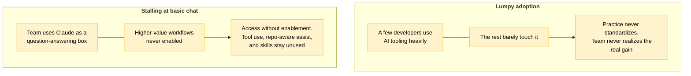
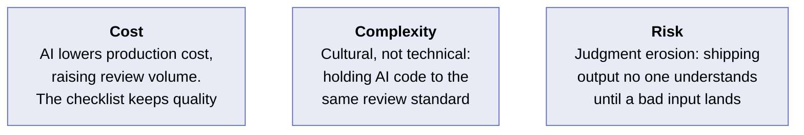
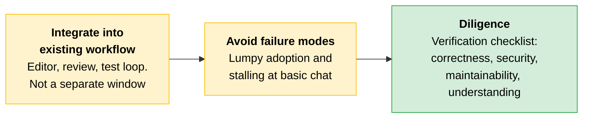

# Developer Workflows: Assistance and Diligence

A team can have Claude configured perfectly and still get little from it. The difference is their workflow: how AI assistance is woven into the way developers work, and the discipline that keeps its output trustworthy. This file is about raising the workflow bar without lowering the quality bar.

---

## Integrate Assistance Into the Workflow That Already Exists

AI tooling pays off when it lives inside the existing workflow: the editor, the review process, the test loop. Not in a separate chat window the developer visits occasionally. The Architect's job is to find where AI assistance removes real friction and improve the overall process.

Integration is also how a team's knowledge gets encoded. The conventions, review standards, and repeated procedures that usually live in people's heads become [Skills](01-Team-Setup.md) and project configuration Claude applies consistently. Good practice travels with the tooling rather than depending on who happens to be in the room.

| Workflow stage | Where Claude helps | Review discipline it still needs |
|---|---|---|
| **Writing code** | Drafting boilerplate, tests, and first-pass implementations from a clear spec | Correctness and security review. The author must understand what was generated |
| **Reviewing code** | Summarizing a diff, flagging likely issues, explaining unfamiliar code | Human judgment on the call. AI flags are input, not a verdict |
| **Debugging** | Proposing hypotheses from a symptom and a trace | Verify the hypothesis against evidence before acting on it |

> **Rule of thumb:** If Claude's help requires a developer to leave their editor and open a separate window, the integration is not deep enough to stick.

---

## Two Failure Modes That Recur

Both failure modes look like adoption from a distance but produce little value up close.

| Failure mode | What it looks like | What prevents it |
|---|---|---|
| **Lumpy adoption** | A few developers use AI tooling heavily; the rest barely touch it. The team never realizes the real gain and practice never standardizes | The [champion-and-batch rollout](01-Team-Setup.md) from team setup spreads usage deliberately instead of leaving it to early adopters |
| **Stalling at basic chat** | The team uses Claude as a question-answering box and never advances to tool use, repository-aware assistance, or packaged skills | Providing access is not adoption. Configure for real enablement within current workflows: enable the capabilities, package the procedures, and show the team what the next step looks like |

---

## Diligence: The Discipline That Keeps AI-Generated Work Trustworthy

**Diligence** is one of the four AI Fluency competencies. Anthropic defines it as taking responsibility for what you do with AI and how you do it. **Deployment diligence** specifically means taking responsibility for verifying and vouching for the outputs you use or share.

Applied to developer workflows, that responsibility shows up as a concrete habit: holding AI-generated code to the same standards as any other code (correctness, security, maintainability) and watching for the subtle failure where engineers accept output they no longer fully understand because it looks right and passes a check.

### The Verification Checklist

The concrete deliverable that diligence produces is a **verification checklist**: the explicit set of checks an AI-generated output must pass before it reaches production. A team produces this internally based on their specific needs. The checklist addresses four dimensions.

| Dimension | What the check confirms |
|---|---|
| **Correctness** | The output does what the spec requires, including edge cases |
| **Security** | No injection points, unvalidated inputs, or data exposure paths introduced |
| **Maintainability** | The code is readable, follows team conventions, and a future developer can change it safely |
| **Human understanding** | The person merging this can explain what it does and why |

> **The key:** Wherever a check can be made automatic, it should be. A regression test suite and an [eval set](../02-Enterprise-Integration-and-Production/README.md) turn correctness and behavior verification from a reviewer's judgment call into a gate that runs on every change. The checklist defines what must be true. Evals and tests prove it repeatably rather than re-deriving it by hand each time.

A team with that checklist has turned a good intention into a repeatable gate. A team without it is trusting AI output by default and hoping the reviewer catches what matters.

---

## Scenario

> [!CAUTION]
> **A team adopted AI-assisted coding and shipped noticeably faster.** Three weeks in, a generated change passed code review and tests and went to production, where it leaked data through an input it never validated. In the post-incident review the author could not explain why the code handled that input the way it did. It looked plausible, the tests were green, and no one asked the question the checklist would have forced: can the person merging this explain what it does and why? Speed had quietly replaced understanding.
>
> **The lesson:** This is exactly the judgment erosion diligence exists to catch. The fourth dimension of the verification checklist, human understanding, is what separates a team that ships fast from a team that ships fast until something breaks that no one can explain.

---

## Cost, Complexity, and Risk

| Dimension | Detail |
|---|---|
| **Cost** | AI assistance lowers the cost of producing code, which raises the volume that reaches review. The verification checklist keeps that volume from overwhelming the quality bar |
| **Complexity** | The hard part is cultural, not technical: holding AI-generated code to the same review standard as hand-written code, especially when it ships faster and looks right |
| **Risk** | The biggest failure mode is judgment erosion: a team that ships output it no longer understands because it passed shallow checks, until an input no one reasoned about reaches production |

---

## Quick Revision

| Concept | One-line summary |
|---|---|
| **Workflow integration** | AI assistance belongs inside the editor, review process, and test loop, not in a separate chat window |
| **Lumpy adoption** | A few heavy users and many non-users means practice never standardizes. Champion rollout prevents it |
| **Stalling at basic chat** | Access without enablement. The team never advances past question-answering to tool use, skills, and repo-aware assistance |
| **Diligence** | One of the four AI Fluency competencies: taking responsibility for verifying and vouching for AI outputs |
| **Verification checklist** | The four-dimension gate (correctness, security, maintainability, human understanding) AI-generated output must pass before production |
| **Judgment erosion** | The failure where engineers accept output they no longer fully understand because it looks right and passes shallow checks |

### Exam Traps

| If you see... | The trap | The right call |
|---|---|---|
| "The team has Claude access but adoption is uneven" | Assuming the tooling is misconfigured or the model is wrong | This is lumpy adoption, a rollout problem. Use champion-and-batch seeding to spread usage deliberately |
| "AI-generated code passed tests and code review" | Assuming the code is safe to ship because it cleared both gates | Tests and review are necessary but not sufficient. The verification checklist adds the human-understanding dimension: can the author explain what it does and why? |
| "What is the concrete deliverable diligence produces?" | Answering with a policy document or a training session | The deliverable is a verification checklist: the explicit checks AI output must pass before production |
| "How do you prevent judgment erosion?" | Adding more automated tests | Automated tests catch correctness, not understanding. The fourth checklist dimension (human understanding) is the specific control for judgment erosion |
| "The team uses Claude but only for answering questions" | Treating this as successful adoption at low intensity | This is stalling at basic chat. The team has not been enabled past the first step into tool use, repo-aware assistance, and packaged skills |
