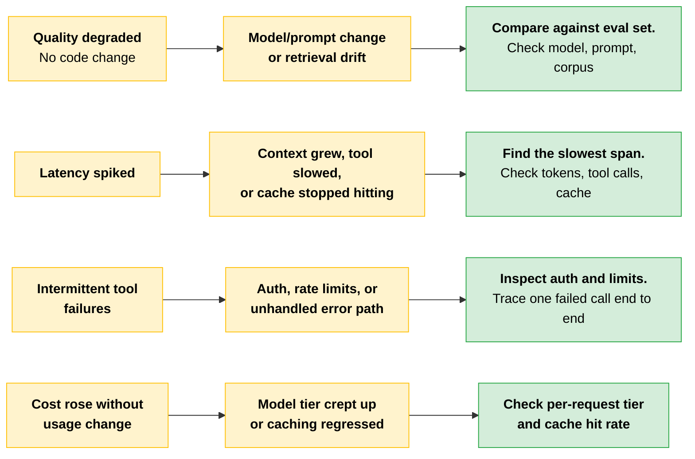
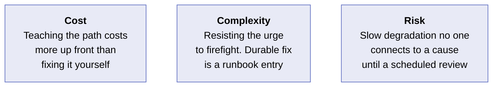
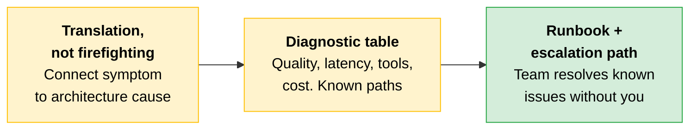

# Operational Support: Symptoms, Causes, and Self-Sufficiency

A live deployment will surprise its team. When it does, the Architect connects what the team is seeing to why it is happening. The Architect is also responsible for upskilling the team so next time they can resolve the issue themselves.

---

## The Support Role Is Translation, Not Firefighting

When an operational issue lands, the team usually identifies a symptom, not a cause: latency spiked, outputs degraded, a tool started failing. The team pulls in the Architect, whose value is connecting the operational symptom to its architecture cause. This is the same diagnostic discipline [Module 2](../02-Enterprise-Integration-and-Production/README.md) built for production systems, now applied in support of a team that owns the deployment.

Resolving one incident yourself is firefighting. Teaching the team the symptom-to-cause path they can follow next time is support that lasts.

> **Rule of thumb:** If you are the only person who can resolve the issue, you have not supported the team. You have made yourself a dependency.

---

## Connect Symptoms to Architecture Causes

Many operational symptoms trace to a small set of architectural causes. Mapping them lets the team reason from what they see to where to look.

| Symptom | Likely architecture cause | First action |
|---|---|---|
| **Output quality degraded gradually, no code change** | A model or prompt change, or retrieval drift as the corpus grew | Compare against an eval set. Check what changed in the model, prompt, or corpus |
| **Latency spiked** | Context size grew, a tool got slow, or a cache stopped hitting | Use telemetry and request traces to find the slowest span. Check token counts per request, the slowest tool call, and cache behavior |
| **Intermittent tool failures** | Authorization, rate limits, or an unhandled error path | Inspect the failing tool's auth and limits. Trace one failed call end to end |
| **Cost rose without a usage change** | Model tier crept up, or caching regressed | Check per-request model tier and cache hit rate against the budget model |

> **The key:** The diagnostic table is the foundation of a runbook. Each row is a path the team can follow without the Architect in the room.

---

## Build Self-Sufficiency: Runbooks and Escalation Paths

Self-sufficiency is engineered, not assumed. Two artifacts make it concrete.

A **runbook** captures the known symptom-to-cause-to-action paths so the team can resolve recurring issues without the Architect. The diagnostic table above is the foundation of a good runbook.

An **escalation path** identifies who handles what and when an issue leaves the team, so people know the boundary of what they can resolve and what must be escalated.

| Artifact | What it contains | Who it serves |
|---|---|---|
| **Runbook** | Symptom, likely cause, first action. One row per known issue class | The on-call engineer or first responder who sees the symptom first |
| **Escalation path** | Issue class, owner, escalation trigger, next-level contact | The responder who has exhausted the runbook and needs to hand off |

> **The goal:** A team that needs you only when new problems arise, not for ones you have already taught them how to face.

---

## Scenario

> [!CAUTION]
> **A support team watched a deployment's dashboards stay green for an entire quarter while answer quality quietly slid.** No one connected the slow decline to its cause: a growing retrieval corpus the index had not kept pace with. The symptoms were visible the whole time, but the runbook entry that says "gradual quality decline with no code change points at the model, the prompt, or retrieval drift" was missing. With that path written down, a first-line engineer could have resolved the issue in an afternoon. Without it, the issue waited for a quarterly review.
>
> **The lesson:** A slow degradation with no runbook entry is invisible until someone with architectural context happens to look. The runbook is what turns a quarterly surprise into a same-day fix.

---

## Cost, Complexity, and Risk

| Dimension | Detail |
|---|---|
| **Cost** | Teaching the symptom-to-cause path costs more of the Architect's time up front than fixing the incident directly, but it is the only version of support that reduces future load instead of repeating it |
| **Complexity** | The hard part is resisting the urge to firefight. The fast fix is to resolve it yourself, but the durable fix is to help the team create a runbook entry and identify the escalation path |
| **Risk** | The biggest failure mode is a slow degradation no one connects to a cause, so it runs until a scheduled review catches it rather than the team catching it the day it starts |

---

## Quick Revision

| Concept | One-line summary |
|---|---|
| **Support as translation** | The Architect connects operational symptoms to architecture causes, not just fixes the incident |
| **Quality degradation (no code change)** | Points at model/prompt change or retrieval drift. Compare against the eval set |
| **Latency spike** | Context size, slow tool, or cache miss. Find the slowest span in the trace |
| **Intermittent tool failures** | Auth, rate limits, or unhandled error path. Trace one failed call end to end |
| **Cost rise (no usage change)** | Model tier crept up or caching regressed. Check per-request tier and cache hit rate |
| **Runbook** | Known symptom-to-cause-to-action paths the team follows without the Architect |
| **Escalation path** | Who handles what, when the issue leaves the team, and the next-level contact |

### Exam Traps

| If you see... | The trap | The right call |
|---|---|---|
| "Output quality degraded but no code changed" | Assuming the model is broken or needs retraining | Check what changed in the model version, prompt, or retrieval corpus. Compare against the eval set |
| "The Architect resolved the incident quickly" | Treating a fast fix as good support | Resolving it yourself is firefighting. Support is teaching the team the symptom-to-cause path so they can resolve it next time |
| "Latency spiked after deployment" | Jumping to infrastructure scaling | Check context size (token counts per request), the slowest tool call, and cache behavior first. The cause is usually in the request path, not the infrastructure |
| "The team has dashboards and they're all green" | Assuming the deployment is healthy | Green dashboards measure what was instrumented. Gradual quality drift is the symptom dashboards miss. Eval comparisons catch what SLAs do not |
| "What makes a team self-sufficient in operations?" | Answering with training or documentation generally | The specific artifacts are a runbook (symptom-to-cause-to-action paths) and an escalation path (who handles what and when to hand off) |
