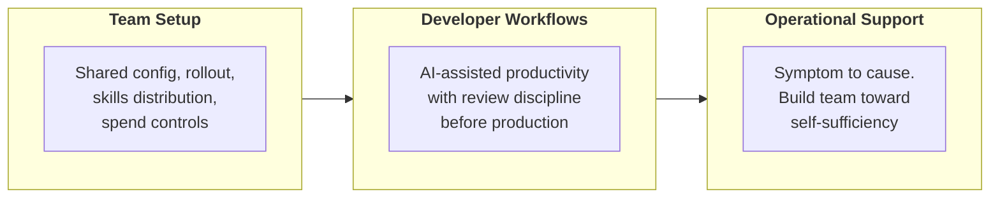

# Team Enablement & Operational Productivity

Enable a team to adopt a live Claude system and keep it healthy without pulling you into every issue.

**Notes:** 3 | **Status:** Complete

Course length: 45 min.

[Module 4](../04-Stakeholder-Engagement-Lifecycle-and-GTM/README.md) took a deployment through stakeholder discovery, tradeoff framing, feedback loops, documentation, and the outcome document. The system is built, governed, approved, and handed off. This module asks the question that follows. How does a team adopt it well, and how does it stay healthy?

Every prior module taught you how to build and configure Claude. This one assumes the system is built and shifts the focus to the people around it: getting them productive before anyone logs in and keeping the system operational once they do.

> **The framing:** A technically correct architecture that the team cannot set up, review, or debug without the Architect in the room has not shipped. It has been demonstrated. The Architect's job ends when the team can make a safe change, catch a workflow issue, and trace a production symptom without escalating.

---

## Three Topics in Enablement

The topics build on each other. The skills you distribute in setup are the same assets a developer workflow leans on. The review discipline you establish for those workflows is what an operational issue tests under pressure. The three run in order: set up the environment, raise the daily workflow, keep the system healthy.

| # | Topic | What you're answering | Failure if you skip it |
|---|-------|-----------------------|------------------------|
| 01 | **Team setup** | Does the team have the shared configuration, rollout pattern, skills distribution, and spend controls to start working? | Developers configure their own environments inconsistently; spend is uncontrolled; reusable assets sit in one person's setup |
| 02 | **Developer workflows** | Are AI-assisted workflows raising output without lowering quality? | AI-generated work reaches production without the review discipline that catches hallucinated logic, missed edge cases, or policy violations |
| 03 | **Operational support** | Can the team connect a symptom to an architecture cause and resolve it without escalating to you? | Every unexpected behavior becomes an Architect ticket; the team never builds the diagnostic skill to self-serve |

---

## Notes in This Module

| Notes | Covers |
|---|---|
| [01-Team-Setup](01-Team-Setup.md) | Shared configuration as a baseline, champion-seeded rollout, the four skills distribution mechanisms (org, plugin, project, API), spend posture and cost controls |
| [02-Developer-Workflows](02-Developer-Workflows.md) | Workflow integration, lumpy adoption and stalling at basic chat, diligence, the four-dimension verification checklist, judgment erosion |
| [03-Operational-Support](03-Operational-Support.md) | Symptom-to-cause reasoning, the diagnostic table, runbooks and escalation paths, building team self-sufficiency |

---

## Learning Objectives

| Objective | One-liner |
|-----------|-----------|
| **Team setup** | Configure Claude tooling and environments for a team: shared configuration, rollout pattern, skills distribution strategy, and spend controls |
| **Developer workflows** | Improve developer workflows with AI tooling and define the review discipline that keeps AI-generated work trustworthy before it reaches production |
| **Operational support** | Connect symptoms to architecture causes and build the team toward self-sufficiency in debugging and operational issue resolution |

---

[Back to Professional](../README.md) · [Back to the study guide](../../README.md)
